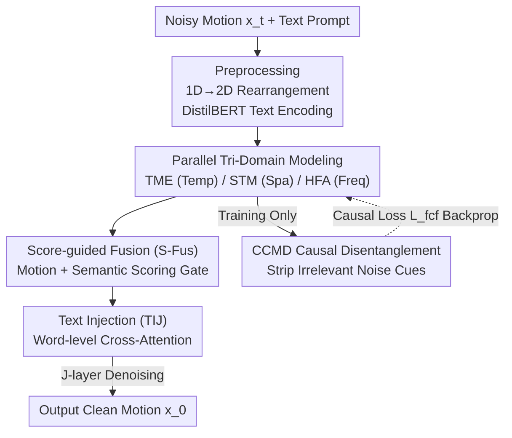

# TriC-Motion: Tri-domain Causal Modeling for Text-to-Action Generation

**Conference**: ICLR 2026  
**OpenReview**: [https://openreview.net/forum?id=ROh4oDPVpD](https://openreview.net/forum?id=ROh4oDPVpD)  
**Code**: https://caoyiyang1105.github.io/TriC-Motion/ (Available)  
**Area**: Diffusion Models / Text-to-Motion Generation / Human Understanding  
**Keywords**: Text-to-Motion, Diffusion Models, Joint Spatio-Temporal-Frequency Modeling, Causal Intervention, Counterfactual Disentanglement

## TL;DR
TriC-Motion models human motion across **temporal, spatial, and frequency domains** in parallel within a diffusion denoising framework. It employs a score-guided gating mechanism for tri-domain fusion and introduces **causal counterfactual intervention** to strip away motion-irrelevant noise cues, achieving a new SOTA R@1 of 0.612 on HumanML3D.

## Background & Motivation

**Background**: Text-driven human motion generation currently follows two main paradigms: diffusion-based (e.g., MDM, MotionLCM) and autoregressive-based (e.g., T2M-GPT, MoMask). Both primarily focus on **temporal modeling** to characterize dynamic evolution and sequence coherence. Some subsequent works incorporate **spatial** priors using graph convolutions (e.g., Spatio-Temporal Graph Diffusion) or joint token attention (e.g., MoGenTS) to ensure skeletal plausibility. Others utilize spectral analysis to handle **low-frequency** (global trends) and **high-frequency** (fine-grained joint jitter) signals separately.

**Limitations of Prior Work**: While each of these three domains has been proven effective, there lacks a **unified framework to jointly optimize temporal, spatial, and frequency information**. Consequently, models only capture partial information—spatio-temporal models miss fine-grained frequency dynamics, while frequency-based models lack joint topology constraints. This leads to quality degradation in highly dynamic or complex motions (e.g., multi-step instructions like "sprint, stop suddenly, turn right, and sit down").

**Key Challenge**: Simply stacking three domains creates a risk: **motion-irrelevant noise cues become entangled with beneficial features**. In naive multi-domain architectures, noise accumulates across domains, leading to motion distortion. The authors attribute this to the model's inability to distinguish between "intrinsic features driving the motion" and "confounding counterfactual features."

**Goal**: (1) Design a diffusion framework capable of joint temporal-spatial-frequency modeling; (2) Embed a mechanism to actively strip irrelevant noise from beneficial contributions.

**Key Insight**: From a Structural Causal Model (SCM) perspective, features $F^i_j$ extracted from each domain are the result of entanglement between intrinsic motion features $E^i_j$ and confounding factors $C^i_j$. Ideally, one wants $E^i_j \to F^i_j \to x_0$. Since directly removing $C^i_j$ is difficult, causal intervention $do(\cdot)$ is used to isolate the influence of $C^i_j$ on $F^i_j$.

**Core Idea**: Perform **parallel tri-domain modeling + score-guided gating** within diffusion denoising blocks, and utilize a **Causal Counterfactual Disentanglement (CCMD)** module during training to expose and eliminate irrelevant cues. The synergy of tri-domain complementarity and causal purification yields higher-fidelity, text-aligned motion.

## Method

### Overall Architecture

TriC-Motion is built upon the diffusion and sampling pipeline of MDM, consisting of $J$ stacked (where $J=4$) identical **TriC-Motion Denoiser Blocks**. The input is a noisy motion sequence $x_t$ and a text prompt. The motion sequence is rearranged from a 1D temporal structure into a 2D spatio-temporal structure $X \in \mathbb{R}^{N\times M\times D}$ ($N$ downsampled frames, $M$ joints, $D$ feature dimensions). The text is encoded using a pre-trained DistilBERT to produce sentence-level (CLS) and word-level ($\tau$) features.

Within each denoising block, motion features $X_j$ are processed by **three parallel modules**: TME (Temporal), STM (Spatial), and HFA (Frequency), producing $F^{temp}_j$, $F^{spa}_j$, and $F^{freq}_j$ respectively. These are fused via the **S-Fus** module using score-guided weighting to obtain $Y_j$. Then, the **TIJ** module injects word-level text information via cross-attention (motion as query, text as key/value). Simultaneously, the **CCMD** module performs causal counterfactual disentanglement on the tri-domain features—this is **enabled only during training**. The $J$-layer stacking process is summarized as $\hat{X} = [\text{TIJ}(\text{S-Fus}(\text{TME}, \text{STM}, \text{HFA}, \text{CLS}), \tau)]\,\|^J_{j=1}$.

### Key Designs

**1. Parallel Tri-Domain Modeling: Dedicated Processing for Temp, Spa, and Freq**

To address the "partial information" bottleneck, TriC-Motion employs three parallel branches. **TME (Temporal)** uses a standard TransformerEncoderLayer along the frame dimension to capture short- and long-range dependencies, ensuring temporal coherence: $F^{temp}_j = \text{TransformerEncoderLayer}(X_j)$. **STM (Spatial)** treats the skeleton as a graph (joints as nodes, limbs as edges) and uses 3-layer GCNs to model topology, constraining the physical plausibility of poses: $F^{spa}_j = X_j + [\text{LN}(\text{GELU}(\text{GCN}(X_j)))]\,\|^3$. **HFA (Frequency)** is the most granular: it uses Discrete Wavelet Transform (DWT) to decompose the sequence into low-frequency ($\hat{S}_{LF}$) and high-frequency ($S_{HF}$) sub-bands, then applies FFT to the low-frequency band. The low-frequency branch uses parallel convolutions (temporal and joint dimensions) to generate 2D spatio-temporal attention for global trends: $S'_{LF} = S_{LF} + \text{Linear}(S_{LF}\otimes(w_t\otimes w_s))$; the high-frequency branch uses 1D depthwise + pointwise convolutions for fine local dynamics: $S'_{HF} = S_{HF} + \text{GELU}(\text{GN}(f^p(f^d(S_{HF}))))$. All are transformed back via IFFT/IDWT.

**2. Score-guided Fusion: Adaptive Gating vs. Naive Concatenation**

Concatenation assumes all domains are equally important across all scenarios. S-Fus uses a **dual-branch scoring framework** for adaptive weighting: **Motion Scoring** $\text{logits}^i_{mot} = f_{mot}(F^{tri}_j)$ captures cross-domain correlations; **Semantic Scoring** $\text{logits}^i_{sem} = f_{sem}(\text{CAT}(F^i_j, \text{CLS}))$ ensures semantic consistency using the global CLS token. Weights $\alpha_i = \text{Softmax}(\text{logits}^i_{mot} + \text{logits}^i_{sem})$ are used for fusion: $Y_j = \text{Linear}(\text{CAT}(X_j, \sum_i \alpha_i F^i_j))$. In ablations, this improved R@1 from 0.592 (concat) to 0.607.

**3. CCMD Causal Counterfactual Disentanglement: "Subtracting" Irrelevant Noise**

The core novelty is the first introduction of causal intervention to motion generation. CCMD uses symmetric lightweight modules—**Fact** and **Counterfactual**—to extract beneficial causal contributions $E^i_j$ and confounding factors $C^i_j$ from $F^i_j$. For the Fact module, an attention gate $\omega = \text{Sigmoid}(\text{Linear}(\text{ReLU}(\text{Linear}(\text{Pool}(F^i_j)))))$ is calculated, followed by $E^i_j = \text{Linear}(\omega F^i_j)\odot F^i_j$; $C^i_j$ is obtained similarly via the counterfactual branch. Supervised causal intervention is then performed: $\tilde{F}^i_j = W_{do}E^i_j - W_{do}C^i_j$—effectively **subtracting** confounding features. A hierarchical causal loss $L_{fcf} = \sum_j w_j L_{MSE}(TDE_j, x_0)$ is applied with increasing weights for deeper layers $\{0.1, 0.2, 0.3, 0.4\}$. Since CCMD only guides gradients during training, it incurs zero inference cost.

### Loss & Training

Total Loss $L = L_{simple} + \lambda_{fcf}L_{fcf} + \lambda_p L_p$ ($\lambda_{fcf}=1, \lambda_p=10$). $L_{simple}$ is the standard diffusion objective; $L_{fcf}$ is the hierarchical causal loss; $L_p$ is a perceptual loss calculated in the feature space of a pre-trained motion encoder. Training uses 50 diffusion steps, cosine noise schedule, $J=4$, $D=256$, AdamW optimizer, and learning rate $1\times10^{-4}$.

## Key Experimental Results

### Main Results

On HumanML3D, TriC-Motion significantly outperforms secondary models like SALAD in text-alignment metrics:

| Dataset | Metric | Ours (Large) | Prev. SOTA (SALAD) | Gain |
|--------|------|------|----------|------|
| HumanML3D | R@1 ↑ | **0.612** | 0.581 | +0.031 |
| HumanML3D | R@3 ↑ | **0.885** | 0.857 | +0.028 |
| HumanML3D | MM-Dist ↓ | **2.465** | 2.649 | -0.184 |
| HumanML3D | FID ↓ | 0.285 | 0.076 | — |

On SnapMoGen (complex, long prompts), R@1 reaches 0.907, far exceeding MoMask++ (0.802), demonstrating robustness to complex instructions.

### Ablation Study

| Configuration | R@1 ↑ | FID ↓ | MM-Dist ↓ | Note |
|------|------|------|---------|------|
| Baseline (MDM) | 0.320 | 0.544 | 5.566 | Start |
| TME (2D rep) | 0.470 | 2.110 | 3.293 | Temporal only |
| TME + STM | 0.570 | 0.611 | 2.617 | + Spatial topology |
| TME + HFA | 0.583 | 0.374 | 2.576 | + Freq (highest FID gain) |
| TME + STM + HFA | 0.592 | 0.383 | 2.564 | Tri-domain concat |
| + S-Fus (Full) | **0.607** | 0.347 | 2.463 | Scoring fusion |
| w/o CCMD | 0.568 | 0.561 | 2.624 | - Causal intervention (R@1 drops 0.039) |

### Key Findings
- **Frequency (HFA) contributes most to fidelity (FID)**, while Spatial (STM) significantly boosts semantic alignment (R@1, MM-Dist).
- **CCMD is most effective when all three domains are present**: R@1 is 0.580 (temp only), 0.602 (temp+spa), and 0.607 (all three), confirming that noise accumulates across domains and requires holistic purification.
- **Hierarchical causal weights must increase**: The schedule $\{0.1, 0.2, 0.3, 0.4\}$ outperformed uniform or late-stage-only weighting.

## Highlights & Insights
- **First introduction of causal intervention to motion generation**: The fact-counterfactual subtraction structure provides a lightweight way to remove confounders. The "purify during training, free during inference" paradigm is transferable to other generative tasks.
- **Hybrid DWT + FFT Frequency Analysis**: Using wavelets for local time-frequency dynamics and Fourier for global patterns provides a more granular frequency decomposition than existing methods.
- **Score-guided Gating**: Integrating global semantic CLS tokens into the fusion gate ensures that tri-domain weighting is adaptive to the specific action content.

## Limitations & Future Work
- **FID is not optimal**: The Large model FID (0.285) is higher than dedicated high-fidelity models like SALAD (0.076). There appears to be a trade-off between text alignment (R@1) and distribution fidelity (FID).
- **Structural Complexity**: The denoising block contains five major components, increasing training complexity and iteration time (650K iterations).
- **Engineering-heavy Causal Modeling**: The "causal intervention" is implemented as feature subtraction and MSE supervision, which is an SCM-inspired regularization rather than a strictly identifiable causal model.

## Related Work & Insights
- **vs. MoGenTS / Spatio-Temporal methods**: These focus on spatio-temporal joint modeling; TriC-Motion adds a frequency branch and adaptive fusion for better high-dynamic detail.
- **vs. Visual Causal methods**: Unlike methods for discriminative tasks, TriC-Motion brings counterfactual intervention into the **diffusion denoising process**, a first for text-to-motion generation.

## Rating
- Novelty: ⭐⭐⭐⭐⭐ First use of causal counterfactual intervention in motion generation; novel unified tri-domain framework.
- Experimental Thoroughness: ⭐⭐⭐⭐⭐ Extensive benchmarks and ablations; clear decomposition of tri-domain and CCMD contributions.
- Writing Quality: ⭐⭐⭐⭐ Clear structure; some causal formalisms lean towards engineering heuristics.
- Value: ⭐⭐⭐⭐ Significant SOTA improvement in R@1; strong alignment capability despite non-leading FID.

<!-- RELATED:START -->

## Related Papers

- [\[CVPR 2026\] Multi-level Causal LLM-based Text-to-Motion Generation with Human Alignment (MoTiGA)](../../CVPR2026/human_understanding/multi-level_causal_llm-based_text-to-motion_generation_with_human_alignment.md)
- [\[CVPR 2026\] Causal Motion Diffusion Models for Autoregressive Motion Generation](../../CVPR2026/human_understanding/causal_motion_diffusion_models_for_autoregressive_motion_generation.md)
- [\[ICLR 2026\] Motion-Aligned Word Embeddings for Text-to-Motion Generation](motion-aligned_word_embeddings_for_text-to-motion_generation.md)
- [\[ICLR 2026\] Event-T2M: Event-level Conditioning for Complex Text-to-Motion Synthesis](event-t2m_event-level_conditioning_for_complex_text-to-motion_synthesis.md)
- [\[ICLR 2026\] UniHand: A Unified Model for Diverse Controlled 4D Hand Motion Modeling](unihand_a_unified_model_for_diverse_controlled_4d_hand_motion_modeling.md)

<!-- RELATED:END -->
