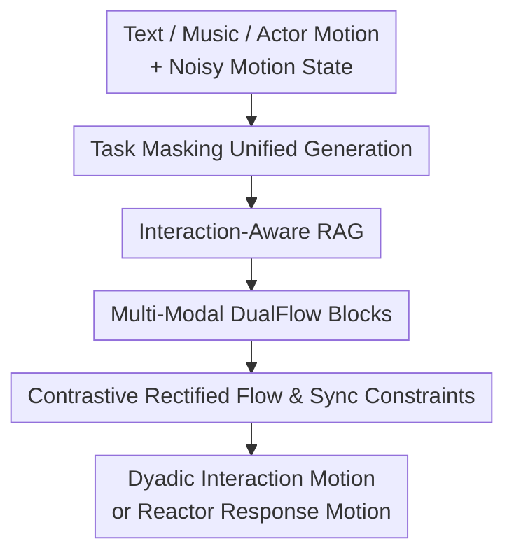

# Unified Multi-Modal Interactive and Reactive 3D Motion Generation via Rectified Flow

**Conference**: ICLR2026  
**OpenReview**: [https://openreview.net/forum?id=QaAgHKbJop](https://openreview.net/forum?id=QaAgHKbJop)  
**Paper**: [Project Page](https://gprerit96.github.io/dualflow-page)  
**Code**: To be open-sourced  
**Area**: Human Understanding / 3D Human Motion Generation  
**Keywords**: Dyadic motion generation, reactive motion generation, Rectified Flow, Retrieval-Augmented Generation, multimodal conditioning  

## TL;DR
DualFlow utilizes a dual-branch Transformer framework based on Rectified Flow to unify text, music, actor motions, and retrieved dyadic motion exemplars. It supports both interactive dyadic motion generation and actor-reactor reactive motion generation, achieving superior semantic alignment, motion quality, and synchronization on MDD, InterHuman-AS, and DD100 with fewer inference steps.

## Background & Motivation
**Background**: 3D human motion generation has expanded from single-person text-to-motion to multi-person interaction, dance accompaniment, and reactive motion synthesis. Dyadic scenarios are significantly more challenging than single-person ones because the model must ensure natural individual poses while matching mutual distance, orientation, rhythm, contact relationships, and motion intentions.

**Limitations of Prior Work**: Existing methods typically separate interactive motion generation and reactive motion generation. The former generates a pair of synchronized motions from text or music; the latter generates a reactor's response given an actor's motion. These tasks are often incompatible in terms of input, architecture, and training objectives. Furthermore, modal conditions are fragmented: some methods focus only on text, others on music or leader/actor motions, lacking a unified model that leverages text semantics, musical rhythm, and existing motion context simultaneously.

**Key Challenge**: The key to dyadic motion is not just "generating human-like poses" but "maintaining the relationship between two individuals under multimodal conditions." Textual descriptions like "closed hold" or "clockwise rotation" correspond to spatial relations, music determines rhythm, and actor motions dictate when the reactor follows or turns. Concatenating these conditions into a single vector often leads to contact misalignment, rhythmic desynchronization, or an inability to perform free interaction.

**Goal**: The authors aim to unify two tasks in one model: generating complete dyadic motions given text/music, and generating only reactor responses given actor motion plus text/music. The model should also perform inference in fewer sampling steps while maintaining naturalness and synchronization.

**Key Insight**: The problem is decomposed into two complementary directions: using Rectified Flow to replace traditional diffusion for straighter and faster generation paths, and explicitly decomposing dyadic semantics into spatial relations, movements, and rhythms, using retrieved examples to provide interaction-aware references.

**Core Idea**: DualFlow combines "Task Masking + Multimodal Dual-branch Blocks + Interaction-aware RAG + Contrastive Rectified Flow" to unify interactive and reactive dyadic 3D motion generation into a single velocity field learning problem.

## Method

### Overall Architecture
DualFlow inputs include text descriptions, music clips, actor history/current motion, and noisy motion states. The output varies by task: in the interactive setting, it outputs full dyadic motions for persons A and B; in the reactive setting, the actor motion is fixed, and only the reactor motion is generated. Multimodal conditions are encoded, followed by stacked Multi-Modal DualFlow Blocks to predict the velocity field of the Rectified Flow, finally yielding clean 3D sequences via ODE sampling.

A key feature is "unification without confusion." In the interactive task, both branches participate through Motion Cross-Attention; in the reactive task, the actor branch is masked/fixed, and the reactor branch reads actor motions via Look-Ahead Causal Cross-Attention.

Motion representation follows the InterGen style using SMPL features (global joint positions, velocities, local rotations, foot contacts). Dyadic motions use Person A's root as the global reference, with Person B's position relative to it, facilitating the modeling of relative distance and orientation.

### Key Designs
**1. Task Masking Unified Generation: Unified dual-branch structure for interaction and reaction**

Instead of training separate models, DualFlow switches tasks via input masking in the same dual-branch structure. In the interactive setting, noisy motions $x_a^t, x_b^t$ are generated symmetrically. In the reactive setting, the actor $x_a$ is a fixed condition, and only the reactor $x_b^t$ is generated, yielding a velocity field $v_\theta(x(t), t, c) = [0; v_{\theta,reactor}(x(t), t, c)]$. This allows interactive and reactive data to co-train a more generalized relationship model.

**2. Interaction-aware RAG: Decomposing descriptions into spatial, body, and rhythm**

To capture fine-grained interaction details (e.g., "closed hold"), DualFlow uses GPT-4o to split text into three focused descriptions: Spatial Relationship, Body Movement, and Rhythm. These are used to query CLIP-L/14 text retrieval libraries, while music uses Jukebox features for retrieval. Scoring accounts for length mismatches: $s_i^q = \langle f_i^q, f_p^q \rangle \cdot e^{-\lambda |l_i-l_p| / \max\{l_i,l_p\}}$. Four sets of results ($R_i^S, R_i^B, R_i^R, R_i^M$) are projected into the latent space as $z_R$ to guide the generation.

**3. Multi-Modal DualFlow Blocks: Handling rhythm, partners, and retrieval via attention**

Each block uses multi-scale 1D temporal convolutions to capture short-term contact and long-term rhythm. The latent then passes through Self-Attention (sequence coherence), Music Cross-Attention (rhythm alignment), Cross-Person Motion Attention (dyadic interaction), and Retrieval Cross-Attention. Interactive settings use bilateral Motion Cross-Attention, while reactive settings use Look-Ahead Causal Cross-Attention, allowing the reactor to see future frames up to $L=10$ to anticipate turns or proximity.

**4. Contrastive Rectified Flow and Sync Constraints: Faster paths and tighter relationships**

DualFlow uses Rectified Flow to learn a straight-line path $x_t = (1-t)\epsilon + t x_0$, targeting velocity $v_t = x_0 - \epsilon$. This allows high-quality 20-step sampling, outperforming 50-step DDIM. A triplet contrastive loss $L_{triplet}=\mathbb{E}[\max(0,d(\hat v,v^+)-d(\hat v,v^-)+m)]$ is added to structure the velocity space. A new synchronization loss $L_{sync}$ weights distances of critical interaction joints (wrists, hands, upper limbs) to ensure precise physical relations in "closed hold" or "connection" scenarios.

### Loss & Training
The total objective is: $L_{total}=L_{CRF}+\lambda_{geo}L_{geo}+\lambda_{inter}L_{inter}$, where $L_{CRF}=L_{flow}+\lambda_{triplet}L_{triplet}$. Interaction losses include joint distance maps and relative orientations. In the reactive setting, these are calculated against the ground-truth actor motion. The model features 20 blocks, 512 latent dimensions, and 1024 FFN dimensions. Training employs Adam for 5000 epochs, with classifier-free guidance masking 10-20% of conditions.

## Key Experimental Results

### Main Results
Evaluation on MDD, InterHuman-AS, and DD100 using FID, R-Precision, MMDist, etc.

| Dataset / Task | Metric | DualFlow (Ours) | Baseline | Conclusion |
|--------|------|----------|----------|------|
| MDD / Interactive Both | R-Precision@3 ↑ | 0.513 | InterGen(Both) 0.302 | Multimodal RAG significantly improves alignment |
| MDD / Interactive Both | FID ↓ | 0.415 | InterGen(Both) 0.426 | Slightly better quality than best baseline |
| MDD / Interactive Both | MMDist ↓ | 0.513 | InterGen(Both) 1.532 | Drastic reduction in condition-motion distance |
| MDD / Reactive Both | R-Precision@3 ↑ | 0.471 | DuoLando(Both) 0.219 | Superior semantic hit rate for reactors |
| InterHuman-AS / Interactive Text | R-Precision@3 ↑ | 0.681 | InterGen 0.624 | Better text alignment |
| DD100 / Reactive Text | FIDcd ↓ | 5.57 | Duolando 9.97 | Better quality in collaborative features |

Efficiency: DualFlow achieves better FID in 20 RF steps than InterGen in 50 DDIM steps. Inference time for a 10s sequence dropped from 1.92s to 1.24s.

### Ablation Study
| Configuration | Key Metrics (MDD) | Explanation |
|------|---------|------|
| Full DualFlow | FID 0.415, R@3 0.513 | Full model with RAG and sync loss |
| w/o RAG | FID 0.622, R@3 0.498 | Retrieval is vital for semantic and quality |
| w/o $L_{triplet}$ | FID 0.783, R@3 0.412 | Triplet loss structures the velocity space |
| w/o CLA (Reactive) | FID 0.849, R@3 0.338 | Look-Ahead Causal Attention is critical for responses |

### Key Findings
- Rectified Flow is the core source of efficiency, enabling high-quality sampling in 20 steps.
- RAG acts as a semantic anchor for interaction and a prior for reaction.
- $L_{triplet}$ is crucial; semantic structures in the velocity space directly affect motion adherence to text/rhythm.
- $L_{sync}$ improves close-contact scenarios by prioritizing interaction-critical joints.

## Highlights & Insights
- **Unified Speed Field**: Mapping both tasks to conditional velocity field prediction is a clean abstraction, handled by masking and attention.
- **Structural RAG**: Decomposing text into spatial, movement, and rhythm dimensions matches the inherent structure of dyadic dance and interaction.
- **Look-Ahead Causal Trade-off**: Allowing $L$ frames of future-viewing simulates human anticipation in reaction scenarios.
- **Focus on Synchronization**: $L_{sync}$ forces the model to prioritize inter-person joint relations over individual frame-wise poses.

## Limitations & Future Work
- **RAG Dependency**: Performance relies on the retrieval library; abstract text or atypical rhythms may lead to semantic drift.
- **Physical Penetration**: While $L_{sync}$ helps, there is still no explicit model for collision avoidance or force consistency.
- **Long Sequence Drifts**: Localized retrieval may not prevent global rhythm or formation drifts in very long sequences.
- **Model Scale**: 456M parameters might be challenging for real-time mobile deployment despite the low step count.

## Related Work & Insights
- **vs InterGen**: DualFlow adds music, RAG, and reactive tasks while utilizing Rectified Flow for faster sampling.
- **vs DuoLando**: DualFlow unifies interactive/reactive tasks and leverages multimodal retrieval, whereas DuoLando focuses on follower generation.
- **vs ReGenNet**: DualFlow achieves higher semantic precision in reaction tasks via Look-Ahead Causal Attention.

## Rating
- Novelty: ⭐⭐⭐⭐⭐ (Systematic unification of interactive/reactive tasks with RAG and Rectified Flow).
- Experimental Thoroughness: ⭐⭐⭐⭐ (Solid multi-dataset results, but could use more quantitative collision/long-term analysis).
- Writing Quality: ⭐⭐⭐⭐ (Clear modules and diagrams).
- Value: ⭐⭐⭐⭐⭐ (Highly relevant for virtual humans, social robotics, and gaming).

<!-- RELATED:START -->

- InterGen: Interactive Architecture for Multi-person Human Motion Generation, CVPR 2023.
- DuoLando: Follower-Lead Video-to-Dance Generation, 2024.
- Flow Matching for Generative Modeling, ICLR 2023.

<!-- RELATED:END -->

## Related Papers

- [\[ECCV 2024\] Large Motion Model for Unified Multi-Modal Motion Generation](../../ECCV2024/human_understanding/large_motion_model_for_unified_multi-modal_motion_generation.md)
- [\[CVPR 2026\] Unified Number-Free Text-to-Motion Generation Via Flow Matching](../../CVPR2026/human_understanding/unified_number-free_text-to-motion_generation_via_flow_matching.md)
- [\[ICLR 2026\] ReactDance: Hierarchical Representation for High-Fidelity and Coherent Long-Form Reactive Dance Generation](reactdance_hierarchical_representation_for_high-fidelity_and_coherent_long-form_.md)
- [\[CVPR 2026\] MMGait: Towards Multi-Modal Gait Recognition](../../CVPR2026/human_understanding/mmgait_multi_modal_gait_recognition.md)
- [\[ICLR 2026\] HUMOF: Human Motion Forecasting in Interactive Social Scenes](humof_human_motion_forecasting_in_interactive_social_scenes.md)

<!-- RELATED:END -->
