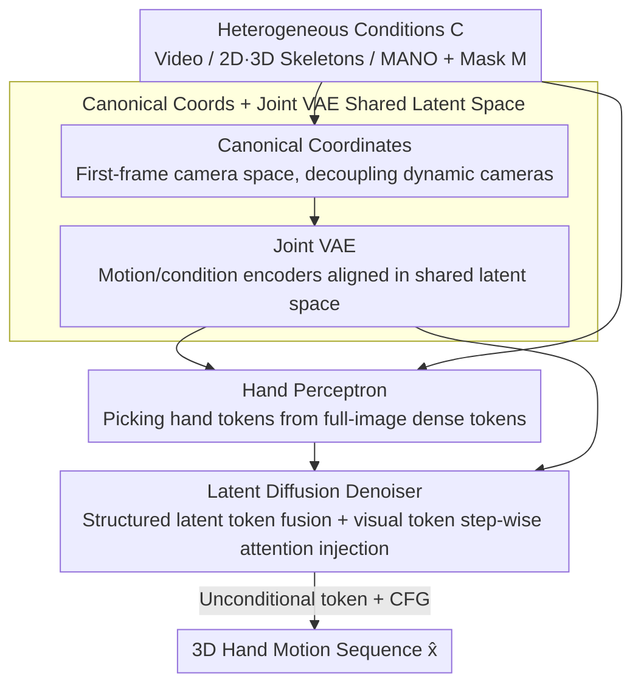

# UniHand: A Unified Model for Diverse Controlled 4D Hand Motion Modeling

**Conference**: ICLR 2026  
**OpenReview**: [https://openreview.net/forum?id=upUl6hMYwy](https://openreview.net/forum?id=upUl6hMYwy)  
**Code**: To be confirmed  
**Area**: 3D Vision / Human Understanding / Diffusion Models  
**Keywords**: 4D Hand Motion, Hand Pose Estimation, Conditional Motion Generation, Latent Diffusion, Joint VAE

## TL;DR
UniHand unifies the long-separated tasks of "estimating hand pose from video" and "generating hand motion under structured conditions" into a single **conditional motion synthesis** problem. By using a Joint VAE to align MANO parameters and 2D/3D skeletons into a shared latent space, and a latent diffusion model to fuse multiple conditions (including a "hand perceptron" that selects hand-specific tokens from global image features), it achieves SOTA results on DexYCB / HO3D / HOT3D even under severe occlusion and missing frames (DexYCB PA-MPJPE 4.08mm).

## Background & Motivation

**Background**: 4D hand motion modeling (i.e., time-varying 3D hand pose sequences) is a critical capability for VR, digital humans, and robotics. Currently, research is divided into two disconnected sub-tasks: **Estimation**, which reconstructs accurate hand poses from monocular/multi-view videos; and **Generation**, which synthesizes hand poses or completes missing sequences under structured conditions like 2D/3D skeletons or MANO parameters using generative priors.

**Limitations of Prior Work**: Estimation methods rely on rich visual input but fail when the hand is occluded, temporarily leaves the frame, or when sequences have gaps. They also typically follow a multi-stage pipeline of "detection-cropping-per-frame regression," which loses context and lacks editing flexibility. Generation methods can perform completion and editing under structured conditions but mostly handle single conditions and struggle with temporally incomplete signals.

**Key Challenge**: In real-world scenarios, conditional signals are **heterogeneous and often incomplete**—visual inputs can be occluded, 2D skeletons can have temporal breaks, and 3D skeletons are only available during editing. Modeling estimation and generation as two specialized models leads to two consequences: inability to flexibly combine these heterogeneous conditions, and the failure to transfer learned motion priors between the two tasks.

**Goal**: To develop a unified framework that performs accurate estimation when visual evidence is sufficient and flexible generation when only structured conditions are available, while gracefully handling any subset of conditions (including missing frames).

**Key Insight**: The authors observe that "hand pose estimation" is essentially "vision-conditioned motion synthesis"—if visual observations are treated as another conditional signal, estimation becomes a special case of generation. The key is not to design two models, but a generator that can **align all modal conditions into the same latent space** and selectively absorb conditions frame by frame.

**Core Idea**: Use a Joint VAE to embed heterogeneous structured signals (MANO / 2D / 3D skeletons) into a shared latent space for alignment, then use a latent diffusion model to fuse these latent tokens with "hand visual tokens" directly attended from the full image, thus unifying estimation and generation into conditional motion synthesis.

## Method

### Overall Architecture

UniHand aims to solve: "given a set of potentially incomplete and heterogeneous condition signals $C$ (video frames, 2D/3D skeletons, optional MANO parameters), output a coherent 3D hand motion sequence $x=\{x_i\}_{i=1}^N$ of length $N$." Each condition is paired with a binary mask $m\in\mathbb{R}^N$ marking its availability per frame, allowing the model to flexibly combine conditions frame by frame. Hand pose is parameterized by MANO (pose $\Theta_i\in\mathbb{R}^{15\times3}$, shape $\beta_i\in\mathbb{R}^{10}$, global orientation $\Phi_i$, root translation $\Gamma_i$). Motion is expressed in a **canonical coordinate system defined by the first frame's camera space**, decoupling hand motion from dynamic cameras and maintaining consistency without external camera parameters.

The pipeline consists of two stages: **Stage 1** uses a Joint VAE to **encode motion sequences and structured conditions into a shared latent space** and aligns them, using an autoregressive decoder to reconstruct motion for temporal consistency. **Stage 2** trains a latent diffusion model on this space, where structured conditions are fused as latent tokens with noisy motion latents, and visual observations are extracted as one hand token per frame via a frozen backbone + hand perceptron, injected into the denoiser through attention at each step. The two stages are trained separately.

### Key Designs

**1. Joint VAE: Aligning Heterogeneous Structured Signals into a Shared Latent Space**

The pain point is that MANO parameters, 2D skeletons, and 3D skeletons are vastly different signals. UniHand designs a joint encoder architecture: the motion encoder $E_m$ encodes the sequence $x$ into frame-wise latent tokens $z=\{z_i\}_{i=1}^N$ and a global motion token $g\in\mathbb{R}^d$ capturing sequence-level info. Each condition encoder $E_c$ encodes condition $c$ into $z_c=E_c(c)\in\mathbb{R}^{N\times d}$, **mapping them into the same latent space as motion tokens**. This alignment forces the latent space to learn cross-modal shared motion semantics.

**2. Autoregressive Decoder: Maintaining Temporal Consistency with Anchor tokens + Global tokens**

The decoder $D$ reconstructs motion **autoregressively**: at each step, it predicts a motion segment $\hat{x}_{i:i+n}$ conditioned on latent tokens $z_{i:i+n}$, a global token $g$, and an anchor token $a_i$ representing the initial state. The anchor token is updated using the previous output's linear mapping: $a_{i+n}=\text{Linear}(\hat{x}_{i+n-1})$. This three-level representation (global + frame-wise + anchor) ensures motion is compressed yet decodable into temporally smooth sequences.

**3. Hand Perceptron: Attending Hand Clues from Global Dense tokens without Detection/Cropping**

Traditional methods use hand cropping, which loses environment context and breaks temporal consistency due to frame-wise coordinate changes. UniHand uses a frozen pre-trained backbone $E_{vision}$ on the **entire frame**, projecting it into dense tokens $v_i\in\mathbb{R}^{h\times w\times d}$. A hand perceptron then aggregates hand-related tokens using a set of learnable hand tokens $H=\{H_i\}$ and an initial pose token $a_1$ as queries, with dense visual tokens $v$ as key/values in a cross-attention mechanism:

$$\text{Attention}(Q,K,V)=\text{Softmax}(QK^T/\sqrt{d_k})V$$

Where $Q$ and $K$ use **3D RoPE** across time $N$, height $h$, and width $w$. The hand tokens aggregate visual info per frame, while the initial pose token anchors attention to the correct hand instance, ensuring consistent binding throughout the sequence.

**4. Multi-Condition Fusion + CFG with Unconditional Tokens**

Structured conditions (MANO/2D/3D) are **directly fused** with noisy motion latents. Visual tokens are injected via attention Layers at **each denoising step**. To support robust performance under partial conditions, the authors introduce **learnable unconditional tokens** for classifier-free guidance. During training, condition latents $z_c^t$ are randomly replaced with their unconditional versions with probability $p$. This allows UniHand to remain robust to missing conditions and fine-tune the influence of each condition during synthesis via a CFG scale $w$.

### Loss & Training
Two-stage training: Stage 1 trains the Joint VAE with KL divergence ($\mathcal{L}_{KL}$), reconstruction ($\mathcal{L}_{rec}$), anchor, and latent losses. Stage 2 trains the diffusion model on the frozen latent space using simple diffusion loss and reconstruction loss. Time step $t$ is injected into the denoiser via Adaptive LayerNorm (LayerNormZero).

## Key Experimental Results

### Main Results

Comparison on DexYCB in camera coordinates by occlusion levels (PA-MPJPE↓ / AUC↑):

| Method | All PA-MPJPE | All AUC | 75-100% Occl. PA-MPJPE | 75-100% Occl. AUC |
|------|------|------|------|------|
| WiLoR (Strongest Image-based) | 5.01 | 0.900 | 5.68 | 0.887 |
| HaWoR (Strongest Video-based) | 4.76 | 0.905 | 5.07 | 0.899 |
| **UniHand** | **4.08** | **0.918** | **4.26** | **0.912** |

HO3D cross-domain generalization and HOT3D world coordinates (dynamic camera, egocentric):

| Dataset | Metric | Prev. SOTA | UniHand |
|--------|------|----------|---------|
| HO3D | PA-MPJPE↓ | 7.5 (WiLoR) | **6.7** |
| HO3D | F@15↑ | 0.983 (WiLoR) | **0.988** |
| HOT3D | PA-MPJPE↓ | 5.47 (HaWoR) | **4.76** |
| HOT3D | AccEr↓ | 5.16 (Dyn-HaMR) | **4.93** |

Note: On HOT3D, UniHand's G-MPJPE (63.97) is higher than HaWoR (47.35) which uses explicit camera trajectories, but UniHand **does not rely on internal SLAM/per-sequence optimization**, achieving comparable global accuracy while outperforming in PA-MPJPE and acceleration error.

### Ablation Study

Ablation of components and conditions on DexYCB and HOT3D:

| Configuration | DexYCB-All PA | DexYCB-Occl. PA | HOT3D PA-MPJPE | Description |
|------|------|------|------|------|
| w/o. Encoder $E_c$ | 5.21 | 5.56 | 5.92 | MLP mapping; Joint VAE alignment fails |
| w/o. Pre-trained $E_{vision}$ | 6.52 | 6.71 | 8.73 | Unreliable visual clues |
| w/o. Hand Perceptron | 7.81 | 8.75 | 12.46 | Replaced with avg pooling; performance collapse |
| w/o. 3D RoPE | 4.65 | 4.76 | 4.95 | Replaced with 1D RoPE; significant decay |
| $c_{2D}$ only | 4.75 | 5.43 | 6.37 | Unreliable under occlusion/dynamic cameras |
| $c_{vision}$ only | 4.24 | 4.27 | 4.52 | Good PA but weak global constraint |
| $c_{vision}+c_{3D}$ | 3.48 | 3.67 | 3.82 | Best overall; complementary visual+3D |
| **Ours ($c_{vision}+c_{2D}$)** | 4.08 | 4.26 | 4.76 | Practical default (2D is easily obtained) |

### Key Findings
- **Hand Perceptron is the most critical component**: Removing it doubles DexYCB PA-MPJPE, proving that attending to tokens from the full image is far superior to standard cropping+pooling.
- **Conditions are complementary**: Visual evidence and 3D structure complement each other. While $c_{vision}+c_{3D}$ is best, $c_{vision}+c_{2D}$ is the most practical default.
- **Pre-training and 3D RoPE yield substantial gains**: The visual backbone needs pre-training for reliable clues, and 3D RoPE fits the "time × space" layout of visual tokens better than 1D.

## Highlights & Insights
- The perspective shift of "**Estimation = Vision-conditioned Generation**" is powerful: it unifies two tasks, removing knowledge barriers between specialized models.
- **Canonical Coordinates (First-frame camera space)** decouple hand motion from dynamic cameras without external parameters, making it transferable to any reconstruction task under dynamic cameras.
- **CFG with learnable unconditional tokens** solves the problem of motion latents lacking a natural null form, supporting robust handling of any subset of missing conditions.
- The **initial pose token anchor** for the Hand Perceptron is clever: it ensures consistent binding of a single hand instance across a sequence in multi-hand scenarios.

## Limitations & Future Work
- The default $c_{vision}+c_{2D}$ config still lags behind methods using explicit camera trajectories in global metrics (G/GA-MPJPE) on HOT3D; vision alone provides weak global translation constraints.
- Reliance on MANO and pre-trained backbones might limit adaptation to non-MANO topologies (e.g., gloves, heavy hand-object adhesion).
- Two-stage training prevents the diffusion stage from optimizing the latent representation; end-to-end training might offer further gains.

## Related Work & Insights
- **vs HaWoR / Dyn-HaMR**: These rely on SLAM or per-sequence optimization for world-frame reconstruction. UniHand unifies estimation as generation, achieving better PA-MPJPE and acceleration metrics without SLAM or external trajectories.
- **vs Generative Hand Priors (VAE/Score-based)**: Previous priors were mostly single-condition and fragile to missing frames; UniHand's joint VAE + diffusion approach handles heterogeneous, incomplete conditions.

## Rating
- Novelty: ⭐⭐⭐⭐⭐ First framework to unify 4D hand estimation and generation.
- Experimental Thoroughness: ⭐⭐⭐⭐☆ Solid datasets and ablations, though lacks efficiency comparison and non-MANO validation.
- Writing Quality: ⭐⭐⭐⭐☆ Clear motivation and methods.
- Value: ⭐⭐⭐⭐⭐ Unified framework and SLAM-free design have direct practical value for VR/Robotics.

<!-- RELATED:START -->

## Related Papers

- [\[ICLR 2026\] Interaction-aware Representation Modeling With Co-Occurrence Consistency for Egocentric Hand-Object Parsing](interaction-aware_representation_modeling_with_co-occurrence_consistency_for_ego.md)
- [\[ICLR 2026\] CLUTCH: Contextualized Language model for Unlocking Text-Conditioned Hand motion modelling in the wild](clutch_contextualized_language_model_for_unlocking_text-conditioned_hand_motion_.md)
- [\[CVPR 2025\] UniHOPE: A Unified Approach for Hand-Only and Hand-Object Pose Estimation](../../CVPR2025/human_understanding/unihope_a_unified_approach_for_hand-only_and_hand-object_pose_estimation.md)
- [\[ECCV 2024\] Large Motion Model for Unified Multi-Modal Motion Generation](../../ECCV2024/human_understanding/large_motion_model_for_unified_multi-modal_motion_generation.md)
- [\[ICLR 2026\] TriC-Motion: Tri-domain Causal Modeling for Text-to-Action Generation](tric-motion_tri-domain_causal_modeling_grounded_text-to-motion_generation.md)

<!-- RELATED:END -->
