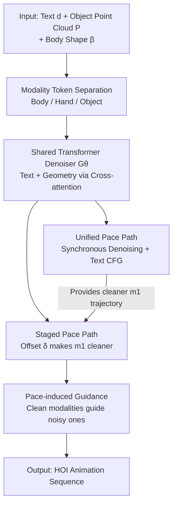

# Unleashing Guidance Without Classifiers for Human-Object Interaction Animation

**Conference**: ICLR 2026  
**OpenReview**: [https://openreview.net/forum?id=7lgQernr2Z](https://openreview.net/forum?id=7lgQernr2Z)  
**Paper**: [Project Page](http://ziyinwang1.github.io/LIGHT)  
**Code**: TBD  
**Area**: Human Understanding / Human-Object Interaction Generation / Diffusion Models  
**Keywords**: HOI Animation, Text-to-Motion, Diffusion Forcing, Implicit Guidance, Contact Fidelity

## TL;DR
LIGHT transforms the "diffusion forcing" mechanism—where each token can have its own noise level—into a **classifier-free guidance approach**. By allowing the body, hands, and objects to follow different denoising paces, clean modalities guide noisy ones via cross-attention. This generates text-driven human-object interaction (HOI) animations with more realistic contact without relying on manual contact priors.

## Background & Motivation

**Background**: Generating 3D human-object interaction sequences from text (e.g., "lift the chair, turn it over, and place it on the table") is an important yet challenging problem in computer vision and graphics. Recently, diffusion models have become the mainstream framework for iteratively denoising HOI sequences from noise.

**Limitations of Prior Work**: Pure diffusion models often exhibit obvious artifacts without physical constraints—hands failing to reach targets, objects floating or penetrating meshes, and unstable contact over time. Existing works primarily follow two paths: 1) Training **external classifiers** (contact/affordance regression) to guide denoising, which are difficult to design and prone to overfitting to specific priors. 2) Introducing **manual kinematic/dynamic rules** (using IK for hand-object alignment or physics simulation), which sacrifices generality and increases computational cost.

**Key Challenge**: The contact quality of these methods essentially stems from **human-designed priors external to the data** rather than emerging from the data itself. A natural thought is to apply classifier-free guidance (CFG) to HOI to reduce reliance on external priors. however, text-based CFG (via text dropout) primarily improves **global distribution alignment** and provides little control over the **fine-grained, continuous contact** essential for HOI.

**Goal**: To find a **purely data-driven** guidance signal that enhances contact fidelity like contact priors while remaining independent of any manually designed classifiers or rules.

**Key Insight**: The authors observe that diffusion forcing allows each token in a sequence to have **independent noise levels and denoising progress**. By decomposing the body, hands, and objects into different modalities and letting them denoise at **different speeds**, the "cleaner" stream naturally becomes the condition for the "noisier" stream—guidance can emerge directly from the **difference in denoising pace**.

**Core Idea**: Use "pace-induced guidance" (derived from the difference in denoising progress between modalities) instead of "text dropout" to generate signals. This principles-based approach extends diffusion forcing into a guidance framework, which is then combined with contact-aware shape augmentation to ensure robustness against geometric diversity.

## Method

### Overall Architecture

The task of LIGHT is as follows: given a text description $d$, object canonical point cloud geometry $P$, and SMPL-H body parameters $\beta$, output a $T$-frame sequence containing human motion and object trajectories. Each frame $x_t$ is characterized by a quadruple: human joint positions $j^p \in \mathbb{R}^{T\times52\times3}$, hand rotations $j^{rh}\in\mathbb{R}^{T\times30}$, object translation $o^t\in\mathbb{R}^{T\times3}$, and object 6D rotation $o^r\in\mathbb{R}^{T\times6}$.

The framework consists of two phases. **During training**: Representations are split into modality tokens (body, hand, object), and a **noise level is independently sampled** for each category. After adding modality-level and frame-level positional encodings, these are fed into a shared Transformer decoder. Text (encoded by DistilBERT) and object geometry (BPS descriptors) are injected via cross-attention, and an MLP head predicts the clean action. **During inference**: Two coupled denoising paths are executed—a "unified pace" where all modalities denoise synchronously (with text CFG), and a "staged pace" where certain modalities are cleaner than others. The difference between them produces pace-induced guidance; the final sample is taken from the staged path.

> The training phase also incorporates **contact-aware shape spectral augmentation**, replacing objects with geometrically different ones of the same category while preserving contact semantics. This allows the guidance to leverage a stronger prior insensitive to geometric variation.

### Key Designs

**1. Modality-level Adaptation of Diffusion Forcing: Independent Noise as the Foundation for HOI Guidance**

The key to Diffusion Forcing (Chen et al., 2024) is relaxing the standard diffusion constraint where "all tokens share one noise level," allowing each token's noise level $\lambda$ to be independently sampled from $\{0, 1, \dots, K\}$. The corresponding noisy state is $x(\lambda) = \langle\sqrt{\bar\alpha(\lambda)}, x(0)\rangle + \langle\sqrt{1-\bar\alpha(\lambda)}, \epsilon\rangle$ (using dot product as different tokens have different noise). This paper adapts this to HOI: following Text2HOI, it explicitly splits representations into body $x^b$, hand $x^h$, and object $x^o$ tokens (total $3 \times T$ tokens), with noise levels $\lambda=\{\lambda^b, \lambda^h, \lambda^o\}$. Modeling hands separately is crucial because human body (22 joints, large movements) and hands (30 joints, fine-grained finger movements) differ significantly; experiments show this separation is superior for tasks like GRAB involving frequent hand interaction. The model directly predicts clean data $\tilde x(0) = \mathcal{G}_\theta(x(\lambda), \lambda, d)$ rather than noise. The training objective is reconstruction error $\mathcal{L}_{\text{DF}} = \mathbb{E}_{x(0), \lambda}\|\hat x(0) - \mathcal{G}_\theta(x(\lambda), \lambda, d)\|^2$. During training, noise levels for the three modalities are independently sampled from $U\{0, \dots, K\}$ (while frames within a modality share one level), ensuring the model encounters various "who is cleaner than whom" asynchronous conditional distributions.

**2. Pace-induced Guidance: Replacing Text Dropout with Denoising Pace Differences**

This is the core contribution. Instead of guiding via the difference between "text vs. no text," LIGHT guides via the difference between "two denoising paces" across two paths. The **Unified Path** denoises all modalities synchronously with standard text CFG: $\tilde x_U = \mathcal{G}_\theta(x_U(\lambda), \lambda, d) + \omega_1 (\mathcal{G}_\theta(x_U(\lambda), \lambda, d) - \mathcal{G}_\theta(x_U(\lambda), \lambda, \varnothing))$, providing a relatively clean reference trajectory. The **Staged Path** divides modalities into complementary sets $m_1, m_2$ (where $m_1 \cup m_2 = \{b, h, o\}$, with $m_1=\{b, h\}$ and $m_2=\{o\}$ in the main paper). An offset vector $\delta$ makes $m_1$ denoise faster than $m_2$: $x_S' = (x_U^{m_1}(\lambda^{m_1}-\delta); x_S^{m_2}(\lambda^{m_2}))$, concatenating the cleaner $m_1$ from the unified path with the current $m_2$. The update adds pace-induced guidance on top of text CFG:

$$\tilde x_S = \mathcal{G}_\theta(x_S(\lambda), \lambda, d) + \omega_1(\dots) + \omega_2 \big(\mathcal{G}_\theta(x_S', \lambda', d) - \mathcal{G}_\theta(x_S(\lambda), \lambda, d)\big)$$

where $\omega_2$ controls the pace guidance strength. Intuitively, the cleaner $m_1$ (body + hand) "pulls" the noisy $m_2$ (object) via internal cross-attention to maintain contact consistency. This mechanism features a continuous spectrum: it degenerates to joint denoising without guidance as $\delta \to 0$, and approximates conditional dropout in CFG when $\delta$ is very large. Experiments show that while text dropout improves global alignment, this soft guidance refines **underlying contact details**, meaning the model learns to reduce contact errors purely from data.

**3. Contact-aware Shape Spectral Augmentation: Preserving Contact Semantics Across Geometry**

While LIGHT relies on data-driven physical priors, it indirectly incorporates world knowledge via "data manipulation." The authors use an optimization-based augmentation: first, a correspondence network (following Xie et al., 2024) maps points from source object surfaces to new objects of the **same category but different geometry** from ShapeNet/Objaverse. Using this correspondence, original sequence objects are replaced, and their placement is optimized so that **original human-object contact points are preserved**. These synthetic "same action, different geometry" samples teach the model that "contact should remain invariant to irrelevant shape changes." This expands the object library from 217 to 1,121, forming a robust prior that enables the asynchronous pace guidance to significantly improve generalization to **unseen objects**.

### Loss & Training

The total loss is $\mathcal{L} = \mathcal{L}_{\text{DF}} + \mathcal{L}_{\text{reg}}$. $\mathcal{L}_{\text{DF}}$ is the reconstruction term. $\mathcal{L}_{\text{reg}}$ consists of three parts: Bone length loss (limbs matching GT), Contact loss (aligning body joints with expected contact zones on objects), and Velocity loss (matching motion speed). The architecture uses an 8-layer Transformer decoder, hidden dimension 512, FFN 1024. Object geometry is represented by 1024-point BPS descriptors (concatenated unnormalized + normalized BPS with a scale scalar). Inference hyperparameters: $\omega_1=0.5, \omega_2=3.0$, offset $\delta=250$, total steps $K=500$. Convergence takes ~24 hours on a single A100.

## Key Experimental Results

The primary dataset is InterAct (Xu et al., 2025a), with ablations on BEHAVE and OMOMO. Evaluation metrics include realism/diversity (FID, Diversity), text alignment (R-Precision, MM Dist), physical plausibility (Foot Skating Ratio, Penetration Ratio, Contact Ratio), and frame-level contact accuracy ($C_{prec}/C_{rec}/C_{F1}$).

### Main Results

Comparison with four recent HOI generation baselines on InterAct (R-Precision with batch size 256):

| Method | R-Prec Top1↑ | FID↓ | MM Dist↓ | Pene↓ | C_F1→ |
|------|--------------|------|----------|-------|-------|
| Ground Truth | 0.600 | 0.000 | 1.475 | 0.076 | 1.000 |
| HOI-Diff | 0.413 | 0.689 | 3.029 | 0.103 | 0.501 |
| CHOIS | 0.439 | 0.572 | 2.781 | 0.131 | 0.541 |
| InterDiff | 0.501 | 0.215 | 2.461 | 0.116 | 0.584 |
| Text2HOI | 0.428 | 0.331 | 2.665 | 0.105 | 0.532 |
| **Ours (No Guid.)** | 0.395 | 0.196 | 2.885 | 0.121 | 0.599 |
| **Ours (W/ Guid.)** | 0.421 | **0.148** | 2.756 | 0.132 | **0.627** |

The full version of LIGHT leads in FID (0.148, the lowest, approaching GT quality) and Contact F1 (0.627, highest). Text alignment (R-Prec, MM Dist) also outperforms most baselines. Notably, enabling guidance improves FID from 0.196 to 0.148 and Contact F1 from 0.599 to 0.627, verifying that pace guidance enhances contact fidelity.

### Ablation Study

**Modality Separation Strategy (Table 2)**:

| hand–body separation | human–object separation | R-Prec Top1↑ | FID↓ | C_F1→ |
|:---:|:---:|:---:|:---:|:---:|
| ✓ | ✓ | 0.421 | 0.148 | 0.627 |
| – | ✓ | 0.414 | 0.157 | 0.611 |
| ✓ | – | 0.409 | 0.155 | 0.572 |

**Generalization to Unseen Objects (Table 3)**:

| Aug. | Unseen Type | R-Prec Top1↑ | FID↓ | C_F1→ |
|:---:|:---:|:---:|:---:|:---:|
| ✗ | In-category | 0.216 | 2.151 | 0.809 |
| ✓ | In-category | 0.279 | 2.271 | 0.833 |
| ✗ | Cross-category | 0.022 | 5.078 | 0.351 |
| ✓ | Cross-category | 0.022 | 4.788 | 0.560 |

### Key Findings

- **Concurrent separation of body, hands, and objects is optimal**: Removing human-object separation drops C_F1 to 0.572, indicating that isolating the object to its own denoising pace is a prerequisite for guidance. Separation of hands primarily fixes finger artifacts during grasping.
- **Shape augmentation contributes significantly to generalization**: For in-category unseen objects, R-Prec improves from 0.216 to 0.279 and C_F1 from 0.809 to 0.833. In difficult cross-category scenarios, C_F1 improves from 0.351 to 0.560. Augmentation helps the model internalize "geometry-invariant contact" as a transferable prior.
- **Pace-induced guidance primarily refines low-level contact**: Complementary to text CFG's global alignment, qualitative results show reduced penetration/floating and more precise contact dynamics when guidance is active. The guidance also yields improvements on new tasks without retraining.

## Highlights & Insights
- **Reinterpreting "denoising pace differences" as guidance signals**: This is the most innovative aspect. While CFG relies on the presence vs. absence of conditions, LIGHT relies on "which leads in denoising" under the same conditions. This identifies a softer, adjustable guidance dimension on the continuous noise spectrum of Diffusion Forcing.
- **Decoupling "contact priors" into two solvable parts**: Pace-induced guidance handles "dynamic contact consistency," and shape augmentation handles "geometric invariance of contact semantics." Neither requires hard-coded rules, yet they jointly exceed the performance of manual priors.
- **Transferability**: Because pace-induced guidance is essentially "asynchronous denoising + clean path guiding noisy path," it can theoretically be applied to any diffusion generation task that can be naturally split into modalities (human-human interaction, hand-object, audio-video alignment).

## Limitations & Future Work
- Absolute metrics for cross-category unseen objects remain low (R-Prec Top1 of 0.022), suggesting generalization to entirely foreign geometry remains an open problem.
- Shape augmentation depends on an externally trained correspondence network and optimization-based placement, making the pipeline relatively heavy.
- Guidance introduces three hyperparameters ($\omega_1, \omega_2, \delta$) and requires two coupled paths during inference, increasing computational cost.
- The model still retains regularization terms (contact, velocity, bone length) as soft constraints, thus it is not strictly "zero-prior" but rather replaces hard rules with training losses.

## Related Work & Insights
- **vs. Classifier Guidance (HOI-Diff / CG-HOI)**: These rely on external contact/affordance predictors, embedding manual assumptions. LIGHT requires no such assumptions; guidance emerges from denoising paces, avoiding the risk of overfitting external priors.
- **vs. Kinematic/Physical Constraints (InterDiff / Simulation)**: These use IK or simulation for correction, sacrificing generality and speed. LIGHT is data-driven, indirectly injecting physical knowledge via augmentation.
- **vs. Text CFG**: Standard CFG improves global distribution alignment but fails fine-grained contact. LIGHT's soft guidance complements text CFG by filling the contact fidelity gap.

## Rating
- Novelty: ⭐⭐⭐⭐⭐ Reinterpreting asynchronous noise mechanisms as classifier-free guidance is highly novel and theoretically supported.
- Experimental Thoroughness: ⭐⭐⭐⭐ Extensive InterAct experiments plus ablations on token separation/augmentation and cross-task generalization, though cross-category results are still weak.
- Writing Quality: ⭐⭐⭐⭐ Clear motivation; successfully explains the relationship between CFG and pace-induced guidance.
- Value: ⭐⭐⭐⭐ Provides a better HOI animation method and a general guidance paradigm potentially applicable to other multimodal diffusion tasks.

<!-- RELATED:START -->

## Related Papers

- [\[ICLR 2026\] Human-Object Interaction via Automatically Designed VLM-Guided Motion Policy](human-object_interaction_via_automatically_designed_vlm-guided_motion_policy.md)
- [\[ICLR 2026\] InfBaGel: Human-Object-Scene Interaction Generation with Dynamic Perception and Iterative Refinement](infbagel_human-object-scene_interaction_generation_with_dynamic_perception_and_i.md)
- [\[ICLR 2026\] LINK: Learning Instance-level Knowledge from Vision-Language Models for Human-Object Interaction Detection](link_learning_instance-level_knowledge_from_vision-language_models_for_human-obj.md)
- [\[CVPR 2026\] Decoupled Generative Modeling for Human-Object Interaction Synthesis](../../CVPR2026/human_understanding/decoupled_generative_modeling_for_human-object_interaction_synthesis.md)
- [\[ICLR 2026\] Disentangled Hierarchical VAE for 3D Human-Human Interaction Generation](disentangled_hierarchical_vae_for_3d_human-human_interaction_generation.md)

<!-- RELATED:END -->
