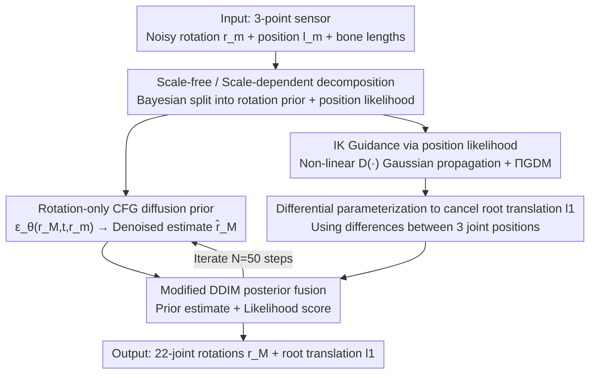

# Zero-Shot Human Pose Estimation Using Diffusion-Based Inverse Solvers

**Conference**: ICLR 2026  
**Paper**: [OpenReview / ICLR 2026 Conference Paper](https://iclrinpose-crypto.github.io/ICLRInPose/)  
**Code**: https://iclrinpose-crypto.github.io/ICLRInPose/ (Available, project page + animations)  
**Area**: Human Understanding / Human Pose Estimation / Diffusion Models / Inverse Problem Solving  
**Keywords**: Sparse Sensor Pose Estimation, Diffusion Inverse Problems, Zero-Shot Generalization, Inverse Kinematics Guidance, $\Pi$GDM

## TL;DR
For the sparse pose estimation task of "recovering full-body 22-joint poses from only a VR headset + two controllers (3 upper-body sensors)," this paper proposes **InPose**: it decomposes the pose into scale-free rotations and scale-dependent joint positions. It uses only rotations as a conditional diffusion prior while treating position measurements as an Inverse Kinematics (IK) likelihood term to guide denoising, achieving **zero-shot generalization to users of different body shapes without any fine-tuning**.

## Background & Motivation

**Background**: Recovering full-body pose from extremely sparse wearable sensors (headset + dual controllers, i.e., $\langle \text{position, rotation} \rangle$ measurements of the head + two wrists) is a core problem for VR/AR avatar driving. Recent state-of-the-art methods utilize conditional diffusion models, such as BoDiffusion, which condition full-body pose prediction **simultaneously** on sensor positions $l_m$ and rotations $r_m$. Predicting 22 joints from 3 points significantly outperforms earlier pure neural network regressions.

**Limitations of Prior Work**: These conditional diffusion methods exhibit **poor cross-user generalization**. A model trained on a specific body shape must be fine-tuned again for a person with a different build. The root cause is that while joint **rotation angles remain the same** for two people in the same pose, the joint **positions $l_j$ calculated via Forward Kinematics differ** due to varying bone lengths ($l_j(i) = l_{p_j}(i) + R_{p_j}(i)\cdot b_{j,p_j}$). Once the model incorporates "position" into its conditions, the body shape bias of the training users is hardcoded.

**Key Challenge**: Position measurements $l_m$ are **naturally coupled with body shape**, whereas rotation measurements $r_m$ are scale-free. Using position as a conditional input is equivalent to forcing the model to memorize a specific body shape. To generalize, one would need to include various body shapes during training (e.g., Aliakbarian's flow model jointly training poses + numerous bone lengths), which increases complexity and still fails to cover all outliers (e.g., a basketball player with exceptionally long arms).

**Goal**: Design a full-body pose estimation algorithm that is robust to all body shapes (including extreme outliers) **without requiring any fine-tuning or retraining** for new users.

**Key Insight**: The authors observe that any full-body pose can be decomposed into a "scale-free pose (a template human rotated by joint angles)" and a "scale-dependent component (joint positions in 3D space)," connected by Forward Kinematics + body shape parameters. Since rotation is scale-free, one can **estimate a distribution of scale-free poses solely from rotations**, then use position measurements to **sharpen** this distribution toward poses that best explain the measurements. This precisely follows the structure of a standard **inverse problem**.

**Core Idea**: Use Bayesian splitting to divide the conditional score into a "rotation prior" + a "position likelihood." **Use only rotations as the CFG conditional diffusion prior, and treat position as the likelihood term for Pseudoinverse Guidance during inference to guide denoising.** This ensures body shape information only enters through the likelihood and does not contaminate the prior, enabling zero-shot generalization.

## Method

### Overall Architecture
InPose solves the ill-posed inverse problem of "given noisy $\langle \text{position, rotation} \rangle$ from 3 upper-body sensors, output 22-joint rotations $r_M$ and root translation $l_1$." The overall approach applies the Bayesian rule to split the full-body pose posterior $p(r_M|y_m)$ into a **rotation-conditional prior** and a **position likelihood**. These are provided by a "pre-trained conditional diffusion model" and "inference-time pseudoinverse guidance," respectively, merging at each diffusion step to iteratively denoise the final pose sequence.

Specifically, at each diffusion time step $t$: ① The CFG score model $\epsilon_\theta(r_M^t, t, r_m)$ uses only rotation $r_m$ as a condition to provide a scale-free conditional prior score, yielding a denoised estimate $\hat r_M^t$ via the Tweedie formula; ② A modified $\Pi$GDM calculates the position likelihood score $\nabla_{r_M^t}\log p_t(l_m|r_M^t)$, injecting body shape (bone lengths $\kappa$) through a linear measurement operator $A$ and "dragging" the pose to match the head position measurement $l_{head}$; ③ The prior denoised estimate and likelihood score are merged via a modified DDIM to obtain the next step $r_M^{t-1}$. This process adapts to new body shapes without training or fine-tuning any network weights.

### Key Designs

**1. Scale-Free / Scale-Dependent Decomposition + Bayesian Splitting: Evicting Body Shape Bias from the Prior**

This is the foundation of InPose's zero-shot generalization. The pain point is that position $l_m$ couples body shape, locking in training data styles if used as a condition. The authors split the target score using the Bayesian rule (assuming $l_m, r_m$ are conditionally independent):

$$\nabla_{r_M^t}\log p_t(r_M^t|\{l_m, r_m\}) = \nabla_{r_M^t}\log p_t(r_M^t|r_m) + \nabla_{r_M^t}\log p_t(l_m|r_M^t)$$

The first term $\nabla_{r_M^t}\log p_t(r_M^t|r_m)$ **depends only on rotation** and is scale-free, learnable via a CFG conditional diffusion model. The second term $\nabla_{r_M^t}\log p_t(l_m|r_M^t)$ is the **scale-dependent likelihood**, used as a guidance term during inference **without requiring network training or fine-tuning**. Thus, body shape (hidden in bone length) only enters through the likelihood, keeping the prior universal for all users. The same prior, paired with different bone lengths, can explain different body shapes.

**2. Position Measurement as IK Likelihood Guidance: $\Pi$GDM + Nonlinear Gaussian Propagation**

Splitting is not enough—the position likelihood $\nabla_{r_M^t}\log p_t(l_m|r_M^t)$ is difficult to compute. It requires mapping joint rotations to positions, i.e., minimizing $\|l_m - A\circ D(\hat r_M^t)\|^2$, where $D(\cdot)$ converts 22-joint 6D rotation vectors to rotation matrices, and $A$ is a linear operator determined by bone lengths. Two obstacles exist: ① $r_M^t$ is a noisy estimate and cannot pass directly through the measurement operator; ② $D(\cdot)$ is **nonlinear**, and passing Gaussian variables through it destroys Gaussianity.

The authors adopt the $\Pi$GDM (Pseudoinverse-Guidance for Diffusion Models) approach to approximate $p_t(x_0|x_t)$ as a Gaussian $\mathcal{N}(\hat x_t, w_t^2 I)$. They use **Theorem 1** to prove that if the score model is well-trained (ensuring the two 3D sub-vectors of the 6D representation for each joint are orthonormal, i.e., $\|\hat r_j^{t,1:3}\|=\|\hat r_j^{t,4:6}\|=1$ and their dot product is 0), then the distribution after nonlinear $D(\cdot)$ can still be approximated as Gaussian $p_t(D(r_M^0)|r_M^t)\approx\mathcal{N}(D(\hat r_M^t), w_t^2\Sigma_{\hat r_M^t})$. The likelihood score is then written in closed form:

$$\nabla_{r_M^t}\log p_t(l_m|r_M^t) = \Big((l_m - A\cdot D(\hat r_M^t))^\top (w_t^2 A\Sigma_{\hat r_M^t}A^\top + \sigma_l^2 I)^{-1} A\frac{\partial D(\hat r_M^t)}{\partial r_M^t}\Big)^\top$$

The linear operator $A := I_3\otimes\kappa^\top$ is constructed using bone lengths $\kappa$ via the Kronecker product—**this is where body shape enters the likelihood to guide denoising**. Positions serve as "guidance/constraints" rather than "hard conditions," avoiding sensitivity to noise and body shape.

**3. Differential Parameterization to Eliminate Root Translation $l_1$**

The linear operator $A$ (derived in Eq. 8) holds only if root translation $l_1=0$. In reality, $l_1 \neq 0$, and $l_1$ contributes **additively** to every joint position (linear addition of $l_1(i)$ along the kinematic chain). This root translation violates the premises of linear inverse guidance.

The authors' solution is straightforward: **use the pairwise differences between the three measured joint positions in the same frame** as the guidance signal. Since $l_1(i)$ contributes equally to each measured joint position, subtracting them **cancels it out**, restoring the validity of linear inverse guidance. The trade-off is that without direct translation guidance, **lower-body motion** (legs) must be hallucinated by the diffusion prior, which is less constrained. To compensate, when the body shape is close to the default, head translation can be used as an additional CFG input (denoted as **InPose (head)**) to recover estimation capability for the lower body.

### Loss & Training
The training phase only requires a **CFG-based score model** $\epsilon_\theta(r_M^t, t, r_m)$ (using the DiT denoiser architecture from BoDiffusion but conditioned only on rotation $r_m$). It outputs 6D representations of global joint rotations $r_M$. Inference uses modified $\Pi$GDM + DDIM (Algorithm 1) with $N=50$ steps and VP-SDE scheduling. A key engineering choice is using a **6D continuous representation** $r_j\in\mathbb{R}^6$ for joint rotations to facilitate network training and reduce output jitter.

## Key Experimental Results

The dataset is **AMASS** (SMPL format, resampled to 60Hz), trained on a default body shape. Two protocols: Protocol 1 (Transitions + HumanEVA for testing, others for training); Protocol 2 (90/10 split on CMU/BMLrub/HDM05). Metrics include MPJPE (position error in cm), MPJRE (rotation error in degrees), and UPE/LPE (upper/lower body position error in cm). Baselines include AvatarJLM (neural net) and BoDiffusion (CFG diffusion, conditioned on both position and rotation).

### Main Results: Varying Upper Body Shape (Protocol 1, lower is better)

| Algorithm | Default MPJPE | Default MPJRE | UB×1.4 MPJPE | UB×1.4 MPJRE | Arm×1.4·Torso×0.7 MPJPE |
|------|------|------|------|------|------|
| AvatarJLM | **4.92** | **4.25** | 26.09 | 7.02 | 18.89 |
| BoDiffusion(Local) | 5.16 | 4.32 | 25.69 | 15.35 | 9.98 |
| BoDiffusion(Global) | 5.97 | 4.97 | 13.40 | 11.48 | 7.61 |
| **Ours (InPose)** | 7.64 | 6.38 | **9.15** | **6.71** | **6.52** |

Interpretation: On the default body shape, baselines are stronger (neural networks learn complex mappings, and training/testing shapes match). However, **once bone lengths change, baselines are misled by position inputs, and errors skyrocket**, whereas InPose remains stable, outperforming them across MPJRE/MPJPE/UPE. The paper also notes that InPose's **LPE (lower body) remains high** in some cases—the price paid for canceling $l_1$ via differential parameterization.

### Ablation Study 1: Head Translation as CFG Input (Protocol 1, mild shape variations)

| Algorithm | UB×0.85 MPJPE | UB×1.17 MPJPE | Arm×0.85·Torso×1.17 MPJPE | LPE (UB×0.85) |
|------|------|------|------|------|
| BoDiffusion(Global) | 6.76 | 8.18 | 6.80 | 12.16 |
| InPose | 7.13 | 8.25 | 7.80 | 14.25 |
| **InPose (head)** | **6.08** | **5.92** | **5.71** | **12.06** |

Finding: When shape changes are mild, pure InPose lags slightly behind baselines in MPJPE. However, **adding head position as a CFG input (InPose (head)) outperforms all baselines across nearly all metrics and shapes**, with significantly improved LPE, confirming that supplemental translation guidance recovers lower-body estimation.

### Ablation Study 2: 6D Representation vs. Rotation Matrix (Jitter, lower is better)

| Representation | Jitter | Description |
|------|--------|------|
| RoT-Raw | High | Matrices are non-unitary; high jitter |
| RoT-Post | Med | Post-processing with $D(\cdot)$ reduces jitter |
| 6D | **Low** | Continuous representation; smoothest mesh |

### Key Findings
- **Position as Guidance $\neq$ Position as Condition**: By using position only for inverse guidance, InPose is naturally robust to **measurement noise**. Baselines degrade significantly as noise increases, whereas InPose remains stable.
- **Flat Zero-Shot Curve**: While baseline errors spike as the body scale factor deviates from 1.0, InPose's scaled-MPJPE and MPJRE remain remarkably flat.
- **Lower Body Trade-off**: Since all sensors are upper-body and root translation is canceled, the legs (LPE) are a relative weakness for InPose, requiring head-CFG for improvement.

## Highlights & Insights
- **Reframing "Cross-Shape Generalization" as an Inference-Time Inverse Problem**: Instead of relying on diverse training data, Bayesian splitting isolates body shape into the likelihood. This allows plug-and-play bone lengths during inference, which is elegant and eliminates retraining.
- **Gaussian Propagation for Nonlinear Operators**: $\Pi$GDM typically requires linear operators. This paper provides Theorem 1 to show that the nonlinear $D(\cdot)$ mapping from 6D to rotation matrices can be approximated as Gaussian with a closed-form covariance, expanding the applicability of diffusion inverse solvers to geometric constraints.
- **Differential Parameterization** is a simple but effective trick: using differences between measured points to cancel out common additive terms, instantly restoring the validity of linear inverse guidance.

## Limitations & Future Work
- **Weak Lower-Body Estimation**: Without direct translation guidance, leg motion relies heavily on the prior "guess."
- **Trails Baselines on Default Shape**: When training and testing body shapes match, end-to-end neural networks that ingest position as a condition are more accurate.
- **Dependency on Theorem 1**: The Gaussian approximation depends on the score model satisfying orthonormality; if training is insufficient, this approximation may degrade.
- **Synthetic Data Only**: Validated only on AMASS/SMPL; not yet tested on in-the-wild hardware data. Future work could introduce physics constraints to aid the lower body.

## Related Work & Insights
- **vs. BoDiffusion (2023)**: BoDiffusion conditions on both position and rotation; InPose uses only rotation for the prior and treats position as likelihood. The difference lies in "whether body shape enters the prior."
- **vs. Aliakbarian (2022)**: Relies on joint training with many bone lengths; InPose requires no shape-specific training and handles any bone length at inference time.
- **vs. General Diffusion Inverse Solvers ($\Pi$GDM, DPS)**: These focus on linear measurements; this paper extends the approach to nonlinear kinematic operators via Gaussian approximation.

## Rating
- **Novelty**: ⭐⭐⭐⭐⭐ Reframing generalization as an inverse problem with nonlinear Gaussian propagation is highly innovative.
- **Experimental Thoroughness**: ⭐⭐⭐⭐ Covers scaling, noise, and ablations, but limited to synthetic AMASS data.
- **Writing Quality**: ⭐⭐⭐⭐ Clear derivations and pipeline; well-explained theorems.
- **Value**: ⭐⭐⭐⭐ Highly practical for "one model fits all" VR/AR avatars, though lower-body weaknesses limit plug-and-play utility.

<!-- RELATED:START -->

## Related Papers

- [\[ICLR 2026\] KinemaDiff: Towards Diffusion for Coherent and Physically Plausible Human Motion Prediction](kinemadiff_towards_diffusion_for_coherent_and_physically_plausible_human_motion_.md)
- [\[ECCV 2024\] MANIKIN: Biomechanically Accurate Neural Inverse Kinematics for Human Motion Estimation](../../ECCV2024/human_understanding/manikin_biomechanically_accurate_neural_inverse_kinematics_for_human_motion_esti.md)
- [\[ICLR 2026\] Pose Prior Learner: Unsupervised Categorical Prior Learning for Pose Estimation](pose_prior_learner_unsupervised_categorical_prior_learning_for_pose_estimation.md)
- [\[ICLR 2026\] From Sparse to Dense: Spatio-Temporal Fusion for Multi-View 3D Human Pose Estimation with DenseWarper](from_sparse_to_dense_spatio-temporal_fusion_for_multi-view_3d_human_pose_estimat.md)
- [\[ICLR 2026\] Inverse Virtual Try-On: Generating Multi-Category Product-Style Images from Clothed Individuals](inverse_virtual_try-on_generating_multi-category_product-style_images_from_cloth.md)

<!-- RELATED:END -->
