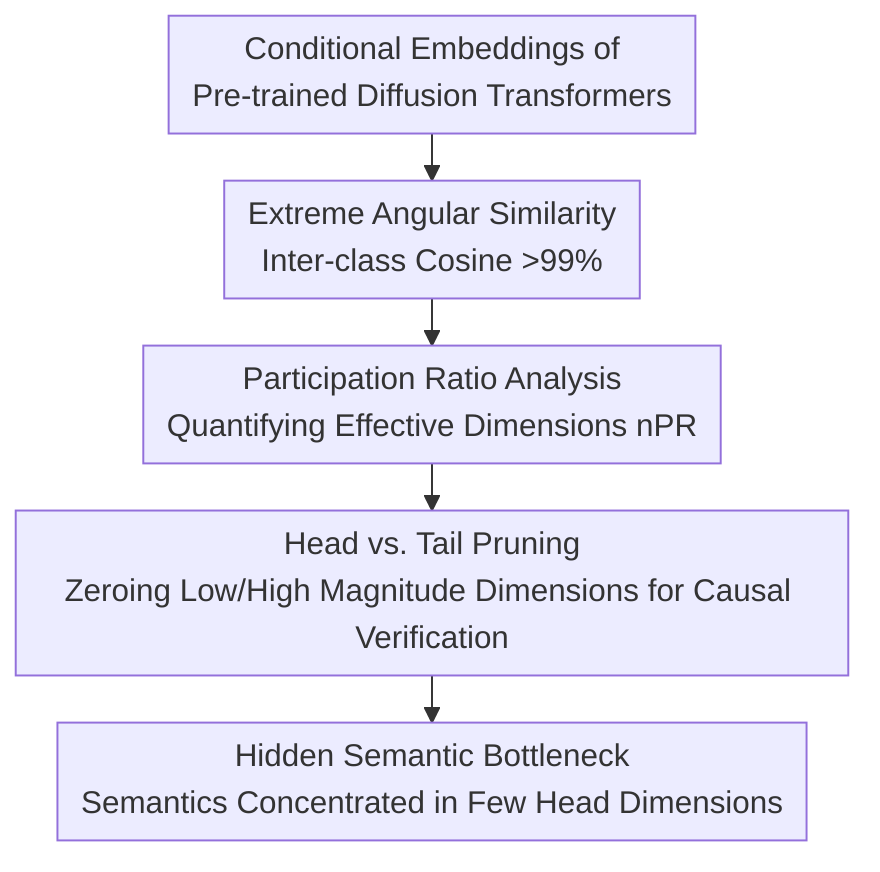

# A Hidden Semantic Bottleneck in Conditional Embeddings of Diffusion Transformers

**Conference**: ICLR 2026  
**arXiv**: [2602.21596](https://arxiv.org/abs/2602.21596)  
**Code**: Available  
**Area**: Diffusion Models  
**Keywords**: diffusion transformer, conditioning, embedding sparsity, cosine similarity, AdaLN  

## TL;DR
The first systematic analysis of conditional embeddings in Diffusion Transformers reveals extreme angular similarity (inter-class cosine similarity >99%) and dimensional sparsity (only 1-2% of dimensions carry semantic information). Generation quality remains largely unchanged after pruning 2/3 of low-magnitude dimensions, uncovering a hidden semantic bottleneck in conditional embeddings.

## Background & Motivation
**Background**: Transformer-based diffusion models such as DiT, SiT, and REPA inject conditional signals (embeddings of class labels and timesteps) via AdaLN, achieving SOTA generation performance.

**Limitations of Prior Work**: Although conditional embeddings are core components of Diffusion Transformers, their internal structure and semantic encoding mechanisms remain almost entirely unknown—no prior work has analyzed the nature of these embeddings.

**Key Challenge**: Conditional embeddings for 1000 categories are highly similar (>99% cosine similarity) in a 1152-dimensional space, yet the model correctly distinguishes categories to generate high-quality images. This contradiction of "how nearly identical vectors produce completely different images" requires explanation.

**Goal**: Systematically understand how Diffusion Transformers encode and utilize conditional signals.

**Key Insight**: Directly analyze learned conditional vectors by measuring cosine similarity, participation ratios, and variance distributions, and verify dimension importance through pruning experiments.

**Core Idea**: Diffusion Transformers compress semantic information into a very small number of "head" dimensions within conditional embeddings, while the remaining vast majority of "tail" dimensions are redundant.

## Method

### Overall Architecture
This is a purely analytical paper that does not propose a new model. Instead, it treats learned conditional embeddings (vectors from class labels and timesteps injected via AdaLN) in Diffusion Transformers as subjects for dissection. It addresses the counter-intuitive contradiction: how vectors that nearly overlap in direction generate distinct images. The analysis is conducted across 6 ImageNet SOTA models (DiT/MDT/SiT/REPA/LightningDiT/MG) and 2 continuous conditioning tasks (pose-guided portrait, video-to-audio). The logic follows a "correlation then causality" approach in three steps: measuring **Extreme Angular Similarity** to see how close vector directions are, using **Participation Ratio Analysis** to quantify how many dimensions carry information, and performing **Head vs. Tail Pruning** for causal verification to locate where semantics are hidden—ultimately confirming the existence of a "hidden semantic bottleneck."

### Key Designs

**1. Extreme Angular Similarity: Revealing "How Nearly Identical Vectors Distinguish Categories"**

The first step involves directly measuring the directional proximity between learned conditional vectors. The results are counter-intuitive: the cosine similarity of embeddings for 1000 ImageNet classes is generally above 99%, with REPA reaching 99.46%. Continuous conditioning tasks are even more extreme, with pose and audio tasks exceeding 99.9%+. Directionally, these vectors almost overlap, yet the model generates distinct images. The authors hypothesize that diffusion training requires embeddings to provide stable denoising signals across all timesteps, naturally favoring a globally aligned direction that "pulls" all category vectors into the same narrow cone. Semantic differences reside not in the overall direction, but in a very few high-magnitude "head" dimensions. Thus, the contradiction is resolved: directions are nearly identical, while differences are hidden in magnitudes.

**2. Participation Ratio Analysis: Quantifying the Active Dimensions**

To convert the intuition of "semantics concentrated in few dimensions" into a measurable metric, the paper uses the Participation Ratio (PR) to characterize the effective width of the embedding magnitude distribution, normalized as $\alpha_{norm} = \text{PR}(|c|) / d$, representing the ratio of effective dimensions to the total dimension $d$. Measurements show that the normalized PR (nPR) of SOTA models (MDT, REPA, MG) is only 1.5–2.3%—meaning only about 18–26 dimensions out of 1152 actually carry information. DiT is an exception (10.5%) due to its older architecture and lower compression. Continuous tasks show higher nPR (13–48%) because conditions like pose and audio require encoding fine-grained continuous information that cannot fit into a dozen dimensions. This metric solidifies "sparsity" from a qualitative observation into concrete data.

**3. Head vs. Tail Pruning: Locating Semantics via Causal Experiments**

While the first two steps show correlations, the paper uses pruning for causal verification: dimensions with magnitudes below a threshold $\tau$ are zeroed out to observe impacts on generation quality. In tail pruning, removing 38.9% of low-magnitude dimensions ($\tau=0.01$) results in an FID change from 7.17 to 7.16 (nearly identical); even removing 66.2% ($\tau=0.02$) only increases FID to an acceptable 9.22. This suggests tail dimensions are nearly redundant. In contrast, head pruning shows a sharp drop: removing just the top 2/1152 dimensions (0.2%) increases FID to 7.85, and removing 8/1152 dimensions (0.69%) causes FID to explode to 523, leading to complete image collapse. These comparisons provide a complete causal chain: semantic information is almost entirely concentrated in a few head dimensions, and tail dimensions can be safely discarded.

### Loss & Training
No training is involved; all analyses and pruning are performed on pre-trained models during inference.

## Key Experimental Results

### Main Results (Conditional Embedding Statistics)

| Model | Dimensions | nPR | Cosine Similarity |
|------|------|-----|-----------|
| DiT-XL | 1152 | 10.47% | 90.01% |
| MDT-XL | 1152 | 1.60% | 99.05% |
| SiT-XL | 1152 | 2.28% | 98.52% |
| REPA-XL | 1152 | 1.53% | **99.46%** |
| LightningDiT | 1152 | 2.05% | 97.79% |
| X-MDPT (Pose) | 1024 | 48.42% | 99.98% |
| MDSGen (Audio) | 768 | 13.57% | **99.99%** |

### Ablation Study (REPA-XL)

| Pruning | Dimensions Removed | FID↓ | IS↑ | CLIP↑ |
|------|---------|------|-----|-------|
| No Pruning | 0% | 7.17 | 176.0 | 29.75 |
| Tail τ=0.01 | 38.9% | **7.16** | 176.0 | **29.81** |
| Tail τ=0.02 | 66.2% | 9.22 | 125.2 | 29.22 |
| Head τ=5.0 | 0.2% (2 dim) | 7.85 | 164.2 | 29.56 |
| Head τ=1.0 | 0.69% (8 dim) | **523.8** | 1.95 | 22.69 |

### Key Findings
- After pruning 39% of tail dimensions, FID slightly improves (7.17→7.16) and CLIP increases modestly, suggesting these dimensions are not only useless but potentially noisy.
- Variance analysis shows only 15-20 head dimensions carry meaningful cross-category variance; 98% of dimensions have nearly zero variance.
- Training dynamics tracking reveals that cosine similarity and sparsity increase progressively during training—this is a natural outcome of training rather than random initialization.
- Pruning in late denoising steps yields better results than in early steps, as conditional signals become finer in later stages.

## Highlights & Insights
- **Counter-intuitive Discovery**: Conditional embeddings for 1000 distinct categories are 99%+ similar; models generate completely different images based on <2% dimensional differences, challenging common understanding of conditional encoding.
-  **Implications for Efficient Design**: Since only ~20 effective dimensions are needed, future conditioning mechanisms can be significantly simplified—reducing dimensions, parameters, and inference time.
- **Difference from Contrastive Collapse**: Although the phenomenon is similar (highly similar embeddings), this is not harmful collapse because the iterative refinement of the diffusion process can amplify minute differences.

## Limitations & Future Work
- The analysis is restricted to AdaLN injection; embedding structures in cross-attention conditioning (e.g., text-guided) may differ.
- Explanations for "why this happens" remain at the hypothesis level and lack rigorous theoretical proof.
- Analysis is solely on pre-trained models; the study does not attempt to redesign and train more efficient conditioning mechanisms based on these findings.
- Pruning experiments were performed at inference; whether sparsity can be leveraged to accelerate training remains unexplored.

## Related Work & Insights
- **vs. AlignTok**: AlignTok focuses on how encoders affect latent space semantics, while this work focuses on how conditional embeddings encode semantics—the two are complementary.
- **vs. Contrastive Collapse**: While the phenomena are similar (extreme embedding similarity), this is an effective compression in diffusion models rather than a harmful collapse.
- **vs. Information Bottleneck Theory**: Consistent with IB theory—the model learns to compress conditional information into the minimum necessary subspace.

## Rating
- Novelty: ⭐⭐⭐⭐⭐ First systematic revelation of the hidden structure in Diffusion Transformer conditional embeddings.
- Experimental Thoroughness: ⭐⭐⭐⭐⭐ 6+ models, 3 types of tasks, detailed pruning ablations, and training dynamics.
- Writing Quality: ⭐⭐⭐⭐ Findings are clear, though theoretical explanations are relatively light.
- Value: ⭐⭐⭐⭐⭐ Fundamental impact on the understanding of conditional generative models.

<!-- RELATED:START -->

## Related Papers

- [\[ICLR 2026\] Scaling Laws for Diffusion Transformers](scaling_laws_for_diffusion_transformers.md)
- [\[ICLR 2026\] Rethinking Global Text Conditioning in Diffusion Transformers](rethinking_global_text_conditioning_in_diffusion_transformers.md)
- [\[ICLR 2026\] Dual-Path Condition Alignment for Diffusion Transformers](dual-path_condition_alignment_for_diffusion_transformers.md)
- [\[ICML 2026\] Recovering Hidden Reward in Diffusion-Based Policies](../../ICML2026/image_generation/recovering_hidden_reward_in_diffusion-based_policies.md)
- [\[ICLR 2026\] Massive Activations are the Key to Local Detail Synthesis in Diffusion Transformers](massive_activations_are_the_key_to_local_detail_synthesis_in_diffusion_transform.md)

<!-- RELATED:END -->
