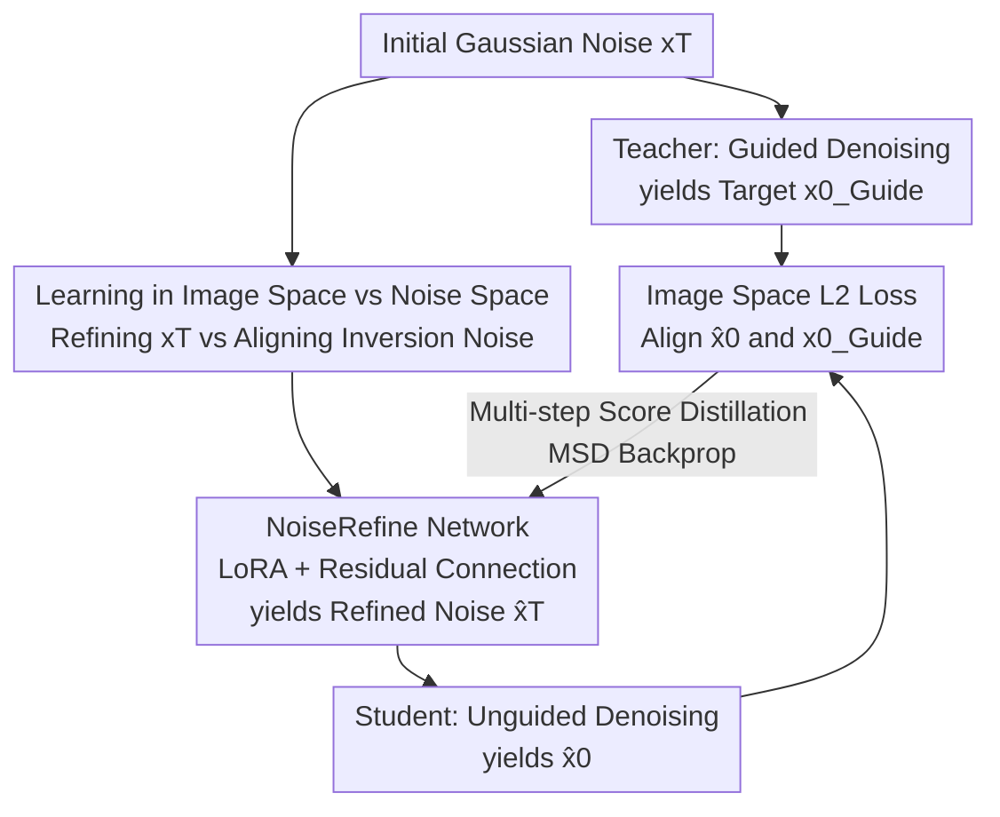

# A Noise is Worth Diffusion Guidance

**Conference**: ICLR2026  
**OpenReview**: [https://openreview.net/forum?id=xEWooSOgaz](https://openreview.net/forum?id=xEWooSOgaz)  
**Code**: https://cvlab-kaist.github.io/NoiseRefine (Project Page)  
**Area**: Diffusion Models / Image Generation  
**Keywords**: Diffusion Guidance, Classifier-free Guidance, Noise Refinement, Guidance Distillation, Guidance-free Sampling

## TL;DR
This paper proposes NoiseRefine: instead of modifying the diffusion model itself, it trains a lightweight network to "refine" random Gaussian noise into a structured noise. This enables generating images with quality close to CFG guidance using only a single forward pass **without any sampling guidance**, thereby eliminating the overhead of dual forward passes per step.

## Background & Motivation
**Background**: Text-to-image diffusion models (SD, SDXL, SiT, etc.) produce high-quality images but almost entirely rely on **sampling guidance**, primarily Classifier-Free Guidance (CFG). The cost of guidance is the requirement to compute two predictions (conditional + unconditional) at every denoising step, doubling the inference cost.

**Limitations of Prior Work**: The prevailing method to reduce guidance overhead is **guidance distillation**, which trains a student network to approximate "guided predictions." However, such methods modify the denoising network itself, making them prone to **catastrophic forgetting** and incompatible with downstream domain fine-tuning (e.g., Anime or Clay LoRAs) or timestep distillation (few-step models). A new distillation is required for every fine-tuned model.

**Key Challenge**: Must the guidance signal be "injected into the denoising network"? Modifying the network inevitably damages the model's original priors and breaks compatibility with other plug-and-play modules.

**Key Insight**: The authors noticed an overlooked factor—the **initial noise**. They analyzed the following: taking Gaussian noise $x_T$, generating a high-quality image $x_0^{\text{Guide}}$ with guidance, and then **inverting** this image back to noise $x_T^{\text{Guide}}$. They found that this "inversion noise" can reproduce similar high-quality images even **without guidance**. Statistical analysis of 10K pairs of $(x_T, x_T^{\text{Guide}})$ revealed that the difference between them is much smaller than between two random noises, and the difference is **concentrated in low-frequency components** (see Fig. 3 in the original paper). This suggests a **structured, learnable** mapping between initial Gaussian noise and "guidance-free high-quality noise."

**Core Idea**: Distill the guidance into the **noise** rather than the network. Train a noise refinement network $g_\phi$ to map Gaussian noise to "guidance-refined noise." The diffusion model remains unchanged, and at inference time, only one step of noise refinement is added before denoising.

## Method

### Overall Architecture
The training of NoiseRefine follows a **teacher-student alignment** framework: a single Gaussian noise $x_T$ follows two paths. The teacher path (target) uses the original model with guidance over $N'$ denoising steps to obtain a high-quality image $x_0^{\text{Guide}}$. The student path first lets the noise refinement network $g_\phi$ refine $x_T$ into $\hat x_T$, then uses the **same original model without guidance** over $N$ steps to obtain $\hat x_0$. The training objective is to make the unguided output $\hat x_0$ approximate the guided target $x_0^{\text{Guide}}$ by minimizing the $L2$ distance in image space $d(\hat x_0, x_0^{\text{Guide}})$. Notably, this process **does not require paired image datasets**, as the target images are generated online by the teacher. During inference, one simply samples Gaussian noise, passes it through $g_\phi$ to get $\hat x_T$, and runs standard unguided denoising.

### Key Designs

**1. Learning in Image Space Instead of Noise Space: Avoiding Inversion Error**

The most intuitive approach would be to learn the mapping "Gaussian noise → Inversion noise." However, inversion methods (like DDIM inversion) have inherent approximation errors. The **ideal inversion noise** $x_T^{\text{Guide}\dagger}$ (which perfectly reconstructs the guided image) is unattainable in practice. Using error-prone inversion noise as a supervision target leads to blurry results (see Fig. 4 and Fig. 5 top row). The authors shift the optimization target from noise space to **image space**: instead of minimizing $d(x_T, x_T^{\text{Guide}})$, they minimize $d(x_0, x_0^{\text{Guide}})$. This is supported by Proposition 1: assuming the denoising mapping $\epsilon_\theta^{(t)}$ is Lipschitz continuous with respect to distance $d$, there exists a constant $\kappa>0$ such that

$$d(x_T, x_T^{\text{Guide}\dagger}) < \kappa\, d(x_0, x_0^{\text{Guide}}).$$

In other words, **minimizing the image difference implicitly bounds the noise difference**, and image-space supervision avoids the dependency on unavailable ideal inversion noise. Table 1 shows that PickScore for noise-space loss is only 17.97 and CLIPScore is 18.39, whereas image-space loss (Ours) improves these to 21.62 and 36.43.

**2. NoiseRefine Network: LoRA + Residual Connection, Reusing Diffusion Priors Without Modifying the Model**

The architecture of $g_\phi$ can be arbitrary, but the authors use a **lightweight LoRA attached to the pre-trained diffusion model**. This offers three advantages: first, LoRA can leverage the rich text/image knowledge of the diffusion model itself, ensuring parameter efficiency and fast convergence. Second, LoRA is **detachable**—it is attached during refinement and detached during denoising, saving VRAM and integrating seamlessly into existing pipelines without destroying the model's priors. This serves as a prompt-learning-style approach that naturally avoids catastrophic forgetting. Third, since it only modifies the noise input and not the denoising network, the trained refinement network achieves **zero-shot transfer** to various fine-tuned models and compatibility with timestep-distilled models. Combined with the observation in Fig. 3 (that Gaussian and refined noise differ only by structured low-frequency components), a **residual connection** is added to $g_\phi$ so the network predicts only the "correction" rather than the entire refined noise.

**3. Multi-step Score Distillation (MSD): Bypassing High Backpropagation Costs**

Image-space loss requires backpropagating gradients from $\hat x_0$ through $N$ denoising steps (typically 20-30 for the SD family), which is computationally and memory-intensive. This has traditionally limited noise optimization to one/few-step models. The standard loss is $L_{\text{Denoise}}=d\big(D_1(\dots D_T(g_\phi(x_T))), x_0^{\text{Guide}}\big)$, where a single denoising step is $D_t(x)=a_t x_t + b_t \epsilon_\theta^{(t)}(x)$. The authors propose **MSD**: during backpropagation, a **stop-gradient (detach)** is applied to the denoising network at each step, replacing $D_t$ with

$$F_t(x) = a_t x_t + b_t\, \mathrm{SG}\big(\epsilon_\theta^{(t)}(x)\big),$$

Equation becomes $L_{\text{MSD}}=d\big(F_1(\dots F_T(g_\phi(x_T))), x_0^{\text{Guide}}\big)$. This ensures gradients do not pass through the denoiser's Jacobian, avoiding gradient explosion/vanishing issues typical of long-range dependencies (similar to RNN instability). This results in faster convergence, sharper images, and lower costs (Fig. 6). Proposition 2 further indicates that the MSD gradient differs from the full gradient only by a constant factor $k\in(0,1)$: $\nabla_\phi L_{\text{Denoise}} \approx k\,\nabla_\phi L_{\text{MSD}}$.

### Loss & Training
The core loss is $L2$ in image space coupled with the MSD stop-gradient implementation: $L_{\text{MSD}}(g_\phi(x_T),\theta)$. Teacher guidance can be any guidance or combination—class-conditional models (SiT-XL/2) use CFG, while T2I models (SD2.1, SDXL) use a combination of CFG and Perturbed-Attention Guidance (PAG). Training prompts are sampled from MS-COCO and Pick-a-Pic, **requiring no paired image data**; target images are generated online.

## Key Experimental Results

### Main Results
FID / IS evaluations on MS-COCO 30K (T2I) and ImageNet 50K (SiT) comparing four settings: Gaussian noise without guidance (Baseline), Gaussian noise with guidance, Guidance Distillation, and the proposed Refined Noise without guidance.

| Model | Setting | FID ↓ | IS ↑ |
|------|------|------|------|
| SiT-XL/2 | Gaussian + Unguided | 18.43 | 40.00 |
| SiT-XL/2 | Gaussian + Guided | 14.20 | 63.99 |
| SiT-XL/2 | Guidance Distill. | 12.12 | 58.90 |
| SiT-XL/2 | **Refined Noise (Ours) · Unguided** | **10.80** | 50.59 |
| SD2.1 | Gaussian + Unguided | 42.71 | 20.86 |
| SD2.1 | Gaussian + Guided | 16.19 | 37.95 |
| SD2.1 | **Refined Noise (Ours) · Unguided** | **14.62** | 34.90 |
| SDXL | Gaussian + Unguided | 63.28 | 17.64 |
| SDXL | Gaussian + Guided | 21.20 | 34.60 |
| SDXL | **Refined Noise (Ours) · Unguided** | 26.22 | 27.63 |

Refined noise achieved an **FID even superior to guided sampling and guidance distillation** on SiT and SD2.1 using only a single refinement step. On SDXL, it performed slightly worse than guidance but remained significantly better than the unguided baseline (63.28 → 26.22).

### Ablation Study

| Config | Key Metrics | Explanation |
|------|---------|------|
| Noise Space Loss | PickScore 17.97 / CLIPScore 18.39 | Directly learning noise mapping; hampered by inversion errors, leading to blurry output |
| Image Space Loss (Ours) | PickScore 21.62 / CLIPScore 36.43 | Alignment in image space drastically improves quality |
| Full Gradient vs. MSD | MSD converges faster; sharper images | Detaching denoiser gradients avoids instability in multi-step backprop (Fig. 6) |

User Study (Tab. 3): For image quality, Refined Noise Unguided (53.96%) vs. Gaussian Guided (46.04%); for prompt consistency, 51.76% vs. 48.24%—indicating that users have comparable or slightly higher preference for Refined Noise.

### Key Findings
- **Image space loss is critical for quality**: Switching to noise space loss leads to a sharp decline in all metrics; inversion error is the root cause of failed noise-map learning.
- **Differences are structured and low-frequency**: The difference between Gaussian and inversion noise is concentrated in low frequencies, which directly motivated the "residual connection to learn corrections" design.
- **Generalization and Compatibility**: Refinement networks trained on SD2.1 exhibit **zero-shot transfer** to specialized models (Anime, Clay) with quality near guided sampling (Tab. 4), and can be applied to SD-Turbo models to improve structural coherence (Fig. 8).

## Highlights & Insights
- **Perspective shift in optimization variables**: While traditional guidance reduction focuses on the "denoising network," this work shifts the focus to the "initial noise"—a severely underutilized degree of freedom. Modifying noise instead of the model preserves plug-and-play capability, prevents forgetting, and ensures transferability.
- **Image Space vs. Noise Space Trade-off**: Proposition 1 uses Lipschitz continuity to link image difference minimization with noise difference reduction, providing theoretical grounding while bypassing unattainable ideal inversion noise.
- **MSD enables noise optimization for full-step diffusion**: Detaching denoiser gradients extends noise optimization, previously limited to few-step models, to standard 20-30 step diffusion models.

## Limitations & Future Work
- **Training overhead from online sampling**: Unlike standard distillation, training requires teacher path guided sampling, increasing single-step training costs.
- **Gap in SDXL performance**: On larger models like SDXL, the FID (26.22) is still notably higher than guided sampling (21.20), suggesting noise refinement alone may have limitations at scale.
- **Teacher-bounded quality**: Since it learns to approximate teacher output, its performance ceiling is locked to the quality of the teacher's guidance.
- **MSD as an Approximation**: Proposition 2 holds only under mild assumptions and involves a constant factor; the impact of approximation error on convergence in extreme cases is not fully characterized.

## Related Work & Insights
- **vs. Guidance Distillation (Meng et al. 2023)**: They distill signals into the **student denoising network**, requiring model modification and per-variant distillation. Ours distills into the **initial noise**, keeping the model unchanged and allowing zero-shot transfer.
- **vs. Noise Optimization (Zhou et al. 2024, etc.)**: Others have used inversion noise in **noise space** as supervision for human preference alignment. Ours uses **image space loss** for **guidance-free generation** and solves the multi-step backprop cost via MSD.
- **vs. CFG / PAG Guidance**: These require extra computations (dual passes) at every step. This work "pre-pays" that cost into a one-time "noise refinement" step, eliminating the second forward pass per denoising step during inference.

## Rating
- Novelty: ⭐⭐⭐⭐⭐ Distilling guidance into noise instead of the network is a clean and under-explored direction.
- Experimental Thoroughness: ⭐⭐⭐⭐ Covers SiT/SD2.1/SDXL + transfer/distillation compatibility, though a gap remains on SDXL.
- Writing Quality: ⭐⭐⭐⭐⭐ The sequence of motivation, analysis, method, and proofs is cohesive.
- Value: ⭐⭐⭐⭐ Plug-and-play, no model modification, highly transferable and deployment-friendly.

<!-- RELATED:START -->

## Related Papers

- [\[ICLR 2026\] Mitigating Noise Shift in Denoising Generative Models with Noise Awareness Guidance](mitigating_noise_shift_in_denoising_generative_models_with_noise_awareness_guida.md)
- [\[ICLR 2026\] Deconstructing Guidance: A Semantic Hierarchy for Precise Diffusion Model Editing](deconstructing_guidance_a_semantic_hierarchy_for_precise_diffusion_model_editing.md)
- [\[ICLR 2026\] Stochastic Self-Guidance for Training-Free Enhancement of Diffusion Models](stochastic_self-guidance_for_training-free_enhancement_of_diffusion_models.md)
- [\[ICLR 2026\] Contrastive Diffusion Guidance for Spatial Inverse Problems](contrastive_diffusion_guidance_for_spatial_inverse_problems.md)
- [\[ICLR 2026\] Guidance Watermarking for Diffusion Models](guidance_watermarking_for_diffusion_models.md)

<!-- RELATED:END -->
