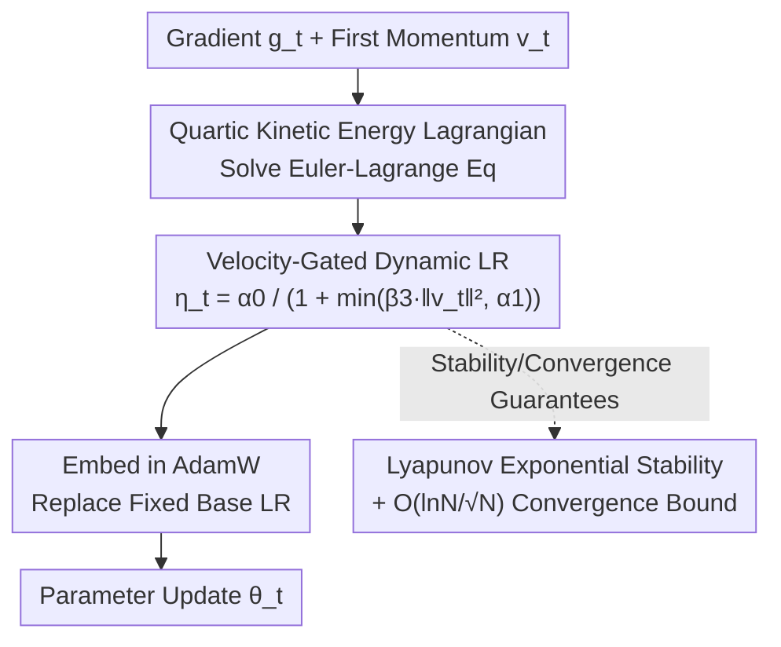

# A Physics-Inspired Optimizer: Velocity Regularized Adam

**Conference**: ICLR2026  
**OpenReview**: [https://openreview.net/forum?id=6BhduwrCp3](https://openreview.net/forum?id=6BhduwrCp3)  
**Code**: To be confirmed  
**Area**: Optimizer / Training Dynamics  
**Keywords**: Physics-inspired optimizer, velocity regularization, Edge of Stability, Adam, Lyapunov stability

## TL;DR
This paper proposes VRAdam (Velocity-Regularized Adam), which translates a physical stability mechanism—the "quartic kinetic energy term"—into a **global dynamic learning rate that automatically contracts with velocity** $\eta_t=\alpha_0/(1+\min(\beta_3\|v_t\|^2,\alpha_1))$. Embedded into AdamW, it automatically decelerates when weight updates are too large, suppressing oscillations near the Edge of Stability. Complemented by rigorous Lyapunov stability and $O(\ln N/\sqrt N)$ convergence proofs, it consistently outperforms AdamW across image classification, language modeling, GFlowNets, GPT-2 pre-training, and LLM fine-tuning.

## Background & Motivation
**Background**: Adam / AdamW has become the de facto standard for training deep networks, relying on "momentum + per-parameter second-moment scaling." However, its base learning rate $\eta$ remains globally fixed at each step once set (even with a schedule), making it sensitive to hyperparameters and often leading to unstable training dynamics.

**Limitations of Prior Work**: Extensive empirical evidence shows that neural network training often enters the so-called "Edge of Stability" (EoS)—the maximum eigenvalue (sharpness) $\lambda_{\max}$ of the loss Hessian stabilizes near the numerical stability limit of approximately $2/\eta$. This causes short-term non-monotonic loss oscillations and slows down convergence. For adaptive methods like Adam, there exists a corresponding "Adaptive Edge of Stability" (AEoS), where the threshold becomes a constraint on the preconditioned Hessian $P_t^{-1}H_t$: $\lambda_{\max}(P_t^{-1}H_t)<\frac{2+2\beta_1}{(1-\beta_1)\eta}$. Once this threshold is reached, the optimizer repeatedly fine-tunes the preconditioner in an oscillatory zone, ultimately slowing convergence.

**Key Challenge**: In classical optimization theory, large learning rates converge fast but diverge if they exceed boundaries. EoS phenomena indicate that real training stays near critical points for long periods. "Speed" and "stability" naturally conflict under a fixed learning rate—the learning rate does not temporarily retreat when a particular step "pushes too hard."

**Key Insight**: The authors take a physical approach, viewing the optimization trajectory as the motion of a particle in a high-dimensional loss landscape, where instability arises from "excessive velocity / step size." In physics, certain systems (classical time crystals, heavy quarks described by Non-Relativistic Quantum Chromodynamics or NRQCD) are exceptionally stable due to **quartic velocity terms** in their kinetic energy. These higher-order velocity terms reshape the energy landscape, making stable configurations attractors. The authors borrow this stability mechanism as inspiration.

**Core Idea**: By adding a quartic term to the kinetic energy $T(v)=\tfrac{m}{2}\|v\|^2+\tfrac{\beta_3}{4}\|v\|^4$ and solving the Euler-Lagrange equations, an **effective learning rate that decreases as velocity increases** naturally emerges. This is embedded as a global scalar gate into AdamW—automatically decelerating when velocity is high, thereby suppressing oscillations near AEoS and accelerating convergence.

## Method

### Overall Architecture
The logical chain of VRAdam is: **Physical kinetic energy assumption → Solving Euler-Lagrange equations to obtain "velocity gating" → Embedding the gate into AdamW → Accompanying theoretical guarantees**.

The authors analogize the global momentum buffer $v$ of the optimizer to the velocity of stable systems like "heavy quark momentum," assuming a Lagrangian:
$$L(x,v)=\frac{m}{2}v^2+\frac{\beta_3}{4}v^4-V(x),$$
where $V(x)$ is the neural network loss landscape ($\partial V/\partial x=\nabla L_\text{loss}(x)$). Solving the Euler-Lagrange equation $\frac{d}{dt}\frac{\partial L}{\partial v}-\frac{\partial L}{\partial x}=0$ and rearranging (under a 1D reduction where $\dot v$ and $v$ are collinear) yields:
$$\dot v=-\nabla L_\text{loss}(x)\big/(m+3\beta_3\|v\|^2),\quad \dot x=v.$$
The key lies in the term $1/(m+3\beta_3\|v\|^2)$: the higher the velocity, the smaller this coefficient becomes, effectively lowering the step size dynamically. Instead of solving this ODE directly (to avoid choosing integrators and introducing extra dissipation), the authors **reparameterize and clip** this term into a dynamic learning rate, directly replacing the fixed base learning rate in AdamW.

Algorithmically (Alg. 1), VRAdam modifies only one line compared to AdamW: after calculating the velocity $v_t$ (first momentum), it inserts:
$$\eta_t=\alpha_0\big/\big(1+\min(\beta_3\|v_t\|^2,\alpha_1)\big),$$
and then uses this $\eta_t$ for the weight-decayed update: $\theta_t=\theta_{t-1}(1-\eta_t\lambda)-\eta_t\,\hat v_t/(\sqrt{\hat m_t}+\epsilon)$. Everything else (second moment $m_t$, bias correction, weight decay) remains identical to AdamW, making it a low-overhead "plug-and-play" modification.

### Key Designs

**1. Quartic Kinetic Energy → Velocity-Gated Learning Rate: Automatic deceleration for aggressive updates**

This design directly addresses the pain point where a fixed learning rate cannot temporarily retreat near EoS. While standard momentum corresponds to kinetic energy $\tfrac{m}{2}v^2$, the authors add a quartic term $\tfrac{\beta_3}{4}v^4$. This causes the step size in the resulting equation of motion to be modulated by $1/(m+3\beta_3\|v\|^2)$—when velocity (recent update magnitude) is large, the denominator is large and the effective step size is small; when velocity is low, the step size restores. In the algorithm, this becomes $\eta_t=\alpha_0/(1+\min(\beta_3\|v_t\|^2,\alpha_1))$: $\beta_3$ controls the velocity penalty intensity, $\alpha_0$ is the max learning rate, and $\alpha_0/(1+\alpha_1)$ is the lower bound. Using $\min(\cdot,\alpha_1)$ to clip the pure $v^2$ term derived from physics prevents the learning rate from being suppressed to zero and getting stuck when gradients/velocities explode. Its effectiveness lies in being a **data-driven adaptive mechanism without extra backpropagation**. In ResNet-32/CIFAR-10 experiments, the learning rate is observed to decrease dynamically in the first 25 steps to suppress initial oscillations before returning near the maximum to exploit the landscape.

**2. Global Scalar Gating instead of Per-Parameter Scaling: Provable stability across directions**

A subtle but significant choice the authors emphasize: $\eta_t$ is a **global scalar** that scales all parameter directions equally, rather than scaling per-coordinate like Adam preconditioning. The authors point out that per-coordinate scaling is equivalent to a switched linear system with a time-varying diagonal matrix $D_t$. Even if each fixed $D$ is individually Schur stable (spectral radius < 1), the product $A(D_2)A(D_1)$ can be unstable because asynchronous contraction directions rotate and the matrices do not commute. By using a global scalar $\eta_t$, the dynamics decouple into a family of identical $2\times2$ subsystems $A_h(\eta_t)$ under the Hessian eigenbasis. This allows for the construction of a **curvature-independent Common Quadratic Lyapunov Function (CQLF)** $V(z)=z^\top Pz$ that holds for any sequence of scalar gates. Furthermore, this scalar gate is rotation-invariant, does not require the preconditioner to commute with the Hessian, and provides a dimensionless upper bound on the update norm: $\|\theta_t-\theta_{t-1}\|=\eta_t\|v_t\|\le \alpha_0/(2\sqrt{\beta_3})$—automatically moving away from instability when velocity surges.

**3. Integrated Stability and Convergence Theory: Solidifying physical intuition into provable guarantees**

The authors provide two layers of theory. First is **Uniform Exponential Stability** under AEoS (Theorem 4.1): in a quadratic model + momentum ablation setup, as long as $\alpha_0 L<B(\beta)=\frac{2(1+\beta)}{1-\beta}$ (or substituting $\eta_{\min} L$ when clipping is active), there exists $P\succ0$ such that $V(z_t)\le(1-\epsilon)V(z_{t-1})$, making the origin a globally uniformly exponentially stable equilibrium. This extends to non-convex trajectories with decoupled weight decay $\lambda>m$ (curvature range $[-m,L]$). Second is the **Non-convex Stochastic Convergence Bound** (Theorem 4.2), following the analysis for Adam by Défossez et al., proving that under mild assumptions, $\mathbb{E}\|\nabla F(\theta_\tau)\|^2$ tends to 0 at a rate of $O(\ln N/\sqrt N)$—the same order as Adam, indicating that velocity gating does not sacrifice convergence speed.

### Loss & Training
VRAdam does not change the training objective, only the optimizer update rule. New hyperparameters are $\alpha_0$ (max LR), $\alpha_1$ (lower bound control), and $\beta_3$ (velocity penalty strength); others like $\beta_1,\beta_2,\epsilon,\lambda$ follow AdamW. Hyperparameters for image classification and language modeling were found via Bayesian optimization targeting validation loss; GFlowNets used random selection due to compute limits.

## Key Experimental Results

### Main Results
The study covers four categories of tasks/architectures: CNN image classification (CIFAR-10), Transformer language modeling (WikiText-2), GFlowNets (GridWorld flow matching), and GPT training. It primarily benchmarks against AdamW, alongside RAdam / SGD+Nesterov / RMSProp.

| Task (Metric=Loss, lower is better) | VRAdam | AdamW | RAdam | SGD+Nesterov | RMSProp |
|--------|------|------|------|------|------|
| WikiText-2 Val / Test | **5.99 / 6.00** | 6.47 / 6.50 | 7.51 / 7.55 | NaN / NaN | NaN / NaN |
| CIFAR-10 Val / Test | **0.476 / 0.469** | 0.522 / 0.565 | 2.300 / 4.005 | 0.625 / 0.620 | 0.801 / 0.813 |
| GridWorld Flow Matching Val / Test | **1.25 / 1.33** | 2.41 / 3.60 | 1.41 / 2.29 | 2.71 / 2.61 | 25.0 / 25.0 |

GPT-2 (124M) pre-trained from scratch on FineWebEdu-10B for ~2 epochs:

| Method | Training Time per Epoch (s) | Val Loss |
|------|------|------|
| AdamW | 48549.56 | 3.511 |
| VRAdam | 48522.40 | **3.447** |

Training times are nearly identical (minimal overhead), while VRAdam achieves lower validation loss.

More challenging LLM fine-tuning (Metric=PPL, lower is better):

| Setup | Model / Dataset | AdamW | VRAdam | Lion |
|------|------|------|------|------|
| 4-bit QLoRA | LLaMA-2-7B / OASST2 | 3.84 | **3.55** | 3.56 |
| Full-Param Fine-Tuning | GPT-2 Large(774M) / GSM8K | 4.12 | **3.53** | 3.67 |

For GPT-2-Large fine-tuning on GSM8K, the exact match accuracy increased from 35% (AdamW) to 42% (VRAdam) under the same training budget. In the OASST2 QLoRA setup, automatic instruction-following quality scores rose from 72.3/100 to 78.5/100.

### Ablation Study
The "ablation" is primarily reflected in the dynamical analysis of ResNet-32/CIFAR-10 (comparing VRAdam vs. Adam vs. SAM) and the mechanistic comparison of "global gating vs. per-parameter scaling."

| Dimension | Phenomenon | Description |
|------|------|------|
| VRAdam vs Adam/SAM Convergence | VRAdam training loss/accuracy converges faster | Dynamic LR reduces AEoS oscillations |
| Effective LR Trajectory | Drops initially (~25 steps) then rises near $\alpha_0$ | Suppresses initial oscillation, later exploits landscape |
| Global Scalar Gate vs per-param $D_t$ | Per-parameter switching can destabilize product | Global scalar ensures CQLF contraction |

### Key Findings
- **Velocity gating is the primary driver of gains**: Relying solely on the global modulation of "higher velocity, lower learning rate," the method achieves both faster convergence and lower final loss with negligible computational overhead (GPT-2 training time is on par with AdamW).
- **Stability comes from the "Global Scalar" rather than "Per-parameter"**: The authors explicitly demonstrate that per-coordinate scaling can lead to instability due to directional rotation and non-commutativity, whereas a global scalar gate is key to provable stability.
- **Universal applicability but EoS mechanism remains partially obscure**: Improvements are observed from legacy CNNs to GFlowNets and 7B LLM fine-tuning, though the authors admit the generalization mechanism in the EoS regime is not yet fully understood.

## Highlights & Insights
- **Translating a physical law into one line of code**: Mechanisms like quartic kinetic energy, which sound abstract, result in a simple $\eta_t=\alpha_0/(1+\min(\beta_3\|v_t\|^2,\alpha_1))$ calculation. This is highly reusable—any momentum-based optimizer can add this velocity gate.
- **The "Global Scalar vs. Per-parameter" stability argument is instructive**: It highlights a counter-intuitive fact—a sequence of per-coordinate scalings that are individually stable can still diverge when composed, whereas a "cruder" global scalar gate is guaranteed by a Common Lyapunov Function. This perspective is transferable to analyzing other adaptive or switching optimizers.
- **Balancing theory and intuition**: The paper provides physical intuition while also supplying proofs for exponential stability and $O(\ln N/\sqrt N)$ convergence, avoiding the "trick without guarantees" pitfall.

## Limitations & Future Work
- The authors acknowledge that the Edge of Stability (EoS) regime itself is not fully understood; the mechanistic explanation for the generalization benefits of VRAdam remains open.
- Computational constraints: GFlowNet hyperparameters were randomly selected, and some large-scale experiments had limited scope. A systematic scan for hyperparameter sensitivity (especially $\beta_3, \alpha_1$) is lacking.
- Three new hyperparameters ($\alpha_0, \alpha_1, \beta_3$) increase the tuning dimensionality; the choice of the velocity clipping threshold $\alpha_1$ involves a trade-off between "preventing stall" and "sufficient deceleration" that requires experience.
- Future directions: Combining velocity gating with existing LR schedulers/warmup or generalizing "quartic" terms to higher-order kinetic energy forms to further shape AEoS behavior.

## Related Work & Insights
- **vs AdamW / RAdam / NAdam / AdaBelief**: These focus on "per-parameter scaling or variance estimation" while the base LR remains a global fixed value. VRAdam does not touch the per-parameter components but adds a **velocity-adaptive** gate to the global LR, which is orthogonal to their improvements.
- **vs SAM (Sharpness-Aware Minimization)**: SAM explicitly seeks flat minima but requires an extra forward/backward pass. VRAdam naturally maintains lower sharpness on AEoS via dynamic LR, achieving faster convergence without extra gradient computations.
- **vs Lion / Sophia**: Lion uses discovered symbolic momentum; Sophia uses diagonal Hessian estimates for preconditioning. VRAdam follows a different path via "Physical Lagrangian → Velocity Regularization," outperforming Lion in PPL during QLoRA/full-param fine-tuning.
- **vs Symplectic Optimizers (França et al.)**: Symplectic methods use structure-preserving integrators to discretize continuous Hamiltonian/Lagrangian flows. This paper **avoids** explicit ODE discretization, simply extracting the quartic term as a gate for the mature AdamW, which is engineering-friendly.

## Rating
- Novelty: ⭐⭐⭐⭐ Translates quartic kinetic energy into velocity gating with a clean implementation.
- Experimental Thoroughness: ⭐⭐⭐⭐ Covers CNN/Transformer/GFlowNet/7B LLM, though some hyperparams were random and sensitivity scans were limited.
- Writing Quality: ⭐⭐⭐⭐ Clear chain of logic: physics intuition → derivation → algorithm → theory → experiments.
- Value: ⭐⭐⭐⭐ Low-overhead, plug-and-play, consistently outperforms AdamW; offers insights for training dynamics research.

<!-- RELATED:START -->

## Related Papers

- [\[ICLR 2026\] PI-Light: Physics-Inspired Diffusion for Full-Image Relighting](pi-light_physics-inspired_diffusion_for_full-image_relighting.md)
- [\[ICLR 2026\] Terminal Velocity Matching](terminal_velocity_matching.md)
- [\[ICLR 2026\] GenCP: Towards Generative Modeling Paradigm of Coupled Physics](gencp_towards_generative_modeling_paradigm_of_coupled_physics.md)
- [\[ICLR 2026\] Half-order Fine-Tuning for Diffusion Model: A Recursive Likelihood Ratio Optimizer](half-order_fine-tuning_for_diffusion_model_a_recursive_likelihood_ratio_optimize.md)
- [\[ICLR 2026\] FlowAlign: Trajectory-Regularized, Inversion-Free Flow-based Image Editing](flowalign_trajectory-regularized_inversion-free_flow-based_image_editing.md)

<!-- RELATED:END -->
