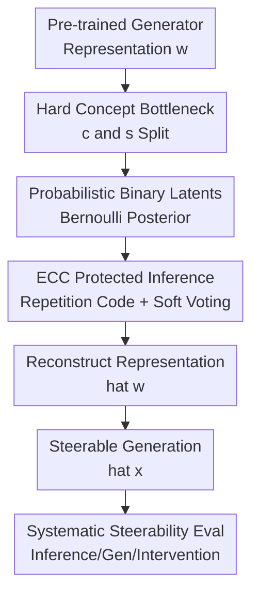

# A Probabilistic Hard Concept Bottleneck for Steerable Generative Models

**Conference**: ICLR2026  
**OpenReview**: [https://openreview.net/forum?id=Kcb6WufAco](https://openreview.net/forum?id=Kcb6WufAco)  
**Code**: https://github.com/mariamartinezgarcia/vhcb  
**Area**: Image Generation / Steerable Generation / Interpretable Generative Models  
**Keywords**: Concept Bottleneck, Steerable Generation, Hard Concepts, Binary VAE, Generative Model Evaluation  

## TL;DR

This paper reformulates the concept bottleneck in generative models into a probabilistic hard binary concept layer, VHCB. This allows users to directly sample images from specified concepts or perform interventions on existing generations. Systematic validation on StyleGAN2 and DDPM demonstrates superior steerability and reduced concept leakage compared to soft concept bottlenecks.

## Background & Motivation

**Background**: Steerable image generation aims to incorporate human-interpretable attributes into the generative process, such as adding a "smile" or "eyeglasses" to a face. Concept Bottleneck Generative Models (CBGMs) follow this path by inserting a concept layer between the generator's intermediate representation $w$ and subsequent modules. This layer maps $w$ to concepts $c$ and additional unsupervised representations $s$, then reconstructs the representation $\hat{w}$ from $(c, s)$.

**Limitations of Prior Work**: Most existing CBGMs utilize soft concept probabilities or embeddings. While interpretable, continuous probabilities allow the model to encode irrelevant information in the fractional parts, causing "concept leakage." This results in opaque interventions and unstable control. Furthermore, post-hoc concept bottleneck methods typically only support concept substitution in existing representations and cannot perform direct sampling from a specified concept configuration.

**Key Challenge**: Generative models must retain sufficient detail for high-quality images, yet concept bottlenecks require discrete and clean channels for steerability. Compressing all information into human-defined concepts loses texture or lighting details, while overly powerful bypasses or soft concepts undermine the bottleneck's purpose.

**Goal**: The authors aim to solve three problems: first, transitioning concept control from soft probabilities to "hard" binary switches; second, enabling probabilistic generation within the bottleneck to support direct sampling; and third, establishing an evaluation pipeline that distinguishes between bottleneck failure and out-of-distribution concept combinations.

**Key Insight**: The paper adapts the idea of binary discrete VAEs. Binary latents are naturally suited for representing the presence of concepts, while the VAE framework enables direct sampling from the latent space. Error-correcting codes are further employed to protect binary latents from inference errors.

**Core Idea**: A probabilistic binary VAE layer with error-correcting codes maps the intermediate representation $w$ to hard concepts $c$ and a binary bypass $s$. Hard concepts reduce leakage, while the probabilistic latent space supports direct concept-based generation.

## Method

### Overall Architecture

The proposed method is termed Variational Hard Concept Bottleneck (VHCB). It is applied post-hoc by inserting a VHCB into a pre-trained generator. The generator produces an intermediate representation $w$, which VHCB encodes into hard concepts $c$ and an unsupervised binary bypass $s$. These are decoded back into $\hat{w}$ to generate the image $\hat{x}$.

This framework supports two control modes: concept intervention (flipping bits from 0 to 1) for existing images, and direct generation (specifying $c$ and sampling $s$ from a prior) to create new images with desired attributes.

### Key Designs

**1. Hard Concept Bottleneck: Mapping attributes to switchable variables**

Unlike CB-AE, which uses continuous logits or probabilities, VHCB explicitly models binary concepts $c \in \{0,1\}^K$. Each bit corresponds to a predefined concept (e.g., smiling, eyeglasses). Narrowing the channel to binary variables makes concept leakage difficult because there is no continuous space to hide unintended information. To maintain quality, a binary bypass $s \in \{0,1\}^L$ captures factors like texture and lighting not covered by the defined concepts.

**2. Probabilistic Binary Latents: Enabling direct generation**

VHCB treats $c$ and $s$ as independent Bernoulli latent variables. Given $w$, the encoder produces posteriors $q_\eta(c|w)$ and $q_\eta(s|w)$. For direct generation, $c$ is fixed or sampled while $s$ is sampled from a prior. Using Coded DVAE reparameterization, binary codes $v$ are smoothed into $z \in [0,1]$ using a distribution $p(z|v=1)=e^{\beta(z-1)}/Z_\beta$ and $p(z|v=0)=e^{-\beta z}/Z_\beta$, ensuring differentiability during training.

**3. Error-Correcting Code (ECC): Protecing discrete inference**

Binary latents are sensitive to single-bit errors. VHCB uses ECC to protect the representations. The $K$-dimensional concept $c$ is mapped to a longer $K'$-dimensional codeword $v_c$ (similarly for $s$). Specifically, a uniform repetition code is used. The encoder predicts marginal probabilities for the redundant bits, and soft majority voting recovers the original bits, providing a noise-reduction mechanism for semantic switches.

**4. Systematic Evaluation: Decoupling inference, generation, and intervention**

The paper introduces a structured evaluation framework:
- **Concept Inference**: Checking the accuracy of $w \to c$.
- **Disentanglement**: Swapping $s$ to see if concepts remain stable.
- **Direct Generation**: Verifying if images generated from a specified $c$ actually exhibit those attributes.
- **Single Concept Intervention**: Measuring target change and non-target stability.
- **Minimum Hamming Distance Intervention**: Selecting target configurations close to the training distribution to distinguish between bottleneck failure and data distribution limits.

### Loss & Training

The pre-trained generator remains fixed. Training samples $(w_i, y_i)$ are generated by the model itself, where $y_i$ are pseudo-labels from a classifier (e.g., ResNet18 or CLIP). The VHCB loss consists of four terms:

$$
L = \mathbb{E}_{q_\eta(c,s,z|w)} \log p_\theta(w|z)
- D_{SKL}(q_\eta(c|w),p(y|x))
- D_{KL}(q_\eta(s|w)\|p(s))
+ \mathrm{MSE}(x,\hat{x}).
$$

The first term is the reconstruction of $w$. The second term uses symmetric KL (Jeffreys divergence) to align the posterior with pseudo-labels. The third term constrains the bypass $s$ to its prior. The final term ensures the reconstructed image $\hat{x}$ remains close to the original $x$.

## Key Experimental Results

### Main Results

VHCB was compared against CB-AE on CelebA-HQ (StyleGAN2 and DDPM) and CUB-200-2011.

| Setting | Metric | VHCB | CB-AE | Conclusion |
|------|------|------|-------|------|
| CelebA-HQ all, ResNet18 | Inference Acc. | 0.855 | 0.857 | Hard concepts do not degrade accuracy. |
| CelebA-HQ all, ResNet18 | Inference Cosine | 0.804 | 0.763 | VHCB posterior aligns better with labels. |
| CelebA-HQ low corr. | Disentanglement Acc. | 0.874 | 0.701 | VHCB maintains concepts better when swapping $s$. |
| CelebA-HQ all, CLIP | Inference Acc. | 0.623 | 0.565 | VHCB is more robust to noisy CLIP labels. |

| Setting | Task | VHCB Target Acc. | CB-AE Target Acc. | Observation |
|------|------|------------------|-------------------|------|
| CelebA-HQ all | Activation | 0.170 | 0.105 | Activating rare concepts is hard, but VHCB is better. |
| CelebA-HQ all | Deactivation | 0.550 | 0.453 | VHCB leads in deactivation tasks. |
| CelebA-HQ low corr. | Activation | 0.769 | 0.420 | Substantial gains on low-correlation concept sets. |

Direct sampling results (unique to VHCB): On StyleGAN2 + CelebA-HQ, sampling concepts following training patterns yields a target accuracy of 0.873, compared to 0.551 for random configurations. This highlights the impact of data distribution on steerability.

### Ablation Study

| Component | Setting | Observation |
|--------|------|----------|
| Symmetric KL | CelebA-HQ all | Provides the most balanced performance across activation and deactivation. |
| Remove bypass $s$ | Balanced set | FID degrades significantly (11.016 $\to$ 20.950). |
| ECC | Repetition code | Improves robustness of concept mapping from intermediate representations. |

### Key Findings

- VHCB's primary gain is not just in classification accuracy but in the effectiveness of changing the target attribute during intervention.
- Data distribution bias is a major limiting factor. Activating rare concepts is much harder than deactivating common ones.
- Direct generation is highly reliable when following empirical concept patterns but struggles with OOD combinations.
- Diffusion models are harder to steer; multi-layer injection of VHCB info improves performance over bottleneck-only injection.

## Highlights & Insights

- **Probabilistic Hard Bottleneck**: Naturally combines hard binary switches for interpretability with VAEs for generative sampling.
- **Controlled Bypass**: Explicitly acknowledges that human concepts are incomplete, using a low-dimensional binary bypass to capture residuals without overwhelming the concept channel.
- **Evaluation Framework**: The decomposed evaluation tasks (target vs. non-target accuracy, Hamming intervention) are highly transferable to other steerable models.
- **Honest Assessment of Data Bias**: The authors distinguish between failures of the bottleneck layer and limitations imposed by training data correlations.
- **ECC in SEM**: Using error-correcting codes to bridge the gap between neural inference and discrete semantic switches is a novel and effective application of communication theory.

## Limitations & Future Work

- **Concept Independence**: VHCB assumes independent Bernoulli latents, while real-world concepts are highly correlated. Future work could model structured priors (e.g., GMs or EBMs).
- **Label Dependency**: Accuracy is capped by the quality of external classifiers or CLIP labels.
- **Diffusion Integration**: Current diffusion results are preliminary; optimal injection sites and temporal scheduling require more exploration.
- **OOD Combinations**: Direct generation remains difficult for concept combinations not seen during training.

## Related Work & Insights

- **vs. CBM**: VHCB extends CBMs from classification to generative representations and focuses on steerability.
- **vs. CB-AE**: VHCB replaces soft continuous concepts with hard binary bits and adds probabilistic sampling.
- **vs. Unsupervised Directions**: Unlike GANSpace which finds emergent directions, VHCB aligns representations with predefined human-interpretable labels from the start.

## Rating

- **Novelty**: ⭐⭐⭐⭐☆ Clean integration of hard concepts, binary VAEs, and ECC.
- **Experimental Thoroughness**: ⭐⭐⭐⭐☆ Extensive testing on multiple architectures and datasets, though diffusion work is still maturing.
- **Writing Quality**: ⭐⭐⭐⭐☆ Clearly defined tasks and methodology.
- **Value**: ⭐⭐⭐⭐☆ Strong contribution to interpretable generation and evaluation.

<!-- RELATED:START -->

## Related Papers

- [\[CVPR 2026\] Interpretable and Steerable Concept Bottleneck Sparse Autoencoders](../../CVPR2026/image_generation/interpretable_and_steerable_concept_bottleneck_sparse_autoencoders.md)
- [\[ICLR 2026\] Conditionally Whitened Generative Models for Probabilistic Time Series Forecasting](conditionally_whitened_generative_models_for_probabilistic_time_series_forecasti.md)
- [\[ICLR 2026\] FastFlow: Accelerating The Generative Flow Matching Models with Bandit Inference](fastflow_accelerating_the_generative_flow_matching_models_with_bandit_inference.md)
- [\[ICLR 2026\] CASteer: Cross-Attention Steering for Controllable Concept Erasure](casteer_cross-attention_steering_for_controllable_concept_erasure.md)
- [\[ICLR 2026\] A Hidden Semantic Bottleneck in Conditional Embeddings of Diffusion Transformers](a_hidden_semantic_bottleneck_in_conditional_embeddings_of_diffusion_transformers.md)

<!-- RELATED:END -->
