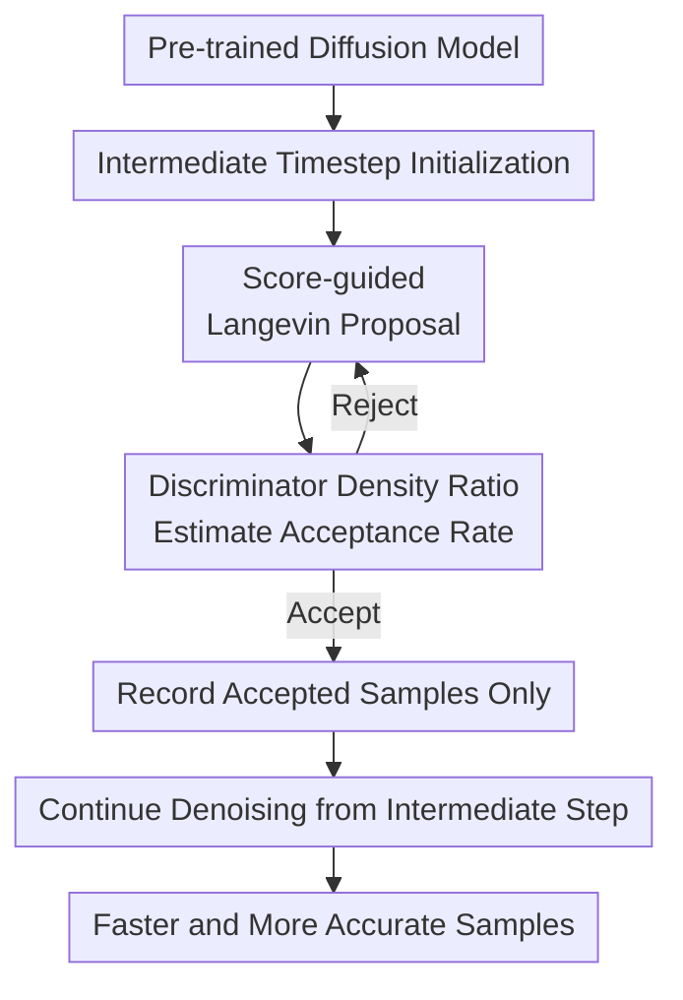

# AC-Sampler: Accelerate and Correct Diffusion Sampling with Metropolis-Hastings Algorithm

**Conference**: ICLR2026  
**OpenReview**: [https://openreview.net/forum?id=kWl13kRJTQ](https://openreview.net/forum?id=kWl13kRJTQ)  
**Code**: https://github.com/aailab-kaist/AC-Sampler  
**Area**: Diffusion Models / Image Generation  
**Keywords**: Diffusion Sampling, Metropolis-Hastings, MALA, Sampling Acceleration, Distribution Correction

## TL;DR
AC-Sampler truncates the diffusion generation process at an intermediate timestep, generates candidates using a score-based Langevin proposal, and applies Metropolis-Hastings (MH) acceptance rates to correct them toward the true marginal distribution. This simultaneously reduces NFE and improves FID without fine-tuning the base model.

## Background & Motivation
**Background**: Diffusion models have become the dominant paradigm for high-fidelity image, video, and text-to-image generation. They typically start from simple prior noise and follow a sequence of reverse denoising transition kernels toward the data distribution. This iterative structure is stable and provides a clear interface between pre-trained models, samplers, and downstream systems.

**Limitations of Prior Work**: The primary issues stem from this long chain. On one hand, each denoising step requires calling a score network or denoiser, resulting in high NFE and slow generation of multiple candidates in production. On the other hand, the reverse kernels learned by pre-trained models are only approximations of the true reverse process; approximation errors accumulate along the chain as the number of steps increases. Consequently, simply "skipping steps" degrades quality, while "adding corrections" often introduces extra computation.

**Key Challenge**: Acceleration and correction methods have long been treated separately. Higher-order ODE/SDE solvers, DDIM, and DPM-v3 primarily compress sampling steps but lack guarantees for pulling the final distribution back to the real data distribution. Correction methods like DG, DiffRS, and Restart focus on bias correction but often require additional discriminator calls, gradient computations, or repeated forward-and-backward sampling, which slows down generation.

**Goal**: The authors aim to solve a specific problem: Can multiple valid samples be generated directly at an intermediate timestep of the diffusion chain while ensuring these samples are closer to the true marginal distribution? If possible, subsequent denoising only needs to proceed from this intermediate step to $t=0$, bypassing a large portion of the path from the prior. Moreover, after MH correction, errors would be genuinely corrected at the distributional level rather than just hidden by skipping steps.

**Key Insight**: This work reformulates diffusion sampling as an MCMC problem running on an intermediate noise distribution $q_\tau$. Since the pre-trained score model provides an approximation of the direction $\nabla_x \log q_t(x)$, a Langevin proposal can be naturally constructed. The core difficulty lies in the fact that the MH acceptance rate requires the ratio of true marginal densities $q_t(\tilde{x}_t) / q_t(x_t)$, which is not directly computable.

**Core Idea**: Replace the full generation process from pure noise with a "MALA proposal at intermediate timesteps + time-dependent discriminator for density ratio estimation." This ensures every accepted intermediate sample costs fewer denoising steps and undergoes Metropolis-Hastings correction.

## Method
The mechanism of AC-Sampler can be summarized as: first reaching a target timestep $\tau$ using the base diffusion model, then running a Langevin chain with MH correction on $q_\tau$, and finally denoising the accepted intermediate samples into images. This does not involve training a new diffusion model or distilling a sampler; the base denoiser remains unchanged, and only a time-dependent discriminator is trained to estimate the density ratio between the model's marginal and the true marginal.

### Overall Architecture
The input consists of a trained diffusion model $s_\theta(x_t,t)$, a target timestep $\tau$, a MALA chain length, and a time-dependent discriminator $d_\phi(x_t,t)$. AC-Sampler first denoises from the prior to $\tau$ using a base sampler to obtain the initial state $x_\tau$. It then repeatedly proposes candidates $\tilde{x}_\tau$ and computes the MH acceptance rate until a new state is accepted. After burn-in, the accepted intermediate samples are denoised to $x_0$ to generate final images. Acceleration comes from "reusing intermediate samples from $\tau$ without repeating the full path from $T$," and correction comes from "targeting the true marginal distribution $q_\tau$ in the acceptance rate."

### Key Designs
**1. Intermediate Timestep Initialization: Turning Acceleration into Sampling on $q_\tau$**
Traditional diffusion sampling generates each image by denoising from $x_T$ to $x_0$. AC-Sampler selects a target timestep $\tau$, reaches $x_\tau$ from the prior using the base model, and uses this $x_\tau$ as the starting point for an MCMC chain. For each subsequent accepted state, it only needs to denoise from $\tau$ to $0$, avoiding the redundant computation from $T$ to $\tau$. Thus, acceleration is achieved by replacing expensive prefix sampling with shared intermediate chain exploration.

This design holds if the intermediate states are samples from the true forward marginal $q_\tau$ rather than the model marginal $p^\theta_\tau$. As long as the MCMC chain pulls samples toward $q_\tau$, and the base reverse kernel denoises from $\tau$ to $0$, the final distribution can be closer to the real data distribution than the original model distribution.

**2. Score-guided Langevin Proposal: Reusing Denoiser Calls for Exploration and Denoising**
At target timestep $t$, AC-Sampler uses the Metropolis-adjusted Langevin Algorithm (MALA) proposal:

$$
p^\theta_{\mathrm{proposal},t}(\cdot \mid x_t)
= \mathcal{N}\left(x_t + \frac{\eta}{2}s_\theta(x_t,t),\eta I\right).
$$

Here, $s_\theta(x_t,t)$ is the score approximation from the pre-trained diffusion model, and $\eta$ is the Langevin step size. Intuitively, the proposal moves toward directions "more like the data marginal" with added Gaussian noise for exploration. The step size $\eta$ is set adaptively based on SNR, as distributions become sharper closer to the data, and inappropriate step sizes lead to slow mixing or high rejection. The efficiency lies in reusing the score output for both the Langevin candidate and the subsequent reverse denoising kernel.

**3. Discriminator Density Ratio Acceptance Rate: Decomposing $q_t$ Ratios**
The MH acceptance rate requires $q_t(\tilde{x}_t)p( x_t\mid \tilde{x}_t) / (q_t(x_t)p(\tilde{x}_t\mid x_t))$, where $q_t(\tilde{x}_t)/q_t(x_t)$ is the non-trivial term. The authors prove that for any fixed $x_{t-1}$, the true marginal ratio decomposes into forward transition terms, model reverse kernel terms, and the likelihood ratio $L_t(x_t)=q_t(x_t)/p^\theta_t(x_t)$. By choosing $x_{t-1}$ as the midpoint of the two reverse kernel means, the Gaussian reverse kernel terms cancel out due to equal distance and variance.

The acceptance rate becomes three tractable parts: forward Gaussian terms, the likelihood ratio from the discriminator, and proposal Gaussian terms:

$$
\hat{\alpha}=\min\left(1,
\frac{q_{t|t-1}(\tilde{x}_t \mid \hat{x}_{t-1})}{q_{t|t-1}(x_t \mid \hat{x}_{t-1})}
\cdot \frac{\tilde{L}}{L}
\cdot
\frac{p^\theta_{\mathrm{proposal},t}(x_t\mid\tilde{x}_t)}{p^\theta_{\mathrm{proposal},t}(\tilde{x}_t\mid x_t)}
\right).
$$

$L$ and $\tilde{L}$ are estimated by a time-dependent discriminator $d_\phi(x_t,t)$, which is trained to distinguish real forward samples $q_t$ from model marginal samples $p^\theta_t$. This converts an uncomputable ratio into a relatively cheap discriminator evaluation.

**4. Record Accepted Samples Only: Adapting MH for Finite-budget Generation**
Standard MH retains the current state upon rejection, which is necessary for detailed balance but creates a side effect in image generation: the same sample is recorded multiple times. In a continuous space, the probability of the true distribution hitting the exact same point twice is zero; duplicate samples are artifacts of the rejection mechanism that harm empirical distribution and diversity.

Algorithm 1 uses "propose-until-accept": it keeps proposing until a candidate passes the acceptance test, and only then records the new state. While theory rests on standard MH, this variant is interpreted as a Jump Markov chain. Ablation results show that traditional MH (retaining rejections) degrades FID to 3.22 on EDM (27 NFE), while the "propose-until-accept" version reaches 1.97.

### Loss & Training
The base diffusion model is not fine-tuned. Only a time-dependent discriminator $d_\phi(x_t,t)$ is trained using a binary cross-entropy loss:

$$
\mathcal{L}_{\mathrm{BCE}}(\phi)=\int \lambda(t)
\left(
\mathbb{E}_{x_t\sim q_t}[-\log d_\phi(x_t,t)]
+\mathbb{E}_{x_t\sim p^\theta_t}[-\log(1-d_\phi(x_t,t))]
\right)dt.
$$

During inference, key hyperparameters include target timestep $\tau$, MALA chain length, and proposal SNR. If $\tau$ is too close to the data, the distribution is sharper and MALA mixing becomes harder. Analysis shows these parameters are critical knobs for balancing FID, NFE, and Recall.

## Key Experimental Results

### Main Results
The authors validated AC-Sampler on CIFAR-10, CelebA-HQ 256×256, ImageNet 64×64/256×256, and Stable Diffusion v1.5. In most settings, AC-Sampler reduces NFE while improving or maintaining FID, CLIP, and Recall.

| Dataset / Setting | Base Method | Ours (AC-Sampler) | Primary Change |
|--------|------|------|----------|
| CIFAR-10, EDM Heun | FID 2.01, NFE 35 | FID 1.97, NFE 26.19 | Slight quality gain, significant NFE drop |
| CIFAR-10, EDM Low NFE | FID 3.23, NFE 17 | FID 2.38, NFE 15.81 | Most significant gains in low NFE range |
| CIFAR-10, DG | FID 1.93, NFE 27 | FID 1.84, NFE 26.19 | Orthogonal to existing correction methods |
| CIFAR-10, DPM-v3 | FID 12.41, NFE 5 | FID 9.88, NFE 4.78 | Orthogonal to existing acceleration methods |
| CelebA-HQ 256×256 | FID 29.74, NFE 198 | FID 6.60, NFE 98.27 | Dramatic improvement in unconditional high-res |
| ImageNet 256×256, DiT | FID 2.35, NFE 250 | FID 2.31, NFE 234.38 | Minor gains on large class-conditional models |
| SD-v1.5, COCO prompts | FID 24.34, CLIP 0.3202 | FID 23.16, CLIP 0.3210 | Improved quality and alignment, lower NFE |

### Ablation Study
| Configuration | Key Metrics | Remark |
|------|---------|------|
| EDM Base | FID 2.05, NFE 27, Recall 0.627 | Base sampler without AC |
| +AC with conventional MH | FID 3.22, NFE 25.08, Recall 0.580 | Retaining rejections harms empirical distribution |
| +AC with Algorithm 1 | FID 1.97, NFE 26.19, Recall 0.628 | Propose-until-accept is better for generation |
| W/O MH Accept-Reject | FID significantly worse | Removing correction breaks alignment with $q_\tau$ |
| 25-Gaussian toy | 25 / 25 modes covered | Improves mode coverage over base model |

### Key Findings
- **MH correction is essential**: Removing the acceptance step significantly worsens FID, proving the discriminator's density ratio effectively aligns intermediate samples with the true distribution.
- **Value in low NFE**: The gains are most prominent when NFE is limited (e.g., EDM's FID improves from 3.23 to 2.38).
- **Orthogonality**: AC-Sampler can be inserted into existing samplers like DPM-v3 or DG to yield additional gains.
- **Wall-clock Efficiency**: Generation time is often faster or parity. For 100 images on an RTX 3090, EDM (35 NFE) takes 6.46s, while AC takes 5.26s.
- **Diversity Maintenance**: Recall on CIFAR-10 remains comparable to the base model, and toy experiments show improved mode coverage.

## Highlights & Insights
- The most ingenious aspect is treating intermediate timesteps as MCMC target distributions rather than correcting only in the final image space. This preserves the score structure of high-dimensional images while naturally amortizing prefix sampling computation.
- The density ratio derivation is critical. By cleverly choosing the reverse kernel midpoint, the authors bypass the need for explicit $q_t(x)$ calculation.
- "Propose-until-accept" is a pragmatic engineering choice that prioritizes finite-sample evaluation over strict MCMC chain trajectory.
- The framework unifies "acceleration" and "correction" under a single acceptance rate logic rather than treating them as serial tricks.

## Limitations & Future Work
- **Discriminator Training**: Requires training a time-dependent discriminator, which adds overhead in data pipelines and storage of model samples.
- **Theoretical Conditions**: Guarantees rely on idealized assumptions such as optimal discriminators and sufficiently long chains; real systems may have errors.
- **Hyperparameter Sensitivity**: $\tau$ and SNR are not merely decorative but directly control the trade-off between FID, NFE, and Recall.
- **T2I Improvements**: Gains on Stable Diffusion v1.5 are consistent but moderate; validation on state-of-the-art models like SDXL is needed.

## Related Work & Insights
- **vs DDIM / DPM-v3**: These methods focus on deterministic paths or higher-order ODES. AC-Sampler performs MH correction at intermediate steps to correct marginal distribution errors.
- **vs DG**: DG uses discriminator guidance across the trajectory. AC-Sampler's discriminator usage is localized to the MALA chain, often resulting in lower D-NFE.
- **vs DiffRS**: While DiffRS uses rejection sampling for exactness, AC-Sampler uses MALA proposals to make candidates more likely to be accepted, improving efficiency.
- **Insight**: If a generation process has interpretable intermediate distributions and an available score approximation, "Intermediate Distribution MCMC Correction" is more principled than simple post-hoc reranking.

## Rating
- **Novelty**: ⭐⭐⭐⭐⭐ Integrates intermediate sampling, MALA proposals, and density ratio estimation into a cohesive MH framework.
- **Experimental Thoroughness**: ⭐⭐⭐⭐ Strong coverage of standard benchmarks; further testing on ultra-modern T2I models would be beneficial.
- **Writing Quality**: ⭐⭐⭐⭐ Theoretical motivations are clear; some relationships between theory and engineering variants are best explored in the appendix.
- **Value**: ⭐⭐⭐⭐⭐ Highly relevant for high-throughput diffusion systems requiring multiple candidates.

<!-- RELATED:START -->

## Related Papers

- [\[ICLR 2026\] Evolutionary Caching to Accelerate Your Off-the-Shelf Diffusion Model](evolutionary_caching_to_accelerate_your_off-the-shelf_diffusion_model.md)
- [\[ICLR 2026\] One Step Further with Monte-Carlo Sampler to Guide Diffusion Better](one_step_further_with_monte-carlo_sampler_to_guide_diffusion_better.md)
- [\[CVPR 2026\] One Algorithm to Align Them All](../../CVPR2026/image_generation/one_algorithm_to_align_them_all.md)
- [\[NeurIPS 2025\] Learnable Sampler Distillation for Discrete Diffusion Models](../../NeurIPS2025/image_generation/learnable_sampler_distillation_for_discrete_diffusion_models.md)
- [\[ICML 2025\] Progressive Tempering Sampler with Diffusion](../../ICML2025/image_generation/progressive_tempering_sampler_with_diffusion.md)

<!-- RELATED:END -->
