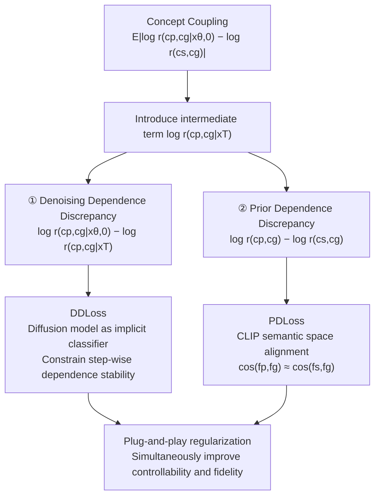

# ACCORD: Alleviating Concept Coupling through Dependence Regularization for Text-to-Image Diffusion Personalization

**Conference**: ICLR 2026  
**Code**: [https://github.com/antgroup/ACCORD](https://github.com/antgroup/ACCORD)  
**Area**: Image Generation / Diffusion Personalization  
**Keywords**: Concept Coupling, Text-to-Image Personalization, Dependence Regularization, DreamBooth, Plug-and-Play Loss  

## TL;DR
ACCORD formalizes "concept coupling" (entanglement between subjects and contexts) in text-to-image personalization as a statistical dependence problem for the first time. It decomposes the total dependence discrepancy into two computable sources: "denoising dependence discrepancy" and "prior dependence discrepancy," eliminating them via two plug-and-play regularization losses (DDLoss + PDLoss). This improves both text controllability and fidelity across subject, style, and face personalization.

## Background & Motivation
**Background**: Text-to-image personalization (e.g., DreamBooth, LoRA, IP-Adapter) requires only 3–6 reference images to teach a T2I model a private concept (a pet, a specific backpack, or a unique artistic style). However, due to the limited number and low diversity of reference images, the target concept is often captured alongside recurring contextual elements.

**Limitations of Prior Work**: Models establish spurious correlations between the "subject" and the "context." For instance, if a "backpack*" always appears with a girl in the training images, the fine-tuned model consistently generates the girl whenever the backpack is requested, violating the text prompt. Existing approaches address this indirectly: data regularization (using class-specific datasets, which may distort concept relationships), weight regularization (constraining parameter updates, which indiscriminately harms fidelity), loss regularization (heuristic objectives without a direct link to underlying statistical issues), or regional regularization (effective only for spatially separable objects, failing for global attributes like style).

**Key Challenge**: These methods treat concept coupling as a "symptom of overfitting" rather than directly modeling and minimizing the "unintended statistical dependence" that defines coupling. Consequently, they force a trade-off between "personalization fidelity" and "text controllability."

**Goal**: Move beyond heuristic patches to diagnose and alleviate concept coupling from its root cause.

**Core Idea**: **[Formalize concept coupling as a statistical dependence problem]** Use the conditional dependence coefficient $r(c_{p}, c_{g}|x) = \frac{p(c_{p},c_{g}|x)}{p(c_{p}|x)p(c_{g}|x)}$ to measure the coupling between the personalized target $c_{p}$ and the general text condition $c_{g}$ (where $r=1$ denotes conditional independence). The objective is to minimize the "excess dependence of the generated image relative to the superclass prior": $E_{x_{\theta}}[|\log r(c_{p},c_{g}|x_{\theta,0}) - \log r(c_{s},c_{g})|]$, which is then decomposed into two computable sub-terms.

## Method

### Overall Architecture
ACCORD starts with a decomposition theorem: the "total dependence discrepancy of the generated image relative to the superclass prior" is split into two parts—**Denoising Dependence Discrepancy** (accumulated during the denoising process) and **Prior Dependence Discrepancy** (caused by the learned concept deviating from the superclass prior). These two parts are bridged by the dependence coefficient at pure noise $x_{T}$, $\log r(c_{p},c_{g})$. Correspondingly, ACCORD introduces two plug-and-play losses: DDLoss leverages the diffusion model as an implicit classifier, and PDLoss utilizes CLIP as a density ratio estimator. These can be used individually or together depending on the personalization setup, without modifying the architecture or hyperparameters.

### Key Designs

**1. Dependence Discrepancy Decomposition Theorem: Splitting an uncomputable objective into two treatable sources.** Directly minimizing $E_{x_{\theta}}[|\log r(c_{p},c_{g}|x_{\theta,0}) - \log r(c_{s},c_{g})|]$ lacks a closed-form expression. By introducing the intermediate term $\log r(c_{p},c_{g}|x_{T})$ (where $x_{T}$ is standard Gaussian noise independent of conditions, thus $\log r(c_{p},c_{g}|x_{T})=\log r(c_{p},c_{g})$), the total discrepancy is decomposed into $|\underbrace{\log r(c_{p},c_{g}|x_{\theta,0})-\log r(c_{p},c_{g}|x_{T})}_{\text{Denoising Dependence Discrepancy}} + \underbrace{\log r(c_{p},c_{g})-\log r(c_{s},c_{g})}_{\text{Prior Dependence Discrepancy}}|$. The former characterizes the dependence changes introduced during denoising, while the latter captures the prior change caused by the deviation of the learned concept $c_{p}$ from the superclass $c_{s}$.

**2. Denoising Decouple Loss (DDLoss): Relaxing "end-to-end dependence discrepancy" to "step-wise dependence stability."** The denoising dependence discrepancy connects the first and last steps, which is incompatible with the step-wise sampling mechanism of diffusion training. The paper uses the triangle inequality to upper-bound it by the sum of step-wise discrepancies: $|\log r(c_{p},c_{g}|x_{\theta,0})-\log r(c_{p},c_{g}|x_{T})| \le \sum_{t} |\log r(c_{p},c_{g}|x_{\theta,t-1})-\log r(c_{p},c_{g}|x_{\theta,t})|$, ensuring that the conditional dependence between the subject and any concept does not change drastically between steps. Using Bayes' theorem and the Gaussian nature of latent noise, the step-wise discrepancy is derived in closed form: $\log r(c_{p},c_{g}|x_{\theta,t-1})-\log r(c_{p},c_{g}|x_{\theta,t}) = \frac{1}{2\sigma_{t}^{2}}[\|U_{\theta}(x_{t},(c_{p},c_{g}),t)-U_{\theta}(x_{\theta,t},c_{p},t)\|^{2} + \|U_{\theta}(x_{t},(c_{p},c_{g}),t)-U_{\theta}(x_{\theta,t},c_{g},t)\|^{2} - \|U_{\theta}(x_{t},(c_{p},c_{g}),t)-U_{\theta}(x_{\theta,t},\emptyset,t)\|^{2}]$. This measures whether the relationship is altered by calculating distances between joint condition $(c_{p},c_{g})$ predictions and those of single conditions $(c_{p}, c_{g})$ and the empty condition $(\emptyset)$. The final loss is $L_{DD}=\sum_{t} \frac{t}{T}|\cdot|$, where a linear time-varying weight $t/T$ emphasizes larger $t$ steps. In practice, $x_{t}$ approximates $x_{\theta,t}$, and gradients are stopped for single condition and empty condition terms to preserve the model's prior knowledge.

**3. Prior Decouple Loss (PDLoss): Aligning $c_{p}$'s relationship with the superclass via CLIP.** When $c_{p}$ is fixed and close to $c_{s}$, DDLoss alone suffices. However, if $c_{p}$ is optimized as a CLIP text embedding or a visual representation to capture more detail, it deviates from $c_{s}$, increasing prior dependence discrepancy. This can be expressed as $\log r(c_{p},c_{g})-\log r(c_{s},c_{g})=\log\frac{p(c_{g}|c_{p})}{p(c_{g}|c_{s})}$. Since this is independent of the denoising process, the paper utilizes CLIP's semantic space. As CLIP is trained with InfoNCE, its objective essentially estimates density ratios, so $\tau\cos(f_{j},f_{k})\propto\frac{p(c_{j}|c_{k})}{p(c_{j})}$. Accordingly, $L_{PD}=E_{c_{g}}[|\cos(f_{p},f_{g})-\cos(f_{s},f_{g})|]\propto E_{c_{g}}[|\frac{p(c_{g}|c_{p})-p(c_{g}|c_{s})}{p(c_{g})}|]$. By forcing the cosine similarity between the personalized target $f_{p}$ and general text $f_{g}$ to approach that of the superclass $f_{s}$ and $f_{g}$, $p(c_{g}|c_{p})$ is aligned with $p(c_{g}|c_{s})$.

## Key Experimental Results

### Main Results (DreamBench Subject Personalization)

| Method | CLIP-T↑ | BLIP-T↑ | CLIP-I↑ | DINO-I↑ | Params. |
|---|---|---|---|---|---|
| DreamBooth (DB) | 30.3 | 40.3 | 74.0 | 69.3 | 819.7 M |
| DB w/ Ours* | 31.3 (+1.0) | 42.1 (+1.8) | 78.6 (+4.6) | 74.4 (+5.1) | 819.7 M |
| CustomDiffusion (CD) | 34.2 | 45.4 | 62.7 | 56.9 | 18.3 M |
| CD w/ Ours* | 34.1 (-0.1) | 46.6 (+1.2) | 71.4 (+8.7) | 65.6 (+8.7) | 18.3 M |
| LoRA (SDXL) | 34.5 | 47.0 | 76.3 | 72.1 | 92.9 M |
| Omnigen (zero-shot) | 35.3 | 47.8 | 73.9 | 68.6 | 3.8 B |
| LoRA w/ Ours* | 35.2 (+0.7) | 47.7 (+0.7) | 77.1 (+0.8) | 72.4 (+0.3) | 92.9 M |

LoRA(SDXL)+ACCORD (93M trainable parameters) outperforms the 3.8B Omnigen in both subject and style tasks. Applying ACCORD to CustomDiffusion leads to a surge in CLIP-I/DINO-I (+8.7), indicating significant restoration of fidelity.

### Ablation Study (DDLoss/PDLoss across backbones)

| Method | CLIP-T | BLIP-T | CLIP-I | DINO-I |
|---|---|---|---|---|
| VE (SDXL) | 27.1 | 38.4 | 82.8 | 77.6 |
| +PDLoss | 27.8 | 39.5 | 82.9 | 77.4 |
| +DDLoss | 28.0 | 40.0 | 82.6 | 77.9 |
| +PD & DDLoss | 28.3 | 39.8 | 83.1 | 78.1 |
| LoRA (FLUX) | 33.4 | 46.8 | 75.8 | 72.8 |
| +DDLoss | 34.8 | 47.8 | 78.2 | 73.4 |

Both losses are individually effective, with their combination yielding the best results. DDLoss improves both text alignment (+1.4 CLIP-T) and fidelity (+2.4 CLIP-I) for LoRA(FLUX).

### Key Findings
- **Simultaneous improvement of text controllability and fidelity**: Unlike most existing methods that improve one at the expense of the other, ACCORD enhances both without requiring regularization datasets or strong weight constraints.
- **Plug-and-play and cross-backbone generalizability**: It is compatible with SD1.5, SDXL, and FLUX, as well as DreamBooth, LoRA, CustomDiffusion, VisualEncoder, and IP-Adapter. DDLoss is typically used alone when personalized embeddings are not updated; otherwise, both are used.
- **Human preference aligns with objective metrics**: In 1,800 paired manual evaluations, ACCORD was consistently preferred. Larger improvements in objective metrics correlated with stronger subjective preferences.
- **Surpassing test-time fine-tuning**: The two losses are also effective in zero-shot condition control tasks, demonstrating the universality of the "decoupling" principle.

## Highlights & Insights
- **First work to formalize concept coupling as a statistical dependence problem**: By using the conditional dependence coefficient $r$, the ambiguous "subject-context entanglement" is transformed into a measurable and optimizable quantity. This marks a paradigm shift from treating symptoms to addressing root causes.
- **Elegant Decomposition Theorem**: Using Gaussian noise $x_{T}$ (independent of conditions) as a bridge, the uncomputable total discrepancy is cleanly split into "denoising" and "prior" sides, respectively mapped to the capabilities of diffusion models and CLIP.
- **Denoising side logic**: DDLoss relaxes end-to-end constraints into step-wise constraints, perfectly aligning with the single-step sampling mechanism of diffusion training.

## Limitations & Future Work
- **PDLoss depends on CLIP's density alignment assumption**: Treating $\tau\cos(f_{p},f_{g})$ as a proxy for the density ratio means CLIP’s own biases or semantic distortions will propagate to the decoupling quality.
- **Primarily oriented toward test-time fine-tuning**: While effective for zero-shot tasks, the primary gains are in scenarios requiring per-target fine-tuning, which incurs time and computational overhead.
- **Superclass $c_{s}$ selection depends on humans/VLMs**: Pulling relationships back to the "superclass prior" assumes the superclass definition itself is accurate; this may be difficult for abstract concepts without clear superclasses.
- **Engineering choices lack deep theory**: Decisions such as the linear $t/T$ weighting and stopping gradients for certain terms are based on empirical success rather than rigorous theoretical derivation.

## Related Work & Insights
- **Data Regularization** (DreamBooth, CustomDiffusion) uses superclass datasets to prevent overfitting but may distort concept relationships. ACCORD complements this by using explicit decoupling to help the model distinguish what should be personalized.
- **Loss Regularization** (Facechain-SuDe, ClassDiffusion, CoRe) also uses plug-and-play losses, but their objectives are heuristic. ACCORD directly optimizes statistical dependence, leading to stronger regularization and larger gains.
- **CLIP / InfoNCE Density Ratio Perspective** (Oord et al. 2018) is used to interpret CLIP cosine similarity as a conditional density ratio, serving as the theoretical foundation for PDLoss. This perspective is broadly instructive for probability alignment tasks using contrastive models.
- **Insight for future work**: Formalizing "spurious correlation/shortcut learning" as an optimizable statistical dependence discrepancy and decomposing it into different subsystems (generation process vs. representation prior) is a strategy transferable to other tasks involving data bias coupling.

## Rating
- **Novelty**: ⭐⭐⭐⭐⭐ First to formalize concept coupling as statistical dependence and provide a computable decomposition; a true root-cause paradigm shift.
- **Experimental Thoroughness**: ⭐⭐⭐⭐ Covers subject, style, and face tasks across 5+ backbones and 10+ baselines with 1,800 manual evaluations; however, mostly focuses on plug-and-play incremental comparisons.
- **Writing Quality**: ⭐⭐⭐⭐ Clear theoretical derivation (3 theorems + 2 lemmas) and excellent visualizations.
- **Value**: ⭐⭐⭐⭐ Plug-and-play, backbone-agnostic, and simultaneously improves controllability and fidelity; highly practical for the personalization community.

<!-- RELATED:START -->

## Related Papers

- [\[ICLR 2026\] Continual Unlearning for Text-to-Image Diffusion Models: A Regularization Perspective](continual_unlearning_for_text-to-image_diffusion_models_a_regularization_perspec.md)
- [\[CVPR 2026\] Beyond Text Prompts: Precise Concept Erasure through Text–Image Collaboration](../../CVPR2026/image_generation/beyond_text_prompts_precise_concept_erasure_through_text-image_collaboration.md)
- [\[ICLR 2026\] Mod-Adapter: Tuning-Free and Versatile Multi-concept Personalization via Modulation Adapter](mod-adapter_tuning-free_and_versatile_multi-concept_personalization_via_modulati.md)
- [\[ICLR 2026\] Localized Concept Erasure in Text-to-Image Diffusion Models via High-Level Representation Misdirection](localized_concept_erasure_in_text-to-image_diffusion_models_via_high-level_repre.md)
- [\[NeurIPS 2025\] Enhancing Diffusion Model Guidance through Calibration and Regularization](../../NeurIPS2025/image_generation/enhancing_diffusion_model_guidance_through_calibration_and_regularization.md)

<!-- RELATED:END -->
