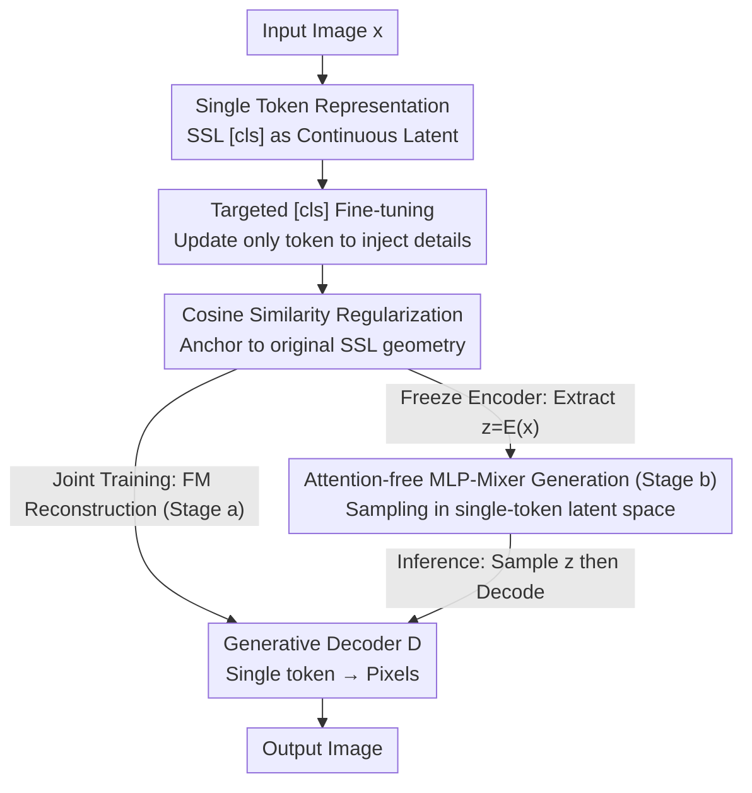

# Adapting Self-Supervised Representations as a Latent Space for Efficient Generation

**Conference**: ICLR2026  
**OpenReview**: [https://openreview.net/forum?id=0b6a2SE23v](https://openreview.net/forum?id=0b6a2SE23v)  
**Code**: https://github.com/CompVis/RepTok  
**Area**: Diffusion Models / Efficient Generation  
**Keywords**: Single-token latent space, Self-supervised representations, Flow matching, MLP-Mixer, Text-to-image

## TL;DR
RepTok fine-tunes the `[cls]` token of a pre-trained self-supervised ViT into a "single continuous token" latent space. Combined with a flow matching decoder for high-fidelity reconstruction and a non-attention MLP-Mixer for generation in this 1D space, it achieves competitive FIDs on ImageNet/MS-COCO using less than 10% of the training compute compared to competitors.

## Background & Motivation
**Background**: Diffusion and flow matching models are currently the strongest frameworks for image generation, but calculating vector fields directly in pixel space is computationally expensive. Latent Diffusion Models (LDM) use pre-trained VAEs to compress images into a low-dimensional latent space, restricting generation to "semantic content" and significantly reducing costs, becoming the de facto standard.

**Limitations of Prior Work**: The latent space of LDM remains a 2D grid (e.g., $32\times32$), which retains significant spatial redundancy from natural images. Adjacent positions in the grid are highly correlated, yet generative models must model interactions between them (usually via attention), which is both computationally wasteful and unnecessary. Previous improvement attempts only went halfway: TiTok uses transformers to encode images into 1D discrete token sequences (minimum 32), breaking the grid but requiring multiple tokens and discrete quantization; REPA utilizes SSL representations to align diffusion features for faster convergence, but only as a "training-time guidance signal," while generation still operates in a 2D grid.

**Key Challenge**: The `[cls]` token of SSL models (DINOv2, MAE, CLIP) is a smooth, semantically well-structured, and geometrically suitable 1D representation. However, it is optimized for downstream classification/contrastive tasks and **only retains high-level semantics while discarding low-level pixel details required for reconstruction**. Consequently, it has not been directly used as a generative latent space. The challenge lies in reconciling the "existing good geometry" with "insufficient detail for reconstruction."

**Goal**: Can SSL representations be promoted from "guides" to the "latent space body"? Specifically: (1) How to supplement the `[cls]` token with low-level details at minimal cost without destroying its original geometry; (2) Whether attention is still necessary during the generation phase under extreme single-token compression.

**Key Insight**: The authors observe that models like unCLIP can generate image variants using only a 512-dimensional CLIP embedding, suggesting that a "compact bottleneck + generative decoder" is viable. The instability in variants arises because CLIP was not trained to preserve precise pixel locations. Therefore, "targeted injection" of a small amount of detail into the semantic token could enable both reconstruction and semantic geometry preservation.

**Core Idea**: Fine-tune only the `[cls]` token embedding of the SSL encoder while freezing all other weights, and train it jointly with a flow matching decoder for reconstruction. A cosine similarity loss is added to anchor this token near the original SSL space. Finally, a "single continuous token" is used as the latent space, allowing the use of a pure MLP architecture during the generation phase.

## Method

### Overall Architecture
The input to RepTok is an image, and the output is an "image reconstructed/generated from a single continuous token." The pipeline consists of three stages: **(a) Encoder-decoder training**: Using a frozen SSL ViT encoder $\mathcal{E}$, only the `[cls]` token is made trainable. It is paired with a generative decoder $\mathcal{D}$ and trained jointly with a flow matching loss to "pour" missing details into the token, while a cosine loss anchors it to the original SSL geometry. **(b) Latent generation training**: The encoder is frozen, and for each image, the latent representation $z=\mathcal{E}(x)\in\mathbb{R}^{1\times 768}$ is extracted. An independent generative model $G$ (an attention-free MLP-Mixer) is trained to synthesize these tokens conditioned on class or text metadata. **(c) Inference**: First, $G$ samples a token $z$, which $\mathcal{D}$ then decodes back into pixel space.

Notably, the decoder does not work directly in pixel space; following SiT conventions, it operates within the latent space of a pre-trained 2D SD-VAE to further save compute. Conditioning is injected via concatenation of the latent token $z$ with the noisy image token, following MMDiT.

### Key Designs

**1. Single-token representation: SSL `[cls]` token as a continuous latent space**

Addressing the spatial redundancy of 2D latent grids, RepTok compresses an entire image into a **single continuous vector** $z\in\mathbb{R}^{1\times 768}$ derived from the SSL ViT `[cls]` token. In SSL pre-training, the `[cls]` token is trained to aggregate information from all patches, serving as a global summary. Using it as a latent space eliminates grid relationships and spatial redundancy. Compared to 1D tokenizers like TiTok, the key differences are: (1) it is **continuous** rather than discrete, avoiding quantization errors and making the pipeline fully differentiable; (2) compression is more aggressive—using 1 token where others use 32-256, yet achieving an rFID of 1.85, matching or exceeding multi-token baselines.

**2. Targeted fine-tuning of `[cls]` token: Injecting low-level details with minimal changes**

Frozen SSL `[cls]` tokens contain semantics but lack low-level details; reconstruction from them is blurry. Conversely, training the entire encoder might pull the token away from its good geometry. RepTok's compromise is to **update only the `[cls]` token embedding parameters while freezing all other encoder weights**. This "minimal intervention" is sufficient to inject fine-grained information needed for high-fidelity reconstruction across various backbones (DINOv2, MAE, CLIP). Intuitively, the encoder backbone extracts general semantic features, while the released token acts as a "detail buffer" that absorbs reconstruction signals backpropagated from the decoder.

**3. Cosine similarity loss: Anchoring tokens to SSL geometry for generatability**

To prevent the `[cls]` token from drifting during long training, a cosine alignment term is introduced:

$$\mathcal{L}_{\cos}(x) = \lambda\big(1 - \cos(z,\, z_{\text{frozen}})\big),\qquad z_{\text{frozen}} = \mathcal{E}_{\text{frozen}}(x),\; z = \mathcal{E}(x)$$

Where $z_{\text{frozen}}$ is the original output and $z$ is the fine-tuned version. $\lambda$ controls the allowed deviation: small $\lambda$ permits more details but noisier geometry, while larger $\lambda$ pins the token to the source representation. This characterizes a **reconstruction-generation trade-off**; moderate regularization significantly improves generation quality (gFID) even at the cost of pixel-level PSNR. It preserves the smooth, low-dimensional manifold where semantically similar images are close, keeping the latent space suitable for generative modeling.

**4. Attention-free two-stage generation: Frozen encoder as regularizer, MLP-Mixer is enough**

In stage (b), the authors note that **freezing the encoder acts as an implicit regularizer**, replacing KL divergence or VQ quantization used in standard LDMs because the structural properties of frozen representations naturally constrain the latent distribution. Crucially, when an image is compressed into a single token, interactions between tokens no longer exist, making attention meaningless. Thus, the ImageNet generator $G$ uses a pure **MLP-Mixer**, shifting architectural complexity to the compression stage without quality loss. Class conditions are injected via a learnable class embedding, with classifier-free guidance (CFG) applied in the $t\in[0.3,0.9]$ interval. Text-to-image retains attention for text conditioning: 4 learnable tokens are concatenated to the noisy `[cls]` token, and cross-attention is applied to frozen language model outputs (CLIP/InternVL/Gemma-2B).

### Loss & Training
- **Reconstruction (Stage a)**: Jointly optimize `[cls]` and decoder $\mathcal{D}$ using Flow Matching loss $\mathcal{L} = \mathbb{E}_{t,x_0,x_1}\lVert v_\theta(t, x_t, z) - (x_1 - x_0)\rVert$ (linear interpolation $x_t = t x_1 + (1-t)x_0$) and $\mathcal{L}_{\cos}$. No perceptual or adversarial losses are used. The decoder operates in pre-trained SD-VAE latent space.
- **Generation (Stage b)**: Encoded tokens $z=\mathcal{E}(x)$ are used to train an MLP-Mixer generator with Flow Matching, class conditioning, and CFG.
- **T2I**: Trained on COYO 120M pairs (captions regenerated by InternVL3-1B) with cross-attention to frozen LMs, batch size 256 for 200k steps.

## Key Experimental Results

### Main Results
ImageNet $256\times256$ class-conditioned generation focusing on saving compute while maintaining/improving FID:

| Method | # token | Continuous? | rFID ↓ | gFID ↓ | Total Training Compute |
|------|---------|-------|--------|--------|-----------|
| LDM | 32×32 | ✓ | 0.90 | 7.76 | — |
| TiTok-S | 128 | ✗ | 1.71 | 1.97 | — |
| FlexTok d18-d28 | 1-256 | ✗ | 1.45 | 1.86 | — |
| SiT-XL/2 +REPA (CFG=1.5) | grid | ✓ | — | 1.42 | 143.9K PFlops |
| **Ours (RepTok-L, CFG=1.5)** | **1** | **✓** | **1.85** | **1.88** | **42.1K PFlops** |

RepTok matches or exceeds multi-token discrete tokenizers with only 1 continuous token. Compared to transformer diffusion baselines like SiT, total training compute is reduced by an order of magnitude, requiring only **1.7% of SiT's FLOPs** for a 90%+ reduction in overall training cost.

### Ablation Study

| Config | rFID ↓ | PSNR ↑ | gFID ↓ | Description |
|------|--------|--------|--------|------|
| w/o prior (Random Init Enc) | 13.99 | 19.64 | 128.54 | No semantic prior → messy latent is ungeneratable |
| CLIP | 13.66 | 14.24 | 30.56 | Generalizable |
| MAE | 9.09 | 13.79 | 28.48 | Generalizable |
| DINOv2 (Main Setup) | 7.95 | 14.94 | 20.75 | Best |

Compared with RCG (pure semantic encoding): RepTok achieves FID 1.85 / PSNR 14.94 versus RCG's 3.20 / 9.31, indicating the single continuous token retains far more information than a "pure semantic code."

### Key Findings
- **Semantic Prior is Critical**: Removing the SSL prior (randomly initializing the encoder) leads to a total failure in generation (gFID 128.54), even if the decoder can reconstruct pixels (rFID 13.99). The smooth low-dimensional manifold induced by the semantic prior is the prerequisite for generation.
- **Cosine Regularization is a Knob**: Larger $\lambda$ improves gFID but lowers PSNR. Light regularization significantly improves generation quality.
- **Single Token makes Attention Redundant**: Pure MLP-Mixer suffices once compressed to 1 token.
- **Language Backbone Scales Independently**: In T2I, the frozen LM can be scaled from CLIP to Gemma-2B, improving all metrics without increasing the generation model's training cost. Competitive zero-shot COCO results were achieved in <20 hours on 4×A100.

## Highlights & Insights
- **From "Guide" to "Body"**: While REPA uses SSL for guidance, RepTok promotes the `[cls]` token to the generative latent space itself, eliminating grid redundancy.
- **Minimal Surgery on Token Embeddings**: Freezing the backbone and only releasing the `[cls]` embedding is enough to inject details without destroying geometry. This "targeted fine-tuning + cosine anchoring" is transferable to other tasks requiring task-specific detail in pre-trained representations.
- **Replacing KL/VQ with Frozen Encoders**: Using the inherent structure of pre-trained representations as a regularizer is a clean and inexpensive alternative to the KL or VQ constraints used in LDM.
- **Shifting Complexity to Compression**: The single-token approach simplifies the generator to a pure MLP, suggesting "heavy compression, light generation" as a viable path for efficient diffusion.

## Limitations & Future Work
- **Information Capacity of a Single Token**: Compressing an entire image into one 768-dimensional vector may have capacity issues for high-resolution or complex scenes (testing was primarily at $256\times256$).
- **Manual Trade-off**: The cosine weight $\lambda$ must be manually tuned between PSNR and gFID without an automated mechanism.
- **Dependence on SSL Prior**: Performance is capped by the geometric quality of the chosen SSL encoder.
- **Decoder still uses SD-VAE space**: This is not yet a true end-to-end single token → pixel model; the bottleneck of the initial VAE remains.
- **Future Work**: Adaptive token counts based on image complexity, learnable/scheduled $\lambda$, and capacity expansion for higher resolutions.

## Related Work & Insights
- **vs REPA**: REPA aligns diffusion features to DINO embeddings on a 2D grid; RepTok uses the SSL token as the latent space itself, reducing compute by an order of magnitude via 1D MLP generation.
- **vs TiTok / FlexTok**: They use discrete 1D sequences (32-256 tokens) for autoregressive generation; RepTok uses a single continuous token, which is differentiable and more aggressive in compression.
- **vs RCG**: RCG generates semantic representations; RepTok actively injects low-level details into the token for high-fidelity reconstruction, yielding much better PSNR/FID.
- **vs SVG / Diffusion Autoencoder**: SVG uses full spatial grids of SSL features; RepTok uses only the pooled semantic token. Unlike Diffusion AE, RepTok does not require a secondary sub-code $x_T$ for faithful reconstruction.

## Rating
- **Novelty**: ⭐⭐⭐⭐⭐ (Promoting `[cls]` to a continuous generative latent space is a fresh and self-consistent perspective)
- **Experimental Thoroughness**: ⭐⭐⭐⭐ (Extensive ImageNet/T2I tests and ablations, though multi-resolution validation is limited)
- **Writing Quality**: ⭐⭐⭐⭐⭐ (Clear derivation of motivation and strong comparative visualizations)
- **Value**: ⭐⭐⭐⭐⭐ (90%+ compute reduction with competitive quality offers significant utility for efficient generation)

<!-- RELATED:START -->

## Related Papers

- [\[ICML 2026\] Evaluating the Representation Space of Diffusion Models via Self-Supervised Principles](../../ICML2026/image_generation/evaluating_the_representation_space_of_diffusion_models_via_self-supervised_prin.md)
- [\[AAAI 2026\] Stabilizing Self-Consuming Diffusion Models with Latent Space Filtering](../../AAAI2026/image_generation/stabilizing_self-consuming_diffusion_models_with_latent_space_filtering.md)
- [\[CVPR 2026\] Self-Evaluation Unlocks Any-Step Text-to-Image Generation](../../CVPR2026/image_generation/self-evaluation_unlocks_any-step_text-to-image_generation.md)
- [\[ICLR 2026\] Stochastic Self-Guidance for Training-Free Enhancement of Diffusion Models](stochastic_self-guidance_for_training-free_enhancement_of_diffusion_models.md)
- [\[ICLR 2026\] COSMO-INR: Complex Sinusoidal Modulation for Implicit Neural Representations](cosmo-inr_complex_sinusoidal_modulation_for_implicit_neural_representations.md)

<!-- RELATED:END -->
