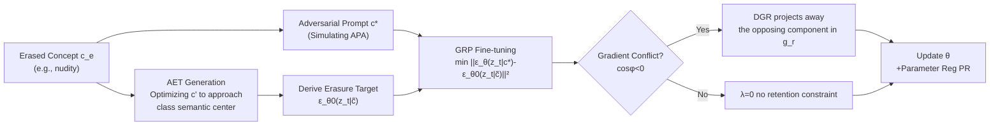

# AEGIS: Adversarial Target-Guided Retention-Data-Free Robust Concept Erasure from Diffusion Models

**Conference**: ICLR 2026  
**OpenReview**: [https://openreview.net/forum?id=3y3hnL7KhS](https://openreview.net/forum?id=3y3hnL7KhS)  
**Code**: [https://github.com/Feng-peng-Li/AEGIS](https://github.com/Feng-peng-Li/AEGIS)  
**Area**: Image Generation / Diffusion Model Security / Concept Erasure  
**Keywords**: Concept erasure, Diffusion models, Adversarial prompt attack, Robustness-retention trade-off, Gradient projection  

## TL;DR
AEGIS transforms the "erasure target" from manually selected fixed safety words to an Adversarial Erasure Target (AET) that iteratively approaches the semantic center of the concept. It further employs Gradient Rectification with Projection (GRP) to maintain generation quality without requiring retention data, effectively minimizing adversarial prompt attack success rates with negligible performance loss.

## Background & Motivation
**Background**: Diffusion Models (DMs) possess powerful text-to-image capabilities, but training data biases can cause models to generate harmful content such as nudity, specific artistic styles, or copyrighted objects. Concept erasure, which "deletes" specific concepts by fine-tuning the denoising UNet, has become a standard method for reliable DMs. Mainstream approaches are categorized into output-based (re-aligning output representations) and attention-based (manipulating cross-attention).

**Limitations of Prior Work**: Concept erasure is currently hindered by a **robustness-retention trade-off**. Robustness refers to ensuring the erased concept is not re-activated by semantically related or adversarial prompts; retention refers to maintaining the generation quality of unrelated concepts. Existing methods often sacrifice one for the other—mapping a single erasure prompt to a fixed safety target (e.g., "a photo") leaves "class-level residues" vulnerable to Adversarial Prompt Attacks (APA), while retention-biased schemes fail against adaptive adversaries.

**Key Challenge**: The authors view the DM as a generative classifier, where the predicted noise $\epsilon_\theta(z_t\mid c_e)$ at the final step $T$ becomes deterministic and can be seen as a "class prototype" in latent space. A concept (e.g., nudity) and its synonyms (naked/sexual/erotic/impure) cluster into a class $C_0$. The problem is: if manually selected erasure instances are too far from the **semantic center** of $C_0$, maximizing the distance between predicted noises before and after erasure only on those instances fails to eliminate the entire class information. Residual information leaks under adversarial prompts close to the semantic center. Conversely, completely clearing the class requires $\theta$ to deviate significantly from $\theta_0$, damaging retained concepts. This is the root of the trade-off. **Core Idea**: **Align the erasure target to the semantic center + perform gradient projection only when real conflicts occur**.

**Goal**: To simultaneously improve erasure robustness and retention performance without relying on extra retention datasets, breaking the existing trade-off.

## Method

### Overall Architecture
AEGIS (Adversarial Erasure with Gradient-Informed Synergy) consists of two components in a fine-tuning pipeline: first, **AET Generation** synthesizes an adversarial erasure target approaching the semantic center of the concept to guide the erasure direction; then, **GRP Fine-tuning** minimizes the gap between predicted noise and the AET target while utilizing data-free parameter regularization and directional gradient correction to protect retention. The objective is a min-max problem:

$$\min_\theta\Big[\max_{\tilde c}\,\mathbb{E}_t\|\epsilon_\theta(z_t\mid c^*)-\epsilon_{\theta_0}(z_t\mid\tilde c)\|_2^2+\lambda\cdot\tfrac{1}{2}\|\theta-\theta_0\|_2^2\Big]$$

where $c^*$ is the adversarial prompt for $c_e$, and the target noise for $\tilde c$ is derived from AET $c'$: $\epsilon_{\theta_0}(z_t\mid\tilde c)=\epsilon_{\theta_0}(z_t)-\eta\big(\epsilon_{\theta_0}(z_t\mid c')-\epsilon_{\theta_0}(z_t)\big)$.

### Key Designs

**1. Adversarial Erasure Target (AET): Aiming at the semantic center instead of isolated instances.** Driven by a diagnostic experiment—using three types of noise distances ($d_0$ for internal semantic similarity, $d_1$ for shift after erasure, $d_2$ for distance between original and adversarial prompts in tuned models)—the authors found that after ESD erases "nudity", it creates a large $d_1$ for the neighbor "naked" ($C_1$), but leaves "sexual/erotic/impure" ($C_2$) almost untouched, while $d_2$ remains small for all instances. This explains the high success rate of adversarial prompts. Thus, a learnable embedding $c'$ (length $m'=1$, randomly initialized) is proposed to iteratively approach the original class center while distancing from updated predictions:

$$c'^{(k+1)}=c'^{(k)}-\beta\cdot\mathrm{sign}\Big(\nabla\big(\|\epsilon_{\theta_0}(z_t\mid c'^{(k)})-\epsilon_\theta(z_t\mid c_e)\|_2^2+\|\epsilon_{\theta_0}(z_t\mid c'^{(k)})-\epsilon_{\theta_0}(z_t\mid c_e)\|_2^2\big)\Big)$$

After optimizing $c'$ within the ESD-style target, $d_2$ increases consistently across the whole $C_0$, indicating class-level information is truly eliminated. To save computation, the number of iterations per step is reduced to 1 (updated once per epoch), balancing accuracy and efficiency.

**2. Parameter Regularization (PR): Replacing retention datasets with "staying close to original parameters".** The retention loss is defined as a layer-wise parameter shift penalty $L_r=\tfrac{1}{2}\|\theta-\theta_0\|_2^2$, forcing the model to only modify parameters related to $c_e$. This offers two benefits: first, it **removes dependency on retention datasets**—since SD is trained on massive diverse data, small retention sets cannot cover all concepts and are highly sensitive to selection; PR is a robust data-free alternative. Second, it **prevents unintentional relearning** of concepts—without retention data, residual signals of $c_e$ are not reintroduced.

**3. Directional Gradient Rectification (DGR): Projecting only during true conflict.** The authors observed that the erasure gradient $g_e=\nabla_\theta L_e$ and retention gradient $g_r=\nabla_\theta L_r$ often have a negative cosine similarity ($\cos\phi<0$), defined as a "gradient conflict." Here, $g_r$ contains a component parallel but opposite to $g_e$, slowing erasure convergence. DGR is restrained: if $\cos\phi\ge 0$ (no conflict), $\lambda=0$ to prioritize erasure; only if $\cos\phi<0$ is $g_r$ projected as $\tilde g=\lambda g_r,\ \lambda=-\omega\frac{\langle g_e,g_r\rangle}{\|g_r\|_2^2}$. The intensity $\omega\in[0,1]$ is **dynamic**: in early fine-tuning, $\theta$ is close to $\theta_0$, so the model focuses on erasure (start $\omega$ at 0). As conflicts arise, it increases via $\omega^{(\tau)}=\omega^{(\tau-1)}-\mu\cdot\mathrm{sign}(\nabla\omega^{(\tau)})$ up to 1. Two theorems prove GRP allows erasure loss to converge to stationary points (Thm 4.1) and ensures retention loss with projection is no worse than without (Thm 4.2).

## Key Experimental Results

Settings: SD v1.4 / v2.1, Adam, $\alpha=10^{-5}$, batch=1, UNet fine-tuning for 1000 epochs using only erased concept prompts + generated adversarial prompts/AETs. Evaluated on three concept types (nudity-sensitive, Van Gogh-style, Church-object) against three APAs (P4D=ASR1, UnlearnDiffAtk=ASR2, Ring-A-Bell=ASR3). Utility measured by FID/CLIP.

### Main Results (Erasing nudity, SD v1.4, Selected)

| Method | ASR1↓ | ASR2↓ | ASR3↓ | FID↓ | CLIP↑ |
|------|------|------|------|------|------|
| SD v1.4 (Base) | 100% | 100% | 83.10% | 16.7 | 0.311 |
| ESD | 87.94% | 73.24% | 69.72% | 18.18 | 0.302 |
| AdvUnlearn | 80.14% | 64.79% | 59.86% | 19.34 | 0.290 |
| SalUn | 19.86% | 11.27% | 7.04% | 33.62 | 0.287 |
| STEREO | 45.77% | 14.08% | 7.04% | 18.27 | 0.286 |
| **AEGIS (Ours)** | **12.06%** | **8.45%** | **3.52%** | 17.43 | 0.303 |

AEGIS achieves the lowest ASR across all attacks. FID is improved by 16.09 compared to the strong baseline SalUn, while CLIP remains high at 0.303. For Van Gogh style, ASR2 is only 12% (AdvUnlearn 38%, ESD 36%). For Church object, ASR2 is only 6% with an FID of 19.06 (far better than SH's collapsed FID 68.02).

### Ablation Study (Erasing nudity, ASR for UnlearnDiffAtk)

| Variant | ASR↓ | FID↓ | CLIP↑ |
|------|------|------|------|
| ESD | 73.24% | 18.18 | 0.302 |
| AdvUnlearn | 64.79% | 19.34 | 0.290 |
| AEGIS w/o AET | 52.11% | 17.54 | 0.305 |
| AEGIS w/o PR | 9.93% | 18.15 | 0.295 |
| AEGIS w/o DGR | 26.24% | 19.84 | 0.284 |
| AEGIS (fixed ω=1) | 14.08% | 17.31 | 0.308 |
| **AEGIS (Ours)** | **8.45%** | 17.43 | 0.305 |

### Key Findings
- **AET is the primary robustness engine**: Removing AET surges ASR from 8.45% to 52.11% (a 65.96 percentage point increase), confirming that targeting the semantic center is key to wiping class-level residues.
- **PR is a valid alternative to retention data**: Using COCO Object as a retention set instead of PR worsens FID/CLIP by 0.72/0.01, proving data-free parameter regularization is superior to small datasets.
- **DGR resolves conflicts**: Removing DGR increases ASR to 26.24% and worsens FID by 2.41, proving directional projection balances erasure and retention.
- **Dynamic ω outperforms fixed ω**: A fixed $\omega=1$ increases ASR by 5.46 percentage points; gradual increases in $\omega$ achieve the optimal trade-off.

## Highlights & Insights
- **Repositioning the root cause of vulnerability**: The failure to "erase cleanly" is attributed to selecting the wrong learning target—targets too far or too close to the class center both leave residues. This diagnostic framework ($d_0/d_1/d_2$ + generative classifier perspective) is insightful.
- **Retention without data**: Replacing retention datasets with $\|\theta-\theta_0\|^2$ in parameter space avoids data bias and prevents concept relearning, a clean engineering trade-off.
- **"Restrained" gradient handling**: DGR does not project blindly but only upon conflict, starting weak during early training and strengthening later. Combined with two theorems, it provides both intuition and theoretical backing.

## Limitations & Future Work
- **Finite absolute robustness**: ASR on nudity is reduced to single digits but is not 0; sensitive concepts might still be breached by stronger adaptive attacks.
- **Decreased cross-model transferability**: All methods show reduced erasure effectiveness on SD v2.1 (OpenCLIP enc, different data), which authors attribute to more entangled concept representations.
- **Concept granularity and composition**: Experiments focused on single concepts; multi-concept erasure and leakage through concept combinations require further validation.

## Related Work & Insights
- **Comparison with ESD/AdvUnlearn**: ESD uses fixed targets, and AdvUnlearn uses adversarial prompts in the objective; both suffer from the trade-off. AEGIS differs by "optimizing the target itself" + "on-demand gradient projection."
- **Inspiration from Adversarial Training**: AET and adversarial prompt updates mirror fast adversarial training, migrating adversarial robustness ideas to erasure target synthesis.
- **Insight**: Treating generative models as classifiers and using noise distances to locate concepts in latent space is a diagnostic perspective transferable to "unlearning" tasks in LLMs. The "project only on conflict" approach can serve as a general conflict mitigation strategy for multi-objective fine-tuning.

## Rating
- Novelty: ⭐⭐⭐⭐ — Diagnosis of "target location determines robustness" + AET semantic center approximation + on-demand projection is a novel combo addressing the root cause.
- Experimental Thoroughness: ⭐⭐⭐⭐ — 3 concept types × 3 APAs × 2 base models, 12 baselines, complete ablations, and 2 theorems; multi-concept composition and stronger adaptive attacks could be added.
- Writing Quality: ⭐⭐⭐⭐ — Motivational diagnosis ($d_0/d_1/d_2$) is progressive; methodology and theorems are clearly linked.
- Value: ⭐⭐⭐⭐ — Directly addresses the core pain point of T2I safety with a data-free, robust solution. Code is open-sourced.

<!-- RELATED:START -->

## Related Papers

- [\[AAAI 2026\] Mass Concept Erasure in Diffusion Models with Concept Hierarchy](../../AAAI2026/image_generation/mass_concept_erasure_in_diffusion_models_with_concept_hierarchy.md)
- [\[ICLR 2026\] SPEED: Scalable, Precise, and Efficient Concept Erasure for Diffusion Models](speed_scalable_precise_and_efficient_concept_erasure_for_diffusion_models.md)
- [\[CVPR 2026\] Prototype-Guided Concept Erasure in Diffusion Models](../../CVPR2026/image_generation/prototype-guided_concept_erasure_in_diffusion_models.md)
- [\[CVPR 2026\] GrOCE: Graph-Guided Online Concept Erasure for Text-to-Image Diffusion Models](../../CVPR2026/image_generation/groce_graph-guided_online_concept_erasure_for_text-to-image_diffusion_models.md)
- [\[ICLR 2026\] SDErasure: Concept-Specific Trajectory Shifting for Concept Erasure via Adaptive Diffusion Classifier](sderasure_concept-specific_trajectory_shifting_for_concept_erasure_via_adaptive_.md)

<!-- RELATED:END -->
## Related Papers

- [\[AAAI 2026\] Mass Concept Erasure in Diffusion Models with Concept Hierarchy](../../AAAI2026/image_generation/mass_concept_erasure_in_diffusion_models_with_concept_hierarchy.md)
- [\[ICLR 2026\] SPEED: Scalable, Precise, and Efficient Concept Erasure for Diffusion Models](speed_scalable_precise_and_efficient_concept_erasure_for_diffusion_models.md)
- [\[CVPR 2026\] Prototype-Guided Concept Erasure in Diffusion Models](../../CVPR2026/image_generation/prototype-guided_concept_erasure_in_diffusion_models.md)
- [\[CVPR 2026\] GrOCE: Graph-Guided Online Concept Erasure for Text-to-Image Diffusion Models](../../CVPR2026/image_generation/groce_graph-guided_online_concept_erasure_for_text-to-image_diffusion_models.md)
- [\[ICLR 2026\] Localized Concept Erasure in Text-to-Image Diffusion Models via High-Level Representation Misdirection](localized_concept_erasure_in_text-to-image_diffusion_models_via_high-level_repre.md)

<!-- RELATED:END -->
