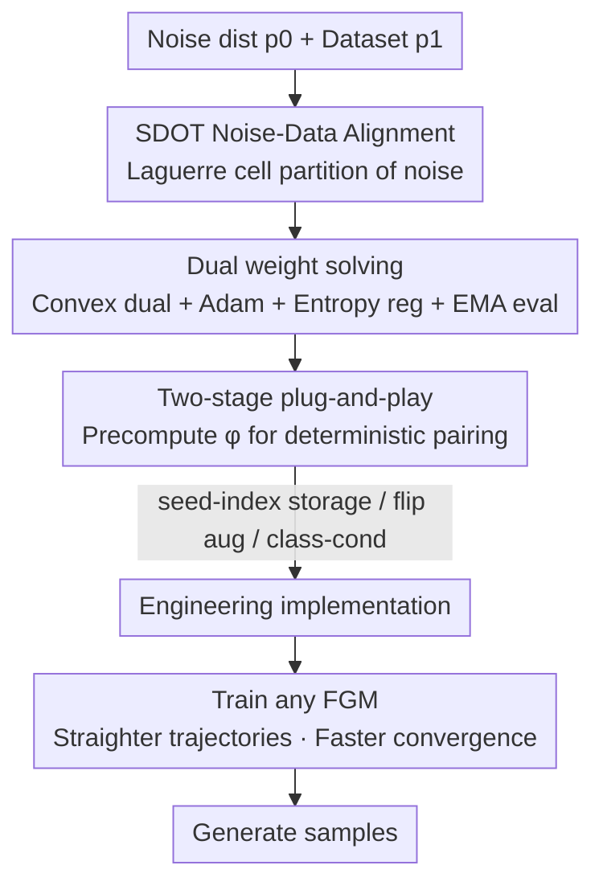

# AlignFlow: Improving Flow-based Generative Models with Semi-Discrete Optimal Transport

**Conference**: ICLR2026  
**OpenReview**: [https://openreview.net/forum?id=nTCF3QNsIN](https://openreview.net/forum?id=nTCF3QNsIN)  
**Code**: https://github.com/konglk1203/AlignFlow  
**Area**: Diffusion Models / Flow Generative Models  
**Keywords**: Flow Generative Models, Optimal Transport, Semi-Discrete Optimal Transport, Noise-Data Alignment, Trajectory Straightening

## TL;DR
AlignFlow utilizes Semi-Discrete Optimal Transport (SDOT) to pre-calculate a deterministic "noise distribution $\rightarrow$ full dataset" alignment mapping before training. This serves as a plug-and-play coupling for various flow generative models, achieving straighter trajectories, faster convergence, and comprehensive FID reductions with less than 1% additional overhead.

## Background & Motivation

**Background**: Flow-based Generative Models (FGM, including Flow Matching, Rectified Flow, shortcut models, MeanFlow, etc.) move noise along an ODE to become data by learning a time-dependent vector field. Sampling involves numerical integration of this ODE, requiring at least one large network forward pass per step. Consequently, the sampling cost (measured by Number of Function Evaluations, NFE) is high—vanilla Flow Matching often requires 100+ steps. NFE directly depends on the "straightness" of the trajectory: straighter trajectories are easier to integrate and require fewer NFE.

**Limitations of Prior Work**: Each FGM training iteration consists of three steps: sampling noise and data, constructing the target vector field, and updating parameters. While significant effort has been invested in designing straighter target vector fields in the second step, the first step—**noise and data sampling—remains independent and randomly paired**. This independence has been proven to "inherently" induce curved trajectories, thereby increasing sampling NFE.

**Key Challenge**: A natural solution is to use Optimal Transport (OT) to couple noise and data, as OT theoretically provides the shortest path between distributions. however, existing OT schemes are difficult to scale. Methods based on discrete OT (Tong et al. 2023, Pooladian et al. 2023) estimate OT plans only within each minibatch and suffer from the **curse of dimensionality**—accurately estimating the OT plan requires samples that scale exponentially with data dimension; small batches are inaccurate, while large batches are too expensive ($O(B^2\log B)$). Continuous OT methods (Kornilov et al. 2024) use ICNNs to parameterize the Brenier potential, introducing extra learning components and inductive biases, and the learned transport maps **lack guarantees of optimality and convergence**.

**Key Insight**: The authors leverage an overlooked fact—during FGM training, data follows a **finite, discrete** empirical distribution, while noise follows a **continuous** prior distribution. Mapping a continuous distribution optimally to a discrete one corresponds exactly to a specialized OT problem: Semi-Discrete Optimal Transport (SDOT). SDOT partitions the noise space into a set of "Laguerre cells," where each cell is mapped as a whole to a specific data point.

**Core Idea**: Use SDOT to **explicitly** calculate a **deterministic** mapping (referred to as Noise–Data Alignment, NDA) from the entire noise distribution to the full dataset before training. This functions as a plug-and-play coupling for any FGM—inheriting the benefits of OT's "shortest path $\rightarrow$ straight trajectory" while **bypassing the curse of dimensionality** by aligning to a fixed discrete dataset. It also offers provable convergence and low-cost quality evaluation.

## Method

### Overall Architecture

AlignFlow **decouples** the issue of "how to pair noise and data" from the FGM training loop into an independent two-stage process. **Stage 1**: For a given noise distribution $p_0$ and empirical data distribution $p_1=\frac{1}{|I|}\sum_{i\in I}\delta_{x_1^i}$, solve the SDOT problem to obtain a deterministic mapping $\varphi$ that maps noise to data indices. **Stage 2**: Train any standard FGM, but replace the original "independent random sampling of $(x_0,x_1)$" with "sample noise $x_0$, and retrieve its aligned data point $x_1$ using $\varphi(x_0)$." All other components (interpolation, target vector field, loss, updates) remain unchanged. Because the NDA component is separated from FGM training, AlignFlow is plug-and-play and can be superimposed on Flow Matching, shortcut models, MeanFlow, Live Reflow, etc.

### Key Designs

**1. Constructing Noise–Data Alignment with SDOT: Partitioning continuous noise into Laguerre cells aligned to data points**

This step directly addresses the "curved trajectories from random pairing" and "discrete OT curse of dimensionality." SDOT seeks the optimal transport between the continuous noise $p_0$ and discrete data $p_1$ given the Euclidean cost $c(y_1,y_2)=\|y_1-y_2\|^2$. The transport map can be fully represented by an $|I|$-dimensional **dual weight** $g=[g_i]_{i\in I}$: given $g$, the mapping from noise samples to data indices is:

$$\varphi(x_0;g):=\arg\min_{i\in I}\; c(x_0,x_1^i)-g_i .$$

Geometrically, this partitions the noise space into Laguerre cells $L_i(g)=\{x: c(x,y_i)-g_i\le c(x,y_j)-g_j,\,\forall j\}$, where each cell is moved to the $i$-th data point, and the integral of the noise density over the cell equals the data point's probability mass $b_i=1/|I|$. Crucially, because $p_1$ is **fully determined** by the dataset (not a sampled approximation), SDOT can in principle be calculated with **zero estimation error**, thereby **bypassing the curse of dimensionality**. This fundamentally distinguishes it from discrete minibatch OT (which approximates both distributions with samples, incurring errors that explode with dimension) and continuous ICNN OT (which introduces inductive bias without optimality guarantees). Simultaneously, it inherits the "shortest path" property of OT, providing FGM with naturally straighter transport directions.

**2. Solving Dual Weights: Transforming SDOT into a convex dual problem using Adam with entropy regularization and EMA evaluation**

With $\varphi$ defined, the core task is solving for the dual weights $g$. Like standard OT, SDOT is a minimization problem, but through duality, it can be converted to maximizing a **concave** dual objective:

$$E(g):=\sum_{i\in I}\int_{L_i(g)}\big(c(x,y_i)-g_i\big)\,dp_0(x)+\langle g,b\rangle,$$

where the gradient has the simple form $\nabla E(g)_i=-\int_{L_i(g)}dp_0+b_i$, representing the difference between the "noise mass falling into cell $i$" and the "target mass $b_i$." The authors use Adam to optimize this objective (Algo. 2): in each round, a batch of noise is sampled, assigned to cells based on current $g$ (using hard $\arg\min$ for $\epsilon=0$ or $\mathrm{SoftMax}\!\big(-(c-g)/\epsilon\big)$ for $\epsilon>0$), and the estimated $\nabla E$ is used to update $g$ after EMA smoothing. Two engineering insights are critical: **Entropy regularization $\epsilon>0$** smooths the SDOT objective and accelerates convergence; the authors also propose an **EMA-based MRE (Mean Relative Error) and $L_1$ distance estimate** to evaluate dual weight quality at low cost, which is convenient for hyperparameter tuning.

**3. Two-stage plug-and-play process + Convergence acceleration from determinism**

Integrating the precomputed $\varphi$ into FGM results in AlignFlow (Algo. 3): sample $M=K\cdot B$ noise points once, align them with data indices using $\varphi$, and then enter the training loop using standard interpolation $x_t=(1-t)x_0+t\,x_1$. The authors provide two reasons for requiring a "deterministic mapping" over a general probabilistic coupling: first, if the OT source distribution is continuous, the optimal OT map is **necessarily deterministic** (Peyré et al. Remark 2.24); second, determinism makes noise-data matching **batch-invariant**. This second point explains the faster convergence: under standard random coupling, determining the target vector field at $(x_t, t)$ theoretically requires an expectation over the dataset. AlignFlow's fixed coupling directly provides $x_1=\varphi(x_0)$, **bypassing this expectation estimation**, making the target cleaner for the network to fit and significantly accelerating empirical convergence. This batch-invariance is particularly valuable when large models are constrained by memory and must use small batch sizes.

**4. Engineering Implementation: seed-index storage, flip augmentation, and class-conditional mapping**

To run the two-stage scheme at ImageNet scales, several practical tricks are used (Sec. 3.5). **Noise Storage**: Pre-generating massive noise for Stage 2 is impractical for storage (TB-level for 10 epochs on ImageNet). Instead, only the **random seed** used for each noise sample is stored, representing each pair as a `(seed, index)` tuple—leveraging JAX's deterministic random matrix mapping—requiring only ~1 GB of disk for 500 epochs. **Data Augmentation**: Complex augmentations are hard to integrate into SDOT, but for image generation, the most effective augmentation is often random horizontal flips. This is handled by **redefining the dataset as the union of original and flipped images**. **Class-conditional Generation**: SDOT mappings are calculated independently for each class $c$ from $p_0$ to $p_{1,c}$, followed by per-class Rebalancing (Sec. C).

### Loss & Training
AlignFlow **does not modify the FGM training objective**—the loss remains the original loss of the respective FGM (e.g., $\frac{1}{B}\sum_j\|\hat v_j-v_j\|_2^2$ for Flow Matching). It only replaces "independent pairing" with "SDOT pairing" in the first step. All FGM hyperparameters follow the original paper configurations. Extra costs stem only from the Stage 1 SDOT calculation (< 1% training time) and Stage 2 pair generation (< 0.1%).

## Key Experimental Results

### Main Results

On CIFAR-10 using U-Net in pixel space for unconditional generation, compared to standard Minibatch OT (Tong et al. 2023), AlignFlow achieves lower FID-50k and faster convergence across all ODE integrators (avg. of 5 runs):

| ODE Integrator | Minibatch OT | AlignFlow (Ours) |
|------------|--------------|--------------------|
| Euler (100 steps) | 4.80 | 4.72 |
| Euler (1000 steps) | 3.92 | 3.79 |
| DOPRI5 | 3.82 | 3.71 |

On ImageNet256 using the DiT-B/2 + shortcut framework, AlignFlow as a plug-and-play component significantly reduces FID-50k at NFE=4 / NFE=1 across various FGMs:

| Algorithm | NFE=4 (w/o $\rightarrow$ w/) | NFE=1 (w/o $\rightarrow$ w/) |
|------|---------------------|---------------------|
| Flow Matching | 125.62 $\rightarrow$ 93.16 ($\downarrow$32.46) | 305.04 $\rightarrow$ 276.18 ($\downarrow$28.86) |
| Consistency Training | 111.84 $\rightarrow$ 103.14 ($\downarrow$8.70) | 76.37 $\rightarrow$ 64.33 ($\downarrow$12.04) |
| Live Reflow | 94.75 $\rightarrow$ 60.23 ($\downarrow$34.52) | 59.87 $\rightarrow$ 47.06 ($\downarrow$12.81) |
| Shortcut Models | 33.11 $\rightarrow$ 30.31 ($\downarrow$2.80) | 46.65 $\rightarrow$ 43.92 ($\downarrow$2.73) |

### Ablation Study

On ImageNet256 using SiT + MeanFlow for one-step generation (NFE=1), AlignFlow consistently improves performance across four model scales. While larger models have stronger baselines and smaller absolute gains, the improvement remains positive:

| Backbone | Params | w/o AlignFlow | w/ AlignFlow | Gain |
|----------|--------|---------------|--------------|------|
| SiT-B/4 | 131M | 15.53 | 13.75 | $\downarrow$1.78 |
| SiT-B/2 | 131M | 6.17 | 5.60 | $\downarrow$0.57 |
| SiT-L/2 | 459M | 3.84 | 3.51 | $\downarrow$0.33 |
| SiT-XL/2 | 676M | 3.43 | 3.23 | $\downarrow$0.20 |

### Key Findings
- **Simultaneous Improvement in Convergence and Performance**: Training curves across CIFAR-10 U-Net, DiT-B/2 shortcut, and SiT MeanFlow show that AlignFlow not only reaches lower final FIDs but also hits target performance earlier. This validates the claim that deterministic coupling bypasses expectation estimation, accelerating convergence.
- **Larger Gains for Weaker Baselines**: The most dramatic improvements occur in low NFE settings where original quality is poor (e.g., Flow Matching NFE=4, FID dropped from 125 to 93). For strong baselines like shortcut models (FID ~33), the improvement is smaller, indicating AlignFlow primarily fixes "insufficiently straight trajectories."
- **Near-Zero Overhead**: Stage 1 takes < 1% training time, Stage 2 takes < 0.1%, and pairs for 500 epochs require only ~1 GB disk space, making it virtually burden-free for large-scale training.

## Highlights & Insights
- **Leveraging the overlooked "continuous-to-discrete" structure**: While others struggle with sample-based discrete OT or network-based continuous OT, the authors identify that data is discrete and noise is continuous. SDOT provides zero estimation error and provable convergence—the key "aha" moment of the paper.
- **Determinism = Optimality Requirement + Batch Invariance**: This single property explains both "why it performs better" and "why it is friendly to small-batch large models."
- **Complete Decoupling and Plug-and-Play**: Moving coupling to a pre-processing stage means any existing FGM can benefit with almost no code changes, lowering the barrier to adoption.
- **The `(seed, index)` Storage Trick**: This reusable method for storing massive random quantities by saving seeds rather than full matrices could be applied broadly to other generative model paradigms.

## Limitations & Future Work
- **Reliance on Fixed Empirical Datasets**: Because SDOT aligns noise to specific data points, complex augmentations (random cropping/rotation) are difficult to incorporate. The authors are limited to enumerable cases like horizontal flips.
- **Complexity of SDOT Solving**: $O(|I|^3)$ complexity rises with dataset size (though mitigated by entropy regularization and $O(|I|)$ outer loops). The scalability to massive datasets beyond ImageNet256 remains to be fully verified.
- **Class-conditional Overhead**: Scaling to a very large number of classes requires per-class mapping and rebalancing, which increases management complexity.
- **Diminishing Returns on Largest Models**: The gain on SiT-XL/2 ($\downarrow$0.20) suggests limited marginal benefit on top-tier SOTA baselines; the long-term value is more evident in few-step or weaker baseline scenarios.

## Related Work & Insights
- **vs. Minibatch OT (Tong et al. 2023 / Pooladian et al. 2023)**: They use Sinkhorn within batches, suffering from the curse of dimensionality and batch-size sensitivity. AlignFlow uses SDOT for the **entire noise distribution and dataset**, achieving zero estimation error and batch invariance.
- **vs. Continuous OT / ICNN (Kornilov et al. 2024)**: They parameterize potentials with ICNNs, introducing inductive bias without convergence guarantees. AlignFlow solves the convex dual directly with guarantees.
- **vs. Rectified Flow / Reflow (Liu et al. 2022)**: Reflow approximates OT by "untangling" trajectories in multiple training stages. AlignFlow achieves alignment as a cheap pre-processing step without retraining.
- **Complementary to Vector Field Methods**: AlignFlow modifies the coupling (Step 1) while methods like shortcut models modify the target field (Step 2). Experiments show they are mutually beneficial.

## Rating
- Novelty: ⭐⭐⭐⭐⭐ Using SDOT for FGM coupling to bypass the curse of dimensionality is a fresh and insightful perspective.
- Experimental Thoroughness: ⭐⭐⭐⭐ Covered CIFAR-10 to ImageNet256 and various FGMs, though missing validation on larger resolutions or multi-modal tasks.
- Writing Quality: ⭐⭐⭐⭐⭐ Clear derivation of motivations and a good balance between theory and engineering practice.
- Value: ⭐⭐⭐⭐⭐ Plug-and-play with nearly zero overhead and universal gains makes it highly likely to be adopted by the community.

<!-- RELATED:START -->

## Related Papers

- [\[ICCV 2025\] The Curse of Conditions: Analyzing and Improving Optimal Transport for Conditional Flow-Based Generation](../../ICCV2025/image_generation/the_curse_of_conditions_analyzing_and_improving_optimal_transport_for_conditiona.md)
- [\[ICLR 2026\] Entering the Era of Discrete Diffusion Models: A Benchmark for Schrödinger Bridges and Entropic Optimal Transport](entering_the_era_of_discrete_diffusion_models_a_benchmark_for_schrödinger_bridge.md)
- [\[ICML 2026\] Pareto-Guided Optimal Transport for Multi-Reward Alignment](../../ICML2026/image_generation/pareto-guided_optimal_transport_for_multi-reward_alignment.md)
- [\[ICLR 2026\] Diagnosing and Improving Diffusion Models by Estimating the Optimal Loss Value](diagnosing_and_improving_diffusion_models_by_estimating_the_optimal_loss_value.md)
- [\[NeurIPS 2025\] Counterfactual Identifiability via Dynamic Optimal Transport](../../NeurIPS2025/image_generation/counterfactual_identifiability_via_dynamic_optimal_transport.md)

<!-- RELATED:END -->
