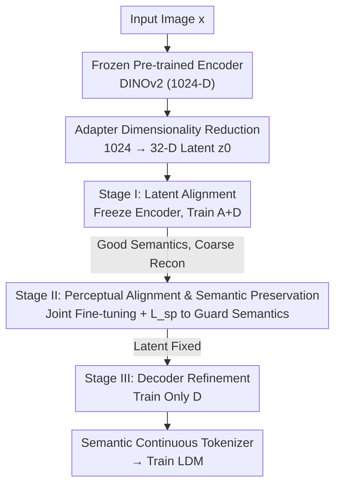

# Aligning Visual Foundation Encoders to Tokenizers for Diffusion Models

**Conference**: ICLR2026  
**OpenReview**: [https://openreview.net/forum?id=ajnBafpqmE](https://openreview.net/forum?id=ajnBafpqmE)  
**Code**: [aligntok.github.io](https://aligntok.github.io)  
**Area**: Diffusion Models / Image Generation  
**Keywords**: Visual tokenizer, pre-trained encoder alignment, latent diffusion, DINOv2, semantic preservation

## TL;DR
Ours proposes AlignTok—instead of training a VAE from scratch or forcing it to learn semantics via "semantic regularization," it transforms a semantically-rich pre-trained visual foundation encoder (DINOv2) into a continuous tokenizer through a three-stage progressive alignment. This yields a latent space that is both semantically well-structured and capable of precise reconstruction; on ImageNet 256×256, it allows the diffusion model to reach a gFID of 1.90 in just 64 epochs, achieving a convergence speed approximately 5× faster than VA-VAE.

## Background & Motivation
**Background**: The core component of Latent Diffusion Models (LDM) is the continuous visual tokenizer, which defines the latent space where the diffusion process occurs. Training a tokenizer requires two concurrent tasks: the encoder must learn a "diffusability-friendly" latent space, while the decoder must learn to reconstruct the latent codes back into images. The mainstream approach is to train a VAE optimized by reconstruction loss (L1 + perceptual + adversarial) plus a weakly weighted KL regularization term.

**Limitations of Prior Work**: Since the KL weight is small, training is almost entirely dominated by reconstruction loss. Consequently, the two tasks are severely **asymmetric**—reconstruction learning for the decoder is direct and strongly supervised, whereas representation learning for the encoder is indirect, making the latent space a mere byproduct of reconstruction constrained only by a weak KL prior. As a result, latent spaces are often dominated by low-level details, exhibit unpredictable structures, and have poor diffusion-friendliness. Recent "semantic regularization" methods like VA-VAE and MAETok (Figure 1 left) add a loss term to push the latent space to align with the representations of a pre-trained large encoder. While this improves diffusion-friendliness, the encoder still has to **learn** semantic structures **from scratch** while competing with reconstruction objectives, which is inefficient.

**Key Challenge**: Learning semantics is inherently much more difficult than learning reconstruction. Forcing a randomly initialized encoder to squeeze out semantics under the pressure of reconstruction leads to a tug-of-war between two objectives, precluding optimal performance.

**Goal**: To build a tokenizer with stronger semantic grounding (resulting in better diffusion-friendliness) and competitive reconstruction capabilities.

**Key Insight**: Since pre-trained foundation encoders (DINOv2/SigLIP/MAE) already possess rich natural semantics, why learn from scratch? Directly "aligning" them into a tokenizer makes the first task (learning a diffusion-friendly latent space) almost free, allowing the training to focus solely on supplementing reconstruction capabilities.

**Core Idea**: Replace "semantic regularization from scratch" with "aligning pre-trained encoders" (Figure 1 right), using a three-stage progressive pipeline to supplement reconstruction capabilities while preserving existing semantics.

## Method

### Overall Architecture
The input to AlignTok is an image $x$, and the output is a tokenizer (encoder $E_p$ + adapter $A$ + decoder $D$) that can be directly used by an LDM. The entire pipeline revolves around a counter-intuitive judgment: **semantics are hard to learn, reconstruction is easy**. Therefore, rather than letting the encoder learn semantics from zero, a semantically-aware pre-trained encoder is "domesticated" into a tokenizer in three steps.

Specifically, an adapter $A$ first projects the high-dimensional features of the pre-trained encoder (1024-D for DINOv2-L/14) into the low-dimensional latent codes preferred by diffusion models (default $d=32$): $z_0 = A(E_p(x))$. Then, three stages proceed sequentially: **Stage 1** freezes the encoder and trains only the adapter and decoder to establish a semantically well-structured but reconstruction-coarse latent space; **Stage 2** unfreezes all components for joint fine-tuning to recover low-level details, using a "semantic preservation loss" to prevent semantics from being overwhelmed by the reconstruction objective; **Stage 3** refines only the decoder to push reconstruction quality to its maximum without altering the latent space. Upon completion, the latent space is both semantically rich (diffusion-friendly) and retains the details necessary for precise reconstruction.

### Key Designs

**1. Alignment Paradigm: Replacing Regularization from Scratch with Pre-trained Alignment**

This is the core of the paper. Semantic regularization (VA-VAE) requires a randomly initialized encoder to "chase" the representations of a pre-trained encoder using an additional loss term during reconstruction-dominated training. However, the encoder struggles to learn both reconstruction and semantics simultaneously. AlignTok reverses this: it starts directly from an $E_p$ already rich in semantics. Thus, the first task—learning a diffusion-friendly latent space—is nearly free, and training focuses on supplementing reconstruction. Experiments confirm that the latent space obtained via alignment is significantly more diffusion-friendly than the regularization route. Using the same DINOv2 and training steps, AlignTok achieves a linear probing accuracy comparable to VA-VAE (35.09% vs. 33.57%) but with significantly better generation quality (gFID w/ CFG 2.17 vs. 3.16), indicating that alignment provides semantic organization advantages beyond just "class separability."

**2. Adapter Dimensionality Reduction: Compressing 1024-D Semantics into a 32-D Latent Space**

Pre-trained encoders are designed for representation learning and have high output dimensions (1024-D for DINOv2-L/14), whereas diffusion models are easier to optimize and show effective noise scheduling at lower dimensions (32 or 64). This is the high-dimensional instability challenge faced when using frozen encoders directly as tokenizers (like in RAE). AlignTok introduces a lightweight adapter $A$ for the projection $z_0 = A(E_p(x))$ to compress high-dimensional semantic features into compact latent codes. Notably, the authors deliberately **exclude the KL term**. Experiments showed that KL provides no benefit and instead imposes unnecessary distribution constraints that distort the original semantic structure of the encoder. The adapter serves as both a dimensionality reducer and the anchor point for the semantic preservation loss (see Design 4).

**3. Stage I: Latent Alignment—Freezing the Encoder to Build the Semantic Latent Space First**

The goal of the first stage is to convert the pre-trained encoder's semantic space into a "generatable" latent space. The approach is restrained: $E_p$ is frozen, and only the adapter $A$ and decoder $D$ are trained using reconstruction loss ($L_{rec} = L_{\ell 1} + w_p L_{perceptual} + w_g L_{GAN}$ in Eq. 1). Freezing the encoder ensures the semantic structure of the latent space remains pure and uncontaminated by reconstruction targets. The cost is lower reconstruction quality—noticeable color shifts occur because the frozen encoder misses fine-grained perceptual details (orange points in Figure 3 left show high rFID). Thus, this step is merely foundational; using Stage 1 alone results in an unusable rFID of 1.63 and PSNR of 17.34.

**4. Stage II: Perceptual Alignment and Semantic Preservation Loss—Unlocking "Reconstruction vs. Semantics" Catastrophic Forgetting**

To supplement reconstruction capability, the encoder must be unfrozen to learn details. Stage 2 starts from the Stage 1 checkpoint and jointly optimizes $E_p, A, D$ using the same $L_{rec}$. Reconstruction improves rapidly (green line in Figure 3 left), but a **catastrophic side effect** occurs: the semantic structure of the latent space collapses, and linear probing accuracy plummets (green line in Figure 3 right). The key patch provided by this paper is a simple yet effective **semantic preservation loss**—it constrains the latent codes produced in the current stage to not drift too far from those of the previous stage (frozen snapshot) using L2:

$$L_{sp} = L_{\ell 2}(z_0^*, z_0)$$

where $z_0^*$ is the latent code from the currently updating $E_p, A$, and $z_0$ is the latent code from the snapshot of the previous stage. The total loss for this stage is $L_{pa} = L_{rec} + w_{sp} L_{sp}$, with $w_{sp}=1$ by default. This separates "supplementing details" and "preserving semantics": reconstruction loss injects low-level details into the latent space, while $L_{sp}$ acts as an anchor to pin down the semantic structure, allowing the blue line (Figure 3) to retain semantics while achieving high reconstruction. Ablations show $w_{sp}$ represents a clear trade-off—at weight 0, reconstruction is slightly better (rFID 0.33) but semantics collapse (9.50% linear probing, 3.05 gFID); at very high weights (5 or 10), generation improves but reconstruction quality drops; $w_{sp}=1$ achieves the best balance.

**5. Stage III: Decoder Refinement—Maximizing Reconstruction After Freezing the Latent Space**

The first two stages align the encoder into a usable tokenizer, but the decoder might still be underfitted because the latent space was changing throughout the training process. In Stage 3, only the decoder is updated while everything else is frozen, allowing it to fully fit on a fixed latent space and further improving reconstruction quality (purple line in Figure 3 left). The beauty of this step is that it **does not touch the latent space**, meaning it can be performed even after training the downstream generation model as a plug-and-play reconstruction enhancement.

### Loss & Training
- **Reconstruction Loss** (used in all stages): $L_{rec} = L_{\ell 1}(x,\hat x) + w_p L_{perceptual}(x,\hat x) + w_g L_{GAN}(x,\hat x)$.
- **Semantic Preservation Loss** (Stage 2): $L_{sp} = L_{\ell 2}(z_0^*, z_0)$, Total $L_{pa} = L_{rec} + w_{sp} L_{sp}$, $w_{sp}=1$.
- **No KL**: Found no benefit and found it distorts semantics, so it is discarded.
- **Training Details**: ImageNet downsampling factor $f=16$, latent dimension $d=32$, sampling steps 30. The generative model follows VA-VAE’s LightningDiT (~673M parameters). Stage 2 uses EMA for stability. Diffusion uses flow matching: $z_t=(1-t)z_0 + t z_1, z_1\sim\mathcal N(0,I)$, predicting velocity $u_t = z_1 - z_0$, with loss $L_{FM}=\mathbb E\|v_\theta(z_t,t)-u_t\|_2^2$.

## Key Experimental Results

### Main Results
ImageNet 256×256, 80K training steps, 30 sampling steps, compared with baselines of the same dimension (lower gFID is better):

| Tokenizer | Encoder | rFID↓ | Linear Probing↑ | gFID w/o CFG↓ | gFID w/ CFG↓ |
|-----------|---------|-------|-----------------|--------------|-------------|
| Vanilla VAE (f16d32) | CNN | 0.26 | 6.04% | 10.17 | 3.31 |
| VA-VAE (f16d32) | CNN | 0.28 | 22.96% | 7.79 | 3.13 |
| VA-VAE† (f16d32) | ViT | 0.37 | 33.57% | 8.21 | 3.16 |
| **AlignTok (f16d32)** | ViT | **0.26** | **35.09%** | **4.05** | **2.17** |
| **AlignTok (f16d64)** | ViT | 0.17 | 46.99% | 5.24 | 2.34 |

Convergence speed (Figure 4 right): AlignTok needs only ~60K steps to reach the quality of VA-VAE at ~300K steps, a **~5× speedup**. At a 64-epoch setting, gFID (w/ CFG) is 1.90 vs. VA-VAE's 2.11. In terms of sampling, AlignTok at 50 steps matches VA-VAE at 250 steps. For Text-to-Image (LAION, 2B parameter T2I model trained for 100K steps): AlignTok outperforms FLUX VAE across gFID (30.27 vs. 35.78), HPSv2, PickScore, and CLIP, trailing only slightly in rFID.

### Ablation Study
ImageNet 256×256, 80K steps, 30 sampling steps, without Stage 3, mainly comparing Stage 1 + Stage 2:

| Configuration | rFID↓ | Linear Probing↑ | gFID↓ | Description |
|---------------|-------|-----------------|-------|-------------|
| $w_{sp}=0$ | 0.33 | 9.50% | 3.05 | Semantic collapse, latent space degrades to low-level details |
| $w_{sp}=1$ (Stage 1+2) | 0.36 | 35.09% | 2.19 | Best balance of reconstruction/semantics |
| $w_{sp}=5$ | 0.49 | 40.55% | 2.48 | Stronger semantics but reconstruction drops |
| Applied Pre-Adapter | 0.34 | 15.61% | 2.83 | Loss applied before adapter, generation quality drops |
| Cosine Loss | 0.37 | 37.99% | 2.23 | Comparable to L2 |
| LoRA Fine-Tuning | 1.35 | 18.56% | 2.97 | Low-rank updates insufficient for balance |
| Stage 1 only | 1.63 | 41.53% | 3.00 | Semantics preserved but unusable reconstruction |
| **Full Model (inc. Stage 3)** | **0.26** | 35.09% | **2.17** | Best full three-stage performance |

### Key Findings
- **Semantic preservation loss is critical in Stage 2**: Removing it ($w_{sp}=0$) causes linear probing to crash from 35% to 9.5% and gFID to worsen from 2.19 to 3.05, validating the existence of catastrophic forgetting and the necessity of this loss.
- **Frozen encoder (Stage 1 only) is not viable**: It yields the best semantics (41.53%) but disastrous reconstruction (1.63 rFID), confirming that the encoder must be unfrozen to supplement details.
- **Encoder choice**: MAE has the strongest reconstruction but the worst generation (gFID 3.12); DINOv2 achieves the best balance (gFID 2.19) and is chosen as the default.
- **Larger decoders (351M) can harm generation**: Increasing decoder capacity on ImageNet yields limited benefits and can hurt generation performance.

## Highlights & Insights
- **Perspective shift from "Regularization" to "Alignment"**: Instead of forcing a random encoder to learn from scratch, modifying an existing semantically-capable encoder turns the hardest sub-task into a given, letting training focus on simpler targets.
- **Semantic preservation loss decouples conflicting goals**: Using the previous stage's latent code as an anchor allows the reconstruction loss to inject details without destroying semantic structure. This is a minimal yet profound design.
- **Modularity of Stage 3**: Refining the decoder without touching the latent space means it can be applied as a plug-and-play enhancement after training the downstream generation model.
- **Architectural simplicity**: It requires no extra encoders, no image-text supervision, and uses a pure self-supervised semantic loss, making it generalizable to any visual encoder.

## Limitations & Future Work
- **Reconstruction at 64-D lags behind VA-VAE (CNN)**: The authors admit that reaching parity in reconstruction requires reducing $w_{sp}$ and increasing the learning rate, which slightly harms generation.
- **Scaling to 80K steps**: Most ImageNet comparisons are at 80K steps, which may not reflect the landscape at full convergence.
- **Stability and QKNorm**: Extending training requires QKNorm to prevent NaN losses, but adding it slightly reduces generation quality, indicating that stabilizing high-semantic latent spaces requires further study.
- **Complementarity with RAE/REPA-E**: AlignTok could be combined with RAE’s high-channel semantics or used as a stronger initialization for REPA-E’s end-to-end training.

## Related Work & Insights
- **vs. VA-VAE (Semantic Regularization)**: VA-VAE pushes a random encoder to match pre-trained representations; AlignTok starts with those representations. At the same dimension/steps, AlignTok leads significantly in quality and speed (gFID 2.17 vs. 3.16).
- **vs. RAE (Frozen Encoders)**: RAE freezes the encoder and keeps semantics but struggles with high dimensionality; AlignTok fine-tunes and reduces dimension, achieving much higher reconstruction fidelity.
- **vs. REPA-E (Joint Training)**: REPA-E found that initializing with an existing tokenizer helps; AlignTok provides a much stronger plug-and-play alternative for the VA-VAE component within such frameworks.

## Rating
- Novelty: ⭐⭐⭐⭐⭐ The move from regularization to alignment is a fundamental shift in how semantic tokenizers are built.
- Experimental Thoroughness: ⭐⭐⭐⭐ Strong ImageNet/LAION results and exhaustive ablations, though training steps are limited in some comparisons.
- Writing Quality: ⭐⭐⭐⭐⭐ Clear motivation, stage-by-stage visual explanations, and thorough trade-off analysis.
- Value: ⭐⭐⭐⭐⭐ Offers a plug-and-play replacement for VA-VAE/FLUX VAE with ~5× faster convergence, making a substantial impact on tokenizer design.

<!-- RELATED:START -->

## Related Papers

- [\[CVPR 2026\] VFM-VAE: Vision Foundation Models Can Be Good Tokenizers for Latent Diffusion Models](../../CVPR2026/image_generation/vfm-vae_vision_foundation_models_can_be_good_tokenizers_for_latent_diffusion_mod.md)
- [\[ICLR 2026\] Latent Denoising Makes Good Tokenizers](latent_denoising_makes_good_tokenizers.md)
- [\[ICML 2026\] Compression as Adaptation: Implicit Visual Representation with Diffusion Foundation Models](../../ICML2026/image_generation/compression_as_adaptation_implicit_visual_representation_with_diffusion_foundati.md)
- [\[ICLR 2026\] Diffusion Transformers with Representation Autoencoders](diffusion_transformers_with_representation_autoencoders.md)
- [\[ICLR 2026\] Asynchronous Denoising Diffusion Models for Aligning Text-to-Image Generation](asynchronous_denoising_diffusion_models_for_aligning_text-to-image_generation.md)

<!-- RELATED:END -->
