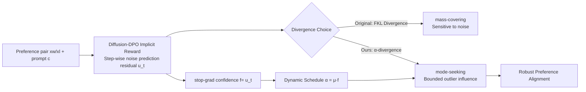

# $\alpha$-DPO: Robust Preference Alignment for Diffusion Models via $\alpha$ Divergence

**Conference**: ICLR 2026  
**Code**: [github.com/yangli-lab/Diffusion_alpha-DPO_ICLR2026](https://github.com/yangli-lab/Diffusion_alpha-DPO_ICLR2026)  
**Area**: image_generation  
**Keywords**: Diffusion-DPO, Preference Alignment, Noise Robustness, $\alpha$-divergence, mode-seeking, dynamic scheduling  

## TL;DR
This paper demonstrates from a distribution matching perspective that Diffusion-DPO is equivalent to minimizing the forward KL divergence and is therefore naturally sensitive to noisy preference pairs. It proposes replacing FKL with $\alpha$-divergence combined with a dynamic $\alpha$ schedule, making diffusion model preference alignment significantly more robust under label-flipping noise.

## Background & Motivation
**Background**: While diffusion models generate high-quality images, alignment is required to match human preferences (semantic relevance, style, aesthetics). Compared to RLHF, which requires a separate reward model and is prone to reward hacking and instability, Diffusion-DPO reparameterizes the reward implicitly into the model itself for end-to-end fine-tuning on pairwise preference data, becoming a simple and stable mainstream solution.

**Limitations of Prior Work**: The effectiveness of DPO depends heavily on the quality of preference data. However, real-world data contains two types of noise: "mislabeled pairs" due to annotation errors and "individual preference pairs" (where both winner/loser are acceptable) due to subjective disagreement. Both are essentially **label-flipping noise**. Experiments show that as the flipping ratio increases, DPO alignment performance degrades sharply.

**Key Challenge**: Existing noise-robust DPO variants (cDPO with label smoothing, rDPO with known noise rates, Hölder-DPO, etc.) are mostly built on simplified assumptions (I.I.D. flipping, known noise rates) and designed for autoregressive Large Language Models. They fail to characterize structured noise in real preference data or the Markov chain properties of diffusion models. This paper identifies a deeper root cause: **the optimization objective of Diffusion-DPO is equivalent to minimizing the forward KL divergence (FKL)**. The "mass-covering" nature of FKL heavily penalizes underestimation in regions where the target distribution has extremely low probability, which exactly amplifies the influence of noisy samples.

**Goal / Core Idea**: Robust alignment under noise requires two properties: (i) **mode-seeking**, prioritizing the learning of high-density significant preferences rather than covering the entire support; (ii) **bounded outlier influence**, ensuring the loss is insensitive to individual erroneous samples. **Core Idea**: Replace FKL with the more general **$\alpha$-divergence**, which covers FKL and reverse KL, and use $\alpha$ to continuously trade off between mass-covering and mode-seeking; then use **dynamic $\alpha$ scheduling** to adaptively adjust $\alpha$ based on the implicit confidence of each sample, achieving data-aware noise tolerance. This is the first noise-robust DPO method specifically for image generation.

## Method

### Overall Architecture
The method progresses in two steps: first, it rewrites the Diffusion-DPO objective as a divergence minimization problem aimed at pulling the preference distribution $\bar p_\theta$ toward the target distribution $\bar p^*$, proving it is equivalent to FKL. Second, it replaces FKL with $\alpha$-divergence to obtain $\mathcal{L}_{\alpha\text{-DPO}}$, setting $\alpha$ dynamically based on sample confidence during training. This pipeline introduces no additional networks or inference overhead, modifying only the loss function shape and a scalar schedule.

### Key Designs

**1. Reducing Diffusion-DPO to FKL Divergence Minimization: Identifying the root cause.** The paper starts from the RLHF objective (maximizing reward minus $\beta$ times KL regularization), derives the optimal policy $p^*\propto p_{\mathrm{ref}}\exp(\beta^{-1}r)$, and utilizes the DPO reparameterization $r(c,x_0)=\beta\log\frac{p_\theta}{p_{\mathrm{ref}}}+\beta\log Z(c)$ with the Bradley-Terry model to obtain the standard DPO loss. For diffusion models, ELBO is used to replace the intractable $p_\theta(x_0|c)$ with a step-wise form of trajectory rewards. The key step is defining mixture distributions $\bar p_\theta\propto p_\theta^\beta\,p_{\mathrm{ref}}^{1-\beta}$ and $\bar p^*\propto p_{\mathrm{ref}}\exp(r)$, rewriting the entire Diffusion-DPO objective as $\mathcal{L}_{\text{DPO-Diffusion}}=\mathbb{E}_x\big[D_{\mathrm{KL}}(\bar p^*\,\|\,\bar p_\theta)\big]$. This rewrite confirms DPO performs forward KL matching. The mass-covering property of FKL exerts heavy penalties in regions where $\bar p^*$ is nearly zero but $\bar p_\theta$ still has mass—precisely the false modes created by noisy preference pairs. This explains why DPO collapses under high flipping rates.

**2. Replacing FKL with $\alpha$-divergence for the $\alpha$-DPO objective.** The $\alpha$-divergence $D_\alpha(P\|Q)=\frac{1}{\alpha(\alpha-1)}\mathbb{E}_{x\sim Q}\big[(P/Q)^{1-\alpha}-(1-\alpha)P/Q-\alpha\big]$ is a family of continuous divergences: as $\alpha\to 1$, it reverts to FKL $D_{\mathrm{KL}}(P\|Q)$; as $\alpha\to 0$, it reverts to reverse KL $D_{\mathrm{KL}}(Q\|P)$. Smaller $\alpha$ values favor mode-seeking and better suppress outliers in the tails. Replacing FKL with $D_\alpha(\bar p^*\|\bar p_\theta)$ and using Monte Carlo approximation for the partition function (with $K=2$ for pairs), the loss simplifies to:
$$\mathcal{L}_{\alpha\text{-DPO}}=\mathbb{E}\Big[\tfrac{1}{\alpha(\alpha-1)}\,u\cdot\big(u^{\alpha-1}-(1-\alpha)u^{-1}-\alpha\big)\Big],\quad u=\sigma\!\big(g_\theta(c,x^w)-g_\theta(c,x^l)\big).$$
where $g_\theta$ is the relative log-ratio of $\log\bar p_\theta-\log p_{\mathrm{ref}}$. Following Diffusion-DPO using Jensen's inequality and the forward process approximation, $u$ is mapped to a per-timestep form $u_t(\theta)=\sigma\big(-\beta T\omega(\lambda_t)[(\|\epsilon^w-\epsilon_\theta\|^2-\|\epsilon^w-\epsilon_{\mathrm{ref}}\|^2)-(\cdots^l)]\big)$. Thus, $\alpha$-DPO simply replaces the $\log\sigma$ loss of standard DPO with a shape controlled by $\alpha$, with near-zero implementation cost.

**3. Dynamic $\alpha$ Scheduling: Using sample confidence as an implicit preference classifier.** A fixed $\alpha$ cannot adapt to different noise levels: larger $|\alpha|$ increases sensitivity to tails, and the optimal value depends on the noise structure. The authors introduce an auxiliary metric $f(x^w,x^l,c)=\text{StopGrad}(u_t(\theta))$ (no gradient backpropagation) to quantify per-sample noise. Analyzing the gradient $\nabla_{u_t}\mathcal{L}_{\alpha\text{-DPO}}=\frac{1}{\alpha-1}(u_t^{\alpha-1}-1)$ shows it is always negative for $0<\alpha<1$ and $0<u_t<1$, meaning optimization drives the model to increase $u_t$ (ranking the winner above the loser). Thus, $f$ serves naturally as a "confidence score": high score = good alignment = low noise. The paper further confirms $f$ is strongly monotonically correlated with reference $\Delta$HPSv2, proving $f$ can act as an internal confidence signal. Consequently, $\alpha$ is set as $\alpha=\mu\, f(x^w,x^l,c)$ (where $\mu$ controls scale): high-confidence samples receive a larger $\alpha$ (closer to standard alignment), while low-confidence (likely noisy) samples automatically receive a smaller $\alpha$, skewing toward mode-seeking for noise resistance. This allows robustness to adapt per-sample based on data quality without increasing computational cost.

## Key Experimental Results

Dataset: Pick-a-Pic v2 (851,293 pairs after removing ~12% ties, 58,960 prompts). Backbone: SD1.5 / SDXL, 8×H100, global batch 2048. Metrics: CLIP, HPSv2, PickScore (PS), ImageReward (IR), Aesthetic (Aes). Baselines: DPO, cDPO, rDPO, Hölder-DPO.

### Main Results (Synthetic label flipping, 20% flipping rate, SDXL subset)

| Metric | Pretrained | DPO | cDPO | rDPO | H-DPO | **Ours** |
|---|---|---|---|---|---|---|
| CLIP↑ | 0.3240 | 0.3310 | 0.3247 | 0.3278 | 0.3304 | **0.3312** |
| HPSv2↑ | 28.20 | 29.12 | 28.83 | 28.77 | 29.12 | **30.38** |
| PS↑ | 21.99 | 22.27 | 22.14 | 22.17 | 22.29 | **22.50** |
| IR↑ | 0.7234 | 0.9102 | 0.8568 | 0.8519 | 0.9211 | **1.001** |
| Aes↑ | 5.932 | 5.940 | 5.936 | 5.925 | 5.937 | **5.961** |

### Main Results (Direct fine-tuning on real Pick-a-Pic v2, SDXL Test)

| Metric | DPO | cDPO | rDPO | H-DPO | **Ours** |
|---|---|---|---|---|---|
| HPSv2↑ | 29.77 | 30.12 | 30.38 | 29.97 | **30.86** |
| IR↑ | 0.9725 | 1.006 | 1.030 | 1.026 | **1.054** |
| HPSv2 bench HPSv2↑ | 30.05 | 30.53 | 30.68 | 30.22 | **31.42** |

### Ablation Study (SDXL, Pick-a-Pic Test)

| Setting | Variation | Conclusion |
|---|---|---|
| μ ∈ {0.9999,…,0.1} | μ↓ → PS 22.51→22.31, IR 1.054→1.013 | μ too small overemphasizes primary mode, losing detail/accuracy. |
| Fixed-α (No dynamic) | IR 1.054→max 1.019 | Performance degrades significantly without dynamic $\alpha$. |
| Dynamic α Start Step 0→200 | PS 22.51→22.44 | Performance worsens slightly with later activation. |
| β ∈ {2000,…,6000} | Up then down | An optimal $\beta$ exists. |

### Key Findings
- **Significant Noise Resistance**: At a 20% flipping rate, the winning rate against SDXL reached 82.6% on HPSv2 and 76.6% on PickScore. Even at a 0.4 flipping rate, it maintained 70.6% on HPSv2 and 62.0% on IR, whereas most baselines dropped below 50% under high noise.
- Although rDPO performs well in synthetic noise domains, **Ours** significantly outperforms it, indicating that real-world "non-mainstream preference" noise differs from simplified noise model assumptions.
- Dynamic $\alpha$ scheduling is a critical component; the degradation is most obvious when it is removed.

## Highlights & Insights
- **Precise Theoretical Positioning**: Reducing Diffusion-DPO strictly to FKL divergence minimization directly identifies "mass-covering → noise sensitivity" as the root cause, rather than applying empirical patches.
- **Minimalist Approach with Zero Extra Cost**: The method essentially only changes the loss function shape and adds a stop-grad scalar schedule. It requires no reward model, no additional networks, and no extra inference overhead, making it directly applicable to existing Diffusion-DPO pipelines.
- **"Free" Confidence from the Loss**: Using the stop-grad of $u_t$ as an implicit preference classifier, and justifying it through both gradient monotonicity and correlation with $\Delta$HPSv2, eliminates the need for external noise detection models (unlike sample-selection methods which require clean data or multiple models).
- **First Noise-Robust DPO for Diffusion**: Successfully transfers and adapts robustness research from LLM preference alignment to diffusion chains.

## Limitations & Future Work
- The $\alpha$ schedule using a linear mapping $\alpha=\mu f$ and fixed $\mu$ is somewhat heuristic; complex non-linear or learnable schedules were not explored.
- The $\alpha$-divergence is restricted to the $0<\alpha<1$ interval; the utility of regions where $\alpha<0$ or $\alpha>1$ was not systematically discussed.
- Evaluation relies heavily on automated metrics (CLIP/HPSv2/PS/IR/Aes) and a single human study; quantitative analysis of whether "excessive mode-seeking sacrifices diversity" is lacking.
- Experiments focused on Pick-a-Pic v2 and SD1.5/SDXL, without validating scalability on newer DiT/Flux backbones or larger-scale preference datasets.

## Related Work & Insights
- **Diffusion Preference Alignment**: DDPO/DPOK (RL, prone to hacking), D3PO (direct fine-tuning on binary feedback), Diffusion-DPO (implicit reparameterization). This paper points out that these direct fine-tuning methods are vulnerable to data noise.
- **Divergence-centric Preference Optimization**: AlphaPO uses $\alpha$-transforms to reshape rewards while keeping KL structure; FKPD introduces Forward KL regularization for mode coverage; Wu et al.'s $\alpha$-DPO performs dynamic margin control. This paper differs by rewriting DPO directly as divergence minimization between learned and target preference distributions and switching to mode-seeking $\alpha$-divergence.
- **Robust DPO**: Sample selection (needs clean data/multi-model), ROPO/cDPO (regularization/label smoothing), Robust-DPO (needs known noise rate), Hölder-DPO (I.I.D. flip assumption). These are for language models; this paper provides unique insights for diffusion chains.

## Rating
- **Novelty**: ⭐⭐⭐⭐ First to reduce Diffusion-DPO to FKL and use $\alpha$-divergence for robust alignment; clean theoretical entry and clever dynamic scheduling.
- **Experimental Thoroughness**: ⭐⭐⭐⭐ Covers synthetic flipping (multiple rates), real data, winning rates, human evaluation, and multiple ablations across two backbones; however, backbones are classic models and diversity remains unquantified.
- **Writing Quality**: ⭐⭐⭐⭐ Consistent logic from motivation to theory, method, and experiment. Clear charts and complete derivations.
- **Value**: ⭐⭐⭐⭐ Zero additional cost and directly deployable in existing DPO workflows; high practical utility for diffusion model alignment in production.

<!-- RELATED:START -->

## Related Papers

- [\[ICLR 2026\] Diffusion Blend: Inference-Time Multi-Preference Alignment for Diffusion Models](diffusion_blend_inference-time_multi-preference_alignment_for_diffusion_models.md)
- [\[ICLR 2026\] PCPO: Proportionate Credit Policy Optimization for Preference Alignment of Image Generation Models](pcpo_proportionate_credit_policy_optimization_for_preference_alignment_of_image_.md)
- [\[ICLR 2026\] Towards Better Optimization for Listwise Preference in Diffusion Models](towards_better_optimization_for_listwise_preference_in_diffusion_models.md)
- [\[ICLR 2026\] Follow-Your-Preference: Towards Preference-Aligned Image Inpainting](follow-your-preference_towards_preference-aligned_image_inpainting.md)
- [\[ICLR 2026\] Reinforcing Diffusion Models by Direct Group Preference Optimization](reinforcing_diffusion_models_by_direct_group_preference_optimization.md)

<!-- RELATED:END -->
