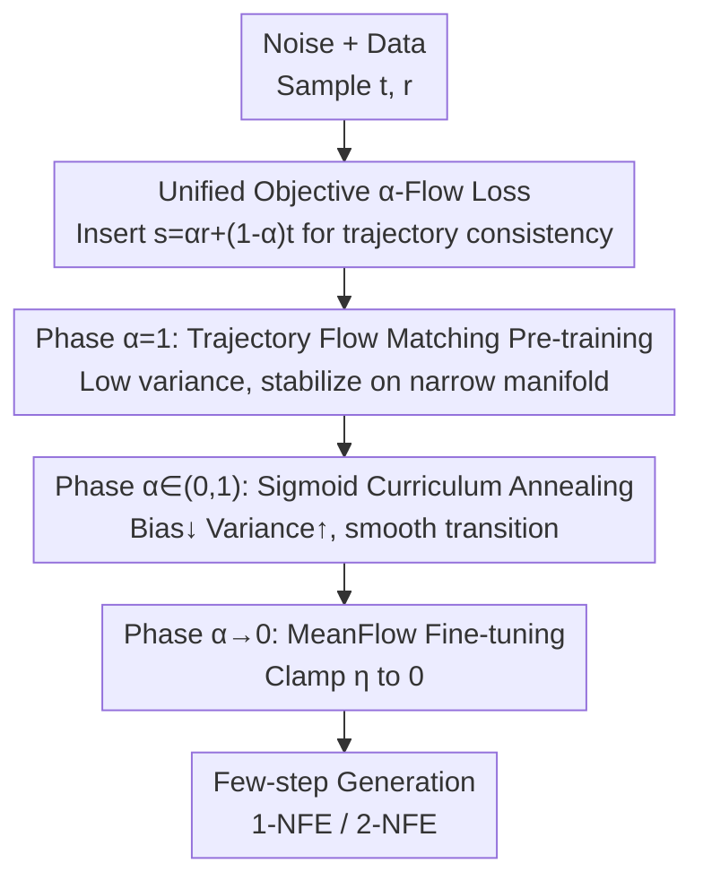

# AlphaFlow: Understanding and Improving MeanFlow Models

**Conference**: ICLR2026  
**OpenReview**: [https://openreview.net/forum?id=adacb4JTIv](https://openreview.net/forum?id=adacb4JTIv)  
**Code**: https://github.com/snap-research/alphaflow  
**Area**: Diffusion Models / Few-step Generation  
**Keywords**: MeanFlow, Flow Matching, Few-step Generation, Curriculum Learning, Trajectory Consistency

## TL;DR
This paper decomposes the training objective of MeanFlow into two terms: "Trajectory Flow Matching + Trajectory Consistency." It identifies that the strong negative correlation between their gradients leads to optimization conflicts. Consequently, the authors propose the $\alpha$-Flow objective family, which unifies Flow Matching, Shortcut, and MeanFlow. Using a curriculum strategy that anneals $\alpha$ from 1 to 0, they achieve a 1-NFE FID of 2.58 and a 2-NFE FID of 2.15 on ImageNet-256 using pure DiT trained from scratch.

## Background & Motivation
**Background**: Diffusion models are the dominant paradigm for visual generation but suffer from slow sampling, typically requiring dozens or hundreds of denoising steps. The community has explored various "few-step generation" methods: early work relied on distilling multi-step pre-trained models, while Consistency Models (CM) achieved few-step generation from scratch. Recently, MeanFlow improved training stability and integration with classifier-free guidance, significantly narrowing the gap between few-step and multi-step models trained from scratch, becoming one of the strongest frameworks in this category.

**Limitations of Prior Work**: While MeanFlow is effective in practice, **the reasons for its success remain unclear**. A particularly counter-intuitive phenomenon is that MeanFlow sets 75% of samples to the "boundary case" of $r=t$ during training—which degrades exactly to standard Flow Matching supervision. Since the goal is to learn the average velocity on the interval $[r,t]$ for large-stride sampling, why spend most of the computation on this boundary case? This heuristic lacks explanation, hindering further improvements and the design of stronger few-step models.

**Key Challenge**: Through algebraic transformation, the authors reveal that the MeanFlow loss is equivalent to two components: **Trajectory Flow Matching** $L_\text{TFM}$ and **Trajectory Consistency** $L_\text{TC}$. Gradient analysis shows these two are **strongly negatively correlated** during training (cosine similarity often below $-0.4$), causing them to "fight" each other during joint optimization and slowing convergence. The criticized $r=t$ Flow Matching supervision (denoted as $L_{\text{FM}'}$) serves as a remedy: it is a subset of $L_\text{TFM}$ that directly reduces $L_\text{TFM}$ and only takes effect at $L_\text{TC}=0$, minimizing conflict with the consistency gradient. The cost, however, is that 75% of compute is spent on this auxiliary boundary supervision.

**Goal**: To optimize $L_\text{TFM}$ within the MeanFlow objective more efficiently without the heavy computational overhead of boundary supervision.

**Key Insight**: Since the optimal solution manifold for $L_\text{TFM}$ is narrow while for $L_\text{TC}$ it is broad, they should not be optimized simultaneously from the start. The model should first stabilize on the narrow $L_\text{TFM}$ manifold before smoothly transitioning to the full MeanFlow objective.

**Core Idea**: The authors propose $\alpha$-Flow—an objective family that unifies Trajectory Flow Matching, Shortcut Models, and MeanFlow using a single parameter $\alpha$. By using curriculum learning to anneal $\alpha$ from 1 to 0, the training transitions smoothly from "high-bias, low-variance" Flow Matching to "low-bias, high-variance" MeanFlow, resolving the conflict between objectives and achieving better convergence.

## Method

### Overall Architecture
$\alpha$-Flow does not modify the network architecture (it uses the pure DiT from MeanFlow) but replaces the training objective. The core is the loss $L_\alpha$ with a continuous parameter $\alpha\in(0,1]$: it inserts an intermediate time $s=\alpha r+(1-\alpha)t$ between $t$ and the endpoint $r$, enforcing consistency between the large jump $t\to r$ and "jumping to $s$ then continuing." This single $\alpha$ aligns multiple objectives along a continuous spectrum: $\alpha=1$ is Trajectory Flow Matching, $\alpha=1/2$ is the Shortcut Model, and the gradient as $\alpha\to0$ converges to MeanFlow. Training follows this spectrum: early stages use $\alpha=1$ with low-variance Flow Matching to establish the noise-to-data mapping; the middle stage uses a sigmoid schedule to anneal $\alpha$ from 1 to 0; the final stage uses $\alpha\to0$ for MeanFlow fine-tuning. This avoids gradient conflicts at the start and significantly reduces the need for the 75% boundary supervision.

### Key Designs

**1. Decomposability of the MeanFlow Objective: Explaining "Why it works"**

The authors first rewrite the MeanFlow loss $L_\text{MF}=\mathbb{E}\big[\|u_\theta(z_t,r,t)-v_t+(t-r)\tfrac{du_{\theta^-}}{dt}\|_2^2\big]$ via algebraic expansion as:
$$L_\text{MF}=\underbrace{\mathbb{E}\big[\|u_\theta(z_t,r,t)-v_t\|_2^2\big]}_{\text{Trajectory Flow Matching }L_\text{TFM}}+\underbrace{\mathbb{E}\big[2(t-r)\,u_\theta^\top\tfrac{du_{\theta^-}}{dt}\big]}_{\text{Trajectory Consistency }L_\text{TC}}+C.$$
$L_\text{TFM}$ is Flow Matching with an additional input $r$; $L_\text{TC}$ is a continuous consistency loss reweighted by $(t-r)$ **without boundary conditions**. This decomposition explains two mysteries: first, why MeanFlow doesn't collapse to a trivial solution (unlike standard CM without boundary conditions)—because $L_\text{TFM}$ implicitly provides them; second, $L_\text{TC}$ has a massive solution manifold, which pulls the optimization toward a broad space, distracting from the narrow intersection required by $L_\text{TFM}$.

**2. Gradient Conflict Diagnosis: Identifying the True Role of 75% Boundary Supervision**

With this decomposition, the authors measured the cosine similarity of gradients using DiT-B/2 on ImageNet over 400K steps. They found $\cos(\nabla L_\text{TFM},\nabla L_\text{TC})$ to be strongly negatively correlated ($<-0.4$) for over 95% of training time, confirming that joint optimization is inherently difficult. Comparing the $r=t$ Flow Matching supervision $L_{\text{FM}'}$, they found it is a slice of $L_\text{TFM}$ that directly reduces $L_\text{TFM}$. Crucially, it only acts where $L_\text{TC}=0$, so $\cos(\nabla L_{\text{FM}'},\nabla L_\text{TC})$ is consistently higher than $\cos(\nabla L_\text{TFM},\nabla L_\text{TC})$, causing less interference. Conclusion: $L_{\text{FM}'}$ is a **low-conflict proxy** for $L_\text{TFM}$—explaining why MeanFlow's "counter-intuitive 75% setting" works, despite its inefficiency.

**3. $\alpha$-Flow Unified Objective: A Continuous Spectrum of Few-step Models**

The $\alpha$-Flow loss is defined as:
$$L_\alpha(\theta)=\mathbb{E}\Big[\alpha^{-1}\big\|u_\theta(z_t,r,t)-\big(\alpha\,\tilde v_{s,t}+(1-\alpha)\,u_{\theta^-}(z_s,r,s)\big)\big\|_2^2\Big],$$
where $s=\alpha r+(1-\alpha)t$ is the intermediate time interpolated between $t$ and $r$, $z_s=z_t+(t-s)\tilde v_{s,t}$, and $\tilde v_{s,t}$ is the "shift velocity" used to estimate $z_s$ from $z_t$. Intuitively, it enforces that the large jump $t\to r$ is consistent with two smaller jumps through $s$. The unification theorem states: when $\tilde v_{s,t}=v_t$, $\alpha=1$ yields $L_\text{TFM}$, and the gradient as $\alpha\to0$ converges to $\nabla L_\text{MF}$; when $\tilde v_{s,t}=u_{\theta^-}(z_t,s,t)$, $\alpha=1/2$ yields the Shortcut Model. If $z_0$ parameterization is used and $r\equiv0$, it covers discrete/continuous Consistency Training. Thus, $\alpha$ becomes a unified dial controlling the relative position of $s$, placing seemingly different methods on the same axis.

**4. Curriculum Annealing Schedule + Clamping: From High Bias to High Variance**

Training proceeds in three phases: ① **Trajectory Flow Matching Pre-training ($\alpha=1$)**—Fast establishment of noise-to-data mapping using a low-variance objective; ② **$\alpha$-Flow Transition ($\alpha\in(0,1)$)**—The parameter $\alpha$ is smoothly decreased from 1 to 0 using a sigmoid schedule. Theoretically, the optimal solution shifts from $L_\text{TFM}$ to $L_\text{MF}$ while the gradient variance increases, guiding the model from "high-bias, low-variance" to "low-bias, high-variance"; ③ **MeanFlow Fine-tuning ($\alpha\to0$)**—Focusing entirely on MeanFlow, with reduced reliance on boundary supervision due to the pre-optimized $L_\text{TFM}$. The schedule is $\alpha=1-\text{Sigmoid}_{k_s\Rightarrow k_e,\gamma,\eta}(k)$ with temperature $\gamma=25$ and a clamp value $\eta=5\times10^{-3}$.

### Loss & Training
In addition to the schedule: **Target velocity** $\tilde v_{s,t}$ defaults to $v_t$ without EMA for $\theta^-$; **Adaptive weights** follow MeanFlow with an equivalent weight $\omega=\alpha/(\|\Delta\|_2^2+c)$ where $c=10^{-3}$; **CFG** sets $\tilde v_{s,t}$ as a weighted combination of conditional and unconditional predictions; **Sampling** uses ODE solvers for DiT-B/2 and consistency sampling for DiT-XL/2. The $\alpha=0$ branch uses JVP to compute $du/dt$ for MeanFlow, while the $\alpha>0$ branch uses two-point estimation.

## Key Experimental Results

### Main Results
ImageNet-1K 256×256, pure DiT trained from scratch, 1/2-NFE generation (lower FID is better):

| Method | Params | Epochs | 1-NFE FID | 2-NFE FID |
|------|--------|--------|-----------|-----------|
| MeanFlow-XL/2 | 676M | 240 | 3.47 | 2.46 |
| FACM-XL/2 (repro) | 675M | 240×2 | 6.59 | 4.73 |
| **α-Flow-XL/2** | 676M | 240 | **2.95** | **2.34** |
| **α-Flow-XL/2+** | 676M | 240+60 | **2.58** | **2.15** |

With the same 240 epochs, $\alpha$-Flow-XL/2 improves 1-NFE FID by ~15% over MeanFlow-XL/2. $\alpha$-Flow-XL/2+ sets a new SOTA for pure DiT trained from scratch. With class-balanced sampling, 2-NFE FID reaches 1.95, outperforming FACM's 2.07 using only 23% of its training epochs.

### Ablation Study

| Configuration | 1-NFE FID | Description |
|------|-----------|------|
| Constant₀ (≈MeanFlow baseline) | 44.4 | No annealing, direct $\alpha=0$ |
| Sigmoid₀→₄₀₀K (Full schedule) | 40.0 | Longer, smoother transitions are better |
| Sigmoid₁₅₀K→₂₅₀K | 41.3 | Longer Flow Matching pre-training is better |
| FM Ratio 75% + Constant₀ | 43.1 | MeanFlow-style high boundary supervision |
| FM Ratio 25% + Sigmoid₀→₄₀₀K | 40.0 | $\alpha$-Flow performs better even with low FM ratio |

(B/2 scale, lower is better)

### Key Findings
- **Pre-training pays off**: Delaying the start of annealing ($k_s$) monotonically improves metrics, confirming that prioritizing $L_\text{TFM}$ early is more efficient than optimizing MeanFlow directly.
- **Smoothness is key**: Increasing the transition length while fixing the midpoint consistently improves quality, indicating the importance of gradually shifting the objective bias.
- **Reduced dependency on boundary supervision**: $\alpha$-Flow outperforms MeanFlow across all FM ratios, with peak performance at lower ratios than MeanFlow's 75%.
- The method also proved effective in video generation (Kinetics-700) measured by FVD.

## Highlights & Insights
- **"Explain then Improve" Paradigm**: Beyond performance gains, the paper's value lies in decomposing MeanFlow into $L_\text{TFM}+L_\text{TC}$ and using gradient conflict to explain its mechanics. The solution emerges naturally from this explanation.
- **Single-Parameter Unification**: Using $\alpha$ to place Flow Matching, Shortcut, and MeanFlow on a continuous axis allows for "interpolation between methods." Curriculum annealing is essentially a journey along this axis.
- **Gradient Conflict to Curriculum Mapping**: Mapping "negative correlation between objectives" to a "high-bias/low-variance → low-bias/high-variance" curriculum is an elegant way to convert optimization difficulty into a training schedule.

## Limitations & Future Work
- Experiments primarily focused on ImageNet-256 and Kinetics-700 with pure DiT; performance on higher resolutions or text-to-image conditions remains to be verified.
- The schedule introduces hyperparameters ($k_s, k_e, \gamma, \eta$). While defaults are provided, the optimal schedule might change with data scale.
- The $\alpha\to0$ branch relies on JVP for $du/dt$, which can be a scaling or efficiency bottleneck in some frameworks.
- The mechanism behind the "optimal $\eta$" empirical success (performance rising then falling as it approaches 0) is not yet fully theorized.

## Related Work & Insights
- **vs MeanFlow**: MeanFlow relies on heuristic 75% boundary supervision; Ours proves this is equivalent to TFM + TC and uses curriculum annealing to achieve better convergence with lower FM ratios, gaining ~15% in performance.
- **vs Shortcut Model**: Shortcut is a special case of $\alpha$-Flow with $\alpha=1/2$, $r=0$, and $\tilde v_{s,t}=u_{\theta^-}$; $\alpha$-Flow allows continuous movement along the $\alpha$ axis.
- **vs Consistency Models (CT)**: Unlike CT, which needs careful time-step scheduling, $\alpha$-Flow fixes $s$ via $\alpha$ as soon as $t, r$ are sampled, avoiding complex partitioning.

## Rating
- Novelty: ⭐⭐⭐⭐⭐ Solid decomposition + unified framework + curriculum strategy.
- Experimental Thoroughness: ⭐⭐⭐⭐ Extensive ImageNet/Video results, though restricted to class-conditioned tasks.
- Writing Quality: ⭐⭐⭐⭐⭐ Excellent narrative flow from explanation to improvement.
- Value: ⭐⭐⭐⭐⭐ Sets new SOTA for from-scratch DiT few-step generation with an open-source, transferable analysis framework.

<!-- RELATED:START -->

## Related Papers

- [\[CVPR 2026\] Understanding, Accelerating, and Improving MeanFlow Training](../../CVPR2026/image_generation/understanding_accelerating_and_improving_meanflow_training.md)
- [\[ICLR 2026\] Decoupled MeanFlow: Turning Flow Models into Flow Maps for Accelerated Sampling](decoupled_meanflow_turning_flow_models_into_flow_maps_for_accelerated_sampling.md)
- [\[ICLR 2026\] Constantly Improving Image Models Need Constantly Improving Benchmarks](constantly_improving_image_models_need_constantly_improving_benchmarks.md)
- [\[AAAI 2026\] MP1: MeanFlow Tames Policy Learning in 1-step for Robotic Manipulation](../../AAAI2026/image_generation/mp1_meanflow_tames_policy_learning_in_1-step_for_robotic_manipulation.md)
- [\[ICLR 2026\] AlignFlow: Improving Flow-based Generative Models with Semi-Discrete Optimal Transport](alignflow_improving_flow-based_generative_models_with_semi-discrete_optimal_tran.md)

<!-- RELATED:END -->
