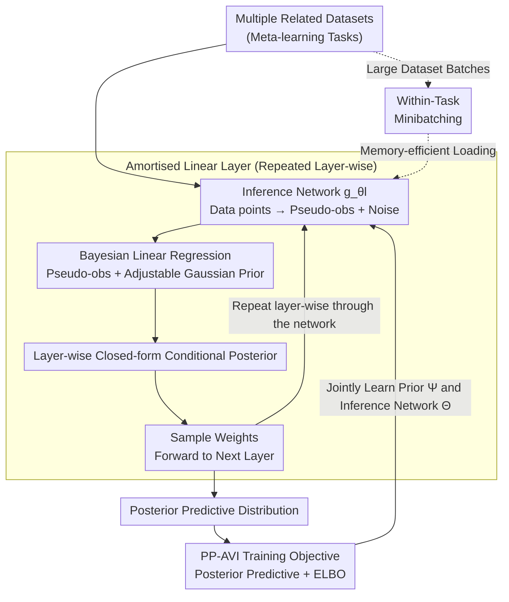

# Amortising Inference and Meta-Learning Priors in Neural Networks (BNNP)

**Conference**: ICLR 2026  
**arXiv**: [2602.08782](https://arxiv.org/abs/2602.08782)  
**Code**: Yes  
**Area**: Bayesian Deep Learning  
**Keywords**: Bayesian neural network, neural process, meta-learning, amortised inference, prior learning

## TL;DR
Proposes BNNP (Bayesian Neural Network Process), a neural process that treats BNN weights as latent variables and the BNN itself as the decoder. By performing layer-wise amortised variational inference to jointly learn BNN priors and inference networks across multiple datasets, it addresses for the first time whether approximate inference still matters under a good prior—the answer is "yes," there is no free lunch.

## Background & Motivation
**Background**: BNN theory is elegant, but prior selection is a core difficulty—weights lack interpretability, and convenient priors (isotropic Gaussians) collapse BNNs into Gaussian processes, losing hierarchical representation learning capabilities. Neural processes meta-learn implicit priors but cannot be evaluated or sampled.

**Limitations of Prior Work**: (1) It is unknown what constitutes a "good prior" for BNNs; (2) It is unclear whether existing approximate inference methods (MFVI, HMC, etc.) are sufficient even with a good prior; (3) Neural processes cannot perform within-task minibatching (leading to memory explosion on large datasets).

**Key Challenge**: Studying BNN behavior under reasonable priors → requires good priors first → good priors must be learned from data → learning priors requires good inference methods → creating a cycle.

**Goal**: To simultaneously solve prior learning and amortised inference: meta-learning BNN priors from multiple related datasets while obtaining high-quality per-dataset posteriors.

**Key Insight**: Reformulate BNN inference as a neural process where the latent variables are the weights and the decoder is the network itself parameterized by these weights. Layer-wise conditional posteriors are solved in closed form via Bayesian linear regression.

**Core Idea**: BNN weights = neural process latent variables, BNN itself = decoder; jointly learning the prior and amortised inference from multi-task data.

## Method

### Overall Architecture
BNNP reformulates Bayesian Neural Network inference as a neural process: the latent variables are the weights of each layer, and the decoder is the network itself parameterized by these weights. Specifically, for each layer of the BNN, an inference network maps data points to "pseudo-likelihood" parameters (pseudo-observations + noise levels), which undergo a closed-form Bayesian linear regression with the layer's Gaussian prior to obtain the conditional posterior for that layer. During inference, weights are sampled from the first layer, forward-propagated to the next, and the next layer's posterior is computed, proceeding layer-by-layer through the entire network. Prior parameters and inference network parameters are jointly optimized across multiple related datasets—thus learning the BNN prior while obtaining an amortised inferer capable of outputting a posterior in a single forward pass.

### Key Designs

**1. Amortised Linear Layer: Enabling closed-form posteriors for hidden layers**

The core difficulty of BNNs is that intermediate weights have no interpretable meaning and their posteriors cannot be computed precisely. This component transforms the problem into intra-layer Bayesian linear regression: the inference network $g_{\theta_l}$ maps each data point $(x_n, y_n)$ to a set of pseudo-observations $y_n^l$ and corresponding noise levels $\sigma_{n,d}^l$, essentially "faking" a batch of noisy regression targets for that layer. With these pseudo-targets and a Gaussian prior $p_{\psi_l}(W^l)$, the conditional posterior $q(W^l \mid W^{1:l-1}, \mathcal{D})$ yields a closed-form solution. The benefit is that inference within the layer is exact (a closed-form posterior approximating the full BNN posterior), while the inference itself is amortised—the inference network provides the posterior in one forward pass without requiring per-dataset iterative optimization.

**2. PP-AVI Training Objective: Learning both prior and inferer effectively**

Amortised layers alone are insufficient; prior parameters $\Psi$ and inference network parameters $\Theta$ must be learned together. PP-AVI (posterior-predictive amortised VI) uses an objective combining two terms:

$$\mathcal{L}_{PP\text{-}AVI} = \log q(Y_t \mid \mathcal{D}_c, X_t) + \mathcal{L}_{ELBO}(\mathcal{D}_c)$$

The first term is the posterior predictive density, responsible for maximizing prediction quality and driving the prior to learn to explain multi-task data; the second term is the ELBO, responsible for the accuracy of the approximate inference itself. This clear division of labor prevents scenarios where predictions are optimized but inference degrades. Proposition 1 in the paper proves that in the limit of an infinite number of datasets, this objective satisfies three desiderata (good prior, good posterior, good prediction).

**3. Within-Task Minibatching: Inference for large datasets**

Almost all existing neural processes must consume the entire context set at once, causing memory explosion with large datasets. BNNP bypasses this using sequential Bayesian inference: splitting a dataset into small batches and updating layer-wise posteriors batch-by-batch—the posterior calculated from the previous batch serves as the prior for the next update. Since Bayesian updates are additive, the prediction results after batched processing are identical to full-batch processing, providing a "memory-efficient without accuracy loss" capability that is unique compared to other neural processes.

**4. Adjustable Prior Flexibility: Preventing prior overfitting in small meta-datasets**

When the number of related datasets for meta-learning is small, allowing the priors of all weights to be learnable can easily lead to overfitting. BNNP allows learning the priors for only a subset of weights while keeping others fixed. Since the inference network parameters and prior parameters are decoupled, the degrees of freedom of the prior can be controlled independently, finding a balance between meta-dataset scale and prior expressivity—experiments show that this partially trainable prior outperforms fully trainable neural processes in small meta-dataset settings.

### Loss & Training
Training utilizes the PP-AVI objective (posterior predictive term + ELBO term) to jointly optimize the prior and the inference network across multi-task datasets, following a standard meta-learning paradigm; the inference network employs a LoRA-style parameterization.

## Key Experimental Results

### Approximate Posterior Quality (KL Divergence ↓)

| Method | KL(q || p(W|D)) |
|------|----------------|
| MFVI | High (esp. low noise) |
| FCVI | Very High |
| GIVI | Medium |
| **BNNP (amortised)** | **Lowest** |
| **BNNP (per-task)** | **Lowest** |

### Prior Learning Ability

| Data Generation Process | Prior Sample Quality |
|------------|-----------|
| Sawtooth function | Almost indistinguishable between real vs. learned prior |
| Heaviside function | Multimodal prior successfully learned |
| MNIST pixel regression | Recognizable digits, supports super-resolution |
| ERA5 precipitation | Real-world prior is effective |

### Key Findings
- **Good Prior ≠ Free Lunch**: Even with a learned prior, performance differences between different approximate inference methods remain significant. HMC still performs best under a good prior, indicating that approximate inference quality always matters.
- Gaussian priors are sufficient to generate highly complex functional priors (including multimodal Heaviside)—prior design is not as difficult as previously imagined.
- BNNP's partially trainable priors outperform fully trainable neural processes in small meta-dataset settings—preventing prior overfitting.
- Within-task minibatching enables BNNP to handle large datasets—a new capability relative to other neural processes.

## Highlights & Insights
- **Unified perspective of "BNN weights as neural process latent variables"**: Elegantly connects two different fields (BDL + probabilistic meta-learning).
- **First empirical answer to a fundamental BDL question**: Does a good prior eliminate the need for a good inference method? The answer is "no"—this provides critical guidance for the BDL community.
- **Unexpected flexibility of Gaussian priors**: Simple Gaussian weight priors, when properly learned, can produce extremely rich functional priors—overturning the assumption that complex prior structures are required.

## Limitations & Future Work
- Inference complexity grows disadvantageously with network width—currently validated primarily on small BNNs.
- Requires multiple related datasets to learn the prior—the single-dataset scenario remains unsolved.
- BNAM (Attention version) breaks consistency (no longer a valid stochastic process)—theory is incomplete.
- Experiments focused mainly on 1D/2D regression tasks; verification on higher-dimensional complex tasks is needed.

## Related Work & Insights
- **vs Neural Process family**: BNNP’s latent variables are the decoder weights themselves (rather than abstract representations), allowing the prior to be explicitly evaluated and sampled.
- **vs MFVI / HMC**: The layer-wise amortised inference quality provided by BNNP is close to HMC and far superior to MFVI.
- **vs Functional Space Priors (Cinquin et al.)**: Functional space priors often collapse into GPs, whereas BNNP’s weight-space prior maintains the hierarchical representation capabilities of BNNs.

## Rating
- Novelty: ⭐⭐⭐⭐⭐ Reshaping BNNs as a unified neural process framework is highly novel and profound.
- Experimental Thoroughness: ⭐⭐⭐⭐⭐ 4 research questions, synthetic + real data, comparison with multiple VI methods.
- Writing Quality: ⭐⭐⭐⭐⭐ Rigorous theoretical derivation, engaging narrative (core "no free lunch" message).
- Value: ⭐⭐⭐⭐⭐ Foundational contribution to the BDL field—provides a new tool for studying BNN behavior.

<!-- RELATED:START -->

## Related Papers

- [\[ICLR 2026\] Scalable Training for Vector-Quantized Networks with 100% Codebook Utilization](scalable_training_for_vector-quantized_networks_with_100_codebook_utilization.md)
- [\[ICLR 2026\] PixNerd: Pixel Neural Field Diffusion](pixnerd_pixel_neural_field_diffusion.md)
- [\[ICLR 2026\] NeuralOS: Towards Simulating Operating Systems via Neural Generative Models](neuralos_towards_simulating_operating_systems_via_neural_generative_models.md)
- [\[CVPR 2026\] PhyCo: Learning Controllable Physical Priors for Generative Motion](../../CVPR2026/image_generation/phyco_learning_controllable_physical_priors_for_generative_motion.md)
- [\[ICML 2025\] ContinualFlow: Learning and Unlearning with Neural Flow Matching](../../ICML2025/image_generation/continualflow_learning_and_unlearning_with_neural_flow_matching.md)

<!-- RELATED:END -->
