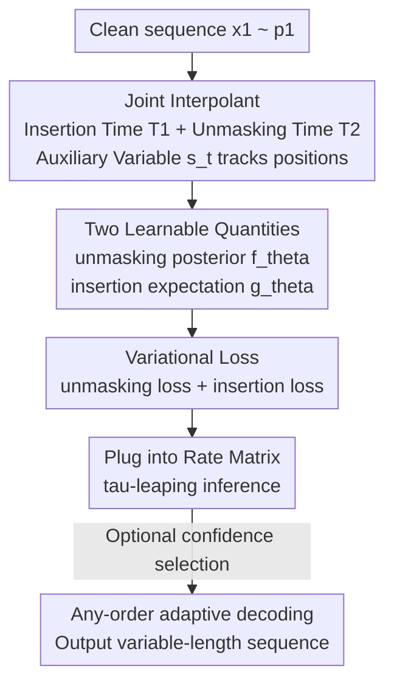

# Any-Order Flexible Length Masked Diffusion

**Conference**: ICLR 2026  
**OpenReview**: [https://openreview.net/forum?id=ttuNnMRI6H](https://openreview.net/forum?id=ttuNnMRI6H)  
**Code**: https://github.com/brianlck/FlexMDM  
**Area**: Discrete Diffusion / Language Model Pre-training  
**Keywords**: Masked Diffusion, Variable-length Generation, Any-order, Stochastic Interpolant, Continuous-time Markov Chain

## TL;DR
This paper proposes FlexMDM, a masked diffusion model capable of **inserting new tokens to model variable-length sequences** during generation. It theoretically preserves the "any-order parallel decoding" capability of masked diffusion. While maintaining perplexity parity with fixed-length masked diffusion, FlexMDM achieves significantly better length distribution fitting. Furthermore, it requires only 16 H100 GPUs for three days to transform a pre-trained LLaDA-8B into a variable-length model, showing clear improvements on GSM8K (58%→67%) and code completion (52%→65%).

## Background & Motivation
**Background**: In the discrete domain (text, code), Masked Diffusion Models (MDM) have emerged as powerful alternatives to Auto-Regressive (AR) models. MDM starts from an all-mask sequence and recovers tokens in **any order and in parallel**. This non-left-to-right decoding facilitates faster inference and strong performance in "non-causal" tasks like planning, reasoning, and code infilling. LLaDA-8B is a large-scale MDM with released weights.

**Limitations of Prior Work**: MDM suffers from a structural flaw—it **can only generate fixed-length sequences**. Because its base distribution $p_0$ is a point mass distribution of "all-mask sequences of length $L$," the denoising process merely reveals masks at fixed $L$ positions. **The number of positions remains constant, making it impossible to insert new tokens**. To generate variable-length answers, sequences must be padded to a maximum length beforehand, which wastes computation and distorts the length distribution.

**Key Challenge**: Variable-length modeling and any-order decoding seem difficult to reconcile. A naive approach would be to "both delete and mask tokens from a clean sequence" to construct an interpolation process. However, once insertion/deletion is allowed, **token indices drift**, making the rate matrix impossible to write in closed form, thus preventing neural network training. This is the fundamental reason why previous MDMs avoided variable-length generation.

**Goal**: Enable the model to insert tokens during sampling to model arbitrary length distributions while preserving the any-order generation capability of MDM, with theoretical guarantees that samples come from the true distribution under perfect training.

**Key Insight**: By re-examining MDM within the **stochastic interpolant / Continuous-time Markov Chain (CTMC)** framework, the authors found that adding an **explicit auxiliary variable to track token positions** allows for a closed-form rate matrix even under index drift.

**Core Idea**: Replace MDM's single unmasking process with a two-step **joint interpolant** ("insert mask, then unmask"). Beyond the original unmasking posterior, the model only needs to learn an additional scalar "insertion expectation" to achieve both variable-length modeling and any-order decoding.

## Method

### Overall Architecture
The generation process of FlexMDM is: **starting from an empty string, it simultaneously inserts mask tokens into the sequence and reveals existing masks into real tokens until $t=1$, resulting in a complete variable-length sequence** (contrasting MDM which starts from a "fixed-length all-mask" and only unmasks).

To make this process trainable and samplable, the authors follow the MDM "interpolant + CTMC" recipe but must solve two difficulties: (a) the base distribution must be easy to sample; (b) the rate matrix must have a closed form. FlexMDM connects these via three components: defining a **joint interpolant** to describe how sequences grow from empty to data (using $s_t$ to resolve index drift); deriving the CTMC which is fully characterized by two quantities—the **unmasking posterior** $f_\theta$ and the **insertion expectation** $g_\theta$; and training these via a variational loss. Inference uses $\tau$-leaping discrete simulation with the learned $(f_\theta, g_\theta)$, supporting any-order adaptive decoding.

### Key Designs

**1. Joint Interpolant: Resolving "Index Drift" with Auxiliary Position Variables**

This is the theoretical cornerstone. MDM's interpolant independently samples an unmasking time $T^i$ for fixed-length sequence coordinates. FlexMDM extends this: for each coordinate $i$, it independently samples a **pair** of times—insertion time $T_1^i$ and unmasking time $T_2^i$ (enforcing $T_1^i < T_2^i$):

$$x_t^i=\begin{cases}\text{(empty)},& 0<t<T_1^i\\ m,& T_1^i\le t<T_2^i\\ x_1^i,& T_2^i\le t\le 1\end{cases}$$

Every token undergoes three states: "non-existent → mask → real." The rates are controlled by insertion schedule $\alpha_t$ and unmasking schedule $\beta_t$. The key trick is introducing the auxiliary variable $s_t=\{i\mid T_1^i\le t\}$, the set of indices in the original $x_1$ of tokens not yet deleted at time $t$. With $s_t$ mapping each position in the short sequence $x_t$ back to its original index in $x_1$, **index drift is explicitly accounted for**, allowing for a closed-form rate matrix.

**2. Insertion Expectation: Learning a Single Additional Scalar**

To characterize the CTMC, the authors prove (Proposition 1) that only two quantities are needed: the **unmasking posterior** $f_\theta(x,t)[i]\in\Delta(\Sigma)$ (the posterior of the clean token at masked position $i$) and the new **insertion expectation** $g_\theta(x,t)[i]\in\mathbb{R}_{\ge0}$, which predicts **how many tokens still need to be inserted** between adjacent tokens $x^{i-1}$ and $x^i$. Both are trained with a unified variational loss:

$$\mathcal{L}_\theta=-\int_0^1\mathbb{E}\Big[\underbrace{\tfrac{\dot\beta_t}{1-\beta_t}\textstyle\sum_{x_t^i=m}\log f_\theta[i,x_1^{s_t[i]}]}_{\text{unmasking loss}}+\underbrace{\tfrac{\dot\alpha_t}{1-\alpha_t}\textstyle\sum_i \phi(s_t[i]-s_t[i-1]-1,\ g_\theta[i])}_{\text{insertion loss}}\Big]dt$$

where $\phi(x,y)=y-x-x\log\frac{x}{y}$ is the scalar Bregman divergence. The loss ensures $f_\theta$ and $g_\theta$ converge to their true values. The design's elegance lies in $g_\theta$ being just **one scalar per position**, which is much cheaper to train than modeling a full insertion distribution, facilitating the reuse of pre-trained MDM weights.

**3. Any-Order Adaptive Inference: Sampling Guarantee for Arbitrary Order**

Proposition 3 proves that FlexMDM inherits MDM's ability to **reveal positions adaptively based on confidence** (rather than strictly following the training schedule): as long as (i) unmasked tokens are sampled from the true posterior and (ii) insertions follow the true rate matrix, the final sample comes from $p_1$. The technical key is that the **true unmasking posterior does not depend on the unmasking schedule $\beta_t$**. During inference, $\tau$-leaping is used: in each time window, mask positions are revealed in parallel, and the number of insertions is sampled via a Poisson distribution parameterized by $g_\theta$.

**4. One-Click Conversion from MDM: Low-Cost Scaling to 8B**

Since FlexMDM shares the **unmasking posterior core component** with MDM, converting a pre-trained MDM is an "add-on" rather than a "retrain": starting from LLaDA-Base, one only needs to (a) add time embedding layers and a scalar softplus head for $g_\theta$, and (b) attach LoRA adapters (approx. 400M parameters). Using ~13.1B tokens and 16 H100s for three days, the model learns to generate variable-length sequences, proving the efficiency of the "scalar insertion expectation" design.

### Loss & Training
The variational loss $\mathcal{L}_\theta$ (unmasking + insertion) is minimized. The backbone is a DiT (bidirectional Transformer) with two heads: a standard posterior head for $f_\theta$ and a scalar softplus head for $g_\theta$. Linear schedules $\alpha_t = \beta_t = t$ are used.

## Key Experimental Results

### Main Results
**Pre-training**: 175M FlexMDM vs MDM on OpenWebText (max length 1024, 500K steps).

| Evaluation | Setting | FlexMDM | MDM | Notes |
|------------|---------|---------|-----|-------|
| Gen. Perplexity | Over steps | Parity with MDM | Baseline | Complex loss does not hurt fluency |
| Length Fitting | 256 steps | Close to true dist | Distorted at 1024 steps | FlexMDM has higher fidelity |

**8B Scale**: Converted from LLaDA-Base, zero-shot evaluation after IFT.

| Task | Metric | FlexMDM | LLaDA-Base | Gain |
|------|--------|---------|------------|------|
| GSM8K | Pass@1 | 67% | 58% | +9 |
| HumanEval (Infilling) | Pass Rate | 65% | 52% | +13 |

FlexMDM continues to improve with more sampling steps, whereas LLaDA plateaus, indicating FlexMDM benefits more from increased compute.

### Ablation Study

| Config / Task (41x41 Maze Planning, $K$ subgoals) | Success Rate | Notes |
|----------------------------------------------------|--------------|-------|
| Easy ($K=2$) — FlexMDM | 92.3% | vs MDM 68.4% |
| Medium ($K=7$) — FlexMDM | 90.4% | vs MDM 29.3% |
| Hard ($K=12$) — FlexMDM | 90.0% | vs MDM 24.2% (approx. 60% gap) |

### Key Findings
- **Length modeling is the primary advantage**: MDM fails to calibrate length even at 1024 steps, while FlexMDM fits at 256 steps because it truly inserts tokens rather than relying on padding.
- **Subgoal planning highlights fixed-length weakness**: In maze tasks, MDM must fix subgoal positions *a priori*, while FlexMDM inserts masks between subgoals.
- **Adaptive decoding outperforms vanilla**: Randomized unmasking based on confidence significantly improves downstream performance.

## Highlights & Insights
- **The "insert mask then reveal" decomposition is ingenious**: It reduces variable-length modeling to predicting a single scalar per position, preserving closed-form rate matrices while allowing cheap transfer of MDM weights.
- **Auxiliary variable $s_t$ is the key trick**: Instead of avoiding index drift, it accounts for it explicitly.
- **Insight on unmasking schedule**: The independence of the unmasking posterior from $\beta_t$ explains why masked diffusion can support adaptive decoding.
- **Aligning with human writing**: FlexMDM moves closer to human-like editing (insertion/reordering) rather than filling pre-determined slots.

## Limitations & Future Work
- **Evaluation challenges**: MDM and FlexMDM use different training objectives, making direct likelihood comparison difficult; performance is validated via perplexity and downstream tasks.
- **Insertion only**: The current interpolant is a one-way "insert then reveal" process and does not model **deletion or rewriting** during generation.
- **IFT dependence**: The 8B experiments still depend on task-specific data pairs.
- **Future directions**: Incorporating token deletion into the joint interpolant for true "edit-based" diffusion.

## Related Work & Insights
- **vs MDM / LLaDA**: MDM relies on padding for variable length; FlexMDM enables native variable length with a single additional head.
- **vs Stochastic Interpolant / Flow Matching**: Extends the framework to discrete space with a joint interpolant and auxiliary variables for length.
- **vs Parallel Works**: Compared to Wu et al. (2025b) which uses auxiliary "expand" tokens, FlexMDM provides a theoretically grounded any-order sampling algorithm.

## Rating
- Novelty: ⭐⭐⭐⭐⭐ First to support native token insertion in masked diffusion while maintaining any-order properties.
- Experimental Thoroughness: ⭐⭐⭐⭐ Covers pre-training, planning, and 8B scaling, though lacks direct likelihood metrics due to different objectives.
- Writing Quality: ⭐⭐⭐⭐⭐ Clear derivation from CTMC to FlexMDM with technical propositions.
- Value: ⭐⭐⭐⭐⭐ Offers a low-cost paradigm to upgrade existing large MDMs to variable-length models.

<!-- RELATED:START -->

## Related Papers

- [\[ICLR 2026\] Any-step Generation via N-th Order Recursive Consistent Velocity Field Estimation](any-step_generation_via_n-th_order_recursive_consistent_velocity_field_estimatio.md)
- [\[ICML 2026\] Esoteric Language Models: A Family of Any-Order Diffusion LLMs](../../ICML2026/image_generation/esoteric_language_models_a_family_of_any-order_diffusion_llms.md)
- [\[ICML 2025\] FlexTok: Resampling Images into 1D Token Sequences of Flexible Length](../../ICML2025/image_generation/flextok_resampling_images_into_1d_token_sequences_of_flexible_length.md)
- [\[ICLR 2026\] Partition Generative Modeling: Masked Modeling Without Masks](partition_generative_modeling_masked_modeling_without_masks.md)
- [\[ICLR 2026\] HOG-Diff: Higher-Order Guided Diffusion for Graph Generation](hog-diff_higher-order_guided_diffusion_for_graph_generation.md)

<!-- RELATED:END -->
