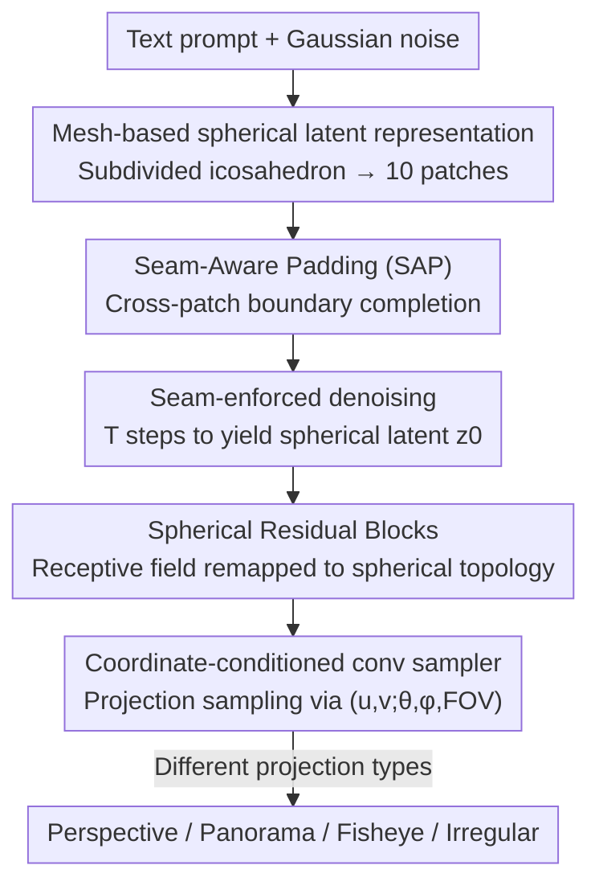

# Arbitrary-Shaped Image Generation via Spherical Neural Field Diffusion

**Conference**: ICLR2026  
**OpenReview**: [https://openreview.net/forum?id=UNeL5NdLzc](https://openreview.net/forum?id=UNeL5NdLzc)  
**Code**: https://github.com/xjyjjy/ASIG  
**Area**: Diffusion Models / Image Generation  
**Keywords**: Arbitrary-Shaped Image Generation, Spherical Neural Field, Mesh-based Spherical Latent Diffusion, View Control, Panorama/Fisheye Generation

## TL;DR
ASIG generates an entire scene at once on a subdivided icosahedral sphere using "Mesh-based Spherical Latent Diffusion," and then employs a "Spherical Neural Field" to perform arbitrary sampling from this sphere based on coordinate conditions. This achieves explicit control over view, FOV, and resolution within a unified framework for the first time, outputting distortion-free images in perspective, panoramic, fisheye, or irregular shapes, with quality significantly exceeding various specialized methods.

## Background & Motivation
**Background**: Diffusion models (SD, SDXL, DiT) have demonstrated extreme proficiency in image generation, but they are confined to fixed grids, fixed resolutions, and fixed viewpoints. Perspective generation methods can only "look forward," while panoramic methods (MVDiffusion, PanFusion, etc.) provide a full field of view but are locked to the Equirectangular Projection (ERP) domain, single central viewpoints, and fixed-resolution rectangular grids.

**Limitations of Prior Work**: To change the viewpoint, FOV, or resolution, current paradigms rely on post-hoc cropping via "projection." However, projection introduces distortion and blur—especially the non-uniform sampling of ERP, which inherently disrupts semantic and spatial consistency. So-called "arbitrary resolution extension" methods (INFD, Kim & Kim) merely upsample details within the same image; the FOV and viewpoint remain unchanged, failing to generate new scene content.

**Key Challenge**: The fundamental issue is that existing methods treat "spatial attributes" (viewpoint, FOV, resolution) as implicitly correlated statistics in the training data to be fitted, rather than using an explicit geometric representation to carry them. It is inherently contradictory to represent both "a full-sphere scene + arbitrary viewpoint projections" on a flat grid—planar projections inevitably have distortion, while global representations without distortion are difficult to render directly.

**Goal**: Establish a unified framework capable of jointly controlling viewpoint, FOV, and resolution while maintaining high quality across different shapes such as perspective, panoramic, and fisheye.

**Key Insight**: The authors' key observation is that if a complete scene representation is first generated on a **sphere**, then images of any viewpoint, FOV, or resolution are simply downstream "sampling and projection" operations from this sphere, allowing distortion to be eliminated geometrically. The challenge shifts to: how to perform diffusion on a sphere (as spheres cannot be directly convolved) and how to decode from a spherical representation based on coordinate conditions without distortion.

**Core Idea**: Replace "planar diffusion + post-projection" with "subdivided icosahedron mesh-based spherical latent diffusion + spherical neural field," decoupling generation into two steps: "building a complete scene sphere → sampling arbitrary regions by coordinates."

## Method

### Overall Architecture
ASIG addresses "generating a complete scene sphere once, then sampling arbitrary shapes as needed." The process is divided into two main stages: the first stage is **Mesh-based Spherical Latent Diffusion**, where a UNet takes a text prompt + Gaussian noise through $T$ denoising steps to produce a spherical latent $z_0$ represented on a subdivided icosahedron. To prevent seams between the 10 rhombic patches, Seam-Aware Padding (SAP) is used throughout. The second stage is the **Spherical Neural Field** (SNF), where a VAE decoder outputs multi-scale features, Spherical Residual Blocks refine them by aligning with the spherical topology, and finally, a coordinate-conditioned convolutional sampler maps the spherical features to RGB under specified spatial attributes based on $(u,v;\theta,\phi,\text{FOV})$. Connecting these stages enables "unified representation → arbitrary sampling."

### Key Designs

**1. Mesh-based Spherical Latent Representation: Turning a sphere into a regular grid for 2D convolution**

The pain point is that the sphere itself cannot be directly convolved, and ERP flattening has non-uniform distortion. The authors start from a regular icosahedron (12 vertices, 20 triangular faces, which can be merged into 10 rhombic faces). Each subdivision step splits each face into four and projects the new vertices back to the sphere; at subdivision level $L$, each original face is divided into $4^L$ triangular faces. Each rhombic patch is unfolded into a rectangular grid, and each triangular face is mapped to a unique pixel via barycentric sampling, establishing a one-to-one correspondence $F_L^p \leftrightarrow M^p \in \mathbb{R}^{H_L \times W_L \times d}$, where resolution $(H_L, W_L) = (2^L, 2^L)$, e.g., $L=5$ yields $64\times64$ and $L=6$ yields $128\times128$. This approach is elegant because subdivision levels naturally correspond to the multi-scale hierarchy of the diffusion UNet/VAE, allowing the spherical representation to fit seamlessly into standard diffusion backbones while preserving spherical adjacency.

**2. Seam-Aware Padding (SAP): Enabling kernels to see a continuous sphere across patch boundaries**

The problem is that each patch is only valid within its rhombic region; after unfolding into a rectangle, the remaining cells are zero-padded. This prevents the convolutional kernels from reading information outside the patch boundary (contextual breakage), and the zero-padded regions create artificial seams between adjacent patches. SAP utilizes the connectivity graph of the subdivided icosahedron to define a neighbor set $N(p_i) = \{p_{i-2}, p_{i-1}, p_{i+1}, p_{i+2}\}$ (indices modulo 10, respecting the cyclic arrangement of patches) for each patch $p_i$. Pixels in the padding region are then geometrically remapped from valid pixels of neighbors:

$$\tilde{M}^{p_i}(u,v) = \begin{cases} M^{p_i}(u,v), & (u,v) \in p_i \text{ valid area} \\ \Pi_{p_i \leftarrow p_j}\!\left(M^{p_j}(u',v')\right), & (u,v) \in \text{padding area},\ p_j \in N(p_i) \end{cases}$$

where $\Pi_{p_i \leftarrow p_j}$ is the geometric remapping along mesh adjacency. By adding SAP after **all** convolutional layers in the diffusion UNet and VAE decoder, the kernels can perceive continuous features across patch boundaries, smoothing the receptive field over the entire grid, eliminating artificial seams, and ensuring semantic consistency across the sphere.

**3. Seam-Enforced Denoising: Integrating SAP throughout the sampling process for seamless spherical latents**

Merely padding during network forward passes is insufficient—processing the denoising of each patch independently would accumulate discontinuities. The authors apply SAP to the latent variable at every timestep: $x_t = \text{SeamPad}(z_t; L)$, copying boundary features from mesh-neighbors before feeding them into the UNet to predict noise. The scheduler then updates $z_{t-1} = \text{Step}(z_t, \hat{\epsilon}_t, t)$, iterating until $t=0$ to obtain a seam-consistent $z_0$. A key detail is that $\text{SeamPad}(\cdot;L)$ only modifies boundary cells, leaving the interior untouched, ensuring efficiency while maintaining semantic continuity. During training, both the noise target and latent variable are passed through SAP (see Loss), aligning training with inference to eliminate boundary artifacts at the source.

**4. Spherical Neural Field (SNF): Distortion-free sampling of arbitrary regions via coordinate conditions**

Directly decoding the spherical latent $z_0$ would result in distortion and lack explicit spatial control. SNF consists of two parts. First, **Spherical Residual Blocks**: for multi-scale features $D^{(\ell)}(z_0)$ from the VAE decoder, the receptive field is remapped to the icosahedron topology for geometrically-aware refinement, followed by upsampling to a unified resolution and concatenation along the channel dimension: $F = \text{Concat}_{\ell \in \{6,7,8,9\}}\big(\text{Upsample}(\text{SphRes}^{(\ell)}(D^{(\ell)}(z_0)))\big)$. Second, the **Convolutional Latent Sampler**: multi-scale spherical features $F$ and the VAE-decoded RGB $D(z_0)$ are concatenated. Given a target viewpoint $(\theta,\phi)$ and FOV, a projection function $\pi(u,v;\theta,\phi,\text{FOV})$ maps each output pixel to the corresponding coordinate on the spherical latent (projection type determines perspective/panorama/fisheye). These are then interpolated and converted to RGB by a lightweight network $f_\theta$:

$$I(u,v) = f_\theta\Big(\text{Sample}\big([F, D(z_0)],\ \pi(u,v;\theta,\phi,\text{FOV})\big)\Big),\quad (u,v) \in G.$$

This coordinate-conditioned sampling allows arbitrary resolutions, viewpoints, FOVs, and image shapes to be treated as different "views" of the same sphere, rather than requiring separately trained specialized models.

### Loss & Training
Training occurs in two stages, with UNet and VAE weights initialized from SDXL. **Stage 1 (Building the Spherical Neural Field)**: The VAE encoder is frozen, and SNF is trained end-to-end. Panoramic images are converted into mesh patches, and GT RGB at arbitrary resolutions is sampled for supervision using a weighted combination of pixel loss, perceptual loss, and adversarial loss: $L = \lambda_1 L_1 + \lambda_p L_{\text{LPIPS}} + \lambda_g L_{\text{GAN}}$. **Stage 2 (Spherical Latent Diffusion Fine-tuning)**: The VAE encoder is frozen, and the UNet is trained for reverse diffusion. Crucially, both the noise target $\epsilon$ and the noisy latent $z_t$ are passed through SAP, making the training objective: $L_{\text{diff}} = \mathbb{E}_{t,z_0,\epsilon}\big[\|\text{SeamPad}(\epsilon, L) - F_\theta(\text{SeamPad}(z_t, L), t, y)\|_2^2\big]$. This aligns training and inference seam processing, preventing boundary artifacts.

## Key Experimental Results

The dataset comprises 10,800 panoramic images from Matterport3D (2,000 for testing), with text prompts generated by BLIP-2. The UNet was trained on 8×A100 for 100k steps (batch 80, cosine annealing), and SNF for 100k steps (batch 4). Inference used DDIM with 50 steps, $\epsilon$-prediction, and CFG (10% text dropout).

### Main Results
Comprehensive comparison with SOTA across perspective, panoramic, and fisheye shapes (selected metrics, KID* unit is $10^{-2}$):

| Shape | Metric | ASIG (Ours) | Prev. SOTA | Note |
|------|------|------|------|------|
| Perspective | FID↓ | **14.68** | 21.33 (PanFusion) | Significant lead over specialized methods |
| Perspective | CLIP-FID↓ | **3.58** | 5.44 (PanFusion) | — |
| Perspective | MUSIQ↑ | **67.03** | 53.16 (SDXL Pano) | Highest perceptual quality |
| Panorama | FID↓ | **25.49** | 28.92 (SMGD) | — |
| Fisheye | FID↓ | **10.29** | 17.16 (PanFusion) | Most significant improvement in fisheye |
| Fisheye | CLIP-FID↓ | **1.99** | 2.76 (SMGD) | — |

ASIG achieves the best performance across all metrics and shapes; the gains for fisheye and perspective are particularly large, demonstrating that the "build sphere then sample" approach is most advantageous for unconventional shapes.

### Ablation Study

| Configuration | Key Metrics (Gen FID↓ / Recon PSNR↑) | Note |
|------|------|------|
| Full model | 25.49 / 30.07 | Complete model |
| w/o Spherical ResBlock | 27.93 / 28.65 | FID↑, PSNR↓, LPIPS 0.168→0.2205 |
| w/o SAP (in SNF) | 27.69 / 29.17 | Degradation in FID, KID, and CLIP-FID |

Cross-resolution panoramic quality (pFID↓ / KID*↓) shows that ASIG significantly outperforms LTEW-enhanced baselines at 512/1024/1536 resolutions (e.g., at 1536: Ours 16.31/0.74 vs. PanFusion+ 25.46/1.04).

### Key Findings
- **SAP is the lifeline**: Removing SAP from the diffusion UNet leads to visible seams and semantic misalignment at patch boundaries (Fig. 6); removing SAP from SNF leads to consistent degradation across FID metrics. Seam processing is indispensable for both "generation" and "decoding."
- **Spherical Residual Blocks govern geometric fidelity**: Removing them drops PSNR by 1.4 points and significantly increases LPIPS, proving that remapping the receptive field to the icosahedron topology is necessary to suppress spherical distortion.
- **Robustness across resolutions**: Baselines degrade more severely at lower resolutions (512), while ASIG shows the slowest degradation, indicating that the coordinate sampling of the Spherical Neural Field is more resistant to resolution changes than planar upsampling.

## Highlights & Insights
- **Decoupling "generate scene sphere, then sample arbitrary views"** is elegant: It transforms viewpoint/FOV/resolution from "implicit statistics to be fitted" into "explicit sampling parameters of a unified spherical representation," unifying multiple specialized tasks (perspective, panorama, fisheye, irregular shapes) into one framework.
- **Subdivided icosahedron aligns naturally with diffusion multi-scale**: Choosing an icosahedron over ERP avoids non-uniform distortion and ensures that subdivision levels $L$ match the feature resolution levels of UNet/VAE, allowing the SDXL backbone to be reused with almost zero cost—a clever engineering-geometric coupling.
- **Seam issues handled symmetrically in training and inference**: SAP is not just an inference trick; it is baked into the training objective (noise also passes through SAP), ensuring training-inference consistency and preventing boundary artifacts from the source.
- **Natural emergence of irregular shapes**: By jointly adjusting FOV and resolution, images of any aspect ratio or irregular shape can be sampled from the same sphere without additional design.

## Limitations & Future Work
- **Reliance on panoramic training data**: The method is trained on Matterport3D indoor panoramas; although out-of-domain generalization to outdoor scenes is shown, the training domain is limited by available panoramic datasets, and open-world generalization remains to be verified.
- **Two-stage training + spherical sampling overhead**: Requires 100k steps for each of the two stages on 8×A100, and every target view during inference requires spherical projection sampling, which is heavier than a single planar forward pass.
- **Geometric dependence on a single scene sphere**: The entire scene is compressed into a spherical representation centered at a single point; for scenes requiring large translations (rather than pure rotations), a single sphere may be insufficient to handle parallax and occlusion changes.
- **Future Directions**: Extending the single sphere to multi-sphere or layered representations to support translational parallax; or replacing the convolutional sampler with a more lightweight real-time sampler to accelerate multi-view rendering.

## Related Work & Insights
- **vs. Perspective Generation (SD / SDXL / DiT)**: These implicitly fit resolution/view/FOV correlations and lack explicit spatial control; ASIG uses a spherical representation to explicitly parameterize these attributes, enabling distortion-free view changes rather than just outputting fixed grids.
- **vs. Panoramic Generation (MVDiffusion / PanFusion / SMGD)**: These learn in the ERP or stitched domains, limited by non-uniform distortion and fixed central viewpoints; changing views relies on projections that introduce distortion. ASIG generates on an undistorted icosahedral sphere, where any viewpoint is a direct sample rather than a secondary projection.
- **vs. Arbitrary Resolution Neural Fields (INFD / Kim & Kim / LTEW)**: These use neural fields for arbitrary scale super-resolution under fixed views/FOVs, only adding detail without new content. ASIG couples neural fields with spherical latent diffusion to extend "arbitrary resolution" to "arbitrary view + arbitrary FOV + arbitrary shape," achieving significantly lower pFID across resolutions.

## Rating
- Novelty: ⭐⭐⭐⭐⭐ The first unified diffusion framework to control view/FOV/resolution across perspective/panorama/fisheye; the coupling of mesh-based spherical latent diffusion and spherical neural fields is truly innovative.
- Experimental Thoroughness: ⭐⭐⭐⭐ Comprehensive comparison across three shapes + cross-resolution + three ablation sets; solid, though training data is limited (only Matterport3D).
- Writing Quality: ⭐⭐⭐⭐ Framework and formulas are clear; the geometric motivation is well-explained, though some notations (e.g., patch neighbor indices) require the figure for full clarity.
- Value: ⭐⭐⭐⭐⭐ Unifies multiple specialized generation tasks into a geometrically consistent framework; highly inspiring for both controllable and 3D scene generation; open-sourced.

<!-- RELATED:START -->

## Related Papers

- [\[ICLR 2026\] PixNerd: Pixel Neural Field Diffusion](pixnerd_pixel_neural_field_diffusion.md)
- [\[ICLR 2026\] COSMO-INR: Complex Sinusoidal Modulation for Implicit Neural Representations](cosmo-inr_complex_sinusoidal_modulation_for_implicit_neural_representations.md)
- [\[CVPR 2026\] Spherical Leech Quantization for Visual Tokenization and Generation](../../CVPR2026/image_generation/spherical_leech_quantization_for_visual_tokenization_and_generation.md)
- [\[ICLR 2026\] Any-step Generation via N-th Order Recursive Consistent Velocity Field Estimation](any-step_generation_via_n-th_order_recursive_consistent_velocity_field_estimatio.md)
- [\[ICLR 2026\] Interaction Field Matching: Overcoming Limitations of Electrostatic Models](interaction_field_matching_overcoming_limitations_of_electrostatic_models.md)

<!-- RELATED:END -->
