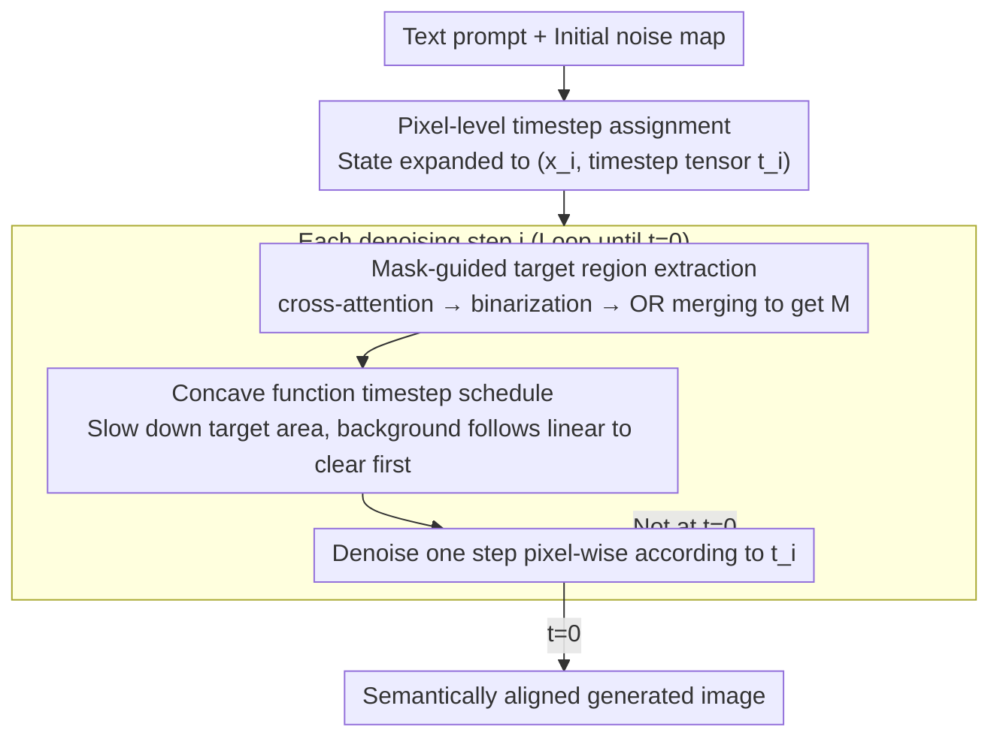

# Asynchronous Denoising Diffusion Models for Aligning Text-to-Image Generation

**Conference**: ICLR 2026  
**arXiv**: [2510.04504](https://arxiv.org/abs/2510.04504)  
**Code**: [https://github.com/hu-zijing/AsynDM](https://github.com/hu-zijing/AsynDM)  
**Area**: Diffusion Models / Text-to-Image Alignment  
**Keywords**: Asynchronous Denoising, Pixel-level Timestep, Text-to-Image Alignment, Cross-attention mask, Plug-and-play

## TL;DR
AsynDM significantly improves semantic alignment in text-to-image generation without fine-tuning by assigning different timestep schedules to different pixels (denoising prompt-related regions more slowly), allowing them to utilize clearer contextual references.

## Background & Motivation
**Background**: Diffusion models have achieved excellent diversity and fidelity in text-to-image generation, but text-to-image alignment remains a significant pain point—generated images often exhibit inconsistencies with prompts regarding text, color, and quantity.

**Limitations of Prior Work**:
   - Existing methods either require fine-tuning (RL-based alignment) or modify CFG or intermediate noisy images during inference.
   - None of these methods address the fundamental mechanism of synchronous denoising.

**Key Challenge**: In synchronous denoising, all pixels evolve according to the same timestep. Prompt-related regions can only refer to other regions at the same noise level as context, which are themselves blurry and unable to provide clear semantic guidance.

**Goal**: To enable prompt-related regions (e.g., target objects) to obtain clearer contextual references during the denoising process to improve semantic alignment between the final image and the prompt.

**Key Insight**: Different regions in an image have different requirements for denoising precision—backgrounds with fewer constraints can be denoised quickly, while prompt-related objects require more refined incremental denoising.

**Core Idea**: Allow prompt-irrelevant regions to become clear first to serve as better contextual references, while prompt-related regions denoise slowly to focus better on the prompt semantics.

## Method

### Overall Architecture
Images generated by diffusion models often fail to match prompts (errors in text, quantity, or color). AsynDM attributes the root cause to "synchronous denoising"—all pixels become clear together following a single scalar timestep $t$, so prompt-related target regions can only refer to equally blurry neighborhoods without reliable semantic guidance. Its solution is to denoise different pixels **asynchronously**: first, the scalar timestep is expanded into a spatial tensor, allowing each pixel to follow its own noise level; then, at each step of the denoising loop, cross-attention is used to identify the current prompt-related regions, which are assigned a "slow-then-fast" concave function schedule, while the background follows a standard linear schedule. This allows the background to clear up early and become a clear contextual reference for the target regions, while the target regions are refined slowly to focus better on the prompt semantics. The entire method is plug-and-play, requires no fine-tuning, only modifies the inference process of pre-trained diffusion models, and is compatible with samplers like DDPM/DDIM and architectures like UNet/DiT.

### Key Designs

**1. Pixel-level timestep assignment: Breaking the scalar timestep $t$ into a spatial tensor to allow each pixel its own noise level**

The root of synchronous denoising is a single scalar $t$ controlling the entire image. To break this, one must first prove that diffusion models allow for pixel-wise timesteps. The authors observe that timestep information is embedded into features in a pixel-wise manner outside the attention modules and does not directly participate in attention calculations—this means different pixels can naturally be assigned different timesteps without modifying the network structure. Accordingly, the DDPM transition distribution is expanded to $p_\theta(\mathbf{x}_{i+1}|\mathbf{x}_i, \mathbf{c}) = \mathcal{N}(\mathbf{x}_{i+1} | \mu_\theta(\mathbf{x}_i, \mathbf{t}_i, \mathbf{c}), \sigma_i^2 \mathbf{I})$, where the timestep changes from a scalar $t$ to a tensor $\mathbf{t}_i \in \mathbb{R}^{h \times w}$, and the corresponding $\alpha_{\mathbf{t}_i}$ and $\beta_{\mathbf{t}_i}$ are changed to element-wise indexing. Crucially, this expansion does not violate the Markov property: as long as the state is redefined from the original $\mathbf{x}_t$ to $(\mathbf{x}_i, \mathbf{t}_i)$, the entire process remains a valid Markov chain, providing a theoretical foundation for subsequent asynchronous scheduling.

**2. Mask-guided target region extraction: Dynamically identifying prompt-related regions using cross-attention maps at each step**

With pixel-level timesteps available, the next step is to decide which pixels belong to the "target regions" that need to be slowed down. Since this changes as denoising progresses, the mask must be recomputed at each step. This is done by leveraging the existing cross-attention maps in the diffusion model: for each target token $o$ in the prompt, its attention map $A^o$ is taken, binarized using its mean as a threshold, and then the binary masks of all target tokens are merged via an OR operation to obtain the target region for the current step:

$$M = \bigvee_{o \in \mathcal{O}_\mathbf{c}} \mathbf{1}[A^o > A^o_{\text{mean}}].$$

Directly using cross-attention instead of training an additional segmentation model is preferred because it naturally encodes the correspondence between image regions and text tokens at zero cost; as denoising progresses and the image takes shape, this mask converges from a coarse early localization to an increasingly precise fit of the object shape, matching the rhythm of the subsequent concave function's "late-stage refinement."

**3. Concave function timestep schedule: Allowing prompt-irrelevant regions to denoise first to provide clear references for target regions**

Once the target regions are identified, the final step is to assign specific trajectories for "who is fast and who is slow." Ours assigns a concave function trajectory $f(i) = T - \frac{1}{T}i^2$ to the prompt-related regions, while other regions follow a standard linear schedule. The shape of the concave function determines that target regions remain nearly stationary (high noise) in the early stages and only accelerate towards $t=0$ in the later stages; conversely, the background clears up early according to the linear schedule. This creates the desired asymmetry in the middle stages of denoising: target regions are still very blurry, but they can refer to a relatively clear background for more reliable contextual semantic guidance, rather than only referring to equally blurry neighborhoods as in synchronous denoising. This concave trajectory is not arbitrary—Proposition 1 proves that any point in the region between a concave function and a linear function can eventually reach $t=0$ through a properly shifted concave function, ensuring that regardless of when a pixel is selected as a "target," a valid path exists to denoise it to the end, avoiding complex state management.

### Loss & Training
- **Training-free**: AsynDM is used directly on pre-trained diffusion models, only modifying the inference process.
- Compatible with various samplers such as DDPM and DDIM.
- Timestep encodings are processed independently and injected in a per-pixel manner.

## Key Experimental Results

### Main Results — Alignment performance on 4 prompt sets (SD 2.1)

| Method | BERTScore↑ | CLIPScore↑ | ImageReward↑ | QwenScore↑ |
|------|-----------|-----------|-------------|-----------|
| DM (baseline) | 0.6353 | 0.3685 | 0.7543 | 4.94 |
| Z-Sampling | 0.6353 | 0.3708 | 0.8283 | 5.02 |
| SEG | 0.6309 | 0.3605 | 0.6493 | 4.76 |
| S-CFG | 0.6383 | 0.3716 | 0.8653 | 5.04 |
| CFG++ | 0.6249 | 0.3565 | 0.3284 | 4.45 |
| **Ours** | **0.6414** | **0.3750** | **0.9219** | **5.52** |

(Example using Animal Activity; trends are consistent across the other 3 sets)

### Ablation Study — Comparison of schedule functions

| Configuration | BERTScore | ImageReward |
|------|-----------|-------------|
| Linear Schedule (baseline DM) | 0.6353 | 0.7543 |
| Global Concave Function (DMconcave) | 0.6381 | 0.8544 |
| **Asynchronous (Ours)** | **0.6414** | **0.9219** |

### Key Findings
- **Ours performs best across all 4 prompt sets and 4 metrics**, and is the only method that does not require fine-tuning.
- **QwenScore shows the most significant Gain**: +0.58 on Animal Activity (from 4.94 to 5.52), indicating that VLM evaluations perceive a substantial improvement in alignment.
- **SEG and CFG++ actually harm alignment**: suggesting that simply modifying guidance is not always effective.
- **Mask quality improves as denoising progresses**: early masks are coarse but sufficient for general localization, while later masks accurately capture object shapes.

## Highlights & Insights
- **Rethinking Synchronous Denoising**: Prior work almost always assumed all pixels denoise synchronously. This paper is the first to identify this as a root cause of alignment issues and propose a solution—a novel perspective.
- **Strong Plug-and-play Utility**: Requires no training, no additional models, and is compatible with both UNet and DiT architectures, making it easy to deploy.
- **Mathematical Elegance of Concave Scheduling**: Proposition 1 guarantees that regions selected as targets at any time can eventually reach t=0 through a shifted concave function, avoiding complex state management.

## Limitations & Future Work
- Relies on the quality of cross-attention maps to extract masks; if entities in the prompt are not correctly localized in the attention, the method is ineffective.
- The quadratic function $f(i) = T - i^2/T$ is manually selected; different prompts may require different scheduling intensities.
- Additional pixel-level timestep encoding introduces some computational overhead (though the paper claims it is negligible).
- May be less effective for abstract concepts (e.g., style, mood) implied in prompts compared to concrete objects.

## Related Work & Insights
- **vs Z-Sampling**: Z-Sampling introduces zigzag steps to improve alignment, but all pixels remain synchronous; Ours starts from pixel-level differentiation.
- **vs SEG/S-CFG/CFG++**: These methods modify guidance strategies, while Ours modifies timestep scheduling—orthogonal directions for improvement that could theoretically be combined.
- **vs Attend-and-Excite**: A&E requires optimizing intermediate latents, whereas Ours only modifies timestep encoding, making it more lightweight.

## Rating
- Novelty: ⭐⭐⭐⭐⭐ Pixel-level asynchronous denoising is a entirely new perspective, redefining the MDP state of diffusion models.
- Experimental Thoroughness: ⭐⭐⭐⭐ 4 prompt sets + 4 metrics + multiple baselines + ablation, though missing human evaluation.
- Writing Quality: ⭐⭐⭐⭐⭐ Motivation is extremely clear, illustrations are intuitive, and mathematical derivations are elegant.
- Value: ⭐⭐⭐⭐ Significant and practical improvement in alignment performance, though scenarios are limited to object-specific alignment.

<!-- RELATED:START -->

## Related Papers

- [\[ICLR 2026\] PCPO: Proportionate Credit Policy Optimization for Aligning Image Generation Models](pcpo_proportionate_credit_policy_optimization_for_aligning_image_generation_mode.md)
- [\[ICLR 2026\] DeRaDiff: Denoising Time Realignment of Diffusion Models](deradiff_denoising_time_realignment_of_diffusion_models.md)
- [\[ICLR 2026\] Aligning Visual Foundation Encoders to Tokenizers for Diffusion Models](aligning_visual_foundation_encoders_to_tokenizers_for_diffusion_models.md)
- [\[ICLR 2026\] LayerSync: Self-aligning Intermediate Layers](layersync_self-aligning_intermediate_layers.md)
- [\[NeurIPS 2025\] Aligning Text to Image in Diffusion Models is Easier Than You Think](../../NeurIPS2025/image_generation/aligning_text_to_image_in_diffusion_models_is_easier_than_you_think.md)

<!-- RELATED:END -->
