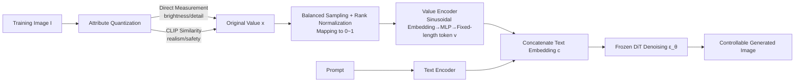

# AttriCtrl: A Generalizable Framework for Controlling Semantic Attribute Intensity in Diffusion Models

**Conference**: ICLR 2026  
**Code**: [https://github.com/CD22104/AttriCtrl](https://github.com/CD22104/AttriCtrl)  
**Area**: Image Generation / Controllable Diffusion  
**Keywords**: Diffusion Models, Aesthetic Attribute Control, Continuous Intensity Adjustment, Value Encoder, Plug-and-play Adapter  

## TL;DR
AttriCtrl quantifies aesthetic attributes such as "brightness/detail/realism/safety" into a unified scalar range of $[0,1]$. By leveraging a lightweight "Value Encoder" to translate these numerical values into token sequences for injection into diffusion models, users can perform continuous, decoupled, and plug-and-play intensity control over single or multiple semantic attributes like adjusting a knob.

## Background & Motivation
- **Background**: Diffusion models have become the mainstream for image generation. Tools like ControlNet, T2I-Adapter, and Prompt-to-Prompt provide fine-grained control over semantic content. Aesthetic alignment research primarily utilizes RL, DPO (e.g., DPOK, Diffusion-DPO), or architectural modifications (e.g., FreeU) to push models toward "human preferences."
- **Limitations of Prior Work**: These methods focus on **global preference alignment**, implicitly assuming a "unique optimal aesthetic goal." They cannot decouple individual attributes or provide **graded continuous control** (e.g., "darken the image by 20%"). Furthermore, text encoders are inherently designed for discrete tokens and are insensitive to numerical values (e.g., "darker" vs. "100% brightness" yields unstable control). Rare interpolation methods (like AID, which performs weighted interpolation on attention) lack explicit guidance along the attribute manifold, often resulting in artifacts like halos or structural collapse.
- **Key Challenge**: Aesthetic judgment is **multidimensional, context-dependent, and continuous**, but existing conditioning mechanisms treat it as either discrete tokens or a single global reward signal, failing to align the two.
- **Goal**: To enable generative models to **decouple** various aesthetic attributes, interpret them as **continuous values**, and allow users to **smoothly navigate intensity** using numerical commands.
- **Core Idea**: **[Attribute Quantization + Value Encoder]** — First, use a hybrid strategy to map both concrete and abstract attributes to a unified $[0,1]$ scale. Then, train a plug-and-play value encoder while freezing the backbone to transform scalar intensities into semantic embeddings injected into the diffusion process, obtaining decoupled and composable attribute-specific control vectors.

## Method

### Overall Architecture
AttriCtrl divides the problem into two steps: **quantization and encoding/injection**. In the first step (attribute quantization), raw scores for brightness, detail, realism, and safety are calculated for each training image and normalized to a unified $[0,1]$ scale. In the second step (customized aesthetic control), an independent value encoder is trained for each attribute to transform the normalized scalar into a fixed-length token sequence. This sequence is concatenated with the text embedding $c$ along the sequence dimension and fed into a frozen DiT backbone (using FLUX as the base). For multi-attribute control, outputs from independently trained value encoders are directly concatenated during inference.

### Key Designs

**1. Hybrid Attribute Quantization: Anchoring concrete and abstract attributes to the same scale.** The paper distinguishes between two types of attributes using distinct metrics. For **concrete attributes**, direct measurement is applied: brightness is the mean of the Value channel in HSV divided by 255, $x^{\text{Brightness}}_I = \frac{1}{H\cdot W}\sum_{i,j} \frac{v_{i,j}}{255}$; detail uses the Shannon entropy of the grayscale histogram $x^{\text{Detail}}_I = -\sum_{k} p_k \log p_k$ as a proxy for texture richness. For **abstract attributes**, CLIP cross-modal similarity is used: realism is defined via positive and negative prompt contrast $x^{\text{Realism}}_I = \text{sim}(e_I, e_{\text{pos}}) - \text{sim}(e_I, e_{\text{neg}})$ (e.g., "realistic photo" vs. "cartoon illustration"); safety leverages the unsafe concept embedding $e_s$ from Stable Diffusion's built-in safety checker, defined as $x^{\text{Safety}}_I = -(\text{sim}(e_I, e_s) - t)$, with threshold $t=0.19$, where the negative sign ensures direction consistency with other attributes.

**2. Balanced Sampling + Rank Normalization: Ensuring uniform distribution and cross-attribute comparability.** Training directly on raw values faces distribution imbalance and scale inconsistency. The authors divide the empirical range of each attribute into 10 equal-width bins, oversampling under-represented bins and downsampling over-represented ones to achieve a uniform, order-preserving distribution. Subsequently, **rank normalization** is applied: $x^{\text{norm}}_i = \frac{\text{rank}(x_i)-0.5}{n} \in [0,1]$, spreading raw scores onto a unified scale. This step is the prerequisite for joint multi-attribute control.

**3. Value Encoder: Expanding a scalar into a sequence of tokens for self-attention.** This is the core innovation. The normalized scalar $x^{\text{norm}}_i$ passes through a **sinusoidal embedding** (similar to diffusion timestep encoding for smooth interpolation), followed by a two-layer SiLU MLP to obtain a latent representation. This is then **replicated and expanded into a fixed-length sequence** (32 tokens in experiments) and combined with learnable position embeddings to produce $v$. Expanding a scalar into a sequence allows self-attention to interpret intensity values in a distributed, relational manner analogous to text tokens, with position embeddings assigning different functional roles to each token.

**4. Modular Multi-attribute Combination: Independent training and inference-time concatenation.** To avoid instability caused by data imbalance during joint training, each attribute's value encoder is **trained independently** on its own single-attribute data. During inference, embeddings from various encoders are concatenated sequentially and appended to the text embedding. This preserves the composability of independent encoders while minimizing inter-attribute interference.

## Key Experimental Results

Based on FLUX, trained on 155K image-text pairs from EliGen, validated with GenEval (553 prompts × 8 seeds). Control precision is measured by the Mean Absolute Difference (AvgDiff $\downarrow$) between target and generated intensity.

### Main Results (Single Attribute Precision AvgDiff ↓ + User Preference ↑)

| Method | Bright. | Detail | Realism | Avg AvgDiff ↓ | User Preference Avg ↑ |
|---|---|---|---|---|---|
| Kontext (Prompt Instructions) | 0.294 | 0.420 | 0.270 | 0.328 | 0.011 |
| W-Emb (Weighted Embedding) | 0.327 | 0.436 | 0.271 | 0.345 | 0.018 |
| AID-in (Attn Interpolation) | 0.214 | 0.361 | 0.227 | 0.267 | 0.072 |
| AID-out (Attn Output Inter.) | 0.214 | 0.361 | 0.227 | 0.267 | 0.056 |
| **Ours (AttriCtrl)** | **0.141** | **0.191** | **0.192** | **0.175** | **0.842** |

AttriCtrl achieves the lowest AvgDiff across all three attributes and is overwhelmingly preferred in user studies (84.2% vs. 7.2% for the second-best AID).

### Safety Control Experiment (I2P Dataset, Removal Rate RR ↑)

| Method | NP | SLD | ESD | **Ours** |
|---|---|---|---|---|
| RR (%) | 11.6 | 32.6 | 53.9 | **57.7** |

Treating safety as an attribute (fixed target intensity at 1) outperforms specialized concept erasure methods like ESD, SLD, and NP.

### Key Findings
- **Explicit "Intermediate Intensity" training is essential**: Baselines only learn endpoint concepts, leading to AvgDiff > 0.21. AttriCtrl enables the model to establish a continuous perception of gradients for smoother transitions.
- **Cost of AID Interpolation**: Lacking explicit guidance along the attribute manifold, interpolation often results in halos, structural collapse, and attribute entanglement.
- **Slight Attribute Coupling**: Realism scores correlate slightly with detail, likely due to biases in the training data where realistic images naturally contain more texture.
- **Strong Compatibility**: Can be seamlessly integrated with ControlNet and EliGen without damaging underlying content or structure.

## Highlights & Insights
- **Standardizing the "Knob-tuning" Paradigm**: The value encoder maps any scalar attribute into a token sequence. The authors suggest this generic framework can extend to object count, aspect ratio, color temperature, and motion blur.
- **Practical Quantization Strategies**: Concrete attributes use zero-cost classic metrics (HSV/Entropy), while abstract attributes leverage existing CLIP and safety checkers, making the engineering implementation lightweight.
- **"Safety as an Attribute"**: Integrating content safety into a continuous control framework is a novel perspective that proves more effective than specialized erasure methods.
- **Frozen Backbone + Modularity**: Independent training avoids joint training imbalances and supports plug-and-play composability.

## Limitations & Future Work
- **Interference from Strong Semantic Modifiers**: Control precision drops when prompts contain strong modifiers like "hyper-realistic lighting." Interaction between natural language semantics and scalar control remains for future work.
- **Attribute Coupling**: The correlation between realism and detail stems from data bias and has not been fully decoupled.
- **Dependence on Proxy Metrics for Abstract Attributes**: Subjective concepts like composition and narrative coherence lack robust proxy metrics, acting as a bottleneck for expansion.
- **Simple Quantization Metrics**: Using mean HSV for brightness and global entropy for detail may fail to capture local structural complexity.

## Related Work & Insights
- **Controllable Generation**: While Prompt-to-Prompt and ControlNet focus on semantic or structural guidance, AttriCtrl fills the gap in **numerical continuous intensity control**.
- **Aesthetic Modeling/Alignment**: Unlike DPOK or Diffusion-DPO which assume global single-target optimization, this work advocates for explicit decoupling.
- **Interpolation Control**: Compared to AID, AttriCtrl uses learned continuous trajectories instead of endpoint interpolation, resulting in higher stability and accuracy.
- **Insight**: The "Continuous Scalar → Token Sequence → Frozen Backbone Injection" paradigm is a universal building block for any conditional generation task requiring graded control.

## Rating
- **Novelty**: ⭐⭐⭐⭐ — The combined perspective of "scalar attributes as token sequences" and "safety as a tunable attribute" is novel, providing clear value through composability.
- **Experimental Thoroughness**: ⭐⭐⭐⭐ — Covers single/multi-attribute control, user studies, safety erasure, and compatibility with ControlNet/EliGen; however, it is limited to a single base model (FLUX).
- **Writing Quality**: ⭐⭐⭐⭐ — Clear motivation, logical flow, and well-explained methodology.
- **Value**: ⭐⭐⭐⭐ — High potential for practical implementation due to its plug-and-play nature and frozen backbone requirement.

<!-- RELATED:START -->

## Related Papers

- [\[ICLR 2026\] CREPE: Controlling Diffusion with Replica Exchange](crepe_controlling_diffusion_with_replica_exchange.md)
- [\[CVPR 2026\] SegQuant: A Semantics-Aware and Generalizable Quantization Framework for Diffusion Models](../../CVPR2026/image_generation/segquant_a_semantics-aware_and_generalizable_quantization_framework_for_diffusio.md)
- [\[ICLR 2026\] ProReGen: Progressive Residual Generation under Attribute Correlations](proregen_progressive_residual_generation_under_attribute_correlations.md)
- [\[ICLR 2026\] GeoDiv: Framework for Measuring Geographical Diversity in Text-to-Image Models](geodiv_framework_for_measuring_geographical_diversity_in_text-to-image_models.md)
- [\[ICLR 2026\] A Hidden Semantic Bottleneck in Conditional Embeddings of Diffusion Transformers](a_hidden_semantic_bottleneck_in_conditional_embeddings_of_diffusion_transformers.md)

<!-- RELATED:END -->
