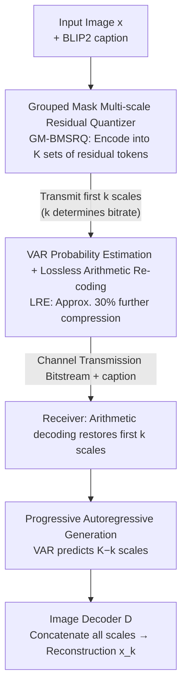

# Autoregressive-based Progressive Coding for Ultra-Low Bitrate Image Compression

**Conference**: ICLR 2026  
**OpenReview**: [https://openreview.net/forum?id=FXu4G5T5QZ](https://openreview.net/forum?id=FXu4G5T5QZ)  
**Code**: https://github.com/Joanna-0421/ARPC  
**Area**: Image Compression / Image Restoration / Visual Autoregression  
**Keywords**: Ultra-low bitrate compression, Visual Autoregression (VAR), Progressive coding, Residual quantization, Lossless entropy coding

## TL;DR
ARPC utilizes the "next-scale prediction" of Visual Autoregressive (VAR) models for ultra-low bitrate image compression. The encoder uses a multi-scale residual quantizer to decompose images into $K$ sets of coarse-to-fine discrete tokens. By transmitting only the first $k$ sets and letting VAR autoregressively generate the remaining $K-k$ sets, a single model achieves continuous bitrate adjustment. Furthermore, VAR is reused as a probability estimator for lossless arithmetic coding, and a grouped mask quantizer is employed to further minimize bits. At bitrates $<0.05$ bpp, ARPC outperforms 13 diffusion and token-based baselines in perceptual quality while being $2 \sim 6 \times$ faster during decoding.

## Background & Motivation
**Background**: Ultra-low bitrate image compression (typically $<0.05$ bpp) is currently dominated by generative models. GANs and diffusion models maintain perceptually significant details under rate-distortion-perception objectives by leveraging strong content generation and texture completion capabilities. Diffusion-based solutions (e.g., PerCo, DiffEIC, DiffPC) have broadly surpassed GANs in perceptual quality.

**Limitations of Prior Work**: Diffusion-based methods face three major challenges. First, **poor bitrate adaptability**: most follow a "one-model-per-rate" approach, which cannot switch bitrates smoothly in dynamic transmission environments. Second, **high encoding/decoding complexity**: even recent progressive coding schemes using pre-trained diffusion with reverse channel coding suffer from high latency due to multi-step iterative denoising. Third, **reliance on shared randomness**: reverse channel coding requires the sender and receiver to share the same random seeds, which is not always feasible in practice.

**Key Challenge**: Diffusion models are inherently continuous generators that reconstruct images from noise in one pass. They lack a natural hierarchical progressive structure and depend on shared randomness due to their continuous latent space. The goal is a discrete representation that is hierarchical, truncatable, and independent of shared randomness—areas where the diffusion paradigm struggles.

**Goal**: To support arbitrary bitrates with a single model (progressive truncatability), ensure fast decoding, and eliminate the need for shared randomness.

**Key Insight**: The authors observe that the "next-scale prediction" in Visual Autoregressive (VAR) models uses a multi-scale residual quantizer to encode images into discrete, hierarchical visual tokens, which are then predicted autoregressively. This coarse-to-fine paradigm inherently serves as perfect bitrate adaptability—transmitting structural information first, followed by fine textures. Compared to diffusion, VAR is faster and does not require shared randomness because the latent space is already discretized.

**Core Idea**: Reformulate image compression as a VAR generation process: "transmit only the first $k$ scales of tokens and let VAR autonomously generate the remaining $K-k$ scales." The truncation point $k$ serves as the bitrate knob. VAR is further reused as a probability estimator for lossless arithmetic coding, and a grouped mask quantizer is used to compress early scales to their limits.

## Method

### Overall Architecture
ARPC is a progressive image compression framework built on the "next-scale prediction" of VAR. The encoder transforms the input image $x$ via an image encoder into a feature map $F \in \mathbb{R}^{h \times w \times c}$, which is then quantized into $K$ multi-resolution residual token maps $(R_1, \dots, R_K)$ using a Bitwise Multi-scale Residual Quantizer (BMSRQ). Bitwise quantization maps each $c$-dimensional vector to $c$ binary bits ($1$ if positive, else $0$), where $r_{i,j} = \frac{1}{\sqrt c} \mathrm{sign}(r_{i,j})$, making the tokens natural bitstreams. Early scales carry structural information like layout and color, while subsequent scales add details. The cumulative reconstruction $F_k = \sum_{i=1}^k \mathrm{upsample}(R_i)$ approaches $F$ as $k$ increases.

During transmission, **only the first $k$ scales of tokens are sent** (along with an image caption generated by BLIP2 for global semantic context). The bitrate is determined by $k$. The receiver uses $R_{\le k}$ as a prefix and uses VAR to perform $K-k$ autoregressive steps to generate the missing $\hat R_{>k}$. All scales are upsampled and concatenated to the image decoder $D$ to obtain the reconstruction $x_k = D(R_1, \dots, R_k, \hat R_{k+1}, \dots, \hat R_K)$. Two features enhance compression: VAR as a probability estimator for Lossless Residual Encoding (LRE) and a Grouped Mask Quantizer (GM-BMSRQ) to compress early scales. Scale Random Dropping (SRD) is used during training to enhance the semantic capacity of early scales.

### Key Designs

**1. Progressive Autoregressive Coding Framework: Bitrate Control via Truncation**

This design eliminates the "one-model-per-rate" and "shared randomness" requirements of diffusion methods. BMSRQ encodes the image into $K$ sets of coarse-to-fine tokens. The sender only transmits the first $k$ sets, and the receiver uses them as a prefix for VAR to perform $K-k$ steps of autoregressive prediction to generate $\hat R_{>k}$. A **single model covers a continuous range of bitrates** by adjusting $k$. Theorem 3.1 proves that reconstruction distortion $\mathbb E[D_k]$ is bounded by the full token reconstruction error plus the KL divergence between the VAR predicted distribution and the true distribution. This allows for a two-stage training strategy: optimize the codec/quantizer first, then the VAR model.

**2. Grouped Mask Multi-scale Residual Quantizer (GM-BMSRQ): Scale-Adaptive Channel Pruning**

This addresses the redundancy where early low-frequency scales still occupy $c$ bits. The authors observed that the $K$ scales follow a hierarchy: the first 4 scales define macro colors, the middle 5 define object contours, and the last 4 add fine textures. GM-BMSRQ applies masks to the channel dimension of early scales: the first group masks the last $c/2$ channels (-1 as inactive bits), and the second group masks the last $c/4$ channels. This **compresses the first two groups in both resolution and channel dimensions**, only utilizing full bits at later scales. These groups are configured with 8, 12, and 16 channels respectively, effectively allocating bits based on the information density of each scale.

**3. VAR Probability Estimation + Lossless Residual Encoding (LRE): Reusing the Generative Model as an Entropy Coder**

Bitwise tokens are not uniformly distributed and carry semantic dependencies. Previous works often assume a uniform distribution for entropy coding, but bitwise indices $y_k(i,j) = \sum_{n=0}^{c-1} \mathbb{1}_{R_k(i,j,n)>0} 2^n$ depend heavily on context. Since VAR is trained to predict this distribution, its $c$ binary classifiers provide high-precision probability estimates $p_k(i,j) \in \mathbb{R}^{c \times 2}$. ARPC uses these as probability estimates for arithmetic coding in an autoregressive sequence. This design further reduces the bitrate by approximately 30% with nearly zero quality loss.

**4. Scale Random Dropping (SRD): Forcing Semantics into Early Scales**

In ultra-low bitrate scenarios, image semantics usually concentrate in the final scales. If only early scales are transmitted, reconstruction quality often collapses. SRD randomly drops subsequent scales starting from the 4th scale with a probability of 0.2 during the first stage of training. This forces the model to embed more semantic information (structure, color, and even fine patterns) into the early scales, significantly enhancing robustness at extremely low bitrates.

### Loss & Training
Two-stage training corresponds to the two terms in Theorem 3.1. **Stage 1** trains the image encoder, decoder, and GM-BMSRQ by minimizing reconstruction loss: $\mathcal L_{\text{first}} = \mathcal L_{\text{rec}} + \mathcal L_{\text{per}} + \mathcal L_{\text{dis}} + \mathcal L_{\text{commit}} + \mathcal L_{\text{entropy}}$ (L1 + Perceptual + Discriminator + Commit + Bitwise Entropy). Training starts at 256×256 for 500k steps, follows by 256/512/1024 mixed-resolution for 300k steps with SRD (p=0.2). **Stage 2** freezes the codec and uses **Infinity-2B** as the VAR backbone, finetuning for 20k steps to minimize $\mathcal L_{\text{VAR}} = -\sum_{i=1}^K \log p_\theta(R_i|R_{<i})$ using AdamW with H20 GPUs and InternVL 2.0 captions.

## Key Experimental Results

### Main Results
- **Data**: Trained on 5M high-quality images from Coyo-700M (cleaned for resolution >1024, OCR, and InternVL 2.0 captions). Evaluated on DIV2K-val and CLIC2020 (cropped to 1024×1024).
- **Baselines/Metrics**: Compared with 13 SOTA methods, including VAE-based (ELIC), diffusion-based (PerCo, DiffPC, StableCodec), and token-based (VQGAN, DLF). Metrics include LPIPS, DISTS, PIEAPP, CLIP Score, FID, and KID.
- **Findings**: Leads in perceptual metrics across almost all bitrates and datasets, especially in FID/KID (statistical fidelity). ARPC outperforms the progressive diffusion method DiffC while requiring no shared randomness.

The following table shows inference efficiency and BD-rate (relative to ARPC) on CLIC2020 (1024×1024):

| Method | Steps | Enc (s) | Dec (s) | BD-rate(%) | FID | DISTS | PIEAPP |
| :--- | :--- | :--- | :--- | :--- | :--- | :--- | :--- |
| PerCo | 20 | 0.20 | 10.25 | 1167.35 | 882.09 | 2744.75 | — |
| DiffEIC | 50 | 0.65 | 15.98 | 681.76 | 139.64 | 100.75 | — |
| DiffPC | 50 | 0.17 | 23.66 | 93.90 | 20.49 | 16.52 | — |
| RDEIC | 6 | 0.31 | 4.18 | 523.52 | 1469.67 | 761.27 | — |
| StableCodec | 1 | 0.42 | 1.11 | 0.1547 | 6.99 | 254.42 | — |
| DiffC | — | 3.63~45.22 | 13.63~37.25 | 674.37 | 59.62 | 117.11 | — |
| **ARPC** | 13 | 1.8~6.2 | 5.39 | **0** | **0** | **0** | — |
| ARPC (w/o LRE) | 13 | 0.20 | 5.39 | 34.64 | 34.58 | 34.38 | — |

> BD-rates for FID/DISTS are calculated relative to ARPC (higher is worse). ARPC's decoding takes 5.39s, roughly twice as fast as PerCo and $2 \sim 6 \times$ faster than DiffC with fixed latency. Encoding time increases with bitrate due to LRE, but remains low for ultra-low bitrates.

### Ablation Study

| Config | Impact | Description |
| :--- | :--- | :--- |
| Full ARPC | — | Baseline model |
| w/o LRE | Rate ↑ ~30% | Transmit raw codes; encoding time drops to 0.2s, but bitrate increases significantly. |
| w/o SRD | Perception ↓ | Significant drop in quality at <0.01 bpp; structures and colors become unstable. |
| w/o GM-BMSRQ | Rate ↑ | Fixed 16-channel coding increases bitrate at ultra-low ranges without quality gain. |

### Key Findings
- **LRE is a "free lunch"**: Reusing VAR for probability estimation saves ~30% bitrate with virtually no quality loss.
- **SRD determines the low-bitrate floor**: Without SRD, early scales lack the semantic capacity to support reconstruction when later scales are truncated.
- **GM-BMSRQ maximizes gains at ultra-low bitrates**: Masking channels in low-frequency scales saves bits without compromising fidelity.

## Highlights & Insights
- **Elegant Paradigm Shift**: Effectively maps the "next-scale prediction" of VAR to "progressive truncatable bitrates," solving adaptability, latency, and randomness in one stroke.
- **Triple-purpose VAR**: The model acts as a missing-scale generator, an entropy model, and a generative prior, unifying compression and generation.
- **Theoretical Grounding**: Theorem 3.1 provides a clean decomposition of the distortion bound into reconstruction error and KL divergence, justifying the two-stage training approach.

## Limitations & Future Work
- **Reliance on Large Priors**: Using Infinity-2B leads to a 5.39s decoding time. While faster than diffusion, it is slower than one-step methods (StableCodec) and less suitable for edge devices.
- **Variable Encoding Latency**: Encoding time scales with bitrate, reaching up to 6.2s, which may not be ideal for real-time symmetric codecs.
- **Perception-Centric Evaluation**: Metrics focus on perceptual and statistical fidelity; PSNR performance for distortion-centric scenarios needs further investigation.
- **External Caption Dependency**: Reliance on BLIP2/InternVL introduces extra overhead and potential complexity in end-to-end evaluation.

## Related Work & Insights
- **vs. DiffC**: DiffC uses reverse channel coding on intermediate diffusion states, requiring shared randomness and variable latency. ARPC's discrete scale truncation is more stable and performs better.
- **vs. Token Baselines (PerCo/OSCAR)**: These methods use small codebooks (e.g., 256) to maintain low bitrates, losing complex features. ARPC uses larger codebooks and controls bitrate via scale count, achieving superior detail preservation.
- **Standing on Shoulders**: ARPC successfully adapts the state-of-the-art VAR and Infinity paradigms to the image compression task.

## Rating
- Novelty: ⭐⭐⭐⭐⭐ 
- Experimental Thoroughness: ⭐⭐⭐⭐⭐ 
- Writing Quality: ⭐⭐⭐⭐ 
- Value: ⭐⭐⭐⭐⭐ 

<!-- RELATED:START -->

## Related Papers

- [\[NeurIPS 2025\] FocalCodec: Low-Bitrate Speech Coding via Focal Modulation Networks](../../NeurIPS2025/image_generation/focalcodec_low-bitrate_speech_coding_via_focal_modulation_networks.md)
- [\[ICLR 2026\] Latent Wavelet Diffusion for Ultra-High-Resolution Image Synthesis](latent_wavelet_diffusion_for_ultra_high-resolution_image_synthesis.md)
- [\[ICLR 2026\] From Parameters to Behaviors: Unsupervised Compression of the Policy Space](from_parameters_to_behaviors_unsupervised_compression_of_the_policy_space.md)
- [\[ICLR 2026\] Autoregressive Image Generation with Randomized Parallel Decoding](autoregressive_image_generation_with_randomized_parallel_decoding.md)
- [\[ICLR 2026\] NextStep-1: Toward Autoregressive Image Generation with Continuous Tokens at Scale](nextstep-1_toward_autoregressive_image_generation_with_continuous_tokens_at_scal.md)

<!-- RELATED:END -->
