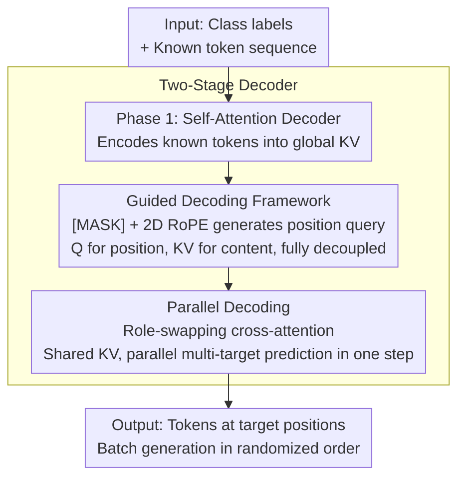

# Autoregressive Image Generation with Randomized Parallel Decoding

**Conference**: ICLR 2026  
**arXiv**: [2503.10568](https://arxiv.org/abs/2503.10568)  
**Code**: [https://github.com/hp-l33/ARPG](https://github.com/hp-l33/ARPG)  
**Area**: Image Generation  
**Keywords**: Autoregressive image generation, randomized order modeling, parallel decoding, KV cache, controllable generation

## TL;DR
This paper proposes ARPG, a visual autoregressive model based on the "guided decoding" framework. By decoupling position guidance (query) from content representation (key-value), it achieves fully randomized order training and generation while supporting efficient parallel decoding. On ImageNet-1K 256×256, it achieves a 1.94 FID in 64 steps, with over 20× throughput improvement and over 75% reduction in memory consumption.

## Background & Motivation
Autoregressive (AR) models have achieved great success in Large Language Models, and this paradigm has been extended to visual generation (e.g., VQGAN, LlamaGen). However, applying next-token prediction to image generation faces two core challenges:

**Fixed Order Limitations**: Images possess a 2D spatial structure, but AR models require flattening them into 1D sequences (e.g., raster scan order). This makes it difficult for models to handle zero-shot generalization tasks requiring non-causal dependencies (e.g., inpainting, outpainting).

**Low Inference Efficiency**: Token-by-token generation is highly inefficient in high-resolution scenarios, especially as 256×256 images require generating hundreds of tokens.

Existing alternatives have limitations: MaskGIT uses masked modeling for randomized order generation but relies on bidirectional attention, preventing the use of KV caches. RandAR implements randomized order via position instruction tokens but doubles the sequence length, leading to significant computation and memory overheads.

**Core Idea**: Embed the "positional information of the target" as a query into the attention mechanism to achieve complete decoupling of content representation (KV) and position guidance (Q). This maintains causality while supporting randomized order modeling and parallel decoding.

## Method

### Overall Architecture
ARPG addresses the pain point where AR image generation is restricted to a fixed raster order, hindering zero-shot tasks and speed. The mechanism splits one decoding pass into two stages: the first stage uses causal self-attention to encode generated tokens into a set of global key-values (content representation); the second stage uses a batch of queries with known target positions to cross-attend to these key-values, predicting target tokens at any location simultaneously. The input is a class label plus an image token sequence, and the output consists of predicted tokens for various target positions. This process preserves causality while breaking free from fixed-order constraints and allowing multiple targets to share the same KV cache for parallel prediction.

### Key Designs

**1. Guided Decoding Framework: Decoupling "Where" from "Context"**

The primary challenge of bringing next-token prediction to images is that the model follows a pre-arranged sequence and cannot naturally know "where the next pixel to predict is." ARPG's starting point consists of three observations: breaking order constraints requires explicit position guidance; in masked modeling, queries corresponding to unmasked tokens receive no loss gradients, implying queries can be data-independent; and [MASK] tokens only carry position without contributing context—keeping them in KV pairs actually breaks causality. Following this, ARPG redefines the probability distribution for permuted autoregression: each query $q_{\tau_i}$ is derived from a data-independent [MASK] token combined with 2D RoPE, encoding only "where the target is," while all key-values come from data-dependent known tokens, encoding only "what the context is." With queries and KV pairs fully decoupled, the model can predict pixels at any randomized position guided by positional queries.

**2. Parallel Decoding: Role-Swapping Cross-Attention to Eliminate Target Conflicts**

Since each token to be predicted appears only as a query and they do not serve as KV for each other, they do not interfere. They can naturally be predicted in parallel in a single step while sharing the same KV cache. The key is that ARPG swaps the roles of traditional cross-attention—known tokens (conditions) serve as key-values, while target positions (inputs) serve as queries. This avoids conflicts caused by multiple generation targets competing for attention in the same sequence. This design allows ARPG to complete in 64 steps what would traditionally require hundreds of steps, increasing throughput by over 20× compared to LlamaGen and reducing memory consumption to less than 1/4 of VAR.

**3. Two-Stage Decoder: Division of Labor in Context Encoding and Target Prediction**

To implement these designs, a backbone is needed that can simultaneously handle "encoding known context" and "predicting guided by position queries." ARPG splits the decoder into two parts: the first stage is a self-attention decoder responsible for processing input tokens into a global context (the KV used in Design 1); the second stage is a cross-attention decoder using guided decoding (Design 1) and parallel decoding (Design 2) to predict target tokens. The distribution of layers between these two parts determines the balance between efficiency and quality. Ablations show a symmetric 12+12 configuration is optimal (FID 2.44). Skewing toward the guided section (6+18 or 0+24) is faster but degrades FID to 3.5 or 4.57, while removing the guided section entirely (24+0) reverts the model to a standard AR model with an FID of 90, losing all randomized order capability. This demonstrates that both context encoding and target guidance are essential.

### Loss & Training
Training uses standard teacher-forcing on randomized sequences: within each batch, sequences are independently shuffled, class tokens are placed at the start, and RoPE frequencies are expanded along the batch dimension and shuffled synchronously to maintain positional alignment. The optimizer is AdamW ($\beta_1=0.99, \beta_2=0.95$), with the initial learning rate linearly scaled by a batch size of 1e-4/256. Training lasts 400 epochs (100-epoch warmup followed by cosine annealing to 1e-5). Class embeddings are dropped out with 0.1 probability for classifier-free guidance. The tokenizer follows LlamaGen's 16× downsampling and 16384 codebook size.

## Key Experimental Results

### Main Results

| Model | Params | Steps | Throughput | Memory | FID↓ | IS↑ |
|------|--------|------|--------|------|------|-----|
| LlamaGen-XXL | 1.4B | 576 | 1.58 it/s | 26.22 GB | 2.62 | 244.1 |
| VAR-d24 | 1.0B | 10 | 48.90 it/s | 22.43 GB | 2.09 | 312.9 |
| RandAR-XXL | 1.4B | 88 | 10.46 it/s | 21.77 GB | 2.15 | 322.0 |
| RAR-XL | 955M | 256 | 8.00 it/s | 10.55 GB | 1.50 | 306.9 |
| **ARPG-L** | **320M** | **64** | **62.12 it/s** | **2.43 GB** | **2.44** | **287.1** |
| **ARPG-XL** | **719M** | **64** | **35.89 it/s** | **4.48 GB** | **2.10** | **331.0** |
| **ARPG-XXL** | **1.3B** | **64** | **25.39 it/s** | **7.31 GB** | **1.94** | **339.7** |

### Ablation Study

| Config | Steps | Throughput | Memory | FID |
|------|------|--------|------|-----|
| ARPG-L (12+12) Baseline | 64 | 62.12 it/s | 2.43 GB | 2.44 |
| Fewer Guided (18+6) | 64 | 50.72 it/s | 3.19 GB | 3.82 |
| More Guided (6+18) | 64 | 66.11 it/s | 1.67 GB | 3.51 |
| w/o Guided (24+0) | 256 | 11.70 it/s | 4.96 GB | 90 |
| Guided Only (0+24) | 64 | 72.26 it/s | 0.91 GB | 4.57 |
| w/o Shared KV | 64 | 48.02 it/s | 3.83 GB | 2.37 |
| Random order | 64 | 62.12 it/s | 2.43 GB | 2.44 |
| Raster order | 256 | - | - | 2.49 |

### Key Findings
- ARPG-XXL achieves 1.94 FID within 64 steps, with throughput over 20× higher than LlamaGen.
- Compared to VAR, ARPG reduces memory consumption by over 75% at similar throughput (7.31 GB vs 22.43 GB).
- Reducing sampling steps (e.g., from 64 to 32) does not significantly degrade quality (ARPG-XXL: 32 steps FID=2.08 vs 64 steps FID=1.94).
- Although randomized order modeling is more difficult ($n!$ possible permutations), it outperforms fixed-order generation.
- Removing the guided decoder reverts the system to a standard AR model (FID spikes to 90), completely losing randomized order capabilities.

## Highlights & Insights
- **Theoretical Clarity**: Derived from a rigorous comparison between masked modeling and autoregressive modeling, the design is justified through three structured insights.
- **Efficiency & Quality Balance**: Maintains competitive generation quality while significantly boosting inference efficiency—crucial for real-world deployment.
- **Zero-Shot Generalization**: Randomized order modeling naturally supports tasks like inpainting, outpainting, and resolution extension without additional training.
- **Controllable Generation Extension**: By replacing [MASK] queries with condition tokens (e.g., Canny edges, depth maps), it achieves controllable generation, reaching SOTA on ControlVAR and ControlAR.
- **Minimalist Design**: Does not rely on extra technical enhancements like QK normalization, AdaLN, or linear attention.

## Limitations & Future Work
- Due to computational resource constraints, the model was not extended to text-to-image (T2I) generation.
- For 512×512 resolution, only 50 epochs of fine-tuning were performed rather than training from scratch; high-resolution performance is not fully verified.
- The two-stage decoder increases architectural complexity, though the authors mitigate overhead via shared KV.
- Randomized order training may require more training epochs to reach the same convergence quality.
- Compared to diffusion models, there remains a gap at the absolute top tier of FID scores (e.g., DiT-XL/2's 2.27 FID is very strong).

## Related Work & Insights
- **Causal Sequence Modeling**: AR models like VQGAN and LlamaGen use raster order; efficiency is limited by token-by-token generation.
- **Masked Sequence Modeling**: MaskGIT series achieve parallel generation via bidirectional attention but cannot utilize KV caches.
- **RandAR**: Implements randomized order via position instruction tokens, but doubling sequence length introduces significant overhead.
- **RAR**: Specifies the next token position via target-aware positional embeddings but still optimizes primarily for raster order.
- **Insight**: Redefining the roles of Q, K, and V in the attention mechanism (Q for position, KV for content) is an elegant design that may inspire other sequence modeling tasks.

## Rating
- Novelty: ⭐⭐⭐⭐⭐
- Experimental Thoroughness: ⭐⭐⭐⭐⭐
- Writing Quality: ⭐⭐⭐⭐⭐
- Value: ⭐⭐⭐⭐⭐

<!-- RELATED:START -->

## Related Papers

- [\[CVPR 2026\] Parallel Jacobi Decoding for Fast Autoregressive Image Generation](../../CVPR2026/image_generation/parallel_jacobi_decoding_for_fast_autoregressive_image_generation.md)
- [\[ICLR 2026\] Locality-aware Parallel Decoding for Efficient Autoregressive Image Generation](locality-aware_parallel_decoding_for_efficient_autoregressive_image_generation.md)
- [\[ICCV 2025\] Randomized Autoregressive Visual Generation](../../ICCV2025/image_generation/randomized_autoregressive_visual_generation.md)
- [\[ICLR 2026\] NextStep-1: Toward Autoregressive Image Generation with Continuous Tokens at Scale](nextstep-1_toward_autoregressive_image_generation_with_continuous_tokens_at_scal.md)
- [\[ICLR 2026\] From Prediction to Perfection: Introducing Refinement to Autoregressive Image Generation](from_prediction_to_perfection_introducing_refinement_to_autoregressive_image_gen.md)

<!-- RELATED:END -->
