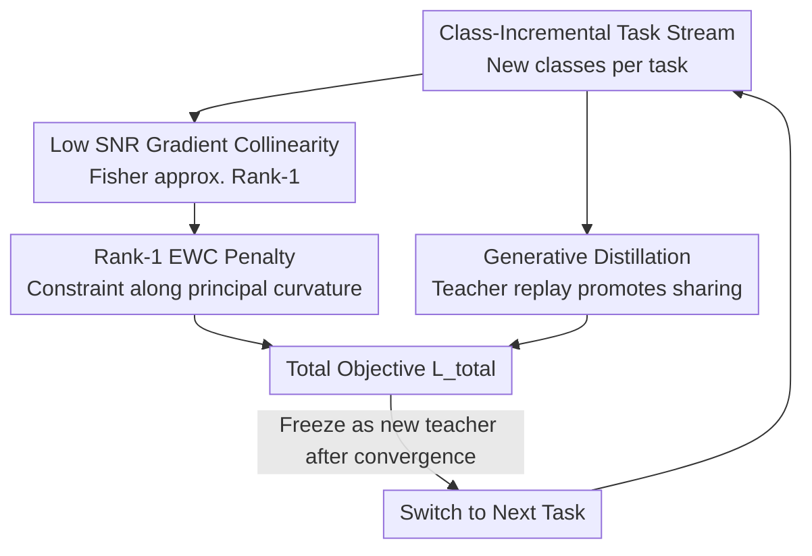

# Avoid Catastrophic Forgetting with Rank-1 Fisher from Diffusion Models

**Conference**: ICLR 2026  
**OpenReview**: [https://openreview.net/forum?id=zCZcbRsc4g](https://openreview.net/forum?id=zCZcbRsc4g)  
**Code**: https://github.com/Teachable-AI-Lab/iclr2026-rank1-fisher  
**Area**: Diffusion Models / Continual Learning  
**Keywords**: Catastrophic Forgetting, Elastic Weight Consolidation, Fisher Information Matrix, Diffusion Models, Class-Incremental Generation

## TL;DR
This paper discovers that per-sample gradients of diffusion models at low SNR timesteps are approximately collinear, causing the empirical Fisher Information Matrix (FIM) to be essentially rank-1. Consequently, a rank-1 EWC penalty is proposed—which is as computationally cheap as diagonal approximation yet captures the principal curvature direction—combined with generative distillation to nearly eliminate forgetting in class-incremental image generation.

## Background & Motivation
**Background**: Continual learning aims to train a model on a sequence of tasks without revisiting all historical data. The core challenge is "catastrophic forgetting," where performance on old tasks drops sharply when learning new ones. Two mainstream approaches to combat forgetting are Elastic Weight Consolidation (EWC) and generative replay. EWC uses a quadratic penalty weighted by the Fisher Information Matrix to "anchor" parameters in directions important to old tasks. Generative replay maintains a generator to sample pseudo-data from old tasks to accompany new task training. For diffusion models, replay is particularly natural due to their high-quality generation capabilities.

**Limitations of Prior Work**: Both routes have significant drawbacks. Replay inherits the generator's flaws, and as the generator itself is continuously updated, the reverse denoising process drifts with tasks, magnifying distributional drift. In practice, EWC almost exclusively uses **diagonal Fisher approximation**, which ignores parameter correlations. This paper further points out that diagonal approximation captures almost no curvature in the low SNR regions of diffusion models—its relative Frobenius error to the true Fisher is close to 1.0 across all timesteps.

**Key Challenge**: EWC implicitly assumes different tasks share an optimal solution (as a quadratic penalty pulls the model toward a region favorable for all tasks). However, in over-parameterized models, different tasks often fall into disjoint basins. Diagonal Fisher loses the only curvature information EWC has. Consequently, "replay for parameter sharing" and "EWC for drift constraint," which should be complementary, fail to work together because the Fisher estimation is too poor.

**Key Insight**: The authors investigate the **gradient geometry** of diffusion models. The starting observation is that diffusion models exhibit an analytic gradient structure at low signal-to-noise ratios, $\text{SNR}=\sqrt{\bar\alpha_t}/(1-\bar\alpha_t)$, specifically at later timesteps. As the model converges, per-sample gradients $g$ become approximately collinear with their mean $\mu=\mathbb{E}[g]$, making the empirical Fisher $F=\mathbb{E}[gg^\top]\approx\alpha\,\mu\mu^\top$ essentially rank-1, with the direction defined by the average gradient.

**Core Idea**: Since the principal curvature direction can be obtained "for free" from model gradients, the diagonal Fisher is replaced with a rank-1 Fisher to construct the EWC penalty (constant cost, higher accuracy). This is coupled with generative distillation to satisfy the "cross-task parameter sharing" premise required by EWC, making replay and EWC truly complementary.

## Method

### Overall Architecture
The method addresses training a single diffusion model on a sequence of class-incremental tasks without forgetting old classes. The workflow centers on task transitions: first, train the diffusion model normally on the current task. Upon convergence, estimate the rank-1 Fisher for the task (an average gradient direction $\mu$ and a scalar coefficient $c^\star$). When moving to the next task, two constraints are added to the loss: an EWC penalty based on the rank-1 Fisher (anchoring parameters along the principal sensitive direction) and generative distillation using the frozen model from the previous task as a teacher (aligning denoising behavior on replayed samples to pull the model toward the shared parameter region). The total objective is used for training, after which the model is frozen as the new teacher for the next cycle.

### Key Designs

**1. Rank-1 Fisher Approximation at Low SNR: Extracting Curvature for "Free"**

This is the theoretical foundation, addressing the failure of diagonal Fisher in diffusion models. From the perspective of denoising score matching, the per-sample loss is $L_{\text{DSM}}(\theta;x_t)=\frac{1-\bar\alpha_t}{2}\lVert s_\theta(x_t,t)-s_t^\star(x_t)\rVert_2^2$. Proposition 1: Using Tweedie's formula, as SNR decreases, the true score $s_t^\star(x_t)\approx -x_t/(1-\bar\alpha_t)$, meaning the denoising network degenerates into a **scaled identity map**. Proposition 2 (with Assumption 1: $s_\theta(x_t,t)\approx A_\theta x_t$ as a linear operator): Substituting the linear form back into the gradient yields:

$$g(\theta;x_t)=(1-\bar\alpha_t)\lVert x_t\rVert^2\,(A_\theta-\gamma_t I)=c(x_t)\,v,$$

where $c(x_t)$ is an input-dependent scalar and $v=A_\theta-\gamma_t I$ is a parameter-space vector independent of $x_t$. Thus, all per-sample gradients are scalings of the same direction $v$, making them collinear with each other and the mean $\mu$. Theorem 1 follows: $F_t(\theta)\approx\mathbb{E}[c^2(x_t)]\,\mu_t\mu_t^\top$, which is rank-1 with eigenvector $\mu_t$ and eigenvalue $\mu_t^\top F_t\mu_t/\lVert\mu_t\rVert^4$. Empirically, the ratio of the first two eigenvalues $\lambda_2/\lambda_1$ for small MNIST models reaches 0.022 at $t=700$. Rank-1 reconstruction error is significantly lower than diagonal approximation (which remains ~1.0) at mid-to-late timesteps. Since $\mu_t$ is highly aligned across timesteps, one can Monte-Carlo sample timesteps to use a single average gradient. **Value**: It captures vital off-diagonal curvature lost by diagonal methods at the same cost as a single average gradient calculation.

**2. Rank-1 EWC Penalty: Reformulating Consolidation via Average Gradients**

The rank-1 structure bypasses the impossibility of constructing a full Fisher matrix. Letting $\mu=\mathbb{E}[g]$ and substituting the rank-1 Fisher into standard EWC with scalar coefficient $c^\star=\mathbb{E}[(\mu^\top g)^2]/\lVert\mu\rVert^4$, the penalty becomes:

$$L_{\text{Rank-1}}(\theta)=L_T(\theta)+\frac{\lambda}{2}\sum_{k=1}^{T-1}c_k^\star\big(\mu_k^\top(\theta-\theta_k^\star)\big)^2.$$

Intuitively, this only penalizes deviations along the "principal sensitive direction $\mu_k$." Unlike coordinate-wise diagonal weights, this explicitly constrains along the true principal eigenvector. It preserves far more curvature information in low SNR regions than diagonal EWC while requiring only gradients—no matrix storage or inversion. The expectation $\mu$ is estimated during training via the joint diffusion sampling process.

**3. Generative Distillation for Parameter Sharing: Supporting EWC Assumptions**

EWC is effective only when task optima lie within the same parameter subspace. In over-parameterized models, these basins are often disjoint, causing EWC to fail (the root cause of high forgetting without distillation). The authors add generative distillation (following Masip et al. 2025): keeping a frozen teacher $\varepsilon_{\theta_{T-1}^\star}$, inputting replayed samples $\tilde x$, and aligning the current model's denoising predictions:

$$L_{\text{GD}}(\theta)=\mathbb{E}_{\tilde x\sim\tilde{\mathcal D}}\Big[\tfrac{1}{2}\lVert\varepsilon_\theta(\tilde x)-\varepsilon_{\theta_{T-1}^\star}(\tilde x)\rVert_2^2\Big].$$

This pulls $\varepsilon_\theta$ back to the manifold compatible with old tasks, guiding gradient descent toward regions overlapping with old optima—**artificially creating the shared optimum assumed by EWC**. The total objective $L_{\text{total}}(\theta)=L_{\text{Rank-1}}(\theta)+L_{\text{GD}}(\theta)$ allows replay to provide cross-task support while rank-1 EWC constrains the residual drift from replay.

### Loss & Training
The total loss is $L_{\text{total}}=L_{\text{Rank-1}}+L_{\text{GD}}$. The backbone is a label-conditioned UNet from HuggingFace (4 ResNet blocks, 128 channels in the first block, 256 in others). Sampling uses DDIM (50 steps, 1000 noise steps). EWC weight $\lambda=15000$. Replay: 1300 images/class for ImageNet-1k, 5000/class for others. Adam optimizer, learning rate $2\times10^{-4}$, batch size 128. Training: 100 epochs/task for ImageNet-1k, 200 for others.

## Key Experimental Results

### Main Results
Class-incremental setup: 5 tasks (2 classes/task) for MNIST/FMNIST/CIFAR-10; 20 tasks (50 classes/task) for ImageNet-1k ($3\times32\times32$) to simulate long-range learning. Metrics: Average FID (AFID↓) and final average forgetting $F$ (↓).

| Method | MNIST AFID/F | FMNIST AFID/F | CIFAR-10 AFID/F | ImageNet-1k AFID/F |
|------|------|------|------|------|
| Non-continual (Upper Bound) | 2.6 / – | 5.7 / – | 23.3 / – | 11.7 / – |
| GD (Distillation only) | 10.1 / 2.3 | 19.1 / 3.9 | 61.2 / 16.6 | 69.0 / 46.2 |
| Diag (Diagonal EWC + GD) | 14.3 / 5.2 | 27.7 / 9.1 | 72.6 / 17.9 | 73.8 / 25.8 |
| **Rank-1 (Ours, +GD)** | **7.6 / 0.6** | **15.4 / 0.9** | **50.5 / 7.4** | **48.5 / 15.2** |

Ours leads across all datasets: forgetting in MNIST/FMNIST is nearly zero ($F=0.6, 0.9$). In long-range ImageNet-1k, forgetting is more than halved compared to "GD only" (15.2 vs 46.2), with generation quality significantly approaching the non-continual upper bound.

### Ablation Study
| Configuration | MNIST AFID/F | ImageNet-1k AFID/F | Note |
|------|------|------|------|
| Diag w/o GD | 62.2 / 51.1 | 86.1 / 34.2 | Diagonal EWC alone |
| Rank-1 w/o GD | 65.2 / 58.3 | 74.3 / 41.3 | Rank-1 EWC alone |
| GD | 10.1 / 2.3 | 69.0 / 46.2 | Distillation only |
| Diag (+GD) | 14.3 / 5.2 | 73.8 / 25.8 | Poor curvature from diagonal |
| Rank-1 (+GD, full) | 7.6 / 0.6 | 48.5 / 15.2 | Complete method |

### Key Findings
- **EWC fails alone; replay is mandatory**: Without distillation, both diagonal and rank-1 EWC suffer extreme forgetting ($F>50$ on MNIST). This confirms that without shared optima basins, EWC pulls the model toward old tasks but away from the new task. Rank-1 EWC shows its value only after distillation creates shared optima.
- **Rank-1 captures curvature better than Diagonal**: Diagonal EWC+GD offers limited improvement or even degrades performance compared to "GD only" (e.g., AFID 14.3 vs 10.1 on MNIST), because diagonal approximation fails to capture diffusion curvature. Rank-1+GD consistently improves AFID and reduces forgetting.
- **Largest gains in long-range tasks**: On the 20-task ImageNet-1k setting, rank-1 slashes forgetting from 46.2 to 15.2, proving that accurate curvature constraints are vital as drift accumulates over long sequences.

## Highlights & Insights
- **Turning "Fisher Estimation" into a free lunch**: Usually, EWC requires an extra pass over data. This paper proves the average gradient at low SNR is the Fisher's principal eigenvector, eliminating extra forward/backward passes—a tangible engineering benefit of analyzing model geometry.
- **Falsifiable and bounded theory**: The authors use VAE (MSE + KL) as a control in Appendix; rank-1 explains only ~50% of the variance. When KL weight is reduced to $10^{-3}$, it rises to ~85%, whereas DDPM (MSE only) is ~99%. This clarifies that rank-1 emerges from the MSE-dominated autoencoding regime and isn't a universal property for all objectives.
- **Transferable trick**: The high alignment of $\mu_t$ across timesteps allows for Monte-Carlo sampling of timesteps for a single average gradient, saving computation. This "directional stability" is useful for any work adding gradient regularization to diffusion.

## Limitations & Future Work
- The core contribution relies on analyzing diffusion gradient geometry. Assumption 1 (linear denoising network $s_\theta \approx A_\theta x_t$) lacks rigorous proof for large-scale non-linear architectures beyond the intuition that UNet skip-connections facilitate PCA-like subspaces. This needs verification across diverse architectures.
- Scale of experiments: Datasets are limited to downsampled $32\times32$ ImageNet-1k and small UNets. Whether the rank-1 conclusion holds for high-resolution, large-scale, or text-conditioned models is unverified.
- Dependency: The method still relies on generative distillation. If replay quality is poor or the teacher drifts, the performance ceiling of the framework is limited.

## Related Work & Insights
- **vs. Diagonal Fisher EWC (Kirkpatrick et al. 2017)**: Classic EWC uses independent coordinate weights, ignoring correlations. This work proves diffusion Fisher curvature resides almost entirely in off-diagonal terms, making diagonal errors ~1.0. Rank-1 constraints along the average gradient direction capture principal curvature at the same cost.
- **vs. Generative Replay/Distillation (Shin et al. 2017; Masip et al. 2025)**: Pure replay/distillation pulls behavior toward old tasks but doesn't explicitly constrain parameter drift. This work uses distillation as a prerequisite for EWC, making them complementary.
- **vs. DDGR/SDDGR (Gao et al. 2023; Kim et al. 2024)**: These focus on using diffusion as a generator for downstream task replay. This work doesn't change the replay mechanism but extracts a better regularization term from diffusion's own geometry.

## Rating
- Novelty: ⭐⭐⭐⭐⭐ High. Linking low SNR collinearity to rank-1 Fisher for EWC is a deep and original insight.
- Experimental Thoroughness: ⭐⭐⭐⭐ Complete across 4 datasets including long-range, though scale and resolution are limited.
- Writing Quality: ⭐⭐⭐⭐⭐ Excellent. The progression from proposition to theorem to method is logical and clear.
- Value: ⭐⭐⭐⭐ Provides a near-zero-cost strong regularizer for diffusion CL.

<!-- RELATED:START -->

## Related Papers

- [\[CVPR 2026\] Low-Rank Residual Diffusion Models](../../CVPR2026/image_generation/low-rank_residual_diffusion_models.md)
- [\[ICML 2026\] Forgetting in Diffusion Models: A Unified Framework via KL Divergence and Likelihood Constraints](../../ICML2026/image_generation/unlearning_in_diffusion_models_a_unified_framework_with_kl_divergence_and_likeli.md)
- [\[ICML 2025\] IntLoRA: Integral Low-rank Adaptation of Quantized Diffusion Models](../../ICML2025/image_generation/intlora_integral_low-rank_adaptation_of_quantized_diffusion_models.md)
- [\[ICLR 2026\] Why Adversarially Train Diffusion Models?](why_adversarially_train_diffusion_models.md)
- [\[ECCV 2024\] Diffusion-Driven Data Replay: A Novel Approach to Combat Forgetting in Federated Class Continual Learning](../../ECCV2024/image_generation/diffusion-driven_data_replay_a_novel_approach_to_combat_forgetting_in_federated_.md)

<!-- RELATED:END -->
