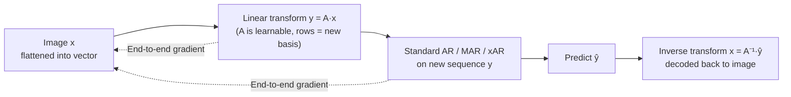

# BAR: Refactor the Basis of Autoregressive Visual Generation

**Conference**: ICLR 2026  
**OpenReview**: [https://openreview.net/forum?id=2m9XQq4Dc3](https://openreview.net/forum?id=2m9XQq4Dc3)  
**Code**: TBD  
**Area**: Image Generation / Autoregressive Visual Generation  
**Keywords**: Autoregressive Generation, Basis Transform, Next-Basis Prediction, Learnable Token Order, ImageNet  

## TL;DR
BAR abstracts the concept of "token sequences" in autoregressive image generation as "projections of image vectors onto a set of basis vectors." By utilizing an end-to-end learnable linear transformation matrix $A$, it unifies various manually designed prediction units and orders (such as VAR/xAR/RAR/PAR/FAR). The model learns the optimal basis automatically, achieving an FID of 1.15 on ImageNet-256.

## Background & Motivation
- **Background**: Autoregressive (AR) models flatten images into 1D token sequences and predict the next token via row-major raster scan order, already surpassing diffusion models in image generation. To adapt to the 2D structure of images, recent works have modified "prediction units" and "prediction orders": VAR uses coarse-to-fine next-scale prediction, MAR changes unidirectional causal attention to bidirectional, xAR groups adjacent tokens into cells, RAR uses random permutation with annealing, PAR predicts weakly dependent tokens in parallel, and FAR generates from low to high frequencies.
- **Limitations of Prior Work**: These improvements **rely heavily on human inductive biases**—VAR relies on coarse-to-fine human perception priors, FAR on frequency hierarchy priors, and xAR on local neighborhood grouping. Diverse priors lead to divergent and contradictory conclusions.
- **Key Challenge**: These methods **lack a unified mathematical framework and formal foundation**. Each design is an ad hoc empirical choice (e.g., PAR's positional grouping, RAR's random permutation, xAR's empirical cells), making it impossible to explain their relationships, determine the truly optimal token unit/order, or search for new strategies beyond manual design.
- **Goal**: To establish a unified framework that encompasses all AR variants involving "reordering/regrouping/remixing token sequences" and to shift the task of determining the sequence from manual design to end-to-end model learning.
- **Core Idea (Basis Autoregressive)**: Each token $x_k$ is viewed as a **projection of the full image vector $x$ onto a basis vector $e_k$ (subspace)**. Thus, "changing the token unit/order" is equivalent to "applying a linear transformation $y=Ax$ to change the basis." The row vectors of $A$ serve as the new basis, and **all prior methods are merely specific forms of $A$**. BAR treats $A$ as a learnable parameter, optimized end-to-end with an AR objective to discover an optimal basis that transcends manual priors.

## Method

### Overall Architecture
After encoding an image into a 2D feature grid, it is flattened into a vector $x \in \mathbb{R}^N$. Standard AR is equivalent to sequentially predicting projections in subspaces spanned by the standard orthonormal basis $\{e_k\}$ (one-hot). BAR inserts a learnable linear transformation $y=Ax$, mapping the sequence to a new space $S'$ for standard AR. Once predicted, it is mapped back using $x=A^{-1}y$. The row vectors $\{a_k\}$ of $A$ constitute the new basis. During training, $A$ is optimized as a learnable parameter alongside the AR Transformer, supported by "residual targets + orthogonal regularization" to ensure the basis is ordered and the transformation is invertible.

### Key Designs

**1. Unified Framework: Tokens as Projections, AR Variants as Special Cases of $A$.** The foundation of BAR is reframing "image modeling" as a projection problem in linear space. The whole image is a vector $x \in \mathbb{R}^N$ (ignoring the channel dimension for simplicity, as the transform can be applied independently per channel). Standard AR partitions the space $S=\mathbb{R}^N$ into subspaces $S_k=\mathrm{span}(e_k)$, determining the projection of $x$ on each $S_k$ step-by-step. BAR introduces a full-rank transform $y=Ax$ ($A=\{a_1,\dots,a_N\}^\top$), predicting projections on new subspaces $S'_k=\mathrm{span}(a_k)$. Crucially, prior "manual designs" can be expressed as specific forms of $A$: in VAR, $a_k$ represents average pooling at different resolutions (multi-scale transform); in xAR, it is a selection matrix for regrouping adjacent tokens; in RAR, it is a random permutation matrix $P_\pi$ annealed to $I$; in FAR, it represents low-pass filters with different cutoff frequencies; in TiTok, it is an abstraction matrix $A \in \mathbb{R}^{M \times N}$ compressing sequences to $M \ll N$. One framework unifies five or six different methods and points out their essence as "re-mix / re-order / re-group."

**2. Learnable Orthogonal Transform: Entrusting Order to End-to-End Optimization.** Since $A$ can describe any manual design, it should be learned rather than manually specified. To narrow the search space without losing generality, BAR makes three constraints: operating only on the sequence dimension; restricting $A$ to a square matrix $\mathbb{R}^{N\times N}$ (minimal modification to existing AR); and focusing on **orthogonal matrices**—since orthogonal transforms preserve the Euclidean norm $\|y\|_2 \equiv \|x\|_2$, which benefits training stability. A key theoretical contribution is the proof of equivalence: the loss of running MAR/xAR on the transformed sequence $y$ is **identical** to the loss on the original sequence $x$ ($L_{\text{BAR}}(y)=L_{\text{MAR}}^{\text{ref}}$). The core of the proof is that the transformed noise $\epsilon'=A\epsilon$ remains i.i.d. Gaussian with identity covariance under orthogonal $A$ ($\Sigma_{\epsilon'}=E[(A\epsilon)(A\epsilon)^\top]=I$). This implies that BAR performs identically to MAR when only network parameters are optimized, but **once $A$ is also learnable, additional gains are achieved**—gains derived entirely from the "learned basis" rather than loss modifications.

**3. Residual Target: Encouraging Early Bases to Carry More Info (Coarse-to-Fine Emergence).** $L_{\text{BAR}}$ alone is insufficient, as the sequential nature of AR requires **early tokens to recover as much of the image as possible**. BAR reformulates the objective as $L_{\text{BAR}}=\frac{\bar\alpha_t}{1-\bar\alpha_t}\|x-A^\top\hat y\|_2^2$, and introduces a residual target:

$$L_{\text{residual BAR}}(y)=\frac{\bar\alpha_t}{1-\bar\alpha_t}\sum_{k=1}^{N}\bigl\|x-A^\top\tilde y_k\bigr\|_2^2,\quad \tilde y_k:=\hat y^\top\Bigl(\sum_{l=1}^{k}e_l\Bigr)$$

where $\tilde y_k$ represents the first $k$ tokens of the predicted sequence $\hat y$ (with the rest zeroed). The intuition is that the first token $y_1$ should maximize recovery of $x$, and subsequent tokens $y_k$ should maximize recovery of the residual $x-A^\top\tilde y_{k-1}$. This resonates with the spirit of VAR/RQ-VAE's residual quantization but is **learned adaptively with fewer priors**. Visualizations confirm that early basis vectors encode facial contours/global structures while later ones encode random details, resulting in a spontaneous coarse-to-fine generation process.

**4. Orthogonal Regularization and Projection: Ensuring Invertibility and Trainability.** To enforce the orthogonality of $A$, BAR uses a regularization term $L_{\text{reg}}=\|A^\top A-I\|_2^2$ combined with an **Orthogonal Procrustes projection**: performing SVD on $A$ to get $USV^\top$, and then clamping singular values to $(1-\delta, 1+\delta)$ ($\delta=0$ for hard projection, $\delta \in (0,1)$ for soft projection), setting $A=US_\delta V^\top$. Ablations show that **regularization alone is too weak, while hard projection limits update directions**; soft projection ($\delta=0.5$) works best. For initialization, the identity matrix $I$ (corresponding to vanilla AR) yields the best results, though random orthogonal initialization also outperforms the baseline.

## Key Experimental Results

### Main Results (ImageNet 256×256 Conditional Generation)

| Type | Model | FID↓ | IS↑ | Pre.↑ | Rec.↑ | Time↓ | #Param↓ |
|------|------|------|------|-------|-------|--------|---------|
| Diff. | DiT | 2.27 | 278.2 | 0.83 | 0.57 | 11.97 | 675M |
| Diff. | REPA | 1.42 | 305.7 | 0.80 | 0.65 | 11.97 | 675M |
| AR | VAR | 1.73 | 350.2 | 0.82 | 0.60 | 0.27 | 2.0B |
| AR | MAR | 1.55 | 303.7 | 0.81 | 0.62 | 28.24 | 943M |
| AR | RAR | 1.48 | 326.0 | 0.80 | 0.63 | - | 1.5B |
| AR | xAR | 1.24 | 301.6 | 0.83 | 0.64 | 0.68 | 1.1B |
| AR | **BAR-B (ours)** | 1.56 | 292.4 | 0.83 | 0.63 | **0.08** | **172M** |
| AR | **BAR-L (ours)** | 1.21 | 301.1 | 0.84 | 0.64 | 0.27 | 608M |
| AR | **BAR-H (ours)** | **1.15** | 327.1 | 0.86 | 0.68 | 0.68 | 1.1B |

BAR-B uses only 172M parameters and takes 0.08s/image, yet its FID of 1.56 surpasses MAR (943M). BAR-H achieves a SOTA FID of 1.15.

### Ablation Study

Gains of adding BAR to different architectures (ImageNet 256):

| Model | FID↓ | +BAR FID↓ |
|------|------|-----------|
| MAR-B | 2.31 | 2.18 |
| MAR-L | 1.78 | 1.56 |
| MAR-H | 1.55 | 1.49 |
| xAR-B | 1.72 | 1.63 |
| xAR-L | 1.28 | 1.24 |
| xAR-H | 1.24 | 1.15 |

Ablation of key components (based on xAR-B, baseline FID 1.72):

| Dimension | Setting | FID↓ |
|------|------|------|
| Initialization | Identity / Orthogonal | 1.63 / 1.66 |
| Orthogonal Projection | None / Hard / Soft(δ=0.5) | 1.70 / 1.66 / 1.63 |
| Training Objective | $L_{\text{BAR}}$ / $L_{\text{residual BAR}}$ | 1.64 / 1.63 |

### Key Findings
- **Plug-and-play**: BAR consistently reduces FID across MAR/xAR (B/L/H variants), proving it is orthogonal to specific AR architectures and model scales.
- **Smaller and Faster**: Due to the learned efficient basis, BAR significantly outperforms in parameter count and inference time (172M, 0.08s/image).
- **Strong Interpretability**: Early learned bases clearly represent face shapes in pixel-space FFHQ, whereas latent-space FFHQ bases are less continuous (explaining why AR works on tokenized images). ImageNet early bases show structure while later ones are random—surpassing any manual design.
- **Generalization to 512 Res and T2I**: Significant improvements over MAR/xAR baselines on ImageNet-512. In text-to-image (JourneyDB training), it achieves an FID 1.36 lower than FAR and a GenEval of 0.39 (vs. 0.37).

## Highlights & Insights
- **Elevating Engineering Tricks to Mathematical Problems**: By using "basis vector projection + linear transform $A$," the paper unifies VAR/xAR/RAR/PAR/FAR/TiTok/FractalGen. This is a brilliant narrative of "building a framework, proving special cases, and finally learning the parameters."
- **Equivalence Proof as a Key Pivot**: Proving that "changing the basis doesn't change the loss" allows performance gains to be attributed cleanly to the "learned basis," logically eliminating concerns about loss modifications.
- **Learned Bases Provide Interpretability**: Early bases correspond to global/contour features, while late bases correspond to details. This spontaneous emergence of coarse-to-fine generation validates manual priors like VAR while suggesting they don't need to be manual.

## Limitations & Future Work
- **Restricted to Orthogonal Square Matrices**: To ensure invertibility and stability, $A$ is restricted to a square orthogonal matrix, sacrificing potential expressive space from changing sequence length (like TiTok compression) or non-orthogonal transforms.
- **Discrete AR Discussed but Not Fully Tested**: Equivalence proofs and main experiments focus on continuous AR (MAR/xAR); learning algorithms for discrete VQ-AR are discussed as special cases but lack exhaustive experimentation.
- **Overhead and Scalability of $A$**: $A \in \mathbb{R}^{N\times N}$ grows quadratically with sequence length. The costs of SVD projection and matrix storage for very long sequences or ultra-high resolutions require deeper analysis.
- **Future Work**: Relaxing non-orthogonal/non-square constraints, jointly training the learnable basis with the tokenizer, and extending to video and multimodal generation are natural directions.

## Related Work & Insights
- **Taxonomy of AR Order/Unit Modifications**: VAR (next-scale), MAR (bidirectional + diffusion loss), xAR (next-X / cell), RAR (random permutation annealing), PAR (parallel weak dependence), FAR (frequency domain). BAR unifies these as special cases of $A$.
- **Residual/Hierarchical Quantization**: Resonates with RQ-VAE and FractalGen's residual ideas, but BAR replaces manual hierarchies with learnable objectives.
- **Insight**: When a field produces many "empirical designs," it often lacks a unifying mathematical framework. Finding that framework (here, basis transform in linear space) allows "human design" to be replaced by "end-to-end learning," unifying understanding while improving performance.

## Rating
- **Novelty**: ⭐⭐⭐⭐⭐ High originality in unifying AR token units/orders via basis transform $A$.
- **Experimental Thoroughness**: ⭐⭐⭐⭐ Covers ImageNet-256/512, T2I, cross-architecture (MAR/xAR), and ablations. Discrete AR experiments are slightly lacking.
- **Writing Quality**: ⭐⭐⭐⭐⭐ Clear progression from framework to proofs to results.
- **Value**: ⭐⭐⭐⭐⭐ Provides SOTA (FID 1.15), is plug-and-play, and offers parameter/speed efficiency. Significant impact on unifying AR visual generation.

<!-- RELATED:START -->

## Related Papers

- [\[ICLR 2026\] SSG: Scaled Spatial Guidance for Multi-Scale Visual Autoregressive Generation](ssg_scaled_spatial_guidance_for_multi-scale_visual_autoregressive_generation.md)
- [\[ICLR 2026\] Next Visual Granularity Generation](next_visual_granularity_generation.md)
- [\[ICCV 2025\] Randomized Autoregressive Visual Generation](../../ICCV2025/image_generation/randomized_autoregressive_visual_generation.md)
- [\[ICLR 2026\] GoT-R1: Unleashing Reasoning Capability of Autoregressive Visual Generation with Reinforcement Learning](got-r1_unleashing_reasoning_capability_of_autoregressive_visual_generation_with_.md)
- [\[ICLR 2026\] Visual Autoregressive Modeling for Instruction-Guided Image Editing](visual_autoregressive_modeling_for_instruction-guided_image_editing.md)

<!-- RELATED:END -->
