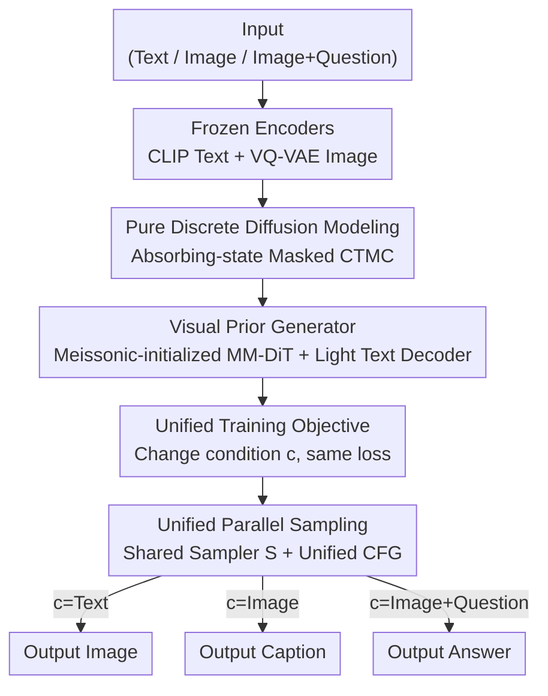

# Beyond Text-to-Image: Liberating Generation with a Unified Discrete Diffusion Model

**Conference**: ICLR2026  
**OpenReview**: [https://openreview.net/forum?id=pG0WTde3pR](https://openreview.net/forum?id=pG0WTde3pR)  
**Code**: https://github.com/M-E-AGI-Lab/Muddit (Model weights: https://huggingface.co/MeissonFlow/Muddit)  
**Area**: Unified Generation / Discrete Diffusion / Multimodal  
**Keywords**: Unified Generative Model, Discrete Diffusion, Visual Priors, Parallel Decoding, MaskGIT

## TL;DR
Muddit integrates text and images into a single absorbing-state (masked) discrete diffusion framework. Utilizing an MM-DiT shared generator initialized from the text-to-image model Meissonic, it performs text-to-image generation, image-to-text generation, and VQA by only switching the condition signal $c$. With 1B parameters, it matches or exceeds the quality and efficiency of significantly larger autoregressive unified models.

## Background & Motivation
**Background**: Unified generative models aim to process cross-modal tasks (T2I, I2T) using a single architecture and decoding paradigm. Current mainstream approaches follow two paths: Autoregressive (AR) routes, which discretize both images and text into token sequences for raster-order generation (Chameleon, LWM, Transfusion, etc.); and hybrid architectures that "glue" AR for text with continuous diffusion for images.

**Limitations of Prior Work**: The AR route is extremely slow for images—generating one image requires predicting thousands of tokens sequentially, leading to high computational overhead. Furthermore, the forced raster order conflicts with the two-dimensional spatial structure of images, limiting the trade-off between speed and quality and making flexible conditional tasks like inpainting difficult. Hybrid "glue" architectures appear unified but actually introduce numerous special tokens and templates into training and inference pipelines. The gap between text and image modeling principles increases system complexity. More recent D-DiT attempts unification under a diffusion framework but still uses continuous diffusion for images and discrete diffusion for text, leading to a fundamental mismatch in generation principles.

**Key Challenge**: True unification requires text and images to share the **same generation principle**. Existing purely discrete unified attempts (UniDisc) achieve unified principles and parallel refinement but suffer from poor quality—failing to even match early Stable Diffusion v1.5—and cannot perform vision-language reasoning like VQA. The authors attribute this to a "lack of strong prior knowledge": UniDisc is trained from scratch without rich priors in any module, hitting a bottleneck in generalization and scaling.

**Goal**: To find a path that maintains **unified principles** (pure discrete diffusion with shared corruption processes and objectives for both modalities) while achieving **high quality** (avoiding training from scratch).

**Key Insight**: The authors observe that MaskGIT-style text-to-image models (like Meissonic) are essentially discrete diffusion models already well-trained on high-resolution T2I, carrying rich "visual priors." Instead of attaching images to language model priors (pretrained dLLMs) as seen in concurrent work, this study does the reverse—**rooting the system in image generation priors** and adding a lightweight text decoder to "grow" language capabilities.

**Core Idea**: Utilize a pure discrete diffusion MM-DiT, initialized from a T2I backbone to obtain strong visual priors, paired with a lightweight text decoder. This allows a single masked diffusion framework to model both text and images simultaneously; only the condition $c$ changes when switching tasks, while loss, decoding, and guidance remains unchanged.

## Method

### Overall Architecture
The core proposition of Muddit is that text and images can share the **exact same** discrete diffusion corruption process and training objective, differing only in the "condition fed to the generator." A sample is treated as a one-hot vector $x\in\{1,\dots,N\}$—where $N$ is the vocabulary size for text and the number of discrete tokens in the VQ codebook for images. The forward process is an absorbing-state continuous-time Markov chain (CTMC): each token can transition to a specialized mask token $m$; once transitioned, it cannot return. The reverse process involves training the model to predict the original clean tokens from masked positions. Since the corruption schedule and objective are identical for any discrete alphabet, the same diffusion backbone naturally unifies text and images.

The architecture consists of six components: a text encoder $E_{txt}$ (frozen CLIP), an image encoder $E_{img}$ (frozen VQ-VAE), a Transformer generator $G$ (an MM-DiT following the dual-stream/single-stream design of FLUX), a sampler $S$, a text decoder $D_{txt}$ (a lightweight linear head), and an image decoder $D_{img}$ (VQ-VAE decoder). Crucially, $G$ is initialized with **Meissonic** weights, directly inheriting spatial structures and semantic correlations from high-resolution T2I. During training, tokens of one modality are randomly masked, and the MM-DiT predicts them back using reweighted cross-entropy. During inference, it starts from a fully masked sequence and iteratively fills them over $T$ steps. All three task types (T2I / I2T / VQA) share the same $G$ and $S$, with the only variation being the source of condition $c$.

### Key Designs

**1. Pure Discrete Diffusion Unifying Text and Images: Sharing the same generation principle**

To address the issues of AR speed/order mismatch, "fake" hybrid unification, and continuous+discrete mismatch, Muddit subsumes both modalities into absorbing-state (masked) discrete diffusion. The forward process masks tokens based on probability, with the marginal distribution written as $q(x_t\mid x)=\text{Cat}\big(x_t\mid \alpha_t x+(1-\alpha_t)m\big)$, where $\alpha_t\in[0,1]$ is the "survival probability" (the probability that a token is not masked at time $t$) and $m$ is the absorbing mask token. The reverse posterior has an analytical form: if $x_t$ is already a real token, it remains unchanged; if $x_t=m$, a convex combination between the mask and clean tokens is performed based on survival probability. Training uses a mask predictor $x_\theta(x_t,\alpha_t)\approx x$, corresponding to the continuous-time negative ELBO:

$$L_{\text{NELBO}}=\mathbb{E}_{q(x_t\mid x)}\Big[\int_0^1 \frac{\alpha_t'}{1-\alpha_t}\log\big(x_\theta(x_t,\alpha_t)\cdot x\big)\,dt\Big].$$

Because this corruption schedule and objective hold for any discrete alphabet $X$, text and images are truly integrated into the **same generation principle**.

**2. Visual Prior Initialization + Lightweight Text Decoder: Filling the prior gap in UniDisc**

UniDisc failed in quality because it was trained from scratch without priors. Muddit initializes the generator $G$ (MM-DiT) with Meissonic's pretrained weights. Since Meissonic is a MaskGIT-style high-resolution T2I model which is naturally discrete diffusion, weights migrate seamlessly, bringing spatial structures and image-text semantics. This visual prior significantly improves sample quality and convergence speed. For the language side, only a **lightweight linear head** $D_{txt}$ is added as a text decoder: CLIP provides text token embeddings, the MM-DiT predicts clean tokens in the shared space, and $D_{txt}$ maps them back to text. Interestingly, the newly added `<mask>` embedding can be predicted as coherent sentences even if frozen, so it is kept frozen throughout. This approach treats "image generation priors" as the backbone and "language ability" as a lightweight incremental growth.

**3. Unified Training Objective—Change Conditions, Not Loss: Sharing parameters for T2I and I2T**

To allow a single parameter set to serve both generation directions, Muddit avoids designing separate losses for each direction. Letting $c$ represent the cross-modal condition (text embedding for image generation, image embedding for caption generation), both directions share the same continuous-time negative ELBO:

$$L_{\text{unified}}=\mathbb{E}_{q(x_t\mid x)}\Big[\int_0^1 \frac{\alpha_t'}{1-\alpha_t}\log\big(G(x_t,\alpha_t,c)\cdot x\big)\,dt\Big].$$

Switching from "text→image" to "image→text" **only involves changing the condition signal $c$, while the loss remains identical**. This symmetry ensures optimization is consistent across both directions. The mask ratio $\gamma_t=1-\alpha_t$ is not fixed at 15% like BERT (which is for completion, not generation). Instead, $\gamma_t$ is continuous on $[0,1]$, monotonically decreasing with boundaries $\gamma_0\to0$ (clean) and $\gamma_1\to1$ (fully masked). The authors use a cosine schedule and sample time steps from a truncated inverse cosine distribution: $\gamma_t=\tfrac{2}{\pi}\big(1-(1-t)^2\big)^{-1/2}$.

**4. Unified Parallel Sampling + Unified CFG: One sampler and one guidance for three tasks**

During inference, the reverse posterior is used as the sampler:

$$S(G,x_t,t)=p_\theta(x_s\mid x_t),\quad \text{keep if } x_t\ne m,\ \ \text{otherwise sample via } (1-\alpha_s)m+\frac{(\alpha_s-\alpha_t)G(x_t,\alpha_t,c)}{1-\alpha_t} \text{ if } x_t=m.$$

Starting from a fully masked sequence, the model predicts a subset of masked tokens in each step and updates them iteratively. Unlike AR models which must learn a fixed order $P(x_i\mid x_{<i})$, the random masking allows the model to learn $P(x_i\mid x_\Lambda)$ (where $\Lambda$ is any observed subset), enabling **parallel sampling** where multiple tokens are predicted simultaneously. The tasks differ only in $c$: T2I uses $c=E_{txt}(\text{prompt})$; I2T uses $c=E_{img}(I)$; VQA concatenates image and question $c=[E_{img}(I),E_{txt}(q)]$ and appends mask tokens for the answer. Even Classifier-Free Guidance (CFG) follows the same rule: $l\leftarrow G(z,\alpha,c)+\lambda\big(G(z,\alpha,c)-G(z,\alpha,c_{\text{neg}})\big)$.

### Loss & Training
A two-stage training approach is used, both employing the unified objective $L_{\text{unified}}$. **Stage 1 (Pre-training)**: 8M image-text pairs (re-captioned using Qwen2.5-VL-3B for consistency). Text is truncated to 77 tokens and images are 512×512. Batches are split evenly between T2I and I2T for 100K steps. **Stage 2 (Instruction Fine-tuning)**: 1M instruction samples (LLaVA-Instruct-150K, ALLaVA, SA-1B, VQAv2), where only the answer part is masked, mixed with 1M high-quality image-text pairs. Constant learning rate $1\times10^{-4}$, weight decay $1\times10^{-2}$, effective batch size 1024, trained on 16 H100 GPUs for 5 days. Inference follows Meissonic's 64-step cosine schedule, with CFG=9.0 for T2I and CFG=1.5 for I2T.

## Key Experimental Results

### Main Results
Text-to-Image evaluation on GenEval (512×512, Post-SFT):

| Model | Arch (Text/Img) | Param (B) | Overall ↑ | Two Obj. | Counting |
|------|------|------|------|------|------|
| Meissonic (1024) | -/Disc. Diff | 1 | 0.54 | 0.66 | 0.42 |
| Monetico (512) | -/Disc. Diff | 1 | 0.44 | 0.48 | 0.26 |
| UniDisc (512) | Disc/Disc | 1.4 | 0.42 | 0.47 | 0.15 |
| SD 3 | -/Diff | 2 | 0.62 | 0.74 | 0.63 |
| D-DiT | Disc/Diff | 2 | 0.65 | 0.80 | 0.54 |
| **Muddit (512)** | **Disc/Disc** | **1** | **0.61** | **0.72** | **0.54** |

Muddit achieves an Overall score of 0.61 with 1B parameters, significantly outperforming other discrete diffusion models like Meissonic (0.54) and UniDisc (0.42), approaching the 2B SD 3 (0.62).

Image-to-Text / VQA (Multimodal Benchmarks):

| Model | Param (B) | CIDEr ↑ | VQAv2 ↑ | MME ↑ | GQA ↑ |
|------|------|------|------|------|------|
| Show-O (512) | 1.3 | - | 69.4 | 1097.2 | 58.0 |
| D-DiT (512) | 2 | 56.2 | 60.1 | 1124.7 | 59.2 |
| UniDisc | 1.4 | 46.8 | - | - | - |
| **Muddit (512)** | **1** | **59.9** | **68.2** | **1107.4** | **57.5** |
| **Muddit (1024)** | 1 | 60.1 | 70.2 | 1139.2 | 57.8 |

CIDEr 59.9 exceeds the diffusion baseline D-DiT (56.2), and VQAv2 68.2% is superior to Show-O and D-DiT.

### Ablation Study

| Config | GenEval | MS-COCO | VQAv2 | Note |
|------|------|------|------|------|
| Joint Training | 61.6 | 59.9 | 68.2 | Full model |
| T2I Only | 59.3 | - | - | GenEval drops 2.3 |
| I2T Only | 28.3 | 60.1 | 69.1 | GenEval drops by >50% |
| Text Loss Weight=0.6 | 61.6 | 59.9 | 68.2 | Best trade-off |
| Text Loss Weight=1.0 | 58.3 | 59.4 | 69.2 | Gen. quality suffers |
| Steps T=32 | 61.9 | 59.7 | 65.4 | Performance elbow |
| Steps T=64 | 61.1 | 59.9 | 68.2 | VQA still rising |

### Key Findings
- **Joint Training is Indispensable**: Training only I2T causes GenEval to crash from 61.6 to 28.3, proving that separating objectives disrupts cross-modal integration.
- **Text Loss Weight Balance**: At 0.6, both GenEval and CIDEr peak. Excessive weight (1.0) improves VQAv2 slightly but significantly degrades generation quality.
- **32 Sampling Steps is the Sweet Spot**: GenEval and CIDEr improve drastically from T=8 to 32 but see diminishing returns thereafter. Discriminative tasks like VQA are less sensitive to step counts.

## Highlights & Insights
- **The "Rooting in Visual Priors" approach**: While most unified models use pretrained dLLMs as the prior root, Muddit reverses this by using a T2I backbone, Inheriting high image quality and adding language capability at a very low cost.
- **Minimalist Unification via Condition Switching**: Compressing multi-task unification into a simple change of $c$ while reusing loss/decoding/CFG is the cleanest design of this paper.
- **Frozen `<mask>` Embeddings**: The discovery that newly added mask embeddings can be predicted as coherent sentences even if frozen provides an efficient engineering shortcut for adding special tokens to discrete diffusion.
- **Parallel Decoding Advantage**: Learning $P(x_i\mid x_\Lambda)$ instead of fixed-order AR allows for multi-token simultaneous prediction, giving discrete diffusion a structural speed advantage over AR unified models.

## Limitations & Future Work
- **Dependency on External Backbones**: Quality largely relies on the Meissonic T2I prior, making it difficult to disentangle the framework's contribution from the quality of the "borrowed" prior.
- **Discriminative Benchmark Gap**: On pure multimodal understanding benchmarks like MME or MMMU, Muddit still lags significantly behind specialized VLMs like InternVL-2.0.
- **I2T Quality Issues**: Some generated captions exhibit repetitions (e.g., "water water"), indicating the lightweight text decoder is not yet robust for long text generation.
- **Future Directions**: Scaling the backbone beyond 1B, exploring more aggressive parallel sampling, and introducing stronger language supervision during SFT to suppress repetition.

## Related Work & Insights
- **vs UniDisc**: Both use pure discrete diffusion. The difference is UniDisc's scratch training results in poor quality (GenEval 0.42), while Muddit's visual prior initialization achieves 0.61 and supports VQA.
- **vs D-DiT**: D-DiT uses continuous diffusion for images and discrete for text (mismatched principles). Muddit is fully discrete, achieving more thorough unification and higher efficiency.
- **vs AR Unified Models (Show-O, Chameleon)**: AR models are slow and structurally mismatched for images. Muddit's parallel discrete diffusion competes effectively with AR models 1.3B to 8B in size using only 1B parameters.

## Rating
- Novelty: ⭐⭐⭐⭐ First pure discrete diffusion unified model with visual priors; the condition-switching paradigm is elegant.
- Experimental Thoroughness: ⭐⭐⭐⭐ Covers T2I/I2T/VQA with comprehensive ablations, though understanding benchmarks are weaker.
- Writing Quality: ⭐⭐⭐⭐ Clear motivation and complete mathematical derivation.
- Value: ⭐⭐⭐⭐ Provides a scalable new path for unified generation using "pure discrete diffusion + visual priors" with open weights.

<!-- RELATED:START -->

## Related Papers

- [\[ICLR 2026\] Continuously Augmented Discrete Diffusion model for Categorical Generative Modeling](continuously_augmented_discrete_diffusion_model_for_categorical_generative_model.md)
- [\[ICLR 2026\] Soft-Di\[M\]O: Improving One-Step Discrete Image Generation with Soft Embeddings](soft-dimo_improving_one-step_discrete_image_generation_with_soft_embeddings.md)
- [\[ICLR 2026\] Improving Discrete Diffusion Unmasking Policies Beyond Explicit Reference Policies (UPO)](improving_discrete_diffusion_unmasking_policies_beyond_explicit_reference_polici.md)
- [\[ICLR 2026\] Consolidating Reinforcement Learning for Multimodal Discrete Diffusion Models](consolidating_reinforcement_learning_for_multimodal_discrete_diffusion_models.md)
- [\[ICCV 2025\] UniVG: A Generalist Diffusion Model for Unified Image Generation and Editing](../../ICCV2025/image_generation/univg_a_generalist_diffusion_model_for_unified_image_generation_and_editing.md)

<!-- RELATED:END -->
