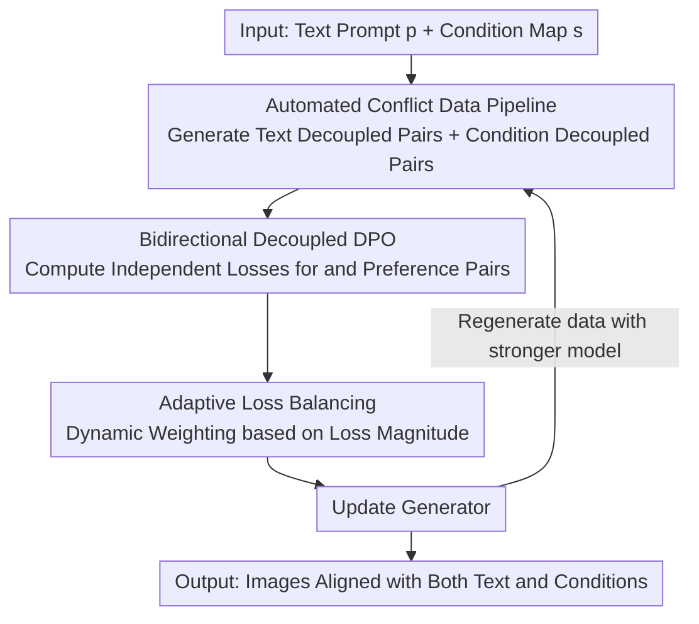

# BideDPO: Conditional Image Generation with Simultaneous Text and Condition Alignment

**Conference**: ICLR2026  
**OpenReview**: [https://openreview.net/forum?id=DNBlGOsIxn](https://openreview.net/forum?id=DNBlGOsIxn)  
**Code**: [Project Page limuloo.github.io/BideDPO](https://limuloo.github.io/BideDPO/)  
**Area**: Diffusion Models / Conditional Image Generation / Preference Optimization  
**Keywords**: Conditional Image Generation, DPO, Gradient Decoupling, Adaptive Loss Balancing, Preference Data

## TL;DR
When text prompts and structural conditions (depth/edges, etc.) conflict, existing controllable generation models often satisfy only one. This paper proposes BideDPO, a bidirectional decoupled DPO framework that splits "text alignment" and "condition alignment" into two independent preference pairs. It utilizes adaptive loss balancing for dynamic weighting and includes a pipeline to automatically construct "conflict-aware preference data" through an iterative self-enhancement loop. On the self-built DualAlign benchmark, it improves text alignment success rates by up to 35%+ while simultaneously enhancing condition fidelity.

## Background & Motivation
**Background**: Conditional image generation (ControlNet series, FLUX-Depth/Canny, Union-Pro2, etc.) injects structural, spatial, or stylistic priors into text-to-image models, which is widely used in design and digital arts. The standard approach involves concatenating encoded condition maps with latent features and training the network end-to-end to follow both text and conditions.

**Limitations of Prior Work**: In practical scenarios, text and conditions frequently **conflict**, and existing models fail to perform nuanced trade-offs. The authors categorize these as: 1) **Input-Level Conflict**, where the condition contains strong semantics contradicting the text (e.g., a real dog's depth map with a "Lego dog" prompt); 2) **Model-Bias Conflict**, where the model's learned generation bias overrides the text even if they are compatible (e.g., "jade texture dog" resulting in real fur).

**Key Challenge**: Such conflicts have no "unique correct answer" and require case-by-case trade-offs. Standard Supervised Fine-Tuning (SFT) provides a fixed "standard answer," which is inherently unsuitable for expressing preference-based trade-offs. While Direct Preference Optimization (DPO) seems appropriate, its direct application faces two issues: ① **Naive DPO fails to balance dual constraints**—using one preference pair (where the positive sample satisfies both and the negative satisfies neither) causes text and condition signals to be **coupled in the same gradient**, where strong signals overwhelm weak ones, typically leading the model to prioritize conditions over text. ② **Lack of decoupled, conflict-aware preference data**—there are no existing DPO datasets specifically for conditional generation, especially for conflict scenarios.

**Goal**: To enable controllable generation models to simultaneously satisfy both text and condition constraints during conflicts, rather than collapsing to a single constraint.

**Key Insight**: Since the root cause is "interference between two learning signals in a single gradient," the signals should be **separated at the source** by constructing independent preference pairs for "text alignment" and "condition alignment," providing each objective with a clean, dedicated gradient direction.

**Core Idea**: Replace the single coupled preference pair of naive DPO with "bidirectional decoupled preference pairs + adaptive loss balancing + automated conflict data construction + iterative self-enhancement" to align both text and conditions under multi-constraint conflicts.

## Method

### Overall Architecture
BideDPO takes a text prompt $p$ and a structural condition map $s$ as input and produces an image satisfying both. The framework consists of three interlocked components: an **automated data pipeline** creates two sets of "decoupled, conflict-aware" preference pairs for each sample; the **bidirectional decoupled DPO algorithm** processes these pairs so that text and condition gradients are optimized independently; **Adaptive Loss Balancing (ALB)** dynamically assigns weights based on current loss magnitudes to prevent training bias. Finally, because the model itself generates the data, the process is embedded in an **iterative optimization loop**.

### Key Designs

**1. Bidirectional Decoupled DPO: Splitting Entangled Gradients**

To address the issue where naive DPO gradients are entangled and weak constraints are overwhelmed, the framework packs text and conditions into a composite context $c=(p,s)$. Assuming the preference score is a linear combination of text and condition components: $f(x,c;\omega)=\varepsilon_{\text{text}}f_{\text{text}}+\varepsilon_{\text{cond}}f_{\text{cond}}$. In naive DPO, targets share a sigmoid factor in the gradient (Eq. 3-4 in the paper); if one target gradient is significantly stronger, the weaker one is masked or even pushed in the wrong direction. BideDPO constructs **two decoupled preference pairs per sample**: a text pair $(x_T^+, x_T^-, c_0)$ where both images match condition $s_0$ but only $x_T^+$ follows the text, and a condition pair $(x_C^+, x_C^-, c_1)$ where both follow the text but $x_C^+$ matches $s_1$ better than $x_C^-$. The losses are calculated independently:
$$\mathcal{L}_{\text{text}}=-\log\sigma\big(f_{\text{text}}(x_T^+,c_0)-f_{\text{text}}(x_T^-,c_0)\big),\quad \mathcal{L}_{\text{cond}}=-\log\sigma\big(f_{\text{cond}}(x_C^+,c_1)-f_{\text{cond}}(x_C^-,c_1)\big).$$
The resulting gradient is a **sum of two fully decoupled terms**, ensuring each objective receives a dedicated optimization signal.

**2. Adaptive Loss Balancing (ALB): Dynamic Weighting**

Decoupling prevents signal suppression, but loss magnitudes may still differ. ALB uses a simple rule: weights are proportional to the current relative loss contribution, using the stop-gradient operator $\text{sg}(\cdot)$ to treat weights as constants for stability:
$$w_{\text{text}}=\text{sg}\!\left(\frac{\mathcal{L}_{\text{text}}}{\mathcal{L}_{\text{text}}+\mathcal{L}_{\text{cond}}}\right),\quad w_{\text{cond}}=\text{sg}(1-w_{\text{text}}),$$
Total Loss $\mathcal{L}=w_{\text{text}}\mathcal{L}_{\text{text}}+w_{\text{cond}}\mathcal{L}_{\text{cond}}$. The intuition is to assign higher weights to the "worse" objective (higher loss) to ensure balanced progress.

**3. Automated Disentangled Conflict-Aware Data Construction**

This fills the gap in conditional DPO data. The pipeline operates in three steps: ① Generate a simple Source Prompt and a detailed Target Prompt $p$ via LLM, then use the Source Prompt to produce an initial condition map $s_0$, naturally creating conflicts with $p$. ② Create a **text decoupled pair** $(x_T^+, x_T^-, p, s_0)$: $x_T^+$ is generated by the Target Prompt and verified by VLM (anchor), while $x_T^-$ is generated by the Source Prompt (lacks text alignment). ③ Create a **condition decoupled pair** $(x_C^+, x_C^-, p, s_1)$: $x_T^+$ is treated as the positive sample $x_C^+$, a strictly aligned condition $s_1$ is extracted from it, and a negative sample $x_C^-$ with looser condition alignment is generated. VLMs verify the quality to isolate text and condition evaluation.

**4. Iterative Optimization: Self-Strengthening Loop**

Since preference data is generated by the current generator, the framework supports iterative refinement. Starting from $G_0$, data is generated to train $G_1$, which then generates higher-quality data for $G_2$. Experiments show that iteration 3 reaches peak performance (text success rate 0.84 → 0.88), though even a single iteration significantly outperforms baselines.

### Loss & Training
The base models are FLUX and its variants (FLUX-Depth/Canny, Union-Pro2). 5,000 samples are generated per round. SFT is performed first (Prodigy optimizer, LR 1.0, 5,000 steps), followed by BideDPO (AdamW, LR 4e-5, weight decay 0.01, 2,000 steps) using LoRA (rank=256).

## Key Experimental Results

### Main Results
Evaluations on the **DualAlign Benchmark** cover Depth, Canny, SoftEdge, and Style conditions (100 cases each). Metrics include Success Rate (SR) via Qwen2.5-VL-72B, CLIP Score, and structural fidelity (MSE/F1/SSIM), alongside semantic-guided versions (SGMSE/SGF1/SGSSIM) that penalize text failures.

| Method (Depth) | SR↑ | MSE↓ | SGMSE↓ | CLIP↑ |
|--------|------|------|--------|-------|
| Union-Pro2 | 0.49 | 177.0 | 272.4 | 0.2748 |
| Union-Pro2 + SFT | 0.70 | 262.2 | 332.5 | 0.2915 |
| Union-Pro2 + DPO | 0.71 | 168.3 | 219.9 | 0.2860 |
| **Union-Pro2 + Ours** | **0.84** | **164.0** | **195.7** | 0.2924 |
| FLUX-Depth | 0.76 | 233.6 | 282.8 | 0.2899 |
| FLUX-Depth + DPO | 0.89 | 171.9 | 195.0 | 0.2974 |
| **FLUX-Depth + Ours** | **0.91** | **145.9** | **164.4** | **0.2982** |

For Canny, Union-Pro2 SR improved from 0.34 to 0.68 (+34%). Robustness tests on COCO also showed consistent gains.

### Ablation Study

| Config | SR↑ | MSE↓ | SGMSE↓ | CLIP↑ | Note |
|------|------|------|--------|-------|------|
| Iter=3 (Ours) | **0.88** | 159.6 | **190.3** | **0.2957** | Optimal |
| Iter=1 | 0.84 | 164.0 | 195.7 | 0.2924 | Significant gain |
| w/o ALB | 0.78 | 157.7 | 205.2 | 0.2862 | SR drops by 6% |
| Text Only | 0.88 | 258.9 | 287.7 | 0.2947 | MSE explodes |
| Cond. Only | 0.59 | 153.7 | 218.7 | 0.2753 | SR collapses |

### Key Findings
- **Decoupling is essential for dual alignment**: Using only text pairs improves text but sacrifices conditions, and vice versa. Balanced optimization requires both.
- **ALB contribution**: Removing ALB leads to a drop in SR and worse SGMSE, proving dynamic weighting prevents collapse.
- **DPO exceeds SFT**: SFT improves SR but often at the cost of fidelity, whereas BideDPO improves both.

## Highlights & Insights
- **Diagnosing "Gradient Entanglement"**: The paper identifies the root cause as signal interference in naive DPO and treats it by splitting preference pairs.
- **Clever Preference Construction**: Fixing one dimension while varying the other systematically isolates constraints.
- **Self-Enhancement Loop**: The transition from model generation to training creates a data-efficient spiral without manual labeling.
- **Semantic-Guided Metrics**: Metrics like SGMSE effectively penalize models that perfectly "copy" conditions while ignoring text.

## Limitations & Future Work
- **VLM Quality Ceiling**: The pipeline heavily relies on VLMs for quality control; VLM errors directly contaminate preference data.
- **Automated Evaluation**: Lack of large-scale human evaluation; reliance on automated SR metrics may have bias.
- **Iterative Cost**: Training multiple rounds with 5,000 samples each is computationally expensive.
- **Synthetic Conflict Scenarios**: The benchmark relies on synthetic conflicts; real-world user prompt distribution may differ.

## Related Work & Insights
- **Vs. Naive Diffusion-DPO**: Diffusion-DPO uses coupled pairs where gradients interfere; BideDPO-decoupled gradients allow simultaneous alignment.
- **Vs. ControlNet Variants**: These focus on "how to inject conditions," while BideDPO acts as a post-training method to resolve "how to weigh conflicts."

## Rating
- Novelty: ⭐⭐⭐⭐⭐ Formalizes "text-condition conflict" and provides a decoupled solution.
- Experimental Thoroughness: ⭐⭐⭐⭐ Broad modality coverage but lacks human evaluation.
- Writing Quality: ⭐⭐⭐⭐⭐ Clear causal reasoning from phenomenon to optimization dynamics.
- Value: ⭐⭐⭐⭐⭐ A plug-and-play post-training method for highly practical issues.

<!-- RELATED:START -->

## Related Papers

- [\[CVPR 2026\] DynFusion: Rethinking Condition Fusion for Adaptive Multi-Conditional Text-to-Image Generation](../../CVPR2026/image_generation/dynfusion_rethinking_condition_fusion_for_adaptive_multi-conditional_text-to-ima.md)
- [\[ICLR 2026\] Condition Errors Refinement in Autoregressive Image Generation with Diffusion Loss](condition_errors_refinement_in_autoregressive_image_generation_with_diffusion_lo.md)
- [\[ICLR 2026\] Condition Matters in Full-head 3D GANs](condition_matters_in_full-head_3d_gans.md)
- [\[ICLR 2026\] Beyond Text-to-Image: Liberating Generation with a Unified Discrete Diffusion Model](beyond_text-to-image_liberating_generation_with_a_unified_discrete_diffusion_mod.md)
- [\[ICLR 2026\] CreatiDesign: A Unified Multi-Conditional Diffusion Transformer for Creative Graphic Design](creatidesign_a_unified_multi-conditional_diffusion_transformer_for_creative_grap.md)

<!-- RELATED:END -->
