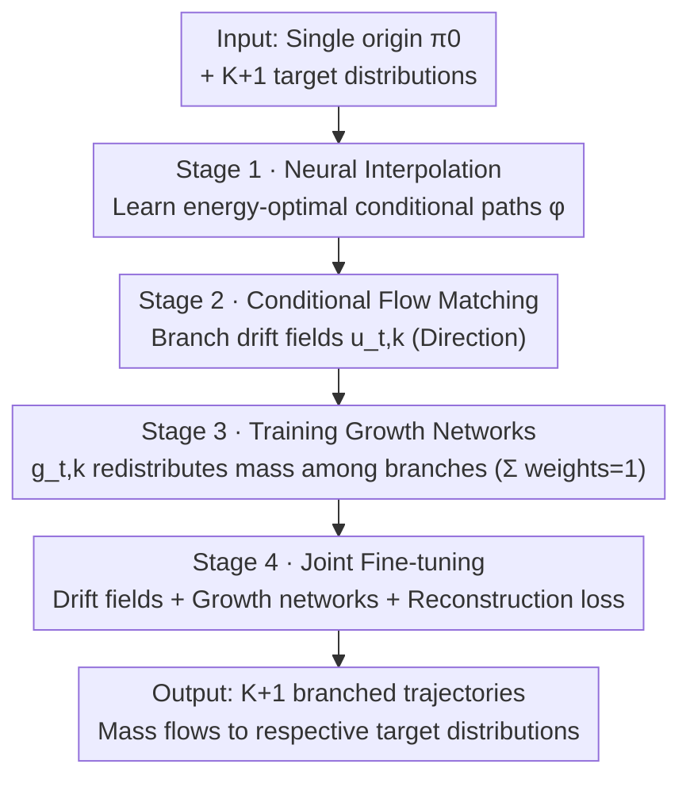

# Branched Schrödinger Bridge Matching

**Conference**: ICLR 2026  
**arXiv**: [2506.09007](https://arxiv.org/abs/2506.09007)  
**Code**: [HuggingFace](https://huggingface.co/ChatterjeeLab/BranchSBM)  
**Area**: Image Generation / Generative Model Theory  
**Keywords**: Schrödinger Bridge, Branched Trajectories, Flow Matching, Cell Fate Differentiation, Optimal Transport

## TL;DR
The authors propose the BranchSBM framework, which extends Schrödinger Bridge Matching to branching scenarios by parameterizing multiple time-dependent velocity fields and growth processes. This approach models bifurcating dynamic trajectories from a single initial distribution to multiple target distributions, significantly outperforming single-branch methods in tasks such as LiDAR surface navigation and single-cell perturbation modeling.

## Background & Motivation
Predicting intermediate trajectories between an initial distribution and a target distribution is a central problem in generative modeling. Existing methods like Flow Matching and Schrödinger Bridge Matching (SBM) effectively learn mappings between two distributions, but they model a **single stochastic path**, which inherently can only handle unimodal transitions.

**Key Challenge**: Many real-world systems exhibit **branching dynamics**—evolving from a common origin state and bifurcating into multiple distinct terminal distributions. Examples include:
- **Cell Fate Differentiation**: Homogeneous progenitor cell populations differentiating into various cell types during development.
- **Drug Perturbation Response**: A single cell line producing multiple different phenotypic outcomes after drug treatment.
- **Path Planning**: Multi-path navigation from a single starting point to various destinations.

Current single-path SBM methods cannot model this branching behavior. When the target distribution is multimodal, single-branch methods either suffer from mode collapse (reaching only the lowest energy mode) or generate trajectories that fail to accurately reach all terminal states.

**Key Insight**: This work generalizes SBM to branching scenarios by learning a set of branched Schrödinger bridges. Each branch has an independent drift field and growth rate, which together describe the bifurcation dynamics of a population from a single origin to multiple destinations.

## Method

### Overall Architecture
BranchSBM aims to learn trajectories that bifurcate from one origin to multiple destinations. Given an initial distribution $\pi_0$ and $K+1$ target distributions $\{\pi_{1,k}\}_{k=0}^{K}$, single-branch SBM can only fit one path and collapses when faced with multimodal terminal states. The core mechanism is to assign an independent velocity network $u_{t,k}^\theta$ (determining where the branch goes) and a growth network $g_{t,k}^\phi$ (determining how much mass flows into the branch) to each branch $k$. These are learned through phased training to decouple the two components, ultimately obtaining a family of branched trajectories that start from the same origin, redistribute mass over time among branches, and flow toward respective target distributions. The entire pipeline decouples "where to go" and "how to distribute mass" into two sets of networks learned across four stages, as illustrated below.

### Key Designs

**1. Unbalanced Conditional Stochastic Optimal Control (Unbalanced CondSOC): Allowing mass flow between branches**

Standard SBM assumes mass conservation—where each unit of initial mass corresponds one-to-one to a terminal state. This is the fundamental reason it cannot handle branching: a unified population cannot "split" into multiple targets under conservation constraints. BranchSBM introduces a time-dependent weight $w_t(X_t)$ driven by a growth rate $g_t(X_t)$ into the standard GSB problem. This allows mass from a primary branch to transfer to secondary branches over time, transforming "bifurcation" into a modelable continuous process. **Proposition 1** proves that this Unbalanced GSB problem can be solved efficiently by conditioning on endpoint pairs, decomposing a population-level optimization problem into sampleable conditional subproblems.

**2. Branched Generalized Schrödinger Bridge Problem: Sum of unbalanced subproblems**

Using Unbalanced CondSOC as a building block, BranchSBM formalizes the branched GSB problem as the sum of multiple Unbalanced GSB problems. The primary branch ($k=0$) starts with a weight of 1, while $K$ secondary branches start with a weight of 0. The process satisfies the mass conservation constraint $\sum_{k=0}^{K} w_{t,k} = 1$ for all time $t$—meaning total mass is conserved at any moment, and mass is only redistributed between branches without being created or destroyed. **Proposition 2** demonstrates that this branched CondSOC problem can be decomposed into independent branch subproblems, allowing each branch to be trained separately to avoid direct high-dimensional coupling.

**3. Four-stage Training Strategy: Decoupling drift and growth learning**

Since joint optimization of drift fields and growth rates is difficult, BranchSBM splits training into four progressive steps. Stage 1 is neural interpolation: training an interpolation network $\varphi_{t,\eta}(\mathbf{x}_0, \mathbf{x}_{1,k})$ to learn energy-optimal conditional paths under a state cost $V_t(X_t)$, minimizing kinetic and potential energy via a trajectory loss $\mathcal{L}_{\text{traj}}$. Stage 2 is conditional flow matching: training branch drift networks $u_{t,k}^\theta$ to match the conditional velocity fields from Stage 1 using standard CFM loss $\mathcal{L}_{\text{flow}}$. Stage 3 fixes the drift networks and trains growth networks $g_{t,k}^\phi$ by optimizing a composite loss: branch energy loss $\mathcal{L}_{\text{energy}}$ for energy distribution, weight matching loss $\mathcal{L}_{\text{match}}$ for terminal target alignment, and mass conservation loss $\mathcal{L}_{\text{mass}}$. Stage 4 unfreezes all parameters for joint fine-tuning with an added reconstruction loss $\mathcal{L}_{\text{recons}}$. This stepwise refinement avoids the instability of simultaneous optimization.

**4. Theoretical Guarantees: From optimality to unidirectional mass flow**

BranchSBM is supported by a series of theorems. **Proposition 3** ensures that Stage 1+2 training yields the optimal drift for the GSB problem, indicating no loss of optimality from decoupling. **Proposition 4** proves the existence of an optimal growth function using direct methods in the calculus of variations. **Lemma 2** proves that the optimal growth rate for secondary branches is non-decreasing—meaning mass only flows out of the primary branch and does not return, aligning with biological intuition that population differentiation from a single origin is generally irreversible.

### Loss & Training
- Stage 1 uses Adam optimizer, lr=1e-4.
- Stage 2-4 use AdamW optimizer, lr=1e-3, weight decay=1e-5.
- Each stage trained for up to 100 epochs.
- Model architecture: 3-layer MLP with SELU activation.
- Growth network secondary branch outputs use softplus to ensure non-negativity.
- State costs use data-dependent LAND metrics (low-dim) or RBF metrics (high-dim).

## Key Experimental Results

### Main Results

| Dataset | Metric | BranchSBM | Single-branch SBM | Description |
|--------|------|-----------|-----------|------|
| LiDAR Surface Navigation | $\mathcal{W}_1$ / $\mathcal{W}_2$ | **Significantly lower** | High | Branch paths bypass both sides of the ridge |
| Mouse Hematopoiesis (t₁) | $\mathcal{W}_1$ / $\mathcal{W}_2$ | **Significantly lower** | High | Accurate prediction at intermediate time points |
| Mouse Hematopoiesis (t₂) | $\mathcal{W}_1$ / $\mathcal{W}_2$ | **Significantly lower** | High | Accurate terminal cell fate reconstruction |
| Clonidine Perturbation (50PC) | MMD / $\mathcal{W}_1$ / $\mathcal{W}_2$ | **Best** | Only reached cluster0 | Single branch fails to reach all terminal states |
| Clonidine Perturbation (100PC) | MMD | Better than 50PC single-branch | - | Validates high-dimensional scalability |
| Clonidine Perturbation (150PC) | MMD | Better than 50PC single-branch | - | Dimensionally scalable |
| Trametinib Perturbation (3-branch) | MMD / $\mathcal{W}_1$ / $\mathcal{W}_2$ | **Best** | Only reached cluster0 | Validates 3-branch capability |

### Ablation Study

| Configuration | Key Metrics | Description |
|------|---------|------|
| Stage 3 only (Fixed drift) | $\mathcal{L}_{\text{energy}}$ Higher | Independent training of growth network |
| Stage 3+4 (Joint training) | $\mathcal{L}_{\text{energy}}$ Lower | Joint optimization further reduces energy |
| $\mathcal{L}_{\text{match}}$ | → 0 | Accurate terminal weight matching |
| $\mathcal{L}_{\text{mass}}$ | → 0 | Mass conservation satisfied |

### Key Findings
- **Single-branch SBM suffers from mode collapse**: When facing multimodal targets, single-branch methods only reach the lowest energy mode, completely ignoring other terminal states.
- **Automatic Learning of Branching Time**: In LiDAR experiments, the model automatically initiates branching at the ridge edge—showing the framework learns optimal branching moments from data.
- **High-dimensional Scalability**: BranchSBM works effectively across 50 to 150 principal component dimensions in single-cell perturbation experiments.
- **Reasonable Mass Transfer Dynamics**: Weight curves show smooth mass transfer from the primary to secondary branches, consistent with biological intuition.
- **Effective Multi-branching**: The Trametinib experiment demonstrates the framework extends successfully to more than two branches.

## Highlights & Insights
- **Novel and Important Problem Definition**: First to formally define and solve the branched Schrödinger bridge problem, filling a gap in generative model theory.
- **Solid Theory**: Provides a complete theoretical framework (Propositions 1-4) including existence, uniqueness, and constructive proofs.
- **Elegant Four-stage Training**: Decoupling drift and growth learning avoids the difficulties of joint optimization.
- **Clear Application Scenarios**: Cell fate differentiation and perturbation response are core problems in computational biology; this provides a principled solution.
- **Deep Connections to Flow Matching and OT**: Reduces to standard GSBM when growth rates are zero, theoretically unifying multiple methods.

## Limitations & Future Work
- **Manual Branch Specification**: Requires pre-specifying $K$ (e.g., via clustering) rather than automatically discovering branch structures.
- **OT Pairing Overhead**: Endpoint pairing relies on optimal transport plans, which may be computationally expensive for large-scale data.
- **Verification Limited to Low-to-Mid Dimensions (2-150D)**: Scalability to genome-wide scales (tens of thousands of dimensions) remains unverified.
- **Simple MLP Architecture**: More complex architectures (e.g., Transformers, GNNs) might improve performance.
- **Limited Use of Intermediate Data**: Primarily trained on endpoint data; utilizing intermediate snapshots could further enhance accuracy.
- **Biological Validation**: Lacks extensive comparison with specialized computational bio methods like CellOT or PRESCIENT.

## Related Work & Insights
- **Schrödinger Bridge**: A classical problem by Schrödinger (1931), recently revitalized in generative modeling (De Bortoli et al., 2021; Shi et al., 2023).
- **Flow Matching**: Conditional Flow Matching (Lipman et al., 2023) provides the theoretical basis for Stage 2.
- **Generalized SBM**: Liu et al. (2023) introduced state costs; BranchSBM adds branching mechanisms on this basis.
- **Unbalanced Optimal Transport**: Chizat et al. (2018) and Pariset et al. (2023) studied transport problems with non-conserved mass.
- **Single-cell Trajectory Inference**: Schiebinger et al. (2019) and Bunne et al. (2023) used OT methods to model cell state transitions.
- **Inspiration**: Can attention mechanisms be introduced to let the model learn branching structures automatically? Can it handle scenarios where branches merge?

## Rating
- Novelty: ⭐⭐⭐⭐⭐
- Experimental Thoroughness: ⭐⭐⭐⭐
- Writing Quality: ⭐⭐⭐⭐⭐
- Value: ⭐⭐⭐⭐

<!-- RELATED:START -->

## Related Papers

- [\[NeurIPS 2025\] Schrödinger Bridge Matching for Tree-Structured Costs and Entropic Wasserstein Barycentres](../../NeurIPS2025/image_generation/schrödinger_bridge_matching_for_tree-structured_costs_and_entropic_wasserstein_b.md)
- [\[ICLR 2026\] Diffusion & Adversarial Schrödinger Bridges via Iterative Proportional Markovian Fitting](diffusion_adversarial_schrödinger_bridges_via_iterative_proportional_markovian_f.md)
- [\[NeurIPS 2025\] Dynamic Diffusion Schrödinger Bridge in Astrophysical Observational Inversions](../../NeurIPS2025/image_generation/dynamic_diffusion_schrödinger_bridge_in_astrophysical_observational_inversions.md)
- [\[ICLR 2026\] Source-Guided Flow Matching](source-guided_flow_matching.md)
- [\[ICLR 2026\] Flow Matching with Semidiscrete Couplings](flow_matching_with_semidiscrete_couplings.md)

<!-- RELATED:END -->
