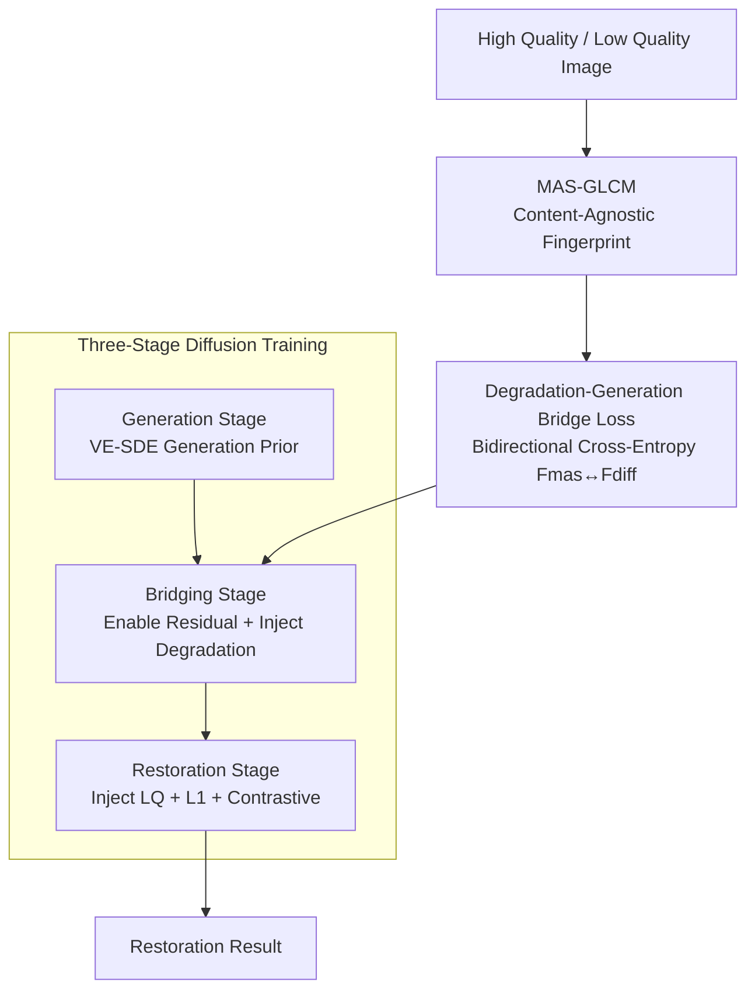

# Bridging Degradation Discrimination and Generation for Universal Image Restoration

**Conference**: ICLR 2026  
**arXiv**: [2602.00579](https://arxiv.org/abs/2602.00579)  
**Code**: None  
**Area**: Image Generation  
**Keywords**: Universal Image Restoration, GLCM Degradation Representation, Diffusion Models, Three-stage Training, all-in-one restoration  

## TL;DR
BDG achieves fine-grained degradation discrimination through Multi-Angle Multi-Scale Gray Level Co-occurrence Matrix (MAS-GLCM) and designs a three-stage diffusion training (generation → bridging → restoration) to seamlessly fuse degradation discrimination capabilities with generative priors, yielding significant fidelity gains in all-in-one restoration and real-world super-resolution tasks.

## Background & Motivation
**Background**: Universal image restoration requires a single model to handle multiple degradation types, necessitating both degradation discrimination and conditional generation capabilities.

**Limitations of Prior Work**:
   - **Degradation Discrimination Route** (e.g., AirNet, PromptIR): These incorporate auxiliary networks to identify degradation types but often produce over-smoothed outputs due to L1/L2 losses, performing poorly in real-world scenarios.
   - **Generative Prior Route** (e.g., StableSR, DiffBIR): These leverage pretrained diffusion models to restore rich textures but tend to misinterpret mild degradations as severe in all-in-one settings, generating details inconsistent with the original images.

**Key Challenge**: Degradation discrimination and generative priors have evolved as two independent capabilities; a unified framework to integrate them organically is lacking.

**Goal**: To inject fine-grained degradation discrimination into diffusion models while maintaining their generative priors, enabling the model to adaptively adjust its output based on degradation severity.

**Key Insight**: A new degradation representation (MAS-GLCM) combined with a three-stage diffusion training strategy is proposed to gradually bridge discriminative information into the generation process.

**Core Idea**: Gray Level Co-occurrence Matrix is utilized as a content-agnostic degradation representation. This information is aligned with diffusion model features through three-stage training to achieve a unification of discrimination and generation.

## Method

### Overall Architecture
The core challenge BDG addresses is the conflict between the generative prior's ability to hallucinate rich textures and the discriminative need to identify degradation types. The overall approach quantifies "how the degradation looks" using a content-agnostic degradation fingerprint (MAS-GLCM). The training is partitioned into three sequential stages—generation, bridging, and restoration—by toggling three coefficients within the same reverse diffusion update formula. The bridging stage acts as a pivotal hub, using bidirectional alignment losses to "weld" the degradation fingerprint into the intermediate features of the diffusion model, thus injecting discriminative information into the generative process without an external secondary network.

### Key Designs

**1. Multi-Angle Multi-Scale Gray Level Co-occurrence Matrix (MAS-GLCM): Creating a content-agnostic degradation fingerprint.**

Universal restoration is difficult because the model must recognize degradation without being distracted by image semantics. Common clues like Sobel, Laplace, or frequency spectra are coupled with content; for example, blur characteristics extracted from a building versus a face vary significantly. BDG adopts GLCM, which counts the co-occurrence frequency of pixel pairs at specific distances and directions. These statistics describe texture "granularity" while naturally discarding content. To avoid local bias, the GLCM is averaged across multiple angles $\Theta$ and scales $L$:

$$M_{mas} = \frac{1}{n \times m} \sum_{i,j} M_{L_i \cdot \sin(\Theta_j),\, L_i \cdot \cos(\Theta_j)}$$

The resulting fingerprint is stable and discriminative: a simple KNN achieves 97.13% accuracy in degradation type classification (vs. 65.80% for frequency spectra) and 74.17% in fine-grained degradation levels (vs. 30.83% for frequency spectra). This content-agnosticism allows the model to distinguish between light and heavy degradation.

**2. Three-stage Diffusion Training: Smoothly transitioning from generation to discriminative restoration via unified parameter switching.**

Discriminative ability and generative priors often conflict when combined naively. BDG formulates the entire training process using a single reverse update equation, switching current learning objectives by toggling three coefficients:

$$x_{t-1} = x_t - \alpha_t x_{res}^\theta - \frac{\beta_t^2}{\bar{\beta}_t} \epsilon^\theta + \delta_t x_{lq}$$

In the **Generation Stage**, $\alpha_t \equiv 0$ and $\delta_t \equiv 0$, reducing the formula to standard VE-SDE denoising where the model learns generative priors on high-quality images. In the **Bridging Stage**, the residual term is enabled ($\delta_t \equiv 0$, but $\alpha_t x_{res}$ is activated). Since residuals carry degradation information, the model begins processing degradation conditions. Simultaneously, MAS-GLCM features $F_{mas}$ are aligned with diffusion intermediate features $F_{diff}$ via bidirectional cross-entropy, while an MLP performs degradation classification to prevent loss of discriminative power during alignment. In the **Restoration Stage**, $\delta_t x_{lq}$ is enabled to inject low-quality images directly for fidelity, and degradation classification shifts to all-negative contrastive learning to handle real-world degradations that lack clean labels. Ablations show that skipping the bridging stage leads to significant fidelity drops.

**3. Degradation-Generation Bridging Loss: Welding the degradation fingerprint into diffusion features.**

The bridging stage ensures that diffusion features can "perceive" the MAS-GLCM information. A symmetric bidirectional alignment loss is employed: predicting diffusion features from GLCM features (m2d) and vice versa (d2m), with averaged cross-entropy:

$$\mathcal{L}_{bridge} = \frac{1}{2}\big[\text{H}(y^{m2d}, p^{m2d}) + \text{H}(y^{d2m}, p^{d2m})\big]$$

This bidirectional constraint ensures tighter alignment. Combined with generation and classification losses, the total objective uses a small weight $\lambda = 0.1$ to balance bridge terms and preserve original generative capabilities:

$$\mathcal{L}_{bdg} = \mathcal{L}_{gen} + \lambda\,(\mathcal{L}_{bridge} + \mathcal{L}_{deg\text{-}cls})$$

### Loss & Training
- **Generation Stage**: Standard denoising loss (noise prediction + residual prediction).
- **Bridging Stage**: Denoising + feature alignment + degradation classification.
- **Restoration Stage**: L1 fidelity loss + bridge loss + all-negative contrastive learning.
- Real-world degradations are simulated using the Real-ESRGAN degradation chain, defining 8 intermediate states as "degradation order" pseudo-labels.

## Key Experimental Results

### Main Results — All-in-One Restoration

| Method | Route | Fidelity (PSNR↑) | Perceptual Quality (LPIPS↓) |
|------|------|-------------|---------------|
| PromptIR | Discriminative | High | Poor (Over-smoothed) |
| DiffBIR | Generative | Low (Inconsistent) | Good |
| **BDG (Ours)** | **Unified** | **Significant Gain** | **Maintained** |

### Ablation Study — MAS-GLCM Discrimination Ability

| Degradation Rep. | Type Acc (%) | Level Acc (%) |
|---------|---------------|---------------|
| LQ Image | 51.44 | 20.00 |
| Sobel (Gradient) | 40.80 | 23.33 |
| Laplace (Gradient) | 83.05 | 20.83 |
| Fourier (Frequency) | 65.80 | 30.83 |
| **MAS-GLCM** | **97.13** | **74.17** |

### Key Findings
- **MAS-GLCM significantly outperforms existing representations**: It leads Fourier transformers by 43 percentage points in fine-grained degradation level classification.
- **Three-stage training is indispensable**: Omitting the bridging stage results in a significant decline in fidelity.
- **Generative priors are successfully preserved**: Texture richness matches pure generative models while fidelity is substantially improved.
- **Architectural consistency**: BDG improves performance through training strategies and loss design without modifying the network structure.

## Highlights & Insights
- The **content-agnostic property of MAS-GLCM** is a major highlight; it isolates texture statistics from image semantics, ensuring degradation discrimination is not biased by content.
- **Elegant three-stage transition**: The progression from generation to bridging to restoration systematically evolves the model's capabilities by gradually introducing parameters of the diffusion formula.
- **Refinement of degradation classification to contrastive learning**: Utilizing discrete labels in bridging and all-negative contrastive learning in restoration reflects a pragmatic approach to ill-defined real-world degradations.

## Limitations & Future Work
- MAS-GLCM requires manual selection of angle and scale parameters.
- The three-stage training process increases complexity.
- "Order classification" for real-world degradation uses approximate pseudo-labels that may not fully reflect reality.
- The method has not yet been verified in temporal scenarios like video restoration.

## Related Work & Insights
- **vs. PromptIR/AirNet**: These utilize external networks but produce smooth outputs; BDG integrates discrimination within the diffusion process.
- **vs. DiffBIR/StableSR**: These utilize generative priors but lack degradation awareness, leading to poor fidelity in all-in-one tasks; BDG resolves this via MAS-GLCM bridging.
- **vs. DiffUIR**: DiffUIR focuses on predicting residuals but loses the generative prior; BDG predicts both noise and residuals to maintain the prior.

## Rating
- Novelty: ⭐⭐⭐⭐ MAS-GLCM and the three-stage design are highly innovative.
- Experimental Thoroughness: ⭐⭐⭐⭐ Solid validation across classification and restoration, though could benefit from more quantitative baselines.
- Writing Quality: ⭐⭐⭐⭐ Clear derivation, though requires close attention to notation.
- Value: ⭐⭐⭐⭐ Providing a unified approach for discrimination and generation offers significant insights for the image restoration field.

<!-- RELATED:START -->

## Related Papers

- [\[CVPR 2026\] Face2Scene: Using Facial Degradation as an Oracle for Diffusion-Based Scene Restoration](../../CVPR2026/image_generation/face2scene_using_facial_degradation_as_an_oracle_for_diffusion-based_scene_resto.md)
- [\[ICLR 2026\] Scalable Energy-Based Models via Adversarial Training: Unifying Discrimination and Generation](scalable_energy-based_models_via_adversarial_training_unifying_discrimination_an.md)
- [\[CVPR 2025\] GenDeg: Diffusion-based Degradation Synthesis for Generalizable All-In-One Image Restoration](../../CVPR2025/image_generation/gendeg_diffusion-based_degradation_synthesis_for_generalizable_all-in-one_image_.md)
- [\[CVPR 2025\] V-Bridge: Bridging Video Generative Priors to Versatile Few-shot Image Restoration](../../CVPR2025/image_generation/v-bridge_bridging_video_generative_priors_to_versatile_few-shot_image_restoratio.md)
- [\[ICLR 2026\] JointDiff: Bridging Continuous and Discrete in Multi-Agent Trajectory Generation](jointdiff_bridging_continuous_and_discrete_in_multi-agent_trajectory_generation.md)

<!-- RELATED:END -->
