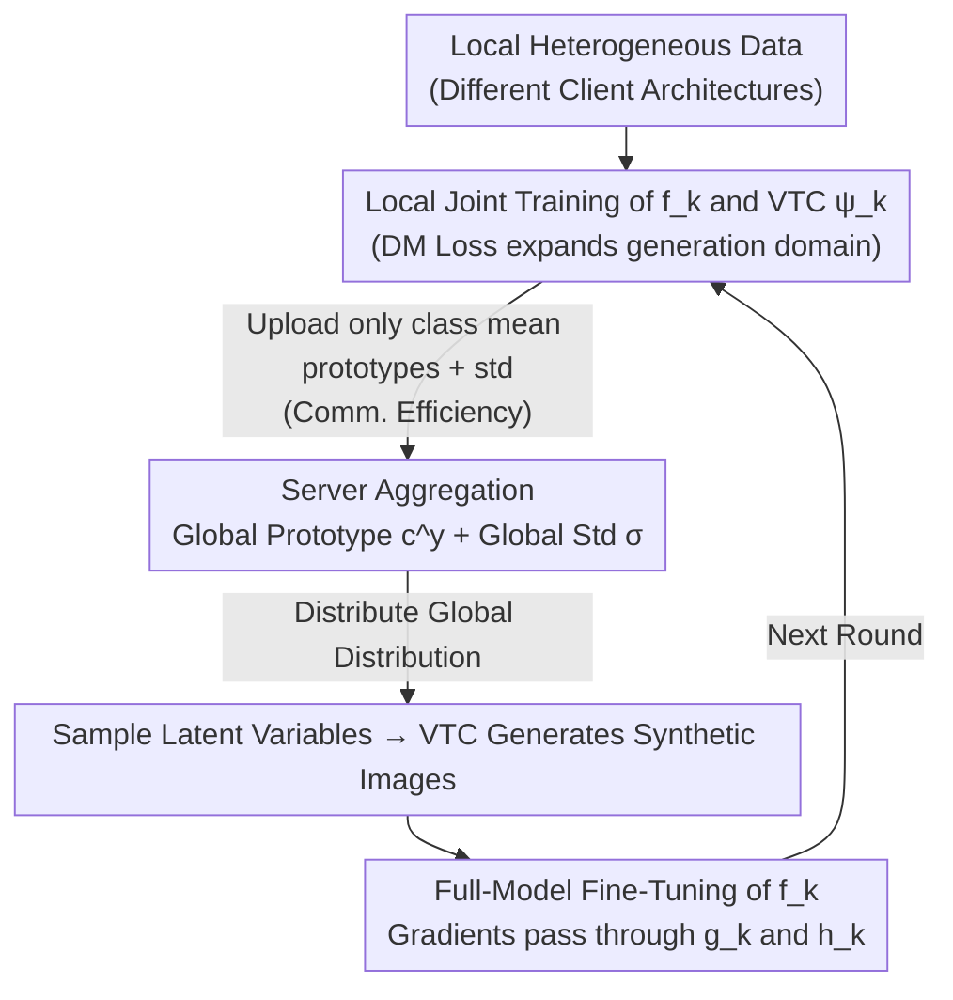

# Bridging Generalization Gap of Heterogeneous Federated Clients Using Generative Models

**Conference**: ICLR 2026  
**arXiv**: [2508.01669](https://arxiv.org/abs/2508.01669)  
**Code**: None  
**Area**: Federated Learning / Generative Models  
**Keywords**: Model Heterogeneous Federated Learning, Variational Transposed Convolution, Synthetic Data Fine-tuning, Feature Distribution Alignment, Communication Efficiency  

## TL;DR
FedVTC proposes that in model-heterogeneous federated learning, each client uses a Variational Transposed Convolutional (VTC) network to generate synthetic data from aggregated feature distribution statistics to fine-tune local models. This significantly improves generalization without requiring public datasets while reducing communication and memory overhead.

## Background & Motivation
**Background**: Data heterogeneity in federated learning leads to poor generalization of local models. Traditional methods improve this through regularization or weight adjustment but often assume identical client model architectures.

**Limitations of Prior Work**:
   - Knowledge distillation methods require public datasets, which are typically unavailable in practice.
   - Distillation in feature space only debiases classifier heads and fails to improve feature extractors.
   - Prototype sharing methods only regularize feature extractors while ignoring classifier heads.
   - Proxy model methods incur high communication and memory overhead.

**Key Challenge**: Model heterogeneity implies that parameters cannot be shared for aggregation, yet clients still need to benefit from global information to improve generalization.

**Goal**: To debias both feature extractors and classifier heads without relying on public datasets or sharing model parameters.

**Key Insight**: Clients share only the statistics of feature distributions (mean and covariance), using them to guide the generation of synthetic data for full-model fine-tuning.

**Core Idea**: Use Variational Transposed Convolution to generate synthetic images from global feature distributions for full-model fine-tuning of local models, simultaneously debiasing the feature extractor and the classifier head.

## Method

### Overall Architecture
FedVTC addresses the dilemma in model-heterogeneous federated learning where parameters cannot be shared and no public dataset is available. Client architectures differ, preventing direct weight aggregation, and local models generalize poorly due to data skew. The solution lies in clients exchanging **feature distribution statistics**, then using a small local generator to "paint" global knowledge into synthetic images for full-model fine-tuning.

Specifically, each client $k$ holds a local model $f_k = h_k \circ g_k$ ($g_k$ is the feature extractor, $h_k$ is the classifier head) and a Variational Transposed Convolutional generator $\psi_k$. The workflow is: first, jointly train $f_k$ and $\psi_k$ on local data; then, upload only the mean prototype $\mathbf{c}_k^y$ and standard deviation $\boldsymbol{\sigma}_k$ for each category to the server; the server aggregates these into a global prototype $\mathbf{c}^y$ and global standard deviation $\boldsymbol{\sigma}$ for distribution; clients sample latent variables from this global distribution and feed them into $\psi_k$ to generate synthetic images; finally, $f_k$ is fine-tuned using these global-aware synthetic images. Only statistical vectors flow across clients, while raw data and model parameters remain local.

### Key Designs

**1. Variational Transposed Convolutional Network (VTC): "Painting" Global Feature Distributions into Images**

The core obstacle of model heterogeneity is the inability to align parameters. FedVTC sidesteps parameter transmission by externalizing "global knowledge" into fine-tunable images. VTC serves as the decoder tool—structurally similar to a VAE decoder, it uses transposed convolution for layer-wise upsampling to restore low-dimensional latent variables into images. The input is constructed via the reparameterization trick: $\mathbf{v} = \mathbf{z} + \boldsymbol{\sigma}_k \odot \boldsymbol{\epsilon}$ (where $\mathbf{z}$ is from the class prototype and $\boldsymbol{\epsilon}$ is Gaussian noise), yielding synthetic image $\mathbf{x}' = \psi_k(\mathbf{v})$. Training maximizes the ELBO, comprising reconstruction loss and KL divergence, where the latter aligns local feature distributions with global prototypes. Consequently, images sampled from the global distribution and generated by VTC naturally carry statistical information contributed by other clients.

**2. Distribution Matching Regularization (DM Loss): Preventing VTC Failure Outside Local Distributions**

VTC is trained locally on local feature distributions. However, at inference, it must generate images using latent variables sampled from the **global distribution**. If these distributions are misaligned, generation quality collapses. DM Loss (Distribution Matching Loss) fills this gap by constraining VTC to produce high-quality samples when facing global distribution inputs, effectively expanding the generator's operating domain from "local" to "global" in advance. Ablation studies show that removing this term leads to significant degradation of synthetic data under global sampling, confirming its role in cross-domain robustness.

**3. Full-Model Fine-Tuning Strategy: Simultaneous Debiasing of Feature Extractor and Classifier Head**

Prior methods often biased one component—feature-space distillation corrected only the classifier head, while prototype sharing corrected only the feature extractor. FedVTC operates at the **image level**: synthetic data passes through the entire forward propagation of $f_k$. Thus, backpropagation gradients flow through both $g_k$ and $h_k$, debiasing both components simultaneously. This is the rationale for "generating images" instead of "generating features"—only complete image samples can drive end-to-end fine-tuning of the entire model.

**4. Communication Efficiency: Transmitting Only Statistical Vectors**

Proxy model methods transmit over-parameterized generators, and parameter-sharing methods transmit full weights, both incurring high costs. FedVTC exchanges only feature distribution statistics: class mean prototypes $\mathbf{c}_k^y \in \mathbb{R}^p$ and standard deviations $\boldsymbol{\sigma}_k \in \mathbb{R}^p$. These $p$-dimensional vectors are much smaller than model parameters or full generative models, keeping total communication low even with many clients and rounds.

### Loss & Training
- VTC training loss: $\mathcal{L}_e = \mathcal{L}_{rc} + D_{KL} + \mathcal{L}_{DM}$
- Reconstruction loss: $\mathcal{L}_{rc} = \|\mathbf{x}' - \mathbf{x}\|_2^2$
- KL divergence: Aligns local feature distribution to global prototypes.
- Local model fine-tuning: Cross-entropy loss on synthetic data.
- VTC and local models are trained alternately to avoid extra memory consumption.

## Key Experimental Results

### Main Results — Generalization Accuracy in Heterogeneous FL

| Method | MNIST | CIFAR-10 | CIFAR-100 | Tiny-ImageNet |
|------|-------|----------|-----------|---------------|
| FedGH (Rep. Sharing) | Medium | Medium | Low | Low |
| FedKD (Distillation) | Reqs. Public Data | Reqs. Public Data | Reqs. Public Data | Reqs. Public Data |
| **FedVTC** | **Highest** | **Highest** | **Highest** | **Highest** |

### Ablation Study

| Configuration | Generalization Accuracy |
|------|----------|
| FedVTC (Full) | Optimal |
| w/o DM Loss | Decrease (VTC not robust to global sampling) |
| w/o Full Fine-tuning (Head only) | Significant Decrease |
| w/o KL Alignment | Significant Decrease |

### Key Findings
- **Full Fine-tuning vs. Partial Alignment**: Fine-tuning the entire model with synthetic data is far more effective than just aligning feature spaces or classifier heads.
- **Criticality of DM Loss**: Without DM Loss, the quality of synthetic data generated by VTC degrades severely under global distribution sampling.
- **Communication Efficiency**: FedVTC's communication volume is much lower than methods requiring the transfer of model parameters or proxy models.
- **Scalability**: Advantages are more pronounced on larger-scale datasets (Tiny-ImageNet), indicating good scalability.

## Highlights & Insights
- **Synthetic Data as Knowledge Medium**: Instead of transmitting parameters or raw data, global knowledge is indirectly transferred via shared distribution statistics and local synthesis—balancing privacy and knowledge sharing.
- **Unified Debiasing**: Previous methods debiased either the feature extractor or the classifier head; FedVTC naturally unifies this through image-level operations.
- **Lightweight Design**: VTC is a simple transposed convolutional network trained alternately with the local model, requiring no additional GPU memory during the main training phase.

## Limitations & Future Work
- The quality of images generated by VTC may be low (simple transposed convolution vs. stronger generators like Diffusion Models).
- Assumption of Gaussian feature distributions for each class; real distributions may be more complex.
- Covariance estimation might be inaccurate when feature dimensionality $p$ is high.
- Privacy attacks are not considered—can feature means and variances be used to infer raw data?

## Related Work & Insights
- **vs. FedGH/FedTGP**: These share prototypes to regularize feature extractors but ignore heads; FedVTC debiases both via synthetic data.
- **vs. FedZKD/FedGen**: These perform distillation in feature space, debiasing only classifier heads; FedVTC operates in image space.
- **vs. FedMAN**: Transmits over-parameterized proxy models with high overhead; FedVTC only transmits statistics.

## Rating
- Novelty: ⭐⭐⭐⭐ VTC as a synthetic data generator in FL is a novel combination.
- Experimental Thoroughness: ⭐⭐⭐⭐ 4 datasets + multiple heterogeneous baselines + ablations.
- Writing Quality: ⭐⭐⭐⭐ Clear logic and comparisons.
- Value: ⭐⭐⭐⭐ Addresses real pain points in heterogeneous FL with high communication efficiency.

<!-- RELATED:START -->

## Related Papers

- [\[ICLR 2026\] Generalization of Diffusion Models Arises with a Balanced Representation Space](generalization_of_diffusion_models_arises_with_a_balanced_representation_space.md)
- [\[ICLR 2026\] Bridging the Distribution Gap to Harness Pretrained Diffusion Priors for Super-Resolution](bridging_the_distribution_gap_to_harness_pretrained_diffusion_priors_for_super-r.md)
- [\[ICCV 2025\] FedDifRC: Unlocking the Potential of Text-to-Image Diffusion Models in Heterogeneous Federated Learning](../../ICCV2025/image_generation/feddifrc_unlocking_the_potential_of_text-to-image_diffusion_models_in_heterogene.md)
- [\[CVPR 2026\] Temporal Equilibrium MeanFlow: Bridging the Scale Gap for One-Step Generation](../../CVPR2026/image_generation/temporal_equilibrium_meanflow_bridging_the_scale_gap_for_one-step_generation.md)
- [\[CVPR 2026\] Heterogeneous Decentralized Diffusion Models](../../CVPR2026/image_generation/heterogeneous_decentralized_diffusion_models.md)

<!-- RELATED:END -->
