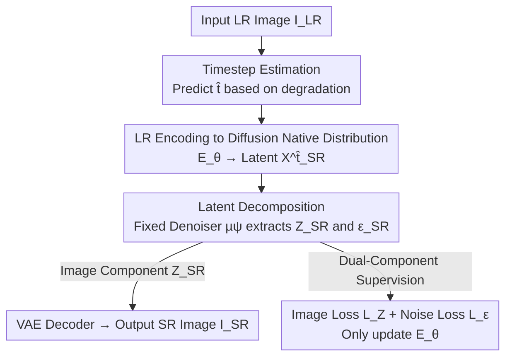

# Bridging the Distribution Gap to Harness Pretrained Diffusion Priors for Super-Resolution

**Conference**: ICLR2026  
**OpenReview**: [https://openreview.net/forum?id=66Ad0i78lW](https://openreview.net/forum?id=66Ad0i78lW)  
**Code**: To be confirmed  
**Area**: Image Super-Resolution / Image Restoration / Diffusion Models  
**Keywords**: Super-resolution, Pretrained diffusion priors, Distribution matching, One-step diffusion, Timestep estimation

## TL;DR
DM-SR maintains the pretrained diffusion model entirely intact, training only an image encoder to "translate" the low-resolution (LR) image directly into the "noisy image" distribution familiar to the diffusion model. By using a fixed denoiser for single-step generation, it achieves current SOTA perceptual quality in one-step diffusion.

## Background & Motivation

**Background**: Diffusion models, with their powerful generative priors, have been widely applied to Single Image Super-Resolution (SISR). Prevailing methods treat LR images as conditions (ControlNet-style) and generate high-resolution (HR) images starting from pure Gaussian noise via multi-step denoising, such as StableSR and SeeSR.

**Limitations of Prior Work**: This approach faces two major issues. First, multi-step schemes starting from pure noise involve high computational costs and redundantly "regenerate" information already present in the LR image, while being sensitive to initial noise. Second, to compress the process to a single step, methods like OSEDiff/SinSR use distillation to transfer diffusion knowledge into an SR network; however, **fine-tuning the denoiser itself damages its original generative priors**, leading to a decline in perceptual quality. InvSR avoids training the denoiser by directly predicting noise but assumes that "noised HR is indistinguishable from LR"—a hypothesis that fails at small timesteps where the original signal is dominant and the distributions of noised HR and noised LR differ significantly.

**Key Challenge**: Diffusion models are trained on the distribution of "natural images + Gaussian noise," whereas LR images come from a **completely different degradation distribution**. To feed them directly into a pretrained denoiser, one must either modify the model (harming priors) or use invalid assumptions (reducing quality). The fundamental problem is that **no prior work has directly bridged this distribution gap**.

**Goal**: To enable the direct processing of LR images by a completely unmodified pretrained diffusion model while compressing the process to a single step.

**Key Insight**: The authors propose a simple yet critical question: since pretrained diffusion models are already adept at denoising samples from the "noisy image distribution," why not **directly transform the LR image into this distribution**? Instead of forcing the model to adapt to the LR, the LR should be adapted to the model.

**Core Idea**: Train only an image encoder to map the LR image into a mixed latent variable of "image component + noise component" that falls into the distribution familiar to the pretrained diffusion model at a specific timestep. By adaptively predicting the appropriate timestep based on the degradation level, high-perceptual-quality HR images are restored in a single step.

## Method

### Overall Architecture

The workflow of DM-SR (Distribution-Matching Super-Resolution) is as follows: given an LR image $I_{LR}$, a **timestep estimator** $T$ first predicts a suitable timestep $\hat{t}$ based on its degradation level. An **image encoder** $E_\theta$ سپس codes $I_{LR}$ and $\hat{t}$ into a latent variable $X^{\hat{t}}_{SR}$, aiming to align it with the distribution of the "noised HR latent" $X^{\hat{t}}_{HR}$. Next, using a **fixed** pretrained denoiser $\mu_\psi$, $X^{\hat{t}}_{SR}$ is decomposed into an image component $Z_{SR}$ and a noise component $\epsilon_{SR}$. Finally, $Z_{SR}$ is fed into a pretrained VAE decoder to obtain the final SR image $I_{SR}$. Inference requires only one forward pass of the diffusion denoiser. During training, only the encoder $E_\theta$ (and its internal timestep estimator) is updated, while the denoiser $\mu_\psi$ and VAE remain frozen.

### Key Designs

**1. Timestep Estimation: Adaptive Noise Levels Based on Degradation**

The image-to-noise ratio "familiar" to diffusion models varies across timesteps: a noised HR latent satisfies $X^{t}_{HR}=\sqrt{\bar\alpha_t}\,X^{0}_{HR}+\sqrt{1-\bar\alpha_t}\,\epsilon$. Smaller timesteps $t$ preserve more original signal, while larger ones approach pure noise. InvSR uses a fixed timestep for all samples, where its assumption fails. DM-SR uses smaller timesteps for lightly degraded images (preserving more content) and larger timesteps for heavily degraded images (allowing the generative prior to "create" more). Degradation is quantified using LPIPS scores between $I_{LR}$ and $I_{HR}$, normalized to $[0, 500]$, as the ground truth $\hat{t}$ to train the estimator $T$. LPIPS is chosen over pixel distance or SSIM because ablation (Table 5) shows it provides the best perceptual results, aligning better with "human-perceived degradation." An interesting finding (Table 3) is that **larger fixed timesteps generally outperform smaller ones**, as the latter retain too much LR content that mismatches the true HR distribution; however, the adaptive $\hat{t}$ outperforms all fixed values.

**2. LR Encoding to Diffusion Native Distribution: Concentrating Translation in the Encoder**

This is the only trained network in the proposed method. The encoder $E_\theta$ takes $I_{LR}$ and the predicted $\hat{t}$ to map the LR image into $X^{\hat{t}}_{SR}$ in the **latent space**. The target distribution is $X^{\hat{t}}_{HR}$ at the same timestep (where $X^{0}_{HR}$ is obtained from the VAE encoding of $I_{HR}$). $E_\theta$ is initialized with a pretrained VAE encoder and follows the ControlNet architecture: features derived from $\hat{t}$ are injected into intermediate layers via linear mappings, making the encoding timestep-dependent. Crucially, all the work of "bridging the distribution gap" is handled by this lightweight encoder, leaving the pretrained denoiser untouched and its generative priors **fully preserved**.

**3. Latent Decomposition: Using the Fixed Denoiser for Supervision**

The output $X^{\hat{t}}_{SR}$ should align with $X^{\hat{t}}_{HR}$, but the latter depends on randomly sampled noise $\epsilon$, making element-wise supervision unstable. The authors use the **fixed** pretrained denoiser $\mu_\psi$ to explicitly decompose $X^{\hat{t}}_{SR}$ into its image component $Z_{SR}$ and noise component $\epsilon_{SR}$:

$$\epsilon_{SR}=\mu_\psi\!\left(X^{\hat{t}}_{SR},\hat{t}\right),\qquad Z_{SR}=\frac{1}{\sqrt{\bar\alpha_{\hat{t}}}}\left(X^{\hat{t}}_{SR}-\sqrt{1-\bar\alpha_{\hat{t}}}\,\epsilon_{SR}\right).$$

The assumption is that the denoiser estimates the noise component $\epsilon_{SR}$, and the remainder corresponds to the latent representation of a natural image $Z_{SR}$ (using the prompt "High-quality, photo-realistic, ..."). This allows for **targeted supervision on both components**. During inference, only $Z_{SR}$ is passed to the VAE decoder to obtain $I_{SR}$.

**4. Dual-Component Supervision: HR-like Image and Reconstructable Noise**

The total loss is $L_{tot}=L_Z+L_\epsilon$.

For the **image component** $Z_{SR}$, $X^{0}_{HR}$ is used as supervision, combining L1, perceptual, adversarial, and distribution matching losses: $L_Z=\lambda_{L1}L_{L1}+\lambda_{per}L_{per}+\lambda_{adv}L_{adv}+\lambda_{dm}L_{dm}$. Two points are notable: ① The discriminator $D_\phi$ follows ControlNet by taking $I_{LR}$ as a condition to distinguish between $Z_{SR}$ and the real $X^{0}_{HR}$, ensuring $Z_{SR}$ is both realistic and faithful to the LR input. ② The distribution matching loss $L_{dm}$, inspired by Distribution Matching Distillation (DMD), requires the denoiser to predict consistent score functions for both $Z_{SR}$ and $X^{0}_{HR}$ after adding the same random noise.

For the **noise component** $\epsilon_{SR}$, the goal is for it to be the "optimal noise" that allows the denoiser to reconstruct the HR latent:

$$L_\epsilon=\mathbb{E}\left[\,\big\lVert \mu_\psi(\sqrt{\bar\alpha_t}X^{0}_{HR}+\sqrt{1-\bar\alpha_t}\,\epsilon_{SR},\hat{t})-\epsilon_{SR}\big\rVert\,\right].$$

This ensures the noise component carries semantic information related to the input. Experimentally (Fig. 4), $\epsilon_{SR}$ naturally approximates a Gaussian distribution despite no explicit constraint.

### Loss & Training

The total loss $L_{tot}=L_Z+L_\epsilon$ is backpropagated only to the encoder $E_\theta$. The denoiser $\mu_\psi$ utilizes **SD-Turbo** for efficient one-step generation. The training data utilizes DF2K + LSDIR with $512\times512$ patches. LR is obtained via 4× bicubic downsampling. Optimization is performed using AdamW for 300k steps with an initial learning rate of $1\times10^{-4}$, decaying by half every 100k steps.

## Key Experimental Results

### Main Results

Evaluations on synthetic (ImageNet) and real degradation (DRealSR / RealSR / RealSet80) benchmarks for 4× SR focus on no-reference perceptual metrics:

| Dataset | Method | CLIP-IQA↑ | TOPIQ(NR)↑ | MANIQA↑ | MUSIQ↑ |
|--------|------|-----------|------------|---------|--------|
| ImageNet | InvSR-1 | 0.711 | 0.630 | 0.469 | 72.382 |
| ImageNet | **DM-SR-1** | **0.785** | **0.712** | **0.633** | **73.856** |
| RealSet80 | InvSR-1 | 0.727 | 0.623 | 0.466 | 69.798 |
| RealSet80 | **DM-SR-1** | **0.797** | **0.707** | **0.600** | **70.616** |

DM-SR consistently outperforms existing one-step diffusion methods (SinSR/OSEDiff/InvSR) and the 50-step StableSR in perceptual metrics. In terms of efficiency (RealSR, A100, 128² upsampling), DM-SR has 34.16M trainable parameters and a runtime of 92ms, making it the **fastest** among diffusion-based methods (compared to 3460ms for StableSR-50). However, reference-based metrics (PSNR/SSIM) are not top-tier, reflecting the perceptual-distortion trade-off.

### Ablation Study

| Configuration | LIQE↑ | CLIP-IQA↑ | TOPIQ(NR)↑ | MUSIQ↑ | Note |
|------|-------|-----------|-----------|--------|------|
| $L_{L1}+L_{per}$ only | 3.643 | 0.726 | 0.575 | 64.153 | Baseline |
| +$L_{adv}$ | 4.579 | 0.779 | 0.694 | 69.947 | Max gain from adversarial loss |
| +$L_{dm}$ | 4.171 | 0.756 | 0.614 | 69.089 | Limited gain alone |
| +$L_\epsilon$ | 4.195 | 0.756 | 0.615 | 69.189 | Limited gain alone |
| Full (DM-SR) | **4.652** | **0.797** | **0.707** | **70.616** | Synergetic optimum |

Ablation on timestep ground truth (Table 5) confirms LPIPS is superior to pixel distance or SSIM. Adaptive $\hat{t}$ (Table 3) outperforms any fixed timestep.

### Key Findings
- **Adversarial loss is the primary contributor**: Adding $L_{adv}$ to the baseline significantly boosts perceptual metrics. While $L_{dm}$ and $L_\epsilon$ provide marginal gains individually, their simultaneous use is necessary for optimal performance.
- **More steps are not necessarily better**: Quality for 1/2/5 steps is similar, but 10 steps result in over-smoothing, as SD-Turbo is optimized for very few steps.
- **Text prompts have a performance ceiling**: Using LLaVA to extract specific prompts (Table 7) is slightly better than fixed prompts. Since the denoiser is not fine-tuned, prompts can be changed at test time without retraining.

## Highlights & Insights
- **"Adapt data to model" instead of "adapt model to data"**: The core innovation is leaving the pretrained diffusion model untouched and using an encoder to bring LR into the model's native distribution, ensuring zero loss of generative priors.
- **Latent decomposition via fixed denoiser**: Using a frozen $\mu_\psi$ to split the latent into image/noise components bypasses the difficulty of element-wise supervision on random noise.
- **Adaptive Mapping (Degradation → Timestep)**: Quantifying "how blurry" an image is via LPIPS and regressing it to a timestep allows the model to determine how much generative prior to involve.
- **Spontaneous Gaussianity of noise**: The noise component approximates a Gaussian distribution naturally, validating the "optimal noise" assumption.

## Limitations & Future Work
- **Distortion metrics are not SOTA**: Prioritizing perceptual quality leads to slight deviations from the input (e.g., changing pupil color from gray to black). This can be mitigated by semantic color alignment or specific text prompts.
- **Optimization of timestep ground truth**: LPIPS is currently the best choice, but more optimal definitions of timestep supervision may exist.
- **Dependency on SD-Turbo**: The performance is tightly coupled with the base model's few-step characteristics.
- **Fixed prompt overhead**: While image-specific prompts improve results, they require an additional captioning model (LLaVA), adding deployment trade-offs.

## Related Work & Insights
- **vs StableSR / SeeSR (Fine-tuning approach)**: These methods fine-tune layers and require multi-step denoising from pure noise. DM-SR is single-step, zero-modification to the denoiser, and faster with better prior preservation.
- **vs OSEDiff / SinSR (Distillation approach)**: These distill knowledge into a fine-tuned SR network, which damages generative priors. DM-SR maintains the denoiser, achieving higher perceptual quality.
- **vs InvSR (Noise prediction approach)**: InvSR's assumption fails at small timesteps. DM-SR fixes this using adaptive timesteps and explicit distribution matching.

## Rating
- Novelty: ⭐⭐⭐⭐⭐ "Adapting LR to model" perspective + Latent decomposition is simple and effective.
- Experimental Thoroughness: ⭐⭐⭐⭐ Extensive benchmarks and ablations, though distortion metrics are secondary.
- Writing Quality: ⭐⭐⭐⭐ Clear motivation and well-coordinated formulas/figures.
- Value: ⭐⭐⭐⭐ High perceptual quality for one-step SR, with a paradigm applicable to other restoration tasks.

<!-- RELATED:START -->

## Related Papers

- [\[CVPR 2025\] FaithDiff: Unleashing Diffusion Priors for Faithful Image Super-Resolution](../../CVPR2025/image_generation/faithdiff_unleashing_diffusion_priors_for_faithful_image_super-resolution.md)
- [\[CVPR 2026\] Bridging Fidelity-Reality with Controllable One-Step Diffusion for Image Super-Resolution](../../CVPR2026/image_generation/bridging_fidelity-reality_with_controllable_one-step_diffusion_for_image_super-r.md)
- [\[ICLR 2026\] Bridging Generalization Gap of Heterogeneous Federated Clients Using Generative Models](bridging_generalization_gap_of_heterogeneous_federated_clients_using_generative_.md)
- [\[ECCV 2024\] XPSR: Cross-modal Priors for Diffusion-based Image Super-Resolution](../../ECCV2024/image_generation/xpsr_crossmodal_priors_for_diffusionbased_image_superresolut.md)
- [\[ICLR 2026\] Decoupled DMD: CFG Augmentation as the Spear, Distribution Matching as the Shield](decoupled_dmd_cfg_augmentation_as_the_spear_distribution_matching_as_the_shield.md)

<!-- RELATED:END -->
