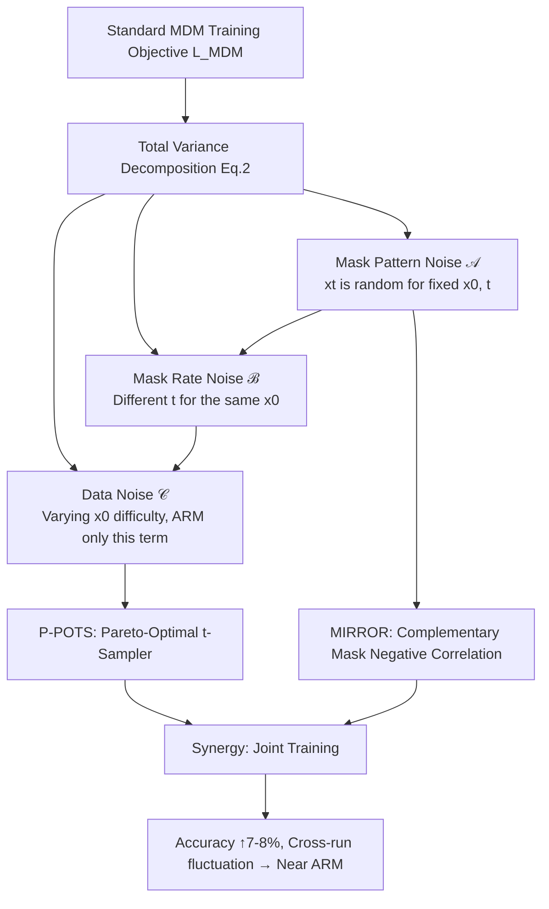

# Bringing Stability to Diffusion: Decomposing and Reducing Variance of Training Masked Diffusion Models

**Conference**: ICLR 2026  
**OpenReview**: [https://openreview.net/forum?id=IobTEbQ3vt](https://openreview.net/forum?id=IobTEbQ3vt)  
**Code**: [https://github.com/Qwen-Applications/StableDLLM](https://github.com/Qwen-Applications/StableDLLM)  
**Area**: Masked Diffusion Models / Diffusion Language Models / Training Stability  
**Keywords**: Masked Diffusion Models, Variance Decomposition, Importance Sampling, Inverse Sampling, Training Stability, dLLM  

## TL;DR
This paper provides the first **systematic decomposition** of the training variance in Masked Diffusion Models (MDM) into three terms: "mask pattern noise + mask rate noise + data noise." Based on this, six variance reduction methods are designed, centered on P-POTS (Pareto-Optimal $t$-Sampler) and MIRROR (Complementary Mask Inverse Sampling). These methods improve MDM accuracy on complex reasoning by 7–8% and reduce run-to-run fluctuations to levels comparable to Autoregressive Models (ARM).

## Background & Motivation
- **Background**: Masked Diffusion Models (e.g., LLaDA-8B, Dream-7B, MMaDA-8B) are considered powerful alternatives to Autoregressive Models (ARM). They are trained by "random mask rate $t$ + reconstructing masked tokens," naturally supporting parallel decoding and avoiding exposure bias and the "reversal curse."
- **Limitations of Prior Work**: MDM training is highly unstable. Even when pre-trained MDMs have comparable capabilities to ARMs, they often **fall significantly behind** after fine-tuning on the same task, and **results vary greatly across runs (different random seeds)**—loss fluctuations translate directly into violent gradient jitters.
- **Key Challenge**: Previous mitigation methods (Zhu 2025's symmetric sampling, Arriola 2025's cropped noise scheduling, etc.) are **isolated, heuristic** patches. They lack a unified theoretical explanation for "why MDM variance is higher than ARM" and whether different methods are complementary.
- **Goal**: Starting from the definition of the training objective, provide a **first-principles decomposition** of variance, and then construct "unbiased but low-variance" alternative estimators to stabilize MDM training at its root.
- **Core Idea**: **【Variance Decomposition】** Under the standard training objective $L_{\mathrm{MDM}}=\mathbb{E}_{x_0,t,x_t}[l_\theta]$, the total variance is precisely split into three sources. ARM only suffers from one of these; the two additional sources are the root causes of MDM instability. Thus, "reducing MDM variance" is transformed into a clear engineering problem of "suppressing these two extra noise sources term-by-term."

## Method

### Overall Architecture
The paper first performs a theoretical decomposition: expanding $\mathrm{Var}(l_\theta)$ using the law of total variance into three terms—mask pattern noise $\mathcal{A}$, mask rate noise $\mathcal{B}$, and data noise $\mathcal{C}$ (where ARM only has $\mathcal{C}$). Subsequently, variance reduction techniques are designed for each term. Two core methods, P-POTS (redesigning the sampling distribution of $t$ to suppress $\mathcal{A}+\mathcal{B}+\mathcal{C}$) and MIRROR (using negative correlation of complementary masks to suppress $\mathcal{A}$), can be stacked synergistically. Four other methods (ISAD, SyRM, StraTS, EMA) serve as supplements targeting single noise sources.

### Key Designs

**1. Three-Source Variance Decomposition: Translating Instability into Suppressible Mathematical Terms.** The paper expands the training objective using the law of total variance: $\mathrm{Var}_{x_0,t,x_t}(l_\theta)=\underbrace{\mathbb{E}_{x_0,t}[\mathrm{Var}_{x_t}(l_\theta\mid x_0,t)]}_{\mathcal{A}}+\underbrace{\mathbb{E}_{x_0}[\mathrm{Var}_t(g_\theta\mid x_0)]}_{\mathcal{B}}+\underbrace{\mathrm{Var}_{x_0}(\mathbb{E}_t[g_\theta])}_{\mathcal{C}}$, where $g_\theta(x_0,t)=\mathbb{E}_{x_t}[l_\theta\mid x_0,t]$. $\mathcal{A}$ represents fluctuations caused by specific mask positions given fixed clean data $x_0$ and mask rate $t$; $\mathcal{B}$ is the variation in expected loss for the same $x_0$ across different $t$; $\mathcal{C}$ is the inherent difficulty difference between samples. This decomposition emerges naturally without strong assumptions, explaining prior methods and providing targets for future designs.

**2. P-POTS—Pareto-Optimal $t$-Sampler: Directing training compute to difficult regions without letting them dominate optimization.** Standard training uses $t\sim U[0,1]$, which is unbiased but high-variance. P-POTS uses a data-fitted non-uniform distribution $p(t)$ and maintains unbiasedness through importance weights $\tfrac{1}{p(t)}l_\theta$ (since $\int_0^1 p(t)\tfrac{1}{p(t)}g(t)\mathrm{d}t=\int_0^1 g(t)\mathrm{d}t$). After writing $\mathcal{A}+\mathcal{B}+\mathcal{C}$ as an integral over $p(t)$, $\int_0^1\tfrac{g(t)^2+v(t)}{p(t)}\mathrm{d}t-(\int_0^1 g(t)\mathrm{d}t)^2$, the unique optimal solution is found via Lagrange multipliers: $p^*(t)\propto\sqrt{g(t)^2+v(t)}$. This is Pareto-optimal in minimizing all three sources simultaneously. Since $g(t), v(t)$ are unknown, P-POTS estimates points $\hat p_j$ via Monte Carlo before training and fits them using a 7-parameter **EPR (Exponential-Polynomial Root) model**: $p_{\mathrm{EPR}}(t)=\sqrt{a t^r+b(1-t)^q+A^2\exp(2\kappa t^m)}$. The exponential term captures the explosion of high-$t$ loss when reasoning chains are broken, while the polynomial term captures variance inflection points from rare events like critical tokens being masked/surviving. Intuitively, $p^*(t)$ allocates more samples to the "hard-to-train" high-$t$ regions, while $1/p^*(t)$ suppresses their update weights, ensuring noise does not dominate global optimization.

**3. MIRROR—Complementary Masks for Negative Correlation: Cutting $\mathcal{A}$ at least by half.** For the same $(x_0,t)$, MIRROR generates two **complementary** noise samples: $x_t^1$ is masked when $U_i<t$, and $x_t^2$ is masked when $U_i>1-t$. The average loss $\bar l=\tfrac12(l_1+l_2)$ is backpropagated. Since $l_1, l_2$ follow the same distribution, $\mathrm{Var}(\bar l)=\tfrac{\sigma^2}{2}(1+\rho)$, where $\rho=\mathrm{Corr}(l_1,l_2)\le 0$. Thus, MIRROR never performs worse than standard training. The complementary design makes $\rho$ tend toward negative values (especially when $t<0.5$ as masks don't overlap), **reducing $\mathcal{A}$ by at least 50%**. The intuition is hedging: regardless of whether $x_t^1$ masks simple or difficult tokens, $x_t^2$ provides the complementary side, resulting in a reliable average estimate. Compared to MultiSample-2 (independent sampling), MIRROR provides negative covariance and improves joint coverage to $\min(1,2t)$.

**4. Synergy of P-POTS and MIRROR ($1+1>2$).** While both are based on non-interfering assumptions, their combined gain exceeds the sum of their parts. Substituting the optimal $p(t)$ back, the variance becomes $(\int_0^1\sqrt{g^2+v}\,\mathrm{d}t)^2-(\int_0^1 g\,\mathrm{d}t)^2$, which no longer depends on $p(t)$ but can be further reduced by changing $v(t)$. To make the integrals closer, $v(t)$ should be concentrated where $g(t)$ is large. MIRROR suppresses $v(t)$ most strongly in the middle $t$ region, relatively preserving $v(t)$ in high $g(t)$ regions, essentially pushing $v(t)$ toward the direction preferred by P-POTS.

**5. Four Supplementary Techniques Targeting Single Noise Sources.** ISAD biases mask probability toward answer delimiter tokens and uses $1/q_j(t)$ reweighting to suppress $\mathcal{A}$. SyRM targets structured data like HTML/code by including syntax tokens in the maskable set to reduce $\mathcal{A}$. StraTS uses stratified sampling to reduce $\mathcal{B}$ via inter-strata variance. EMA maintains an exponential moving average of losses within $t$-bins as control variables to suppress $\mathcal{B}$.

## Key Experimental Results

### Main Results (Accuracy per seed, LLaDA-8B-Instruct)

| Method (Seed) | OpenScience Avg | GSM8K Avg | HiTab Avg |
|---|---|---|---|
| **P-POTS+MIRROR** | **52.53** | **60.53** | **67.10** |
| P-POTS | 46.80 | 58.58 | 61.37 |
| MIRROR | 46.38 | 53.70 | 64.48 |
| Standard Training (Range) | — | 50.6–53.7 | 52.9–62.6 |

### Key Findings
- **Consistent Gains Across Tasks**: Accuracy on complex reasoning tasks increased by approximately **7–8%** (GSM8K from 50.6–53.7% to 58.6–62.0%; HiTab from 52.9–62.6% to 66.0–68.6%).
- **Significant Variance Reduction**: Multi-run fluctuations were suppressed to **levels near ARM**. In most settings, the "best run of the best baseline" was lower than the "worst run of Ours."
- **Effective in Multi-modal Scenarios**: On Text-to-Image-2M, MMaDA-8B's CLIP score range narrowed and shifted upwards; image quality with P-POTS+MIRROR was visibly superior to standard training under the same seed.
- **Cost-Benefit Trade-off**: P-POTS has nearly zero overhead and provides significant gains alone. MIRROR roughly doubles training cost due to an extra forward pass but is especially effective on long-response data.

## Highlights & Insights
- **From "Patchwork" to "Framework"**: The systematic decomposition of MDM training variance is the major conceptual contribution, unifying heuristic methods into a single framework.
- **Theoretically Sound and Deployable**: Every method is supported by proof or analysis yet remains simple enough to require almost no hyperparameter tuning.
- **Non-trivial Synergy**: The "$1+1>2$" effect of P-POTS and MIRROR is rigorously demonstrated through the shape of $v(t)$ after substituting the optimal $p(t)$.

## Limitations & Future Work
- **Drift in P-POTS**: $p^*(t)$ is fitted only once before training. As the model evolves, the sampler might become outdated. Periodic adaptive re-fitting is left for future work.
- **Scope of Verification**: Due to resource constraints, verification focused on **Supervised Fine-tuning (SFT)**. The generalizability to pre-training and more MDM architectures remains to be confirmed.
- **MIRROR Cost**: The extra forward pass doubles training cost, which may not be ideal for ultra-long sequences or compute-constrained environments.
- **EPR Model Assumption**: While the 7-parameter model fits well, its structure is based on empirical intuition.

## Related Work & Insights
- **Variance Reduction in Continuous Diffusion**: Prior works (Meng 2021, Xu 2023) mostly focus on continuous diffusion and often suffer from bias or degradation when migrated to discrete masked diffusion.
- **MDM-Specific Methods**: Works like Zhu (2025) and Arriola (2025) are explained by this framework. This paper points out that extreme $t$ values, often discarded by heuristic scheduling, are actually worth emphasizing via importance sampling.
- **Insight**: The paradigm of "variance decomposition + targeting terms" can be generalized to other stochastic training objectives.

## Rating
- **Novelty**: ⭐⭐⭐⭐⭐ First systematic decomposition of MDM training variance. Derived a Pareto-optimal sampler.
- **Experimental Thoroughness**: ⭐⭐⭐⭐ Covers 3 text datasets + 1 multi-modal. Multiple seeds used. However, focused only on SFT.
- **Writing Quality**: ⭐⭐⭐⭐ Clear theoretical derivations and intuitive diagrams.
- **Value**: ⭐⭐⭐⭐⭐ Directly addresses the core bottleneck of dLLM deployment (instability). Plug-and-play with high practical value.

<!-- RELATED:START -->

## Related Papers

- [\[ICLR 2026\] What Exactly Does Guidance Do in Masked Discrete Diffusion Models](what_exactly_does_guidance_do_in_masked_discrete_diffusion_models.md)
- [\[ICLR 2026\] Any-Order Flexible Length Masked Diffusion](any-order_flexible_length_masked_diffusion.md)
- [\[ICML 2026\] Unified Masked Diffusion Models with Diverse Generation Orders](../../ICML2026/image_generation/unifying_masked_diffusion_models_with_various_generation_orders_and_beyond.md)
- [\[ICLR 2026\] Quantization-Aware Diffusion Models for Maximum Likelihood Training](quantization-aware_diffusion_models_for_maximum_likelihood_training.md)
- [\[ICCV 2025\] SliderSpace: Decomposing the Visual Capabilities of Diffusion Models](../../ICCV2025/image_generation/sliderspace_decomposing_the_visual_capabilities_of_diffusion_models.md)

<!-- RELATED:END -->
