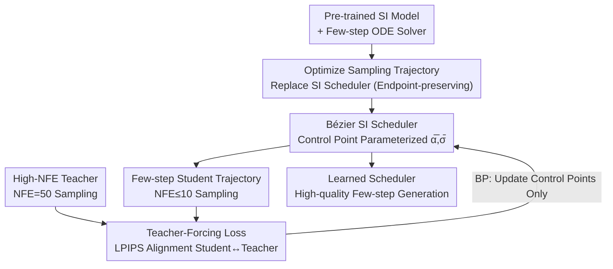

# BézierFlow: Learning Bézier Stochastic Interpolant Schedulers for Few-Step Generation

**Conference**: ICLR2026  
**OpenReview**: [https://openreview.net/forum?id=PCuDI32xhQ](https://openreview.net/forum?id=PCuDI32xhQ)  
**Project Page**: https://bezierflow.github.io  
**Code**: To be confirmed  
**Area**: Diffusion Models / Few-Step Generation  
**Keywords**: Few-step sampling, Stochastic Interpolant, Bézier curves, Scheduler learning, Lightweight training

## TL;DR
BézierFlow shifts the focus of "what to optimize for few-step generation" from discrete ODE timesteps to continuous Stochastic Interpolant (SI) schedulers. By parameterizing the scheduler with Bézier control points, it achieves a 2–3× FID improvement for pre-trained diffusion/flow models in $\le 10$ sampling steps with only 15 minutes of lightweight training.

## Background & Motivation
**Background**: While diffusion and flow models offer high quality, their iterative generation process (dozens to hundreds of steps) is computationally expensive. Acceleration strategies follow three main paths: ① Designing dedicated ODE solvers (DPM-Solver, UniPC, iPNDM, etc.), which are training-free but struggle to reach single-digit steps; ② Distillation (Consistency Models, ReFlow, etc.), which can achieve 1–2 steps but require hundreds to thousands of GPU hours for fine-tuning; ③ **Lightweight training**—learning a few parameters outside the pre-trained model, significantly improving quality at low NFE (Number of Function Evaluations) in just dozens of minutes.

**Limitations of Prior Work**: Existing lightweight training methods almost exclusively focus on one task: **learning the optimal ODE timestep sequence**. GITS allocates steps based on trajectory curvature, DMN minimizes local numerical integration error, and the representative LD3 uses teacher-forcing distillation with a high-NFE solver as the "teacher" and a low-NFE solver as the "student" to optimize timesteps. Regardless of the learning method, their search space is restricted to "selecting discrete points on a fixed sampling trajectory."

**Key Challenge**: The geometric shape of the sampling trajectory itself (not just the selection of points) directly determines the discretization error in few-step generation. However, "learning timesteps only" fails to exploit the larger degree of freedom in trajectory shape. The only attempt to learn trajectories, Bespoke Solver, utilizes **discrete parameterization**, causing function values and their derivatives to be modeled separately and leading to alignment issues that make it difficult to represent a truly differentiable trajectory.

**Goal**: Upgrade the optimization target of lightweight training from "discrete timesteps" to "continuous sampling trajectories" while ensuring the trajectory remains a valid SI scheduler.

**Key Insight**: The Stochastic Interpolant (SI) framework provides a unified perspective—diffusion, flow-based, and score-based models can all be written as linear interpolations between source and target samples: $x(t)=\alpha(t)x_1+\sigma(t)x_0$. The coefficient pair $(\alpha, \sigma)$ is the "scheduler," which entirely determines the geometry of the sampling trajectory. A critical fact is that **changing the scheduler at inference time does not alter the marginal distribution at the endpoints**. Thus, the scheduler can be treated as a learnable variable to optimize trajectory shape without re-training the base model.

**Core Idea**: Learn an SI scheduler parameterized by Bézier curves. This expands the search space from "discrete timestep transformations" to "continuous trajectory transformations" and leverages Bézier control points to naturally satisfy the three essential constraints of a scheduler: boundary conditions, monotonicity, and differentiability.

## Method

### Overall Architecture
BézierFlow acts as a lightweight optimizer wrapped around pre-trained models. The input consists of a pre-trained SI model $S_\phi$ (diffusion or flow) and a specified few-step ODE solver. The output is a set of learned Bézier control points defining a new target sampling trajectory. At inference, sampling along this trajectory for $\le 10$ steps can approximate the quality of a teacher solver using dozens of steps.

The logic is divided into three layers: **What to optimize**—keep model weights frozen and replace only the sampling trajectory, determined by the SI scheduler $(\bar\alpha_s, \bar\sigma_s)$ (§4.2 formalizes "changing schedulers" as endpoint-preserving path re-parameterization); **How to parameterize**—represent $\bar\alpha$ and $\bar\sigma$ as 1D Bézier curves, learning only the intermediate control points (§4.3); **How to train**—use teacher-forcing: a high-NFE solver generates "teacher outputs" along the source trajectory, while the low-NFE solver generates "student outputs" along the target Bézier trajectory, minimizing the LPIPS distance between them (§4.1). The pipeline only updates $2(n-1)$ control point parameters during backpropagation, allowing convergence in 15 minutes.

### Key Designs

**1. Optimizing Trajectories instead of ODE Timesteps: Schedulers as Path Transformations**

This step addresses the "narrow search space" of learning only discrete timesteps. Instead of picking points on a fixed trajectory, the authors optimize the trajectory itself. Formally, let the source trajectory be determined by $(\alpha_t, \sigma_t)$ (the training trajectory) and the target trajectory be determined by the learnable target scheduler $(\bar\alpha_s, \bar\sigma_s)$, sharing endpoints $x_0, x_1$. Using a scaling re-parameterization trick from Karras et al., the target state is derived from the source state as $\bar{x}_s=c_s x_{t_s}$, where $c_s=\bar\sigma(s)/\sigma(t_s)=\bar\alpha(s)/\alpha(t_s)$, with time mapping $t_s=\rho^{-1}(\bar\rho(s))$ and $\rho(t)=\alpha(t)/\sigma(t)$ (Signal-to-Noise Ratio, SNR). Since SNR increases monotonically, $\rho$ and $\bar\rho$ are invertible. The velocity field on the target trajectory can be obtained in closed form via the chain rule:

$$\bar{u}_s(\bar{x}_s)=\Big(\partial_s\log c_s\Big)\bar{x}_s+c_s\frac{dt_s}{ds}\,u_{t_s}\!\Big(\frac{\bar{x}_s}{c_s}\Big).$$

This substitution is valid because the SI training objective is independent of the specific trajectory shape as long as the SNR endpoints remain fixed, and changing the scheduler does not alter the endpoint marginal distributions. Thus, learning $(\bar\alpha_s, \bar\sigma_s)$ only modifies the trajectory geometry, affecting few-step discretization behavior without moving the target distribution or requiring model re-training—this is why it offers much higher freedom than "picking timesteps."

**2. Bézier SI Scheduler: Satisfying Boundary, Monotonicity, and Differentiability Constraints**

The challenge in optimizing 1D continuous functions $\bar\alpha(s), \bar\sigma(s)$ is ensuring they remain valid schedulers. An SI scheduler must satisfy: (i) Boundary conditions (fixed endpoint coefficients), (ii) Monotonicity (SNR must be non-decreasing), and (iii) Differentiability (required for velocity field derivation). General function spaces are too large, and standard polynomials struggle to satisfy all three. The solution is an $n$-th order **Bézier curve**:

$$B(\lambda)=\sum_{i=0}^{n}b_{i,n}(\lambda)\,C_i,\quad b_{i,n}(\lambda)=\binom{n}{i}(1-\lambda)^{n-i}\lambda^{i}.$$

Bézier curves are beneficial because they **interpolate control points sequentially**. The constraints simplify to simple operations on control points: locking the first and last points ($C_0^{(\alpha)}=C_0^{(\sigma)}=0, C_n^{(\alpha)}=C_n^{(\sigma)}=1$) satisfies boundaries; the curve is $C^\infty$ smooth with a closed-form derivative $\dot{B}(\lambda)=n\sum b_{i,n-1}(\lambda)(C_{i+1}-C_i)$ satisfying differentiability; and non-decreasing control points satisfy monotonicity. In practice, only $n-1$ internal control points are set as learnable parameters $\theta\in\mathbb{R}^{n-1}$, mapped to a monotonic sequence via cumulative softmax $\psi(\theta)_i=\sum_{j\le i}\mathrm{softmax}(\theta)_j$, ensuring $\bar\rho(s)=\bar\alpha(s)/\bar\sigma(s)$ is strictly non-decreasing on $[0,1)$ and $\bar\rho^{-1}$ exists. This approach also mirrors LD3's learning of non-decreasing timesteps but re-interprets them as Bézier control points, expanding the search space from discrete to continuous. Unlike Bespoke Solver's discrete parameterization, the Bézier formulation allows derivatives to be calculated analytically from values, stabilizing optimization.

**3. Teacher-Forcing Trajectory-level Objective: LPIPS Alignment Between Teacher and Student**

To optimize the scheduler, the authors adopt the teacher-forcing approach from LD3: minimizing the KL divergence between the teacher distribution $q(x_1)$ and student distribution $\bar p_\theta(x_1)$, $\min_\theta D_{\mathrm{KL}}(q\,\|\,\bar p_\theta)$. This is optimized via a proxy—aligning outputs for the same initial noise $x_0$ between a multi-step teacher solver $\xi(x_0,\{t_i\}_{i=1}^N)$ and a few-step student solver $\bar\xi_\theta(x_0,\{s_i\}_{i=1}^M)$ ($M\ll N$):

$$\min_\theta\ \mathbb{E}_{x_0\sim p_0}\Big[d\big(\xi(x_0,\{t_i\};S_\phi),\ \bar\xi_\theta(x_0,\{s_i\};S_\phi)\big)\Big],$$

where $d(\cdot,\cdot)$ is the LPIPS distance. Unlike Bespoke Solver's step-wise error minimization, this is a **global trajectory-level** output alignment. Because only the scheduler coefficients are optimized while reusing the pre-trained model, training is extremely lightweight. Visually (Paper Fig.1), the initial student trajectory at NFE=3 deviates from the target distribution, but after BézierFlow training, the student trajectory closely follows the 50-step teacher trajectory.

### Loss & Training
The objective is the LPIPS teacher-forcing loss described above. By default, $n=32$ control points are used for Bézier parameterization. The target scheduler is initialized as a linear SI scheduler ($\bar\alpha(s)=s, \bar\sigma(s)=1-s$). Timesteps are set uniformly according to SNR $\rho(s)$ for diffusion models and uniformly in time $s$ for flow models. Training uses minimal samples (200 for CIFAR-10, 50 for FFHQ/AFHQv2/ImageNet, 25 for SD). Models are trained for 8 epochs on CIFAR-10/FFHQ/AFHQv2 and 5 epochs elsewhere, taking approximately 15 minutes on a single GPU.

## Key Experimental Results

### Main Results
Evaluation using FID (50k samples) for few-step generation on diffusion (EDM) and flow models (ReFlow/FlowDCN/SD v3.5). The table below shows critical low-NFE results for diffusion models (lower FID is better):

| Dataset / Solver | NFE | Base Solver | LD3 (Runner-up) | BézierFlow |
|--------|------|------|----------|------|
| CIFAR-10 / UniPC | 4 | 50.30 | 12.04 | **9.55** |
| CIFAR-10 / iPNDM | 4 | 29.53 | 9.97 | **6.93** |
| FFHQ / UniPC | 4 | 47.62 | 22.48 | **17.05** |
| CIFAR-10 / UniPC | 10 | 6.16 | 2.62 | **2.09** (Teacher 2.08) |

Improvements are even more significant for flow models: On CIFAR-10 + RK1 at NFE=4, BézierFlow achieves 20.64, leading LD3 (38.95) by 18.31. On ImageNet + FlowDCN, BézierFlow is optimal across NFE=6/8/10 (e.g., NFE=6: 6.85 vs. LD3 11.94).

### Ablation Study

| Configuration / Analysis | Key Metric | Description |
|------|---------|------|
| Bézier Order $n$: 4→32 | FID monotonically decreases | Gain tapers from $n=16 \to 32$; $n=32$ is used with negligible extra training time |
| Generalization to unseen NFE (Train 10, use 6/8) | RK2 NFE=6: 9.57 | Better than LD3 (13.82) or Bespoke (64.87) trained specifically at NFE=6 |
| vs. Distillation CD (CIFAR-10) | 2.09 @ NFE=10, 15 min | CD achieves 2.93 @ NFE=2 but takes 8 days; BF cost is ~0.13% |
| Combined with LD3 | No significant gain | Suggests learnable schedulers already capture the benefits of LD3 |

### Key Findings
- **Continuous Parameterization Enables Cross-NFE Generalization**: Because it learns a continuous function rather than discrete step variables, BézierFlow trained at NFE=10 can be directly applied to NFE=6/8, outperforming baselines trained specifically for those steps—something discrete methods cannot achieve.
- **Strongest Advantage at Very Low NFE**: The lead over competing methods is most significant at NFE=4, supporting the hypothesis that trajectory geometry is more critical under high discretization error.
- **Trajectory Geometry Outperforms Point Selection**: Jointly optimizing LD3's timesteps with the proposed scheduler provides no extra benefit, confirming that "learning continuous trajectories" encompasses all the benefits of "learning discrete timesteps."

## Highlights & Insights
- **Elegant Variable Substitution**: The type of parameters learned (a sequence of ordered points) is identical to LD3, but by re-interpreting them as "Bézier control points" instead of "ODE timesteps," the search space is expanded from discrete to continuous for free.
- **Bézier Curves for Three Constraints**: Boundary conditions, differentiability, and monotonicity are all handled via simple control point operations, avoiding the complexity of modeling derivatives separately (a pitfall in Bespoke Solver).
- **Extreme Efficiency**: Achieving quality comparable to 8-day distillation in 15 minutes with dozens of images and without modifying model weights. This paradigm of "lightweight scheduler learning" is transferable to any model within the SI framework.

## Limitations & Future Work
- **Exploration of Basis Functions**: The authors suggest exploring functions beyond Bézier curves that might offer even greater expressivity with fewer control points.
- **Dependency on Teacher**: Teacher-forcing requires a high-NFE teacher solver to generate reference outputs, which inherently bounds the student's performance by the teacher's limit.
- **Edge Cases**: In a few settings (e.g., ImageNet NFE=4), performance was not optimal (RK1 NFE=4 at 15.60 vs. baseline 12.03), suggesting boundaries to trajectory learning in high-resolution, ultra-low-step scenarios.
- **Modalities**: Experiments focused on image FID; performance in other modalities (video/audio/3D) and text-to-image alignment remains to be validated.

## Related Work & Insights
- **vs. LD3 (Tong et al., 2025)**: Both learn non-decreasing sequences, but LD3 interprets them as discrete ODE timesteps (a subset of this search space). BézierFlow generalizes this to continuous control points, enabling cross-NFE generalization and superior performance.
- **vs. Bespoke Solver (Shaul et al., 2024)**: Also targets optimal trajectories but uses discrete parameterization prone to zeroth/first-order inconsistencies. BézierFlow ensures $C^2$ smoothness and analytical derivatives, using global trajectory alignment instead of step-wise errors.
- **vs. Dedicated ODE Solvers (DPM-Solver / UniPC / iPNDM)**: These are training-free but fail at ultra-low NFE. BézierFlow acts as a lightweight learning layer on top of them.
- **vs. Distillation (Consistency Models / ReFlow)**: Distillation reaches 1–2 steps but is computationally heavy; BézierFlow provides a cost-effective alternative at 0.13% of the training cost for $\le 10$ steps.

## Rating
- Novelty: ⭐⭐⭐⭐⭐ Shifting optimization from discrete timesteps to Bézier-parameterized continuous SI schedulers is a clean and effective perspective.
- Experimental Thoroughness: ⭐⭐⭐⭐ Covers diffusion/flow, multiple datasets, solvers, and NFE counts, with strong ablations; not optimal in all extreme edge cases.
- Writing Quality: ⭐⭐⭐⭐⭐ Clear derivation from the SI framework to Bézier parameterization with well-motivated arguments.
- Value: ⭐⭐⭐⭐⭐ High utility: 15 minutes of training for 2–3× quality improvement in few-step generation.

<!-- RELATED:START -->

## Related Papers

- [\[ICLR 2026\] DistillKac: Few-Step Image Generation via Damped Wave Equations](distillkac_few-step_image_generation_via_damped_wave_equations.md)
- [\[ICLR 2026\] PairFlow: Closed-Form Source-Target Coupling for Few-Step Generation in Discrete Flow Models](pairflow_closed-form_source-target_coupling_for_few-step_generation_in_discrete_.md)
- [\[CVPR 2026\] Refining Few-Step Text-to-Multiview Diffusion via Reinforcement Learning](../../CVPR2026/image_generation/refining_few-step_text-to-multiview_diffusion_via_reinforcement_learning.md)
- [\[CVPR 2026\] LogCD: Local-to-global Consistency Distillation for Few-step Image Generation](../../CVPR2026/image_generation/logcd_local-to-global_consistency_distillation_for_few-step_image_generation.md)
- [\[ICLR 2026\] FALCON: Few-step Accurate Likelihoods for Continuous Flows](falcon_few-step_accurate_likelihoods_for_continuous_flows.md)

<!-- RELATED:END -->
