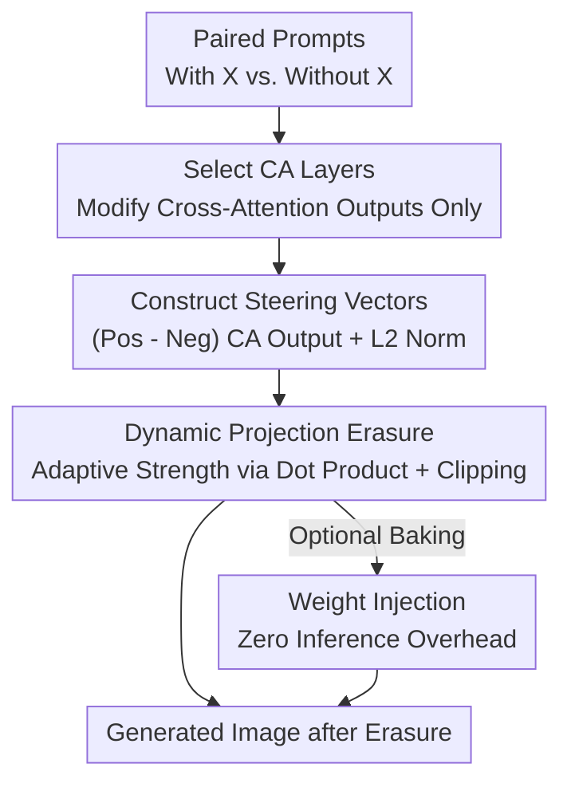

# CASteer: Cross-Attention Steering for Controllable Concept Erasure

**Conference**: ICLR2026  
**OpenReview**: [https://openreview.net/forum?id=6D5Odqol1B](https://openreview.net/forum?id=6D5Odqol1B)  
**Code**: https://github.com/Atmyre/CASteer  
**Area**: Diffusion Models / AI Safety  
**Keywords**: Concept Erasure, Diffusion Models, Steering Vectors, Cross-Attention, Training-free

## TL;DR
CASteer is a **training-free** framework for concept erasure in diffusion models. It pre-calculates "steering vectors" in the cross-attention layers for each concept using paired positive/negative prompts. During inference, it dynamically subtracts this direction based on the projection size of the current activation onto the vector. This allows for precise erasure (of nudity, violence, specific characters/styles) only on patches where the concept truly appears, while leaving other content nearly untouched, outperforming all training-based SOTA methods on multiple benchmarks.

## Background & Motivation

**Background**: While diffusion models have significantly improved text-to-image quality, they also carry risks of misuse (deepfakes, nudity, violence, copyrighted characters/styles). Consequently, various "concept erasure" methods have emerged to prevent models from generating problematic content at the source. Mainstream approaches include LoRA fine-tuning for specific objects/styles, model weight modification (UCE, RECE, MACE), and text-side negative prompting or token embedding editing.

**Limitations of Prior Work**: Almost all existing methods require **training or weight modification for each concept**, which is costly and lacks scalability—erasing multiple concepts often requires multiple adapters or repeated retraining. More importantly, they have specific weaknesses: LoRA/weight editing methods work well for "concrete concepts" (e.g., Snoopy) but struggle with "abstract concepts" (e.g., nudity or violence) that lack fixed visual anchors. Text-side methods are flexible but imprecise, with a stiff trade-off between erasure and feature preservation in discrete token space; even when the text "looks safe," the model can still generate inappropriate content.

**Key Challenge**: There is a fundamental trade-off between erasure strength and the preservation of irrelevant content. Indiscriminately suppressing a concept (fixed strength) causes collateral damage. Achieving precise erasure—suppressing a concept **only where it truly appears and proportional to its intensity**—requires a mechanism that can dynamically judge the presence of a concept patch-wise and step-wise during denoising, which is exactly what prior methods lack.

**Key Insight**: The authors build on the finding that deep networks encode features into approximate linear subspaces. Since the intermediate representations of the diffusion backbone contain linear directions that can adjust the intensity of a feature, concept erasure can be transformed into: finding the direction representing the concept and then subtracting the component of the representation projected along that direction—entirely without training.

**Core Idea**: Use the difference between a pair of "concept-containing/not-containing" prompts to calculate a steering vector in the **cross-attention output** space. During inference, dynamically subtract this vector based on the projection of the current activation onto it, achieving training-free, context-aware, and precise concept erasure.

## Method

### Overall Architecture

The operational principle of CASteer is simple: modify the **outputs of certain intermediate layers** of the diffusion backbone during inference so that the target concept does not appear in the generated image's semantics. The pipeline consists of two phases: **offline** pre-calculation of steering vectors for each concept, and **online** adaptive subtraction of these vectors at each denoising step.

Offline Phase: Given a concept $X$ to control (e.g., "Baroque Style"), construct paired prompts $p_{pos}$ / $p_{neg}$ that differ only in the presence of $X$. Run generation for both, save the cross-attention (CA) outputs for all $N$ layers and $T$ denoising steps. Average across the patch dimension, subtract the negative from the positive, and apply L2 normalization to obtain the layer-wise and step-wise steering vector $ca^X_{it}$.

Online Phase: Perform normal denoising, but at each step and each CA layer, use the **dot product** of the current CA output and $ca^X_{it}$ to estimate "how much $X$ is in this patch," then subtract a component of the steering vector proportional to this dot product. Patches with high concept presence are reduced more, while irrelevant patches remain nearly unchanged. Finally, this operation can be **baked into model weights** for zero inference overhead.

### Key Designs

**1. Selecting Cross-Attention Layers for Steering: Targeting the Entry Point of Text into Images**

Modern diffusion backbones (U-Net or DiT) contain cross-attention (CA), self-attention (SA), and MLP layers in each Transformer block. The authors point out that **CA layers are the only channel through which text prompt information enters the image** in the entire model. Since image semantics are primarily determined by text, modifying CA outputs achieves the best balance between effectiveness and precision. It is effective enough to remove concepts without significantly affecting text-independent structures like SA/MLP. Therefore, CASteer only constructs steering vectors for CA layer outputs.

**2. Steering Vector Construction: "Pointing" to the Concept Direction in Activation Space**

For concept $X$, create a pair of prompts differing only by $X$ (e.g., $p_{pos}$="A man, Baroque style", $p_{neg}$="A man"). Generate with both, saving all output pairs $\langle ca^{pos}_{it}, ca^{neg}_{it}\rangle$. Average across the patch dimension:

$$ca^{pos\_avg}_{it} = \frac{1}{\text{patch\_num}_i}\sum_k ca^{pos}_{itk}, \quad ca^{neg\_avg}_{it} = \frac{1}{\text{patch\_num}_i}\sum_k ca^{neg}_{itk}$$

Subtract and L2 normalize to obtain the steering vector for concept $X$:

$$ca^X_{it} = f_{norm}(ca^{pos\_avg}_{it} - ca^{neg\_avg}_{it})$$

Intuitively, this is the direction in activation space pointing from "regions without $X$" to "regions with $X$." Compared to methods like SDID that learn a vector, this is entirely training-free and more granular as it is calculated for every layer and step.

**3. Dynamic Projection Erasure + Intermediate Clipping: Adaptive Subtraction with $β=2$ Mirror Reflection**

Using a fixed strength to subtract the steering vector ($ca^{new}_{itk} = ca_{itk} - \alpha\, ca^X_{it}$) has a problem: the intensity of a concept varies across prompts and patches. A single $\alpha$ either fails to erase or causes collateral damage. The key observation is that since $ca^X_{it}$ is normalized, **the dot product $\langle ca^X_{it}, ca_{itk}\rangle$ is the projection length of the current output on the concept direction, representing the amount of $X$ in the patch.** Thus, the subtraction is made proportional to this dot product:

$$ca^{new}_{itk} = ca_{itk} - \beta\langle ca^X_{it}, ca_{itk}\rangle\, ca^X_{it}$$

This is equivalent to a projection operator onto the orthogonal subspace of $s = ca^X_{it}$. **Intermediate clipping** is added: only patches with a positive dot product (truly containing $X$) are modified, $\alpha = \max(\beta\langle ca^X_{it}, ca_{itk}\rangle, 0)$, preventing the "injection" of concepts into irrelevant regions. The authors use $\beta=2$ throughout. At $\beta=2$, the operator $(I - 2ss^T)$ is exactly a Householder reflection, which **preserves the L2 norm of the vector $c$**. This keeps all information orthogonal to $s$ intact while only flipping the component in the concept direction, providing a mathematical basis for erasing concepts without degrading image quality.

**4. Engineering: Cross-Distilled Model Transfer + Weight Baking**

Practical enhancements: ① **Multi-prompt stability**: Averaging differences from $P$ prompt pairs improves direction accuracy. ② **Multi-concept erasure**: Successively apply orthogonalized steering vectors for different concepts or average them. ③ **Transfer from distilled models**: One-step distilled models (SDXL-Turbo / SANA-Sprint) only need one denoising step ($T=1$). The resulting steering vector can guide non-distilled models at every step, saving the cost of multi-step sampling for vector calculation. ④ **Zero-overhead weight injection**: Since the final layer of CA blocks in SDXL/SANA is purely linear ($h_{out} = W_{proj\_out}h_{in}$), the projection $(I - ss^T)$ can be pre-multiplied into the weight matrix $W^s_{proj\_out} = (I - ss^T)W_{proj\_out}$, making the erasure permanent with **zero additional inference cost**.

## Key Experimental Results

The main comparisons use SD-v1.4 with $\beta=2$, applying steering to all CA layers. 50 prompt pairs were used for concrete concepts and 196 for abstract ones. SDXL / SANA used steering vectors from their distilled versions.

### Main Results

**Nudity Erasure** (I2P dataset, NudeNet threshold 0.6, lower is better):

| Method | Total Nude Detections ↓ |
|--------|------------------------|
| SD v1.4 (Original) | 646 |
| RECE | 66 |
| CPE (four word) | 40 |
| AdvUnlearn (Requires training) | 23 |
| SAeUron | 18 |
| **CASteer (w/o clip)** | 12 |
| **CASteer (clip)** | **7** |

The version with clipping results in only 7 detections, **less than half** of the second place (SAeUron 18), without requiring any training.

**Inappropriate Content Overall Erasure** (I2P, Q16 classifier, % inappropriate): CASteer (clip) achieved **25.58%**, surpassing the runner-up Receler (27.0%) by 1.42 percentage points, with particularly strong leads in "sexual" and "illegal activity" categories.

**Style Erasure** (Removing Van Gogh / Kelly McKernan; LPIPSe↑ indicates thorough erasure, Acce↓ indicates failure to recognize target style, Accu↑ indicates preservation of other styles):

| Method | Remove Van Gogh: Acce ↓ | Remove McKernan: Acce ↓ |
|--------|--------------------------|--------------------------|
| UCE | 0.95 | 0.80 |
| SAFREE | 0.35 | 0.40 |
| **Ours (clip)** | **0.25** | **0.05** |

CASteer erases target styles most thoroughly while preserving unrelated styles best.

### Ablation Study

| Configuration | Phenomenon | Explanation |
|---------------|------------|-------------|
| Dynamic α (Projection) vs. Fixed | Fixed strength is either insufficient or damaging | Adaptive strength via dot product is key to precision |
| w/ Intermediate Clipping (Eq.6) | Nudity detections 12 → 7 | Substantially reduces false positives by only targeting $X$ |
| $\beta=2$ (Householder) | Preserves L2 norm; better FID than most | Orthogonal info preserved, maintaining quality |
| $\beta<2$ | Weaker erasure, high quality remains | Allows smooth control of erasure degree |
| SDXL/SANA with $\beta>2$ | Stronger erasure, quality remains high | Larger models allow more aggressive settings |

**General Quality** (COCO-30k): CASteer (clip) achieved an FID of **13.02**, outperforming all competitors, proving that erasure does not harm normal generation.

### Key Findings
- **Dynamic Projection + Clipping are the primary drivers of performance**: Switching from fixed $\alpha$ to an adaptive amount proportional to the dot product, specifically for positive dot products, is crucial for reducing nudity detections.
- **Erasure of "implicitly defined" concepts**: Even when the prompt is "a mouse from Disneyland" (not explicitly naming Mickey), CASteer can still erase Mickey. Methods like SPM and DoCo fail here because CASteer operates in the joint image-text latent space.
- **Universal and Scalable**: Both abstract (nudity/violence) and concrete (Snoopy/styles) concepts can be erased simultaneously—a feat difficult for training-based LoRA/weight methods.
- **The Householder Reflection at $\beta=2$** provides a mathematical explanation for quality preservation: only flipping the concept direction while keeping orthogonal components intact.

## Highlights & Insights
- **Transforming concept erasure into linear projection**: The core insight is that the projection length of CA output onto the steering vector equals the concept presence. Thus, erasure equals subtracting this projection. One dot product performs both "detection" and "strength determination."
- **Elegant math with $\beta=2$**: Using Householder reflection ensures the transformation is norm-preserving, moving "quality preservation" from an empirical observation to a provable property.
- **Distilled model transfer**: The trick of using a 1-step distilled model to find directions for multi-step models is high-value. It follows the principle of "find the direction on the cheap model, apply it on the expensive one."
- **Zero-overhead weight baking**: By merging the projection into the final linear layer of CA blocks, the method achieves the same speed as the original model during deployment.

## Limitations & Future Work
- **Dependency on prompt pair quality**: Steering vectors depend on the difference between prompt pairs. Abstract concepts require many pairs (196) for stability; poor prompt design may lead to inaccurate directions.
- **Linear assumption**: The method relies on the assumption that concepts can be represented by a single linear direction. It remains unclear how well this handles highly tangled or context-dependent concepts.
- **Multi-concept interference**: When averaging or orthogonalizing multiple vectors, concepts might interfere with each other. Robustness for large-scale concurrent erasure needs more verification.
- **Detector dependency**: Evaluation relies on NudeNet/Q16 detectors, which have their own false positive/negative rates.

## Related Work & Insights
- **vs. ESD / Receler (Fine-tuning/Weight editing)**: These rely on pushing probability sets toward null tokens, which often causes collateral damage to related concepts. CASteer is training-free and adaptive.
- **vs. UCE / RECE / MACE (Direct weight modification)**: Effective for concrete concepts but struggle with abstract ones like nudity and require parameter modification.
- **vs. SPM / DoCo**: These fail on implicit concepts (e.g., "mouse from Disneyland"), whereas CASteer succeeds by acting on the joint latent space.
- **vs. SDID (Inducing concepts via vectors)**: SDID learns a vector to add to bottleneck activations to "induce" concepts. CASteer uses training-free vectors in the opposite way for precise "erasure."
- **vs. SAeUron (Finding directions with SAEs)**: SAEs are unstable, require massive training, and don't allow pre-specified attribute sets. CASteer is training-free with direct control.

## Rating
- Novelty: ⭐⭐⭐⭐⭐ Transform concept erasure into dynamic linear projection on CA outputs; training-free yet beats SOTA.
- Experimental Thoroughness: ⭐⭐⭐⭐⭐ Covers nudity, inappropriate content, concrete concepts, and styles across multiple backbones and implicit prompts.
- Writing Quality: ⭐⭐⭐⭐ Clear derivations, well-motivated $\beta=2$, though some details are in the appendix.
- Value: ⭐⭐⭐⭐⭐ Training-free, zero-overhead, and bakeable into weights; extremely practical for safe diffusion model deployment.

<!-- RELATED:START -->

## Related Papers

- [\[AAAI 2026\] Mass Concept Erasure in Diffusion Models with Concept Hierarchy](../../AAAI2026/image_generation/mass_concept_erasure_in_diffusion_models_with_concept_hierarchy.md)
- [\[CVPR 2026\] Neighbor-Aware Localized Concept Erasure in Text-to-Image Diffusion Models](../../CVPR2026/image_generation/neighbor-aware_localized_concept_erasure_in_text-to-image_diffusion_models.md)
- [\[CVPR 2026\] GrOCE: Graph-Guided Online Concept Erasure for Text-to-Image Diffusion Models](../../CVPR2026/image_generation/groce_graph-guided_online_concept_erasure_for_text-to-image_diffusion_models.md)
- [\[CVPR 2026\] Closed-Form Concept Erasure via Double Projections](../../CVPR2026/image_generation/closed-form_concept_erasure_via_double_projections.md)
- [\[ICLR 2026\] SDErasure: Concept-Specific Trajectory Shifting for Concept Erasure via Adaptive Diffusion Classifier](sderasure_concept-specific_trajectory_shifting_for_concept_erasure_via_adaptive_.md)

<!-- RELATED:END -->
## Related Papers

- [\[AAAI 2026\] Mass Concept Erasure in Diffusion Models with Concept Hierarchy](../../AAAI2026/image_generation/mass_concept_erasure_in_diffusion_models_with_concept_hierarchy.md)
- [\[CVPR 2026\] GrOCE: Graph-Guided Online Concept Erasure for Text-to-Image Diffusion Models](../../CVPR2026/image_generation/groce_graph-guided_online_concept_erasure_for_text-to-image_diffusion_models.md)
- [\[CVPR 2026\] Closed-Form Concept Erasure via Double Projections](../../CVPR2026/image_generation/closed-form_concept_erasure_via_double_projections.md)
- [\[ICLR 2026\] AEGIS: Adversarial Target-Guided Retention-Data-Free Robust Concept Erasure from Diffusion Models](aegis_adversarial_target-guided_retention-data-free_robust_concept_erasure_from_.md)
- [\[ICML 2026\] Orthogonal Concept Erasure for Diffusion Models](../../ICML2026/image_generation/orthogonal_concept_erasure_for_diffusion_models.md)

<!-- RELATED:END -->
