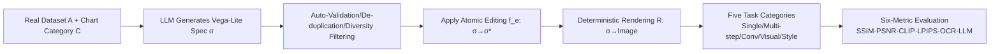

# Charts Are Not Images: On the Challenges of Scientific Chart Editing

**Conference**: ICLR 2026  
**OpenReview**: [https://openreview.net/forum?id=259xBeNyDV](https://openreview.net/forum?id=259xBeNyDV)  
**Code**: [https://github.com/adobe-research/figure-editing](https://github.com/adobe-research/figure-editing)  
**Area**: Image Generation / Scientific Chart Editing / Multimodal Benchmark  
**Keywords**: Chart editing, structural transformation, grammar of graphics, benchmark, semantic evaluation, instruction editing  

## TL;DR
This paper argues that "charts are not images"—charts are structured data renderings constrained by graphical grammars, and editing them is essentially a structural transformation rather than a pixel manipulation. Accordingly, it proposes FigEdit, a benchmark with over 30K samples covering 10 chart types and five progressive tasks, revealing that mainstream image editing models exhibit inflated pixel-based scores while frequently failing at actual semantic editing.

## Background & Motivation
**Background**: Diffusion models and autoregressive VLMs have shown impressive performance in instruction-based editing of natural images (e.g., InstructPix2Pix, Emu Edit, ControlNet). Naturally, there is a desire to transfer these tools to the modification of scientific charts—updating data, adjusting layouts, unifying styles, and converting encodings are daily requirements in scientific writing.

**Limitations of Prior Work**: Treating charts as images rests on a false premise. A chart is not a mere stack of pixels but a product rendered from structured data $D$ via a graphical grammar. Instructions such as "add a bar with a value of 42 for category X" require the model to coordinately update the data schema and visual mapping. However, current models often treat this as a visual rearrangement, producing results that "look plausible but violate semantics." Meanwhile, existing chart benchmarks mostly focus on captioning, QA, table extraction, or chart-to-code, lacking real underlying data, covering narrow editing categories, and containing almost no interactive scenarios like visual guidance or style transfer, while still relying on pixel similarity metrics like SSIM/PSNR.

**Key Challenge**: Instruction editors are optimized for "perceptual alignment under open objectives," whereas chart editing is strictly constrained by "data fidelity + visualization rules"—a persistent **problem–method mismatch**. Models trained on natural images lack the inductive biases to maintain "value–encoding consistency, axis coherence, and legend integrity."

**Goal**: To establish a task-structured, semantic-aware, and scalable benchmark dedicated to chart editing, and to systematically reveal the failure modes of existing models.

**Core Idea**: **[Problem Redefinition] Chart editing = Structural transformation**—formalizing editing as a transformation function $f_e:\Sigma\to\Sigma$ acting on marks, scales, encodings, and legends, explicitly defining invariants like data–encoding alignment, axis coherence, and legend integrity; **[Benchmark] FigEdit** applies transformations to Vega/Vega-Lite specifications using deterministic editing functions followed by rendering to provide pixel-consistent supervision; **[Evaluation] Semantic-aware metrics** reveal the gap between pixel similarity and semantic correctness.

## Method

### Overall Architecture
FigEdit is a "specification-driven + deterministic rendering" data generation and evaluation pipeline. First, an LLM generates base Vega-Lite specifications $\sigma$ under the constraints of real datasets and chart categories, followed by automated validation. Then, deterministic editing functions from a set of atomic operations $O$ are applied to the specifications to obtain edited specifications. Finally, a renderer $R$ renders these into "before/after" image pairs. From this, five categories of tasks are derived: single-step, multi-step, conversational, visual-guided, and style transfer. Models are evaluated in the image space using six complementary metrics (including LLM scoring).

### Key Designs

**1. Formalizing charts as structural specifications of "content + style" to make editing a definable transformation.** Natural images are viewed as mapping coordinates to colors $I:\mathbb{R}^2\to\mathbb{R}^3$, whereas charts are defined as the deterministic output of a renderer on a specification $I=R(\sigma)$. The specification is further decomposed into $\sigma=(C,S)$: content $C$ includes the dataset $D$, chart type $\tau$, and encoding functions mapping variables to geometric marks; style $S$ covers palettes, fonts, stroke/fill, grid lines, legend layout, spacing, and margins. An atomic edit $e$ is defined as a total function with pre/post-conditions $f_e:\Sigma\to\Sigma$. This formalization is the cornerstone of the work—it converts "is the edit correct" from a vague visual judgment into "does the specification-level transformation satisfy invariants," enabling the generation of pixel-consistent ground truth (GT) using deterministic editing functions, avoiding the limitations of chart-to-code which "only verifies code executability while ignoring perceptual quality."

**2. Five progressive tasks covering real editing scenarios.** Tasks are designed with increasing difficulty: single-step editing gives one atomic edit $\sigma^\star=f_e(\sigma)$; multi-step editing requires applying $k\ge2$ edits jointly, using a fixed specification order $\sigma^\star=(f_{e_k}\circ\cdots\circ f_{e_1})(\sigma)$ for non-commutative operations; conversational editing breaks a two-step edit into multiple rounds, where each round inputs $(I_{t-1},H_{t-1},u_t)$ containing history and intermediate states, testing the model's ability to maintain state across rounds; style transfer provides a source style and target content, requiring $C(\sigma^\star)=(D_t,\tau_t)$ while $S(\sigma^\star)\approx S(\sigma_s)$, i.e., changing style while preserving content; visual-guided editing additionally provides an annotated region $G$ (e.g., a thin red circle on the target element), requiring $\sigma^\star=f_{e,u,G}(\sigma)$ to apply modifications within the guided region while keeping the rest unchanged. This suite systematically expands across atomic edits, composite edits, multimodal guidance, and cross-image style adaptation, addressing interaction scenarios missing in existing benchmarks.

**3. Automated annotation pipeline ensuring reproducible deterministic supervision.** For each chart, a triplet is automatically produced: a natural language instruction with machine-readable OP labels, an edited specification with inlined data values, and the corresponding rendered image. Prior to editing, illegal operations are filtered based on chart semantics (e.g., spacing adjustments only apply to band/point scales), and schema correctness, visibility of changes, and data accounting consistency upon addition/deletion are verified to ensure supervision is deterministic and reproducible. From atomic edits, further derivations are made: splitting two-step edits into conversational samples, using a VLM to draw red circles on target regions for visual guidance assets, and pairing target edits with "style-matched reference images" for style transfer annotations. This results in 30,836 edited charts covering real domains such as economics, climate, healthcare, sports, and social sciences.

**4. Semantic-aware evaluation: Debunking "inflated" pixel metrics.** Evaluation is conducted entirely in the image space using six complementary metrics: SSIM, PSNR, LPIPS, CLIP similarity, OCR similarity, and an LLM-based instruction score (subdivided into Instruction Following, Content Preservation, and Visual Quality on a 1–5 scale). While the first five are classical pixel/perceptual metrics, the last directly judges "whether the edit was actually completed as instructed." The paper uses a set of cases (Fig. 2) to illustrate that a model can achieve very high SSIM/PSNR while the edit is actually incorrect—maintaining the overall appearance but ignoring instructions, distorting graphics, or misidentifying key content. This design explicitly shifts the evaluation focus from "pixel similarity" to "semantic correctness."

## Key Experimental Results

### Main Results
The evaluation targets 4 representative instruction editing models (GPT-Image, Imagen 4, OmniGen 2, InstructPix2Pix), with MLLM scores on a 1–5 scale:

| Task | Model | SSIM↑ | PSNR↑ | OCR↑ | Instr.↑ | Preserv.↑ | Qual.↑ |
|------|------|-------|-------|------|---------|-----------|--------|
| Single | Imagen 4 | **0.773** | **13.04** | 0.072 | 1.58 | 1.51 | 2.05 |
| Single | GPT-Image | 0.730 | 10.32 | 0.205 | **3.47** | 1.71 | 2.45 |
| Single | OmniGen2 | 0.735 | 11.30 | **0.262** | 3.35 | **2.55** | **2.85** |
| Multi | Imagen 4 | 0.696 | **11.02** | 0.107 | 1.26 | 1.32 | 2.15 |
| Multi | OmniGen2 | **0.710** | 10.15 | **0.265** | **2.65** | **2.10** | **2.70** |
| Conv. | GPT-Image | 0.673 | 10.66 | 0.172 | **4.59** | **2.51** | **2.91** |
| Conv. | Imagen 4 | **0.718** | **11.58** | 0.070 | 1.35 | 1.23 | 2.11 |
| Visual | Imagen 4 | **0.842** | **13.10** | 0.120 | 1.40 | 1.35 | 2.20 |
| Visual | GPT-Image | 0.836 | 12.85 | **0.467** | 2.39 | **3.16** | **3.95** |
| Transfer | Imagen 4 | **0.850** | **14.00** | 0.130 | 1.30 | 1.25 | 2.15 |
| Transfer | GPT-Image | 0.844 | 13.81 | **0.509** | **3.06** | **3.57** | **4.16** |

**Key Comparison**: Imagen 4 achieves the highest SSIM/PSNR in nearly all tasks but ranks last in instruction following and content preservation (with Instr. $\approx 1.3$ in many cases); this is clear evidence of "high pixel scores, failed semantics."

### Ablation Study

| Model | Strengths | Weaknesses |
|------|------|------|
| Imagen 4 | Pixel fidelity (highest SSIM/PSNR) | Worst instruction following and semantic preservation; edits "look smooth but are wrong" |
| GPT-Image | Strongest instruction following (esp. Conv/Transfer), high OCR | Lower PSNR, weak robustness for text-dense/layout-sensitive edits |
| OmniGen2 | Most balanced across tasks, stable OCR | Weaker visual-guided and style transfer performance, limited cross-instance reasoning |
| InstructPix2Pix | Reasonable for some semantic metrics | Generally inferior to OmniGen2 for complex edits |

### Key Findings
- **Pixel Similarity $\neq$ Semantic Correctness**: SSIM/PSNR systematically inflate the performance of pixel-oriented models like Imagen 4, whereas LLM scores and OCR reveal massive semantic errors. The gap is particularly severe in multi-step and conversational editing.
- **No Model Leads Universally**: Performance is highly fragmented; each model appears overfitted to specific task structures or metric types. High performance on classical pixel metrics does not guarantee that edits are performed correctly in harder scenarios.
- **Consistent Failure Modes**: Under instructions to delete data points, change background colors, or add new elements, models frequently produce results that are "visually similar but where the transformation never occurred."

## Highlights & Insights
- **Core Insight and Slogan**: "Charts are not images"—decoupling chart editing from general image editing and redefining it as a structural transformation problem constrained by graphical grammar is a highly persuasive reframing.
- **Ingenious Deterministic GT**: Applying editing functions to Vega-Lite specifications before rendering provides pixel-consistent ground truth while avoiding the pitfalls of chart-to-code benchmarks that "only verify executability," balancing structural correctness with perceptual quality.
- **Challenging Evaluation Paradigms**: This is not just another dataset; it experimentally demonstrates that SSIM/PSNR can lead to misleading conclusions in chart editing, pushing the evaluation towards semantic correctness at the data/encoding layers—providing methodological value to the field of chart intelligence.
- **Robust Scale and Coverage**: Over 30K samples, 10 chart types, five task categories, and real-domain data make it the first chart editing benchmark to simultaneously support visual guidance and style transfer.

## Limitations & Future Work
- **Benchmark Only, No New Model**: The paper diagnoses the "absence of structure-aware models" but only provides the evaluation protocol without offering a structure-aware editing method that passes the test, leaving this for future work.
- **LLM Scoring as Judge**: Semantic correctness relies heavily on LLM scoring; its own reliability, bias, and reproducibility need further calibration.
- **Image-Space Evaluation Compromise**: Although GT comes from specifications, model outputs are evaluated in the image space, which doesn’t fully utilize the executability for finer-grained structural validation for models that "output specifications."
- **Future Work**: Building structure-aware editing models that truly output specifications/executable targets and explicitly maintain data–encoding invariants is the natural next step for this research line.

## Related Work & Insights
- **Image Editing**: Instruction-based editing methods like InstructPix2Pix, LEDITS++, Emu Edit, SmartEdit, and AnyEdit are optimized for natural images and lack the structural constraints required for charts.
- **Scientific Chart Generation/Editing**: ScImage explores the limitations of MLLM chart generation, AutomaTikZ works on program-constrained text-to-vector graphics, and ChartEdit formalizes chart editing as a multimodal evaluation but only partially covers instruction types and lacks paired outputs—FigEdit systematically fills the gaps in real data, paired outputs, interactive scenarios, and semantic evaluation.
- **Insight**: When the "correctness" of a task is defined by structure/grammar (e.g., charts, code, UI layouts), relying on perceptual similarity for evaluation is systematically misleading; evaluation should descend to the structural/semantic layer, and models should be injected with corresponding inductive biases.

## Rating
- **Novelty**: ⭐⭐⭐⭐ — The "charts are not images" redefinition is clear and powerful. The specification-driven benchmark construction and semantic-aware evaluation are original, though it remains a "diagnosis + benchmark" work.
- **Experimental Thoroughness**: ⭐⭐⭐⭐ — 4 representative models × 5 task categories × 6 metrics, with quantitative and qualitative evidence cross-referencing to thoroughly explain the pixel–semantic gap. However, it lacks a structure-aware baseline that passes the tests.
- **Writing Quality**: ⭐⭐⭐⭐⭐ — Sharp arguments, clean formalization, and clearly organized tables and radar charts; the slogan and arguments are highly consistent.
- **Value**: ⭐⭐⭐⭐ — Provides a task-structured, semantic-aware public benchmark and evaluation paradigm for chart/scientific figure editing, offering strong impetus to the field. Its primary value lies in "setting the standard" rather than "providing the solution."

<!-- RELATED:START -->

## Related Papers

- [\[CVPR 2026\] Group Editing: Edit Multiple Images in One Go](../../CVPR2026/image_generation/group_editing_edit_multiple_images_in_one_go.md)
- [\[ICLR 2026\] Easier Painting Than Thinking: Can Text-to-Image Models Set the Stage, but Not Direct the Play?](easier_painting_than_thinking_can_text-to-image_models_set_the_stage_but_not_dir.md)
- [\[CVPR 2026\] Improved Mean Flows: On the Challenges of Fastforward Generative Models](../../CVPR2026/image_generation/improved_mean_flows_on_the_challenges_of_fastforward_generative_models.md)
- [\[CVPR 2026\] ChArtist: Generating Pictorial Charts with Unified Spatial and Subject Control](../../CVPR2026/image_generation/chartist_generating_pictorial_charts_with_unified_spatial_and_subject_control.md)
- [\[CVPR 2025\] Science-T2I: Addressing Scientific Illusions in Image Synthesis](../../CVPR2025/image_generation/science-t2i_addressing_scientific_illusions_in_image_synthesis.md)

<!-- RELATED:END -->
