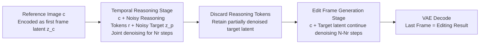

# ChronoEdit: Towards Temporal Reasoning for In-Context Image Editing and World Simulation

**Conference**: ICLR 2026  
**Code**: [https://research.nvidia.com/labs/toronto-ai/chronoedit](https://research.nvidia.com/labs/toronto-ai/chronoedit)  
**Area**: Image Generation / Image Editing  
**Keywords**: Image Editing, Video Generation Priors, Physical Consistency, Temporal Reasoning, World Simulation, Flow Matching

## TL;DR
This work reformulates image editing as a "two-frame video generation" problem, leveraging the temporal priors of pre-trained large video models to ensure the physical consistency of edits. By inserting discardable "temporal reasoning tokens" during inference to imagine a plausible editing trajectory, the proposed method achieves SOTA performance on world simulation editing tasks.

## Background & Motivation
**Background**: Large-scale foundational models such as FLUX.1 Kontext, OmniGen, and Qwen-Image-Edit have achieved high visual fidelity and instruction alignment in instruction-driven image editing. Closed-source systems like GPT-Image and Gemini 2.5 Flash Image further support multi-turn conversational refinement.

**Limitations of Prior Work**: These models are almost entirely data-driven image models, lacking mechanisms to enforce "physical consistency." When edits involve world simulation scenarios (e.g., long-tail events in autonomous driving, robotic manipulation, action rewriting), they often **hallucinate objects that should not exist, distort scene geometry, or violate color/shape attributes of edited objects**. The results appear plausible but violate physical constraints. Simply augmenting data with pixel-level editing pairs extracted from videos does not fundamentally solve the consistency issue.

**Key Challenge**: Image editing requires "changing what should be changed and preserving what should not." Direct mapping from an input image to a target image in a single step often results in abrupt changes, as the model lacks priors to constrain whether "this single-step transformation is physically feasible."

**Goal**: To build an image editing foundational model explicitly designed for physical consistency, particularly serving world simulation tasks (action editing, driving/robotics scenarios) that require high temporal coherence.

**Core Idea**: **① Treat editing as video generation**—Since large-scale video models naturally learn the persistence of object structures and implicit physics of motion/interaction across consecutive frames, treating the input and edited images as the first and last frames of a video allows the model to inherit these temporal priors. **② Treat inference as trajectory imagination**—During inference, the model is allowed to "imagine" a short sequence of intermediate frames (reasoning tokens) between input and output to plan how the edit occurs. This constrains the solution space to physically feasible transformations. These tokens can be discarded after a few steps to save computational resources.

## Method

### Overall Architecture
ChronoEdit is fine-tuned from a pre-trained image-to-video model (the 14B version is based on Wan2.1-I2V-14B-720P, the 2B version on Cosmos-Predict2.5-2B). The entire pipeline is built on rectified flow. During training, image editing pairs and real videos are unified into the same video sequence format: "First Frame = Input $c$, Last Frame = Output $p$, Intermediate Frames = Reasoning Tokens," for joint supervision. The inference stage is divided into two parts: first, de-noising with reasoning tokens for the initial high-noise steps to determine the global structure; then, discarding the reasoning tokens to refine only the target frame. It can also be distilled into an 8-step fast version.

### Key Designs

**1. Encoding Edit Pairs as Two-Frame Videos: Anchoring Temporal Intervals with RoPE**. To leverage video temporal priors, edit pairs must resemble videos. ChronoEdit encodes the input image as the first latent frame $z_c = \mathcal{E}(c)$ and encodes the output image, repeated 4 times to match the 4× temporal compression of the video VAE, as $z_p = \mathcal{E}(\text{repeat}(p,4))$. This yields two temporal latents aligned with the video architecture. A critical adjustment is made to the 3D-decomposed Rotary Positional Embedding (RoPE): the input image $c$ is anchored at timestep 0, and the output image $p$ is anchored at a predefined timestep $T$. This **explicitly encodes "how far apart the input and output are in time" into the positional embeddings**, allowing the model to understand the process as an evolution from $c$ to $p$ rather than two unrelated images. $T$ is fixed to the length of the video latents used in joint training.

**2. Temporal Reasoning Tokens: Allowing the Model to Imagine Transitions**. Direct learning of the mapping $c \to p$ often leads to discontinuities. ChronoEdit inserts several intermediate latent frames $r$ between $z_c$ and $z_p$. These are initialized as random noise and jointly denoised with the output frame latent. These "reasoning tokens" serve as intermediate guidance, forcing the model to "reason through" a plausible transition trajectory that maintains object identity, geometry, and physical coherence. The image editing denoiser is denoted as $F_\theta(z_{p,t}, t; y, z_c)$, where $y$ is the instruction text and $z_c$ is the image condition. This design enables unified training on both "image edit pairs" and "complete videos." For public editing data, each $(c, p, y)$ pair is treated as a two-frame video for direct instruction supervision. For real videos, the first frame is $c$, the last frame is $p$, and all intermediate frames serve as reasoning tokens, providing strong supervision for coherent transitions. Since the target frame is encoded separately and repeated 4 times, **reasoning tokens are optional during inference**—the VAE decoder can reconstruct the target frame independently without them, which enables discarding tokens later. The training objective for flow matching is to predict the velocity field $(\epsilon - z_0)$:

$$\mathcal{L}_\theta = \mathbb{E}_{t, x, \epsilon} \big[ \lVert F_\theta(z_t, t; y, c) - (\epsilon - z_0) \rVert_2^2 \big], \quad z_t = (1-t)z_0 + t\epsilon$$

**3. Two-Stage Inference: Reasoning only in the noisiest steps to save computation**. The intuition is that the first few steps (highest noise) of the flow/diffusion trajectory determine the global structure, where tokens attend to each other more frequently across frames. Thus, in the first stage, the clean input token $z_c$, sampled reasoning tokens $r$, and noisy output token $z_p$ are concatenated into a temporal sequence. Denoising proceeds for **$N_r$ steps** as in image-to-video generation, and the partially denoised latent corresponding to $z_p$ is then extracted. In the second stage, this partially denoised output latent is appended to the clean input latent, discarding the reasoning tokens, and is fully denoised in the remaining $N-N_r$ steps. Setting $r=0$ or $N_r=0$ reduces the process to standard sampling without reasoning. The paper uses 6 intermediate latent frames (equivalent to 24 frames in pixel space) as reasoning tokens, corresponding to $T=8$ timesteps.

**4. Curation of Video Data for Training Reasoning Tokens: Decoupling Scene Dynamics from Camera Motion**. Learning reasoning tokens requires many samples of "how scenes evolve over time." ChronoEdit curated 1.4 million synthetic videos, emphasizing the **decoupling of scene dynamics and camera motion**—otherwise, unintentional viewpoint changes between the first and last frames would be misinterpreted as edits. The corpus comprises three complementary categories: (i) Static camera, dynamic object text-to-video (prompts suffixed with "camera remains static," filtered with ViPE for stability); (ii) Egocentric driving scenes (HDMap-conditioned models to fix the camera, bounding boxes to control vehicle motion); (iii) Dynamic camera, static scene GEN3C segments (precise camera trajectory control, content preservation). VLMs are then used to generate editing instructions summarizing the transition between the first and last frames.

**5. DMD Few-Step Distillation: 6× Speedup for Real-Time Editing**. To further accelerate inference, ChronoEdit uses the DMD loss to distill the model into an 8-step student model (ChronoEdit-14B-Turbo), with gradient:

$$\nabla\mathcal{L}_{\text{DMD}} = -\mathbb{E}_t \Big[ \big(s_{\text{real}}(f(F_\theta, t), t) - s_{\text{fake}}(f(F_\theta, t), t)\big) \tfrac{dF_\theta}{d\theta} \Big]$$

where $s_{\text{real}}$ and $s_{\text{fake}}$ are score estimates from the teacher and a trainable fake score model, respectively. After distillation, the time per image drops from 30.4s to 5.0s (on 2×H100), with a quality loss of only about 0.3 points.

## Key Experimental Results

### Main Results
ImgEdit Basic-Edit Suite (734 examples, 9 edit categories, scored by GPT-4.1; temporal reasoning disabled here for fair compute comparison) Overall score (↑):

| Model | Scale | Overall ↑ |
|-------|-------|-----------|
| FLUX.1 Kontext [Dev] | 12B | 3.52 |
| FLUX.1 Kontext [Pro] | N/A | 4.00 |
| GPT Image 1 [High] | N/A | 4.20 |
| Qwen-Image | 20B | 4.27 |
| ChronoEdit-2B | 2B | 4.13 |
| ChronoEdit-14B-Turbo (8-step) | 14B | 4.13 |
| **ChronoEdit-14B** | 14B | **4.42** |

ChronoEdit-14B ranks first with 4.42, which is +0.90 higher than the comparable open-source FLUX.1 Kontext [Dev]. The largest gains are in "extract" (4.66 vs 2.15, +2.51) and "remove" (4.57 vs 2.94, +1.63). Compared to the 20B Qwen-Image, it remains stronger in difficult categories like background (4.67 vs 4.38) and action (4.41 vs 4.27).

PBench-Edit (271 physically grounded images: 133 Human / 98 Robot / 40 Driving, GPT-4.1 scored):

| Model | Action Fidelity | Identity Pres. | Visual Coherence | Overall ↑ |
|-------|-----------------|----------------|------------------|-----------|
| BAGEL | 3.83 | 4.60 | 4.53 | 4.32 |
| Qwen-Image | 3.76 | 4.54 | 4.48 | 4.26 |
| FLUX.1 Kontext [Dev] | 2.88 | 4.29 | 4.32 | 3.83 |
| ChronoEdit-14B | 4.01 | 4.65 | 4.63 | 4.43 |
| **ChronoEdit-14B-Think (Nr=10)** | **4.31** | 4.64 | 4.64 | **4.53** |
| ChronoEdit-2B-Think (Nr=10) | 4.17 | 4.61 | 4.56 | 4.44 |

### Ablation Study
Effect of temporal reasoning steps $N_r$ on PBench-Edit (ChronoEdit-14B-Think):

| Configuration | Action Fidelity | Overall ↑ |
|---------------|-----------------|-----------|
| No Reasoning (ChronoEdit-14B) | 4.01 | 4.43 |
| $N_r$ = 10 | 4.31 | 4.53 |
| $N_r$ = 20 | 4.28 | 4.51 |
| $N_r$ = 50 | 4.29 | 4.52 |

Only 10 reasoning steps are needed to reach the highest score of 4.53. Gains saturate beyond this, confirming the intuition that the global structure is determined in the earliest (noisiest) steps.

### Key Findings
- **Physical consistency stems mainly from video priors**: Even with temporal reasoning completely disabled, ChronoEdit-14B (4.43) outperforms all image editing baselines, suggesting that transferring editing to a video model is itself a key driver of performance.
- **Temporal reasoning specifically targets action fidelity**: Enabling reasoning increases Action Fidelity from 4.01 to 4.31. This dimension directly reflects the model's ability to maintain physical consistency in edits involving real-world interactions.
- **Small Model + Reasoning $\approx$ Large Model**: ChronoEdit-2B-Think (4.44) matches ChronoEdit-14B (4.43), indicating that trading parameters for reasoning is cost-effective.
- **Turbo offers high cost-performance**: The 8-step distilled version achieves 6× acceleration (5.0s vs 30.4s) with only a 0.3 point drop, still outperforming FLUX.1 Kontext Dev/Pro.

## Highlights & Insights
- **Paradigm Shift**: Reformulating "image editing" as "two-frame video generation" is a clean perspective shift. It allows the implicit physical/motion priors from massive video pre-training to be used for editing without injecting physical constraints into an image model from scratch.
- **Discardable Reasoning Tokens**: Utilizing "target frame separate encoding + 4-frame repetition" makes reasoning tokens optional at inference time. This allows reasoning only during the noisiest initial steps, capturing the benefits of trajectory planning without the cost of rendering an entire video—a clever trade-off between efficiency and quality.
- **Interpretability as a Byproduct**: Retaining intermediate reasoning frames allows for a direct visualization of the model's "thought process" (e.g., the step-by-step evolution of "adding a cat to a bench"), making the editing process observable rather than a black box.
- **Data Curation Addresses Core Issues**: Deliberately decoupling camera motion from scene dynamics prevents viewpoint drift from being mistaken for edits, which is a critical engineering detail for clean migration of video priors to editing.
- **New Benchmarking Suite**: PBench-Edit fills the gap in existing benchmarks that focus only on visual fidelity or instruction alignment rather than physical consistency, offering long-term value for the world simulation domain.

## Limitations & Future Work
- **Dependency on Large Video Backbones**: The method relies on powerful video models like Wan2.1 or Cosmos; performance gains might diminish in scenarios without equivalent video priors.
- **High Computational Requirements**: 14B full inference takes 30.4s (2×H100). Even the Turbo version requires 5.0s, which is still far from consumer-grade real-time editing.
- **Heavy Reliance on GPT-4.1 for Evaluation**: Primary metrics are scored by GPT-4.1. The "objectivity" of physical consistency is influenced by evaluator biases, and the work lacks cross-validation with real physical simulators or large-scale human subjective evaluations.
- **Domain Shift in Synthetic Videos**: 1.4 million model-generated videos were used for training. Distributional differences between synthetic data and real-world dynamics might be amplified in extreme long-tail scenarios.
- **Empirical Token Counts**: Hyperparameters like the 6 intermediate frames and $N_r$ are empirically set, lacking an adaptive mechanism across different tasks.

## Related Work & Insights
- **Image Editing Foundational Models**: FLUX.1 Kontext (alignment + multi-round), OmniGen (unified T2I/Edit/Subject-driven), Qwen-Image-Edit (VLM + dual-stream architecture), and closed-source GPT-4o / Gemini 2.5 Flash Image are the primary points of comparison.
- **Video Priors for Editing**: BAGEL, UniReal, and OmniGen use video keyframes to create temporally coherent image pairs (data perspective). Rotstein et al. use I2V models to synthesize intermediate frames without training and select the best one. Wiedemer et al. noted that strong video models (Veo 3) preserve detailed textures better in editing. ChronoEdit is complementary, advancing video models from "data generation/frame selection" to "direct editors with explicit reasoning."
- **Insights**: ① "Changing the generation paradigm to inherit priors" is a general strategy. For any generation task requiring implicit constraints (physics, coherence, identity), one should consider borrowing from a large model in an adjacent modality that has already learned those constraints. ② "Discardable intermediate reasoning representations" is a lightweight paradigm for introducing test-time compute/reasoning into diffusion generation, worthy of transfer to other tasks.

## Rating
- **Novelty**: ⭐⭐⭐⭐ — The paradigm reformulation of "image editing = two-frame video generation" paired with discardable reasoning tokens effectively bridges video priors and test-time reasoning in a self-consistent way.
- **Experimental Thoroughness**: ⭐⭐⭐⭐ — Includes two benchmarking suites (including the self-built PBench-Edit), multiple configurations (14B/2B/Turbo/Think), and comparisons with over ten open/closed-source baselines; only slightly limited by the lack of cross-validation with real physical simulations or human ratings.
- **Writing Quality**: ⭐⭐⭐⭐ — Clear logic from motivation to method and experiments. Pipeline diagrams and algorithm pseudocode are effective, with sufficient explanation of key designs.
- **Value**: ⭐⭐⭐⭐ — Directly addresses the pain point of physical consistency in world simulation editing. Both the model and benchmark are open, offering practical value for autonomous driving/robotics data generation and controllable editing.

<!-- RELATED:START -->

## Related Papers

- [\[CVPR 2026\] Re-Align: Structured Reasoning-guided Alignment for In-Context Image Generation and Editing](../../CVPR2026/image_generation/re-align_structured_reasoning-guided_alignment_for_in-context_image_generation_a.md)
- [\[ICLR 2026\] WorldEdit: Towards Open-World Image Editing with a Knowledge-Informed Benchmark](worldedit_towards_open-world_image_editing_with_a_knowledge-informed_benchmark.md)
- [\[ICLR 2026\] Geometric Image Editing via Effects-Sensitive In-Context Inpainting with Diffusion Transformers](geometric_image_editing_via_effects-sensitive_in-context_inpainting_with_diffusi.md)
- [\[ICLR 2026\] FlowAlign: Trajectory-Regularized, Inversion-Free Flow-based Image Editing](flowalign_trajectory-regularized_inversion-free_flow-based_image_editing.md)
- [\[ICLR 2026\] UniEdit-Flow: Unleashing Inversion and Editing in the Era of Flow Models](uniedit-flow_unleashing_inversion_and_editing_in_the_era_of_flow_models.md)

<!-- RELATED:END -->
