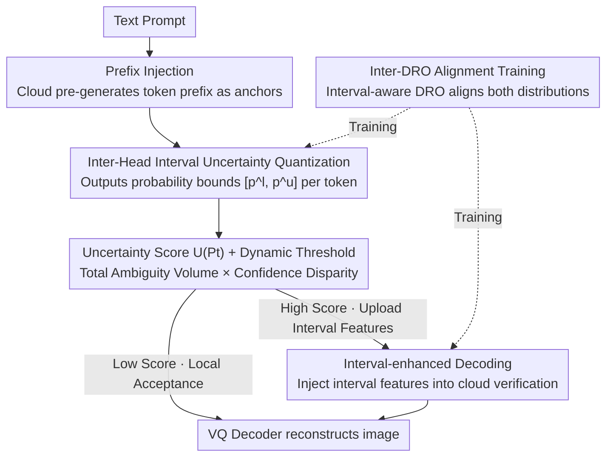

# CIAR: Interval-based Collaborative Decoding for Image Generation Acceleration

**Conference**: ICLR2026  
**OpenReview**: [https://openreview.net/forum?id=YzZ4pSAwZy](https://openreview.net/forum?id=YzZ4pSAwZy)  
**Code**: TBD  
**Area**: Image Generation / Autoregressive Image / Edge-Cloud Collaborative Inference Acceleration  
**Keywords**: Autoregressive image generation, speculative decoding, edge-cloud collaboration, uncertainty quantization, probability intervals

## TL;DR
CIAR introduces speculative decoding for autoregressive image generation into an edge-cloud collaborative framework. It employs an on-device "Inter-Head" to output continuous probability intervals for each visual token to quantify uncertainty. This allows low-uncertainty regions to be generated locally on the device, while only high-uncertainty boundary detail tokens and their interval features are uploaded to the cloud for verification. Combined with Inter-DRO alignment training, it achieves a 2.18× speedup and reduces cloud request volume by 70% with negligible impact on image quality.

## Background & Motivation
**Background**: Autoregressive (AR) image generation models (e.g., LlamaGen, Anole) discretize images into tokens and generate them sequentially via "next-token prediction," achieving image quality comparable to diffusion models. However, they rely on increasingly large visual codebooks for fidelity. The large parameter counts and sequential nature of token generation make them slow and heavy for edge devices like smartphones. A natural solution is edge-cloud collaboration: a lightweight AR model on the device generates tokens quickly, while a large model in the cloud performs parallel verification, essentially porting speculative decoding from text to vision.

**Limitations of Prior Work**: Directly applying speculative decoding to images faces two fatal issues. First, verification overhead explodes—the number of image tokens grows quadratically with resolution. Uploading all tokens to the cloud for verification makes network communication a bottleneck, offsetting the cloud's computational advantages and increasing costs. Second, uniform verification strategies are inefficient—traditional methods treat every image region equally, but image uncertainty is highly spatially non-uniform. Low-entropy regions like backgrounds or smooth surfaces are highly predictable and almost always accepted by the cloud (the authors found approx. 70% of device-side greedy tokens match cloud expectations), whereas object boundaries and complex textures are error-prone. Uniform verification wastes computation on "already correct" tokens and fails to focus resources on truly uncertain areas.

**Key Challenge**: To reduce cloud requests, the device must make more local decisions. However, how can the device determine which tokens are safe to generate locally and which require cloud assistance? Existing entropy metrics fail here: large visual codebooks result in flat probability distributions with poor entropy discrimination. Furthermore, entropy is a scalar that ignores spatial context, masking true ambiguity. Additionally, once a device fixes a local prefix, its conditional distribution gradually drifts from the cloud model's expectations (distribution drift), leading to degraded generation.

**Goal**: (1) Provide the device with an effective and inexpensive uncertainty metric for large visual codebooks to perform self-verification; (2) Re-align the device and cloud distributions during heavy local generation to prevent drift from damaging image quality.

**Key Insight**: The authors observe that visual token uncertainty is "continuous"—rather than enumerating feasible solutions in a discrete set (which is exponentially costly relative to the codebook size), it is more efficient to output continuous probability upper and lower bounds for each token. The "width" of this interval can then characterize uncertainty.

**Core Idea**: Use a lightweight Inter-Head to output continuous probability intervals $[p^l_t, p^u_t]$ for each token. Calculate an uncertainty score based on the interval width to decide between "local acceptance or cloud upload," and inject interval features into the cloud for verification using Inter-DRO loss to align distributions.

## Method

### Overall Architecture
CIAR is an edge-cloud collaborative autoregressive visual decoding framework aimed at generating as many tokens as possible locally on the device, only offloading high-uncertainty tokens to the cloud. The pipeline is: The cloud AR large model first generates a short prefix of image tokens (Prefix Injection) and injects them into the device as anchors. The lightweight AR model on the device, equipped with an **Inter-Head**, generates continuous probability intervals per token and calculates an uncertainty score $U(P_t)$. Tokens with scores below a dynamic threshold are "self-verified" and accepted locally; high-score tokens, along with their interval features, are uploaded to the cloud. During verification/resampling, the cloud injects these interval features into its decoder (Interval-enhanced Decoding) to correct the output and return it, suppressing distribution drift and preserving boundary details. This mechanism is supported by **Inter-DRO alignment training**, which aligns the outputs of the structurally different Inter-Head with the cloud distribution. Finally, a VQ decoder reconstructs the image.

### Key Designs

**1. Inter-Head: Quantifying Uncertainty with Continuous Probability Intervals instead of Discrete Sets**

To address the failure of entropy metrics on large visual codebooks and the exponential cost of discrete enumeration, Inter-Head expands the standard LM Head output dimension from $|V|$ to $2\times|V|$. For the hidden state $h_t$ of each token, it simultaneously predicts a center logit and a radius: $c_t = \text{Linear}_{center}(h_t)$, $r_t = \text{Softplus}(\text{Linear}_{radius}(h_t))$. Softplus ensures the radius $r_t$ is strictly non-negative, resulting in a logit interval $[c_t - r_t,\, c_t + r_t]$. An InterFuse operator then maps this to a valid probability interval $P_t = [p^l_t, p^u_t]$, satisfying the property $\sum_i p^l_i \le 1 \le \sum_i p^u_i$. The advantage is that it preserves the continuity of visual token distributions and provides finer uncertainty characterization than scalar entropy while reducing the exponential cost of discrete enumeration to a single forward pass.

**2. Uncertainty Score $U(P_t)$: Total Ambiguity Volume × Confidence Disparity with Dynamic Thresholds**

An interval must be compressed into a scalar for decision-making. The authors found that token uncertainty increases with both the "total width" of the interval and the "dispersion" of widths across dimensions—simply averaging would lose the latter. Let $\delta_t = p^u_t - p^l_t \in \mathbb{R}^{|V|}_{\ge 0}$ be the vector of interval widths. The uncertainty score is defined as the product of "Total Ambiguity Volume" ($\Omega_t$) and "Confidence Disparity" ($\Sigma_t$):

$$U(P_t) = \underbrace{\lVert \delta_t \rVert_1}_{\Omega_t:\, \text{Total Ambiguity Volume}} \cdot \underbrace{\sqrt{\frac{1}{|V|}\sum_{i=1}^{|V|}\left(\delta_{t,i} - \bar{\delta}_t\right)^2}}_{\Sigma_t:\, \text{Confidence Disparity}}$$

where $\bar{\delta}_t$ is the mean width. Using a product ensures the score is high only when both the total ambiguity is large and the disparity across dimensions is significant, making it sensitive to true ambiguity but insensitive to uniform low-entropy regions. This score is fed to a **dynamic threshold** strategy: tokens below the threshold are self-verified locally (a threshold of 0.30 was found optimal for speed/quality), while those above are uploaded.

**3. Cloud-Enhanced Decoding: Prefix Injection + Interval Feature Injection**

This module addresses distribution drift. **Prefix Injection**: Easing the lack of context for the device in early generation, the cloud pre-generates a short prefix of length $m = \lfloor \rho \cdot T \rfloor$ ($\rho$ is the prefix rate) to serve as high-quality anchors. **Interval Feature Injection**: For each locally accepted token $x_{t+i}$, its hidden state $f_{t+i}$ and interval $P_{t+i}$ are concatenated and passed through a lightweight projection network $\phi$ to obtain a compact interval feature $f^I_{t+i} = \phi(\text{Concat}(f_{t+i}, P_{t+i})) \in \mathbb{R}^d$. During cloud verification, this feature is added to the decoder input: $h^C_{t+i+1} = \text{Decoder}^C\big(E(x_{t+i}) + f^I_{t+i}\big)$. Thus, the cloud sees not just the token but structured information about how "confident" the device was, preventing error accumulation.

**4. Inter-DRO Loss: Interval-aware Distributionally Robust Optimization**

Since Inter-Head and cloud output layers differ in structure, parameters cannot be shared directly. The training strategy must ensure accurate interval estimation and alignment with the cloud. The authors treat the lower bound $q^L$ as a worst-case scenario, similar to Distributionally Robust Optimization (DRO). The loss consists of three parts: An anchoring loss $\mathcal{L}_{anchor} = \lambda_v \lVert p - p_{cloud}\rVert_1 + \lambda_p \text{CE}(p_{cloud}, p)$ pulls both bounds toward the cloud output $p_{cloud}$. For the lower bound, an adversarial reweighting is added: $\mathcal{L}^{DRO}_{lo} = \max_{w}\sum_n w_n \text{CE}(p^{(n)}_{cloud}, p^{(n)}_{lo})$, where weights $w_n \propto \exp(\alpha\,\text{CE})$ focus on harder samples. A KL divergence term ensures alignment for the center prediction $p_{mid}$: $\mathcal{L}_{align} = \lambda_\beta D_{KL}(p_{cloud}\Vert p_{mid})$. The full loss is $\mathcal{L}_{\text{Inter-DRO}} = \big[\mathcal{L}_{anchor}(p_{mid}) + \mathcal{L}_{align}\big] + \mathcal{L}_{anchor}(p_{up}) + \big[\mathcal{L}_{anchor}(p_{lo}) + \mathcal{L}^{DRO}_{lo}\big]$.

### Loss & Training
The core training objective is the Inter-DRO loss described above, constraining the interval center (KL + anchoring), upper bound (anchoring), and lower bound (anchoring + adversarial reweighting DRO). The device-side model uses the same architecture as the cloud but retains only a single autoregressive layer to save computation; training is compatible with Classifier-Free Guidance (CFG).

## Key Experimental Results

### Main Results
Evaluated on LlamaGen-XL (Stage I / II) and Anole cloud models using the MS-COCO validation set for caption-to-image generation. The device-side is a single-layer AR. Baselines include EAGLE-2, Lantern, Entropy-Lens, and CoDe.

| Cloud Model | Method | CLIP↑ | FID↓ | F1↑ | HPSv2↑ | Latency↓ | Cloud Call↓ |
|------|------|------|------|------|------|------|------|
| LlamaGen(I) | Base | 0.3161 | 23.69 | 0.6097 | 22.74 | ×1.00 | 100% |
| LlamaGen(I) | Lantern | 0.3159 | 25.55 | 0.5834 | 21.29 | ×1.66 | 50.11% |
| LlamaGen(I) | CoDe(N=0.3) | 0.2827 | 35.67 | 0.4625 | 18.08 | ×2.04 | 30.00% |
| LlamaGen(I) | **CIAR** | 0.3159 | **24.25** | 0.5997 | 22.48 | **×2.53** | **30.44%** |
| LlamaGen(II) | Base | 0.2822 | 40.07 | 0.5350 | 23.84 | ×1.00 | 100% |
| LlamaGen(II) | **CIAR** | **0.2927** | **39.31** | **0.5458** | 23.26 | **×2.13** | 34.46% |
| Anole | Base | 0.3215 | 19.95 | 0.6544 | 23.52 | ×1.00 | 100% |
| Anole | **CIAR** | 0.3171 | 23.86 | 0.5970 | 23.14 | **×1.87** | **29.88%** |

Note: The 2.18× speedup and 70% reduction in cloud requests are comprehensive conclusions vs. SOTA speculative decoding. Latency gains vary by backbone (up to 2.53× on LlamaGen Stage I). CIAR maintains quality (CLIP/FID/F1) parity with Base while CoDe's quality collapses (FID increases to 35+).

### Ablation Study
Comparison of uncertainty metrics (LlamaGen Stage I):

| Method | CLIP↑ | FID↓ | F1↑ | HPSv2↑ | Speedup | Cloud Call |
|------|------|------|------|------|------|------|
| Random | 0.3142 | 30.19 | 0.5369 | 18.16 | ×2.28 | 36.46% |
| Entropy-Lens | 0.3132 | 24.58 | 0.5796 | 22.03 | ×1.70 | 52.34% |
| SoftmaxCorr | 0.3149 | 31.10 | 0.5130 | 19.11 | ×2.27 | 36.49% |
| **Inter-Head(Ours)** | **0.3159** | **24.25** | **0.5997** | **22.48** | **×2.53** | **30.44%** |

Continuous vs. Discrete uncertainty estimation (LlamaGen Stage I):

| Method | Setting | CLIP↑ | FID↓ |
|------|------|------|------|
| Discrete | k=100 | 0.3081 | 26.04 |
| Discrete | k=300 | 0.3123 | 24.82 |
| **Continuous(Ours)** | — | **0.3176** | **24.25** |

### Key Findings
- **Inter-Head is the core source of gain**: Replacing it with Random/Entropy-Lens/SoftmaxCorr leads to either significant FID degradation or high cloud request volumes.
- **Continuous intervals significantly outperform discrete enumeration**: Discrete methods show exponential latency growth with codebook size $k$, whereas continuous intervals achieve better CLIP/FID with lower latency.
- **Prefix rate is non-monotonic**: Higher prefix rates improve quality and reduce cloud verification but increase cloud pre-generation overhead. $\rho=0.06$ is optimal.
- **Text speculative decoding is ineffective for images**: Direct application of EAGLE-2 shows almost no speedup and quality loss.

## Highlights & Insights
- **Continuous Probabilistic Intervals vs. Discrete Enumeration**: Replacing exponential discrete searching with a single-pass interval estimate preserves distribution continuity while enabling edge deployment.
- **Product-based Uncertainty Score**: The product of total ambiguity and confidence disparity effectively handles the flat distributions of large codebooks, a design transferable to other discrete generation tasks (video, point clouds).
- **Injecting Confidence as a Feature**: Mapping interval features into the cloud decoder allows the cloud to treat device confidence as actionable intelligence, preventing error accumulation.
- **DRO for Unified Training**: Framing the upper/lower bound optimization as a worst-case robust optimization provides a clean objective.

## Limitations & Future Work
- **Reliance on Edge-Cloud Connectivity**: High-uncertainty tokens require cloud backup; offline or weak network scenarios may revert to greedy device generation, resulting in blurred details.
- **Hyperparameter Sensitivity**: $\rho$ and the uncertainty threshold require careful tuning and are non-monotonic regarding speedup.
- **Evaluation Scope**: Experiments were focused on MS-COCO with specific models; scalability to higher resolutions or larger codebooks requires further validation.
- **Adaptive Strategies**: Making thresholds or prefix rates adaptive based on generation progress or semantics could further optimize the speed-quality frontier.

## Related Work & Insights
- **vs. Lantern (Visual Speculative Decoding)**: Lantern requires total cloud verification, leading to high communication costs (50% cloud calls). CIAR reduces cloud calls to ~30% with better CLIP/FID.
- **vs. CoDe (VAR Collaborative Acceleration)**: CoDe relies on small-model sequence completion, causing distribution drift (FID 35+). CIAR suppresses drift via prefix and interval injections.
- **vs. Entropy-Lens / SoftmaxCorr**: These scalar metrics ignore the spatial heterogeneity and flat distributions of large codebooks; CIAR's interval width is more sensitive to visual token properties.

## Rating
- Novelty: ⭐⭐⭐⭐ Continuous intervals for visual token uncertainty + edge-cloud self-verification is a clean and novel combination.
- Experimental Thoroughness: ⭐⭐⭐⭐ Solid multi-backbone testing and ablations, though limited to MS-COCO.
- Writing Quality: ⭐⭐⭐⭐ Clear motivation; Figure 2 provides a good overview.
- Value: ⭐⭐⭐⭐ Clear practical value for accelerating edge-side autoregressive image generation.

<!-- RELATED:START -->

## Related Papers

- [\[ICLR 2026\] Autoregressive Image Generation with Randomized Parallel Decoding](autoregressive_image_generation_with_randomized_parallel_decoding.md)
- [\[ICML 2026\] Speculative Coupled Decoding for Training-Free Lossless Acceleration of Autoregressive Visual Generation](../../ICML2026/image_generation/speculative_coupled_decoding_for_training-free_lossless_acceleration_of_autoregr.md)
- [\[AAAI 2026\] Annealed Relaxation of Speculative Decoding for Faster Autoregressive Image Generation](../../AAAI2026/image_generation/annealed_relaxation_of_speculative_decoding_for_faster_autor.md)
- [\[ICCV 2025\] Grouped Speculative Decoding for Autoregressive Image Generation](../../ICCV2025/image_generation/grouped_speculative_decoding_for_autoregressive_image_generation.md)
- [\[CVPR 2026\] Parallel Jacobi Decoding for Fast Autoregressive Image Generation](../../CVPR2026/image_generation/parallel_jacobi_decoding_for_fast_autoregressive_image_generation.md)

<!-- RELATED:END -->
