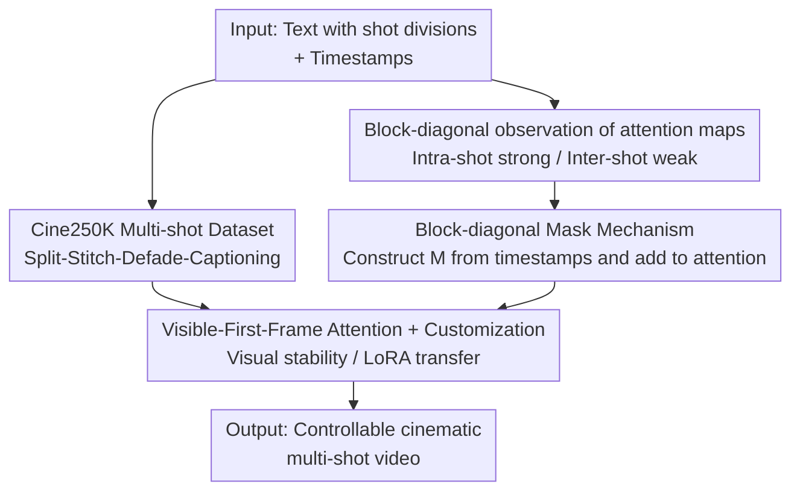

# CineTrans: Learning to Generate Videos with Cinematic Transitions via Masked Diffusion Models

**Conference**: ICLR2026  
**OpenReview**: [https://openreview.net/forum?id=955hVLJdfP](https://openreview.net/forum?id=955hVLJdfP)  
**Code**: [Project Page uknowsth.github.io/CineTrans](https://uknowsth.github.io/CineTrans/)  
**Area**: Video Generation / Diffusion Models  
**Keywords**: Multi-shot video generation, cinematic transitions, attention mask, video diffusion models, dataset construction

## TL;DR
CineTrans observes that the attention maps of video diffusion models naturally exhibit a block-diagonal structure, characterized by "strong intra-shot and weak inter-shot correlation." By manipulating attention with a block-diagonal mask constructed directly from shot timestamps and fine-tuning on the self-constructed Cine250K multi-shot dataset, the model can generate cinematic multi-shot transitions at any specified position. This mechanism is also effective in a training-free manner by simply applying the mask.

## Background & Motivation
**Background**: Text-to-Video (T2V) diffusion models have achieved significant performance in image quality and single-shot coherence. However, the vast majority of models typically generate "one-take" single-shot videos. Real films tell stories through shot transitions (cuts), yet generating multi-shot videos with movie-like transitions from a single prompt remains an unresolved challenge.

**Limitations of Prior Work**: Existing approaches to long/multi-shot video generation face significant hurdles. The first approach involves scaling models and data (e.g., HunyuanVideo, Wan, CogVideoX). While these may occasionally produce multi-shot content when specified in the prompt, transitions are neither guaranteed nor precisely positioned because training data rarely contains explicit shot boundaries. Furthermore, training costs are extremely high. The second approach is the "generate-then-stitch" pipeline (e.g., Animate-a-Story, VGoT, MovieDreamer), which requires heavy manual intervention and lacks cinematic priors, often resulting in cuts that do not follow realistic editing conventions. Other works focus narrowly on face consistency or specific animation styles, limiting generalization.

**Key Challenge**: The fundamental issue is that **how "shot transitions" are internally represented within the model remains a black box**. Without knowing whether diffusion models possess an inherent transition mechanism, it is impossible to precisely control them without massive data or retraining. Additionally, a consistency paradox exists: excessively high inter-shot consistency is detrimental (indicating pixel-level duplication rather than a true cut), yet it cannot be too low (leading to character/scene breakage).

**Goal**: (1) Elucidate how diffusion models encode shot boundaries internally; (2) Design a mechanism for precise transition control at arbitrary positions with minimal dependence on large-scale retraining; (3) Provide multi-shot data embedded with cinematic editing priors; (4) Design evaluation metrics capable of distinguishing "true transitions" from "fake duplication."

**Key Insight**: The authors observe the **temporal attention maps** during the denoising process of diffusion models. Since frame correlations are reflected in the attention mechanism, transition points (requiring drastic change) and non-transition points (requiring continuity) should exhibit distinct attention patterns.

**Core Idea**: Construct a "block-diagonal attention mask" directly from shot timestamps to align with and amplify the model's inherent tendency for shot switching. This is followed by fine-tuning on a custom cinematic dataset to inject controllable cinematic transitions into the video diffusion model.

## Method

### Overall Architecture
CineTrans takes a text prompt with shot divisions (e.g., "Two shots: ...; Shot 1: [0s, 4s]; Shot 2: [4s, 8s]") as input and outputs a multi-shot video with cuts at specified time points. The workflow consists of four steps: data construction, model analysis, mask-based control, and deployment (fine-tuning or training-free):

1.  **Data Construction**: Starting from 633K curated Vimeo videos, the authors build Cine250K—comprising 250,000 pairs with frame-level shot labels and hierarchical captions—through a "split-stitch-filter-defade-caption" pipeline.
2.  **Model Analysis**: By visualizing the inter-frame attention maps, it is discovered that in multi-shot scenarios, attention naturally forms a **block-diagonal structure**, where intra-shot correlation is strong and inter-shot correlation is weak, aligning closely with real shot boundaries.
3.  **Mask-based Control**: Based on user-specified shot timestamps, a block-diagonal mask $M$ is constructed and added to the attention scores of specific layers. this forces "intra-shot connectivity and inter-shot isolation," ensuring transitions occur exactly at specified positions. This step is effective even without fine-tuning (training-free).
4.  **Deployment**: The model is fine-tuned on Cine250K using the mask mechanism to learn authentic cinematic editing styles. Additionally, "Visible-First-Frame Attention" is introduced to stabilize visuals, and the mechanism can be transferred to customized (character-consistent) models via LoRA.

### Key Designs

**1. Cine250K Multi-shot Dataset: Supplying "Cinematic Editing Priors"**

To address the lack of shot transitions in existing T2V data, a multi-stage data processing pipeline was designed. First, PySceneDetect splits raw videos into fragments. Then, ImageBind features are used to measure semantic similarity between adjacent fragments, which are **re-stitched** (split-stitch) according to predefined rules to create 16M candidates with transitions. These are filtered by aesthetic scores (top 40%), duration (8–15s), and shot count (2–4). Crucially, TransNetV2 is used to detect and **remove all "fade transition" frames**; removing these blurry frames ensures clear boundaries and precise start/stop indices. Finally, LLaVA-Video generates dense global captions, while LLaVA-NeXT generates per-shot captions, forming a hierarchical annotation.

**2. Block-diagonal Observation of Attention Maps: Opening the Black Box**

This is the core insight of the paper. The authors hypothesize that correlations between adjacent frames at transition points should differ significantly from those at non-transition points. Visualizing frame-by-frame attention maps reveals that in multi-shot videos, the attention probability matrix exhibits a **block-diagonal structure**—each block corresponds to a shot. Quantitatively, the ratio of intra-shot to inter-shot average attention probability is approximately $26.68$, and Pearson correlation confirms this structure corresponds to real shot boundaries ($r=0.71, p<0.01$). This proves that attention maps naturally encode shot boundaries and can be used for control.

**3. Block-diagonal Mask Mechanism: Amplifying and Localizing Inherent Capabilities**

Based on the above observation, a mask $M$ is added to the visual token attention. Given a preset shot partition, the mask is defined as:

$$M_{ij} = \begin{cases} 0 & \text{if } i, j \text{ belong to the same shot} \\ -\infty & \text{if } i, j \text{ belong to different shots} \end{cases}$$

This is incorporated into the attention calculation:

$$\text{Attention}(Q,K,V) = \text{softmax}\!\left(\frac{QK^{T}}{\sqrt{d_k}} + M\right)V$$

Since the $-\infty$ terms become zero after softmax, inter-shot attention is eliminated, forcing the attention probability into a block-diagonal matrix. This mechanism is applied only to **specific layers** (e.g., the last 6 layers of CineTrans-Unet): masked layers enforce intra-shot coherence for frame-level transitions, while unmasked layers allow all frames to attend to each other to maintain high-level semantic consistency. Because this mechanism aligns with existing model tendencies, it is **effective even without training (training-free)**.

**4. Visible-First-Frame Attention and Customization: Enhancing Stability**

The authors observed that in some attention layers, all visual tokens are strongly correlated with the **first temporal latent**, indicating a dependency on initial frame information. They proposed **Visible-First-Frame Attention**, which modifies the mask to allow all tokens to "see" the first frame, reducing flickering and deformation. Furthermore, by using this mask mechanism, models originally designed for single-shot generation can be forced to perform transitions. By loading LoRA weights (even those trained on single-shot videos), the model can produce multi-shot videos with specific styles or characters.

### Loss & Training
CineTrans-Unet is based on LaVie, with masks applied to the last 6 layers, fine-tuned on Cine250K with a batch size of 128 and a learning rate of $1\times10^{-4}$ for 20,000 steps. CineTrans-DiT is based on Wan2.1-T2V-1.3B, with masks applied to transformer layers 7–28. Two variants are released: a training-free variant using the block-diagonal mask with Visible-First-Frame Attention, and a fine-tuned variant using LoRA (rank=64) for 2,800 steps with a batch size of 256. Since 99.58% of cinematic transitions are hard cuts, the primary method uses hard masks.

## Key Experimental Results

### Main Results
Evaluation was conducted using 100 hierarchical prompts generated by GPT-4o, assessing transition control, temporal consistency, and overall quality.

| Method | Transition Control↑ | Inter-shot Semantic Consistency↑ | Inter-shot Semantic Gap↓ | Aesthetic Quality↑ |
|------|------------|----------------|----------------|-----------|
| CogVideoX | 0.0324 | 0.5150 | 0.5915 | 0.5509 |
| HunyuanVideo | 0.2111 | 0.5723 | 0.4075 | 0.6042 |
| Wanx2.1-T2V-turbo | 0.2355 | 0.6431 | 0.3002 | 0.6324 |
| HunyuanVideo + Cinematron | 0.3787 | 0.5631 | 0.3764 | 0.5978 |
| StoryDiffusion + CogVideoXI2V | - | 0.4966 | 0.5660 | 0.6296 |
| **CineTrans-Unet (Ours)** | **0.8598** | **0.8095** | 0.2444 | 0.5747 |
| **CineTrans-DiT (Ours)** | 0.7003 | 0.7858 | **0.1552** | **0.6508** |

CineTrans-Unet achieves a transition control score of 0.8598, nearly matching the specified shot counts, significantly outperforming baselines (the best baseline, Cinematron, achieved only 0.3787). Large model baselines often failed to cut or misunderstood the concept of cinematic transitions.

### Ablation Study (CineTrans-Unet)

| Configuration | Transition Control↑ | Inter-shot Semantic Gap↓ | Description |
|------|------------|----------------|------|
| w/o Mask, w/o Tuning | 0 | - | Original model does not cut |
| w/o Mask, w/ Tuning | 0.2398 | 0.3279 | Tuning alone offers weak control |
| w/ Mask, w/o Tuning | 0.6168 | 0.4336 | Mask alone (training-free) reaches 0.62 |
| **CineTrans-Unet (Full)** | **0.8598** | **0.2444** | Mask + Tuning yields best control and style |

### Key Findings
- **The mask is the primary driver of control**: Adding the mask without fine-tuning increases the control score from 0 to 0.6168, validating the core thesis.
- **Fine-tuning aligns cinematic style**: Fine-tuning actually slightly decreases the visual consistency score between shots but reduces the Consistency Gap (JS distance to real film distributions)—this produces the larger, more realistic compositional changes characteristic of actual editing.
- **Consistency is not always better**: The authors propose the "Consistency Gap" metric to ensure high consistency isn't just an artifact of "fake transitions" (pixel-level duplication).
- **Aesthetics are base-model dependent**: CineTrans-Unet's lower aesthetics stem from the LaVie base; the Wan2.1 base (DiT variant) performs better, showing the mechanism scales with the base model.

## Highlights & Insights
- **Understand then Control**: Rather than just building a larger model, this work deconstructs how diffusion models encode shot boundaries and designs a mask accordingly. This "mechanism-discovery-driven" approach allows for training-free application.
- **Elegant $-\infty$ Mask Solution**: The complex problem of precise transition timing is solved with a simple timestamp-based block-diagonal mask with zero additional parameters.
- **Addressing the "Consistency Paradox"**: High inter-shot consistency can imply a failed cut. Using the JSD (Consistency Gap) against real cinematic distributions provides a better measure of "realistic editing."
- **High Transferability**: The masking mechanism is applicable to both UNet and DiT architectures and can adapt single-shot customized models into multi-shot ones via LoRA.

## Limitations & Future Work
- **Focus on Hard Cuts**: The method primarily addresses hard cuts (99.58% of data); soft masks for fades/dissolves currently weaken control precision.
- **Pre-defined Timestamps**: The model relies on user-specified indices for transitions rather than autonomously deciding where cuts should occur.
- **Aesthetic Constraints**: Image quality is dictated by the base model; the domain gap between Cine250K and base training sets can cause slight aesthetic drops during fine-tuning.
- **Future Directions**: Unifying soft and hard masks, automating shot planning, and validating on longer narrative sequences (>4 shots).

## Related Work & Insights
- **vs. Large-scale T2V**: Models like HunyuanVideo have high costs and lack precise control; CineTrans provides frame-level control with a single forward pass.
- **vs. Stitching Methods**: CineTrans avoids the manual effort and inconsistent cuts of generate-then-stitch pipelines by using cinematic priors.
- **vs. Structural Modification (e.g., Mask2DiT)**: Mask2DiT assumes fixed shot lengths; CineTrans offers flexible frame-level control with lower training overhead and better generalization.
- **vs. Temporal Control (e.g., VSTAR)**: While VSTAR controls frame-level semantic evolution using band structures, CineTrans operates at the "shot-level semantic switch," aligning closer to real video editing.

## Rating
- Novelty: ⭐⭐⭐⭐⭐ Elegant design based on the discovery of block-diagonal attention structures.
- Experimental Thoroughness: ⭐⭐⭐⭐ Validated across architectures with custom metrics and detailed ablations.
- Writing Quality: ⭐⭐⭐⭐⭐ Logical flow from observation to mechanism to metrics.
- Value: ⭐⭐⭐⭐⭐ Fills a critical gap in multi-shot/cinematic generation; dataset and metrics are highly reusable.

<!-- RELATED:START -->

## Related Papers

- [\[CVPR 2026\] DynaVid: Learning to Generate Highly Dynamic Videos using Synthetic Motion Data](../../CVPR2026/image_generation/dynavid_learning_to_generate_highly_dynamic_videos_using_synthetic_motion_data.md)
- [\[ICLR 2026\] CreatiDesign: A Unified Multi-Conditional Diffusion Transformer for Creative Graphic Design](creatidesign_a_unified_multi-conditional_diffusion_transformer_for_creative_grap.md)
- [\[ICLR 2026\] Consolidating Reinforcement Learning for Multimodal Discrete Diffusion Models](consolidating_reinforcement_learning_for_multimodal_discrete_diffusion_models.md)
- [\[CVPR 2026\] Learning to Generate via Understanding: Understanding-Driven Intrinsic Rewarding for Unified Multimodal Models](../../CVPR2026/image_generation/learning_to_generate_via_understanding_understanding-driven_intrinsic_rewarding_.md)
- [\[ICLR 2026\] What Exactly Does Guidance Do in Masked Discrete Diffusion Models](what_exactly_does_guidance_do_in_masked_discrete_diffusion_models.md)

<!-- RELATED:END -->
