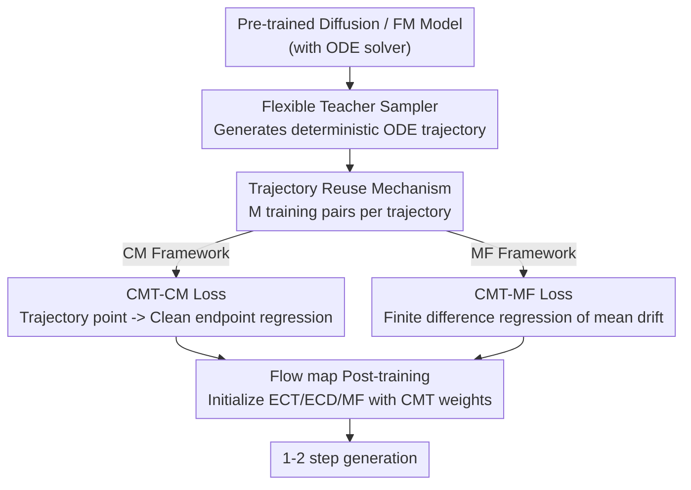

# CMT: Mid-Training for Efficient Learning of Consistency, Mean Flow, and Flow Map Models

**Conference**: ICLR 2026  
**arXiv**: [2509.24526](https://arxiv.org/abs/2509.24526)  
**Code**: [https://github.com/sony/cmt](https://github.com/sony/cmt)  
**Area**: Diffusion Models / Few-step Generation  
**Keywords**: flow map, consistency model, mid-training, few-step generation, diffusion distillation

## TL;DR
Consistency Mid-Training (CMT) is proposed, which inserts a lightweight intermediate training stage between pre-trained diffusion models and flow map post-training. By having the model learn to map arbitrary points on ODE trajectories back to clean samples, it achieves a trajectory-aligned initialization. This significantly reduces training costs (by up to 98%) while reaching SOTA two-step generation quality.

## Background & Motivation

**Background**: Diffusion models provide high generation quality but slow inference (requiring multi-step ODE solving). Flow map models (e.g., Consistency Models, Mean Flow) achieve few-step (1-2 step) generation by learning mappings for PF-ODE solutions, representing a major direction for accelerating diffusion models.

**Limitations of Prior Work**: Flow map model training is unstable, sensitive to hyperparameters, and computationally expensive. The core reason is the lack of real regression targets—current methods rely on "stop-gradient" pseudo-targets that drift during training dynamics, leading to biased and unstable optimization signals.

**Key Challenge**: While initializing from pre-trained diffusion models is helpful, diffusion models learn infinitesimal step denoising, whereas flow maps need to learn large-span trajectory jumps. This "differential vs. integral" mismatch makes diffusion initialization fragile, still requiring numerous heuristic tricks (time sampling, loss weight scheduling, etc.), leaving training slow and unstable.

**Goal**: (a) How to provide a high-quality, trajectory-aligned initialization for flow map models? (b) How to avoid the pseudo-target bias introduced by stop-gradient? (c) How to substantially reduce flow map training costs?

**Key Insight**: Inspired by the mid-training concept in the LLM field, an intermediate stage is inserted between pre-training and post-training. Pre-trained model ODE solvers are utilized to generate reference trajectories, which provide deterministic regression targets without requiring stop-gradient.

**Core Idea**: Use ODE trajectories from pre-trained models as fixed supervision signals. Through simple regression, the model learns to "jump to the end along the trajectory," thereby providing trajectory-aware initialization for flow map post-training.

## Method

### Overall Architecture

CMT addresses the long-standing problem of slow and unstable flow map model (few-step generator) training by inserting a lightweight intermediate training stage between "Pre-trained Diffusion Models" and "Flow Map Post-training". The pipeline consists of three stages: first, use a pre-trained diffusion/flow matching model as a **teacher** to generate deterministic trajectories using its ODE solver; second, treat these trajectories as **fixed regression targets** and train the model to "jump back to the clean endpoint from any point on the trajectory"—this step is CMT itself; finally, use the CMT-trained weights to **initialize** flow map models (ECT/ECD/MF) for standard post-training. Crucially, the teacher trajectories are deterministic and existing supervision, eliminating the drift caused by stop-gradient pseudo-targets in flow map training. The trajectory-aligned initialization ensures post-training is both fast and stable, achieving high-quality 1-2 step generation.

### Key Designs

**1. Flexible Teacher Sampler: Any model generating ODE trajectories can be a teacher**

The only requirement CMT has for the teacher is to produce an ODE trajectory; thus, the teacher does not need to be a pre-trained diffusion model or even particularly strong. By sampling a starting point $\mathbf{x}_T$ from a prior $p_{\text{prior}}$, any solver capable of solving PF-ODE (the paper uses DPM-Solver++ with 16 steps, or an MF teacher with 8 steps) can generate a discrete trajectory $\{\hat{\mathbf{x}}_{t_i}\}_{i=0}^M$, where $\hat{\mathbf{x}}_{t_i} \approx \Psi_{T \to t_i}(\mathbf{x}_T)$ approximates the true flow map. The paper pushes this to the limit on ImageNet 256: using a low-quality small model MF-B/4 (8-step FID of 13.44) as a teacher to generate trajectories still successfully trains a much larger MF-XL/2. This demonstrates that CMT mid-training is architecture-agnostic—in practice, one could quickly train a small model and use its coarse trajectories to guide and accelerate the training of larger models.

**2. Trajectory Reuse Mechanism: One solver call produces $M$ training pairs**

When a teacher runs an $M$-step trajectory, it leaves a sequence of intermediate states $\{\hat{\mathbf{x}}_{t_i}\}$, which would be wasted if only the endpoints were used. CMT pairs each intermediate point $\hat{\mathbf{x}}_{t_i}$ with the endpoint $\hat{\mathbf{x}}_{t_0}$ as a training sample, so one solver call yields $M$ training pairs for regression loss. Compared to "Slow CMT" which only uses endpoints, this reuse mechanism increases data efficiency by approximately 3x, feeding more effective supervision within the same GPU time—this is a direct reason why CMT training costs are far lower than similar methods. Note that each starting point $\mathbf{x}_T$ determines only one unique trajectory, but $\mathbf{x}_T$ can be sampled infinitely, preventing overfitting to fixed supervision.

**3. CMT-CM Loss: Turning consistency training into pure regression to ODE endpoints**

The instability of flow map training stems from using stop-gradient pseudo-targets to supervise itself, where targets drift during training. After obtaining the trajectory training pairs mentioned above, CMT replaces the target with a **fixed and deterministic** entity: the trajectory endpoint $\hat{\mathbf{x}}_{t_0}$ serves as the "clean sample," and the model learns to map any intermediate point $\hat{\mathbf{x}}_{t_i}$ directly back to it. The loss is defined as:

$$\mathcal{L}_{\text{CMT-CM}}(\theta) = \mathbb{E}_i \mathbb{E}_{\mathbf{x}_T \sim p_{\text{prior}}} \big[d\big(\mathbf{f}_\theta(\hat{\mathbf{x}}_{t_i}, t_i),\ \hat{\mathbf{x}}_{t_0}\big)\big],$$

where $d$ is LPIPS or $\ell_2$ distance. Since the solver-generated points approximate the true flow map, this is essentially a discrete approximation of the oracle consistency loss. The entire objective simplifies to a standard regression problem—**no stop-gradient, no custom time sampling, and no loss weight scheduling are required**, which is exactly why it initializes CM-style post-training so quickly and stably.

**4. CMT-MF Loss: Simplifying the mean flow objective to finite difference regression of trajectory points**

Mean Flow does not learn a direct mapping to the endpoint but rather the average drift between two points, which involves a more complex training objective. CMT similarly uses pre-computed trajectories to construct supervision—selecting any two points $t_i > t_j$ on the trajectory, their average drift is approximated via finite difference, and the model $\mathbf{h}_\theta$ is trained to regress it:

$$\mathcal{L}_{\text{CMT-MF}}(\theta) = \mathbb{E}_{i>j} \mathbb{E}_{\mathbf{x}_T} \Big[\big\|\mathbf{h}_\theta(\hat{\mathbf{x}}_{t_i}, t_i, t_j) - \tfrac{\hat{\mathbf{x}}_{t_i} - \hat{\mathbf{x}}_{t_j}}{t_i - t_j}\big\|_2^2\Big].$$

When $t_j = 0$, it reduces exactly to CMT-CM, making CMT-MF a more general form (hence the two losses are shown side-by-side in the framework diagram). Compared to the original MF, this approach avoids both stop-gradient and Jacobian-vector products (JVP). Since JVP is the most expensive part of MF training, omitting it significantly reduces computational costs.

### Loss & Training

- CM-style experiments use LPIPS perceptual loss (pixel space) or ELatentLPIPS (latent space).
- MF-style experiments use $\ell_2$ loss.
- ODE solvers are unified using DPM-Solver++ (16 steps) or MF teacher (8 steps).
- Post-training can omit many ad-hoc tricks ($\Delta t$ annealing, loss reweighting, custom time sampling, EMA variants, non-linear LR scheduling, etc.).

## Key Experimental Results

### Main Results

| Dataset | Metric | CMT (Ours) | Prev. SOTA | Gain |
|--------|------|-----------|-----------|------|
| CIFAR-10 32×32 | 2-step FID | **1.97** | 1.98 (IMM) | -0.01 |
| ImageNet 64×64 | 2-step FID | **1.32** (w/ ECD) | 1.25 (AYF) | +0.07 |
| ImageNet 64×64 | 2-step FID | **1.48** (w/ ECT) | 1.48 (sCT) | Equal but 98% less training |
| ImageNet 512×512 | 2-step FID | **1.84** | 1.87 (AYF) | -0.03 |
| ImageNet 256×256 | 1-step FID | **3.34** | 3.43 (MF) | -0.09 |
| AFHQv2 64×64 | 2-step FID | **2.34** | 2.61 (ECT) | -0.27 |
| FFHQ 64×64 | 2-step FID | **2.75** | 4.02 (iCT) | -1.27 |

### Ablation Study

| Setting | 1-step FID | 2-step FID | Description |
|------|-----------|-----------|------|
| Full model (CMT) | **2.74** | **1.97** | Complete model |
| Vanilla ECT (51.2M) | 3.54 | 2.12 | No mid-training |
| CMT_short (1.28M mid + 49.92M post) | 3.42 | 2.11 | Short mid-training |
| CMT_long (25.6M mid + 25.6M post) | 3.30 | 2.04 | Long mid-training |
| KD Initialization | 3.54 | 2.19 | Knowledge Distillation init, inferior to CMT |
| Slow CMT | 2.75 | 1.98 | Endpoint only, similar quality but 3x slower |

### Key Findings
- Longer CMT mid-training leads to better performance, indicating that trajectory-aligned initialization is critical.
- CMT remains effective even with low-quality small model teachers (MF-B/4, 8-step FID=13.44)—it reduces MF-XL/2 training time by half with better FID.
- Theoretically proven that CMT initialization gradient bias is $\mathcal{O}(\varepsilon + \Delta t^2)$, significantly lower than diffusion or random initialization.
- Effective on MS-COCO T2I tasks, reducing training time by 47%.

## Highlights & Insights
- **Cross-domain transfer of Mid-training**: Introducing the mid-training concept from LLMs into visual generation, solving the long-standing instability of flow map training in an elegantly simple way. The ingenuity lies in identifying ODE trajectories as naturally occurring, easily accessible, fixed regression targets.
- **Simplification for Engineering Value**: CMT allows post-training to discard almost all ad-hoc tricks ($\Delta t$ annealing, custom time sampling, loss weight scheduling), significantly lowering the barrier to hyperparameter tuning. This represents a major engineering simplification.
- **Weak Teachers Suffice**: Proven that the mid-training teacher does not need to be strong; a small model is sufficient. This finding can be transferred to other distillation/initialization scenarios—quickly training a small model to provide rough trajectories can guide and accelerate larger models.

## Limitations & Future Work
- Still requires a pre-trained diffusion model as a foundation; cannot start completely from scratch.
- The number of ODE solver steps (16) in the intermediate stage is fixed; the impact of step count on final quality remains unexplored.
- 1-step FID on T2I tasks remains relatively high (15.12), potentially limited by the dataset.
- Theoretical analysis primarily based on simplified assumptions (uniform weights, $\ell_2$ distance); theoretical guarantees for perceptual loss usage are not fully discussed.
- Can explore effectiveness in more complex generation tasks like video generation.

## Related Work & Insights
- **vs. ECT/ECD**: CMT uses them as post-training methods, significantly enhancing performance at the same or lower cost by adding the mid-training stage. The essential difference is that CMT provides a better initialization.
- **vs. sCT/sCD**: Comparable performance but CMT reduces training costs by 93-98% because it avoids expensive JVP calculations.
- **vs. Knowledge Distillation**: KD only learns endpoint mappings, whereas CMT utilizes intermediate trajectory information, resulting in higher data efficiency.
- **vs. Mean Flow**: CMT can use small MF models as teachers and accelerates MF training by 50% after initialization.

## Rating
- Novelty: ⭐⭐⭐⭐ Systematic introduction of mid-training to visual generation, though the core technique (trajectory regression) is relatively straightforward.
- Experimental Thoroughness: ⭐⭐⭐⭐⭐ Covers multiple datasets, resolutions, pixel and latent spaces, both CM and MF frameworks, and T2I tasks; comprehensive ablations.
- Writing Quality: ⭐⭐⭐⭐⭐ Unifies the perspectives of CM/CTM/MF with clear theoretical analysis and well-organized experiments.
- Value: ⭐⭐⭐⭐⭐ Extremely high engineering value, reducing actual training costs by 90%+ while achieving SOTA.

<!-- RELATED:START -->

## Related Papers

- [\[ICLR 2026\] Flow Map Learning via Non-Gradient Vector Flow](flow_map_learning_via_non-gradient_vector_flow.md)
- [\[ICLR 2026\] FACM: Flow-Anchored Consistency Models](facm_flow-anchored_consistency_models.md)
- [\[ICLR 2026\] RMFlow: Refined Mean Flow by a Noise-Injection Step for Multimodal Generation](rmflow_refined_mean_flow_by_a_noise-injection_step_for_multimodal_generation.md)
- [\[ICLR 2026\] SSCP: Flow-Based Single-Step Completion for Efficient and Expressive Policy Learning](flow-based_single-step_completion_for_efficient_and_expressive_policy_learning.md)
- [\[ICLR 2026\] UniEdit-Flow: Unleashing Inversion and Editing in the Era of Flow Models](uniedit-flow_unleashing_inversion_and_editing_in_the_era_of_flow_models.md)

<!-- RELATED:END -->
