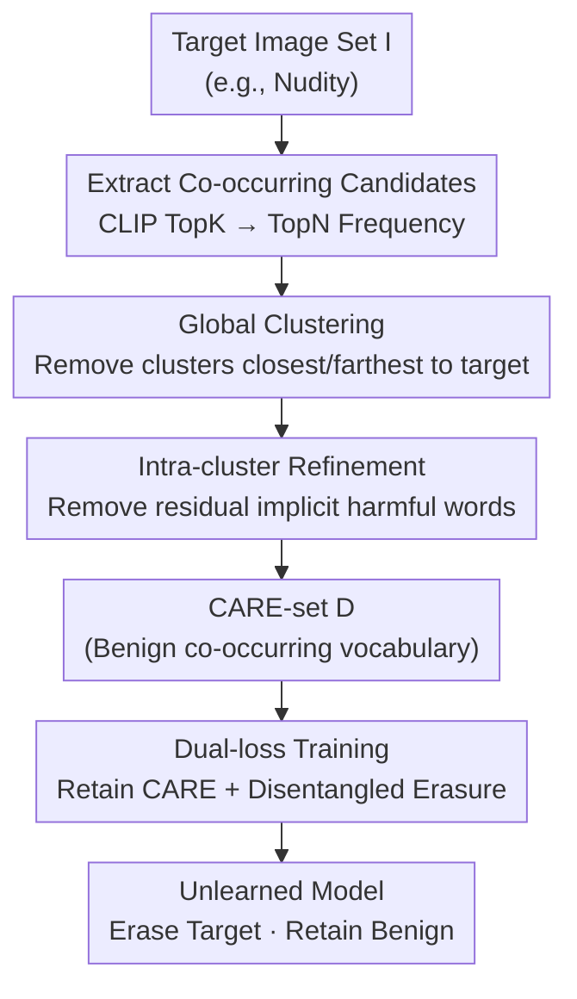

# Co-occurring Associated REtained concepts in Diffusion Unlearning

**Conference**: ICLR 2026  
**OpenReview**: [https://openreview.net/forum?id=Ryc7jKP6H9](https://openreview.net/forum?id=Ryc7jKP6H9)  
**Code**: https://github.com/damilab/CARE  
**Area**: Diffusion Models / Concept Unlearning / AI Safety  
**Keywords**: Diffusion Unlearning, Concept Erasure, Co-occurring Concept Retention, CARE score, Disentanglement

## TL;DR
When diffusion models erase harmful concepts (e.g., nudity), they often inadvertently suppress benign concepts that co-occur with them (e.g., "person"). This paper defines such concepts as CARE (Co-occurring Associated REtained concepts) and proposes the CARE score for quantification. The proposed ReCARE framework automatically constructs a benign co-occurring vocabulary (CARE-set) from target images to simultaneously guide retention and erasure, achieving the best overall performance in robustness, utility, and CARE retention across nudity, Van Gogh style, and Tench tasks.

## Background & Motivation

**Background**: Mainstream concept unlearning in diffusion models currently relies on *post-hoc erasure*—freezing a teacher model $\theta^*$, defining the semantic direction of the target concept $c$ as the difference between conditional and unconditional predictions $\epsilon_{\theta^*}(z_t\mid c)-\epsilon_{\theta^*}(z_t\mid\varnothing)$, and training a student model with reverse updates to "forget" the target. To prevent catastrophic forgetting of unrelated knowledge, recent methods (AdvUnlearn, AGE) introduce anchors (non-target concepts from ImageNet labels, LLM-generated prompts, or external dictionaries) as retention constraints.

**Limitations of Prior Work**: The authors identify a critical, overlooked weakness in anchor-based methods—**benign concepts naturally co-occurring with the erasure target are suppressed together**. When erasing "nudity," the concept of "person" is also eliminated. Consequently, given prompts like "A nude person" or even just "A person," the model fails to generate human figures (Fig. 1). Similarly, erasing "Van Gogh" removes "starry sky," and erasing "Tench" removes "freshwater." The root cause is that CLIP encodes co-occurring concepts into overlapping embedding regions with strong entanglement, while external anchor lists either cover only generic concepts or have limited quality, failing to capture these fine-grained co-occurring terms.

**Key Challenge**: The semantic direction of erasure inevitably "spills over" to benign co-occurring words strongly entangled with the target. Common utility metrics (FID, CLIP score) only measure global fidelity and semantic similarity to prompts, **failing to detect whether a specific benign concept is still present**. Thus, a model with high FID/CLIP scores might have already lost the concept of "person."

**Goal**: (1) Formalize these "co-occurring concepts that must be carefully retained" as CARE; (2) create a metric to automatically measure CARE retention at scale; (3) design a training framework that explicitly protects CARE while erasing the target.

**Key Insight**: Since these benign co-occurring words inherently appear in the target images, they can be extracted directly from the **target images themselves**. After filtering out truly harmful or irrelevant terms, the remaining words form the CARE-set—a vocabulary that naturally fits the real co-occurrence distribution without relying on external anchors.

**Core Idea**: Automatically construct a refined benign CARE-set from target images. This set serves as both a "retention signal" and a "reference for alignment during erasure" injected into the training objective, thereby disentangling "erasing the target" from "retaining benign concepts."

**Mechanism (CARE score)**: Use CLIP R-Precision@1 to measure if a CARE concept can still be generated. For each target, select one CARE concept $w^\star$ (e.g., "person" for nudity) and 80 irrelevant tokens $O$ from COCO object labels. Generate images $x_s=G(c_{w^\star})$ using prompts containing $w^\star$, and check if $w^\star$ ranks first in CLIP similarity among all candidates:

$$\text{CARE}_{\text{score}}=\frac{1}{S}\sum_{s=1}^{S}\mathbb{1}\!\left(\text{CLIP}(x_s,w^\star)=\max_{w\in(\{w^\star\}\cup O)}\text{CLIP}(x_s,w)\right)$$

This metric correlates strongly with human annotation of concept presence (Pearson $r=0.905$) and is insensitive to the encoder used (rankings remain consistent if CLIP is replaced with SigLIP), serving as a third evaluation axis alongside robustness and utility.

## Method

### Overall Architecture
ReCARE (Robust erasure for CARE) is a two-stage core process: "vocabulary construction followed by vocabulary-guided training." Given a target concept (e.g., nudity) and its target images, ReCARE first uses CLIP to extract co-occurring candidate words. These candidates include three types: the target itself, **harmful co-occurring words** that should be erased (e.g., naked, topless), and **benign co-occurring words** to be retained (e.g., person, woman). Two filters are applied: Global Clustering removes clusters "closest to" and "farthest from" the target, and Intra-cluster Refinement eliminates remaining words that are implicitly close to the target, resulting in the refined **CARE-set $D$**. Finally, $D$ is injected into training: a Retain Loss locks knowledge of the CARE-set, while an Erase Loss pushes harmful tokens away from the CARE representation and aligns them with a "CARE minus erasure direction" reference.

### Key Designs

**1. Global Clustering: Removing Extreme Clusters via Orthogonal Residuals**

Candidate words $T$ are extracted from target images by calculating CLIP similarities to find Top-K tokens per image, then taking the Top-N frequent tokens across images (Eq. 5). This set inevitably contains: harmful words too similar to the target (e.g., "naked") and noisy words semantically irrelevant to CARE (e.g., names like "Scarlett"). This design solves the "automatic pruning" problem. Words are projected into 2D via t-SNE and clustered into $n$ clusters via k-means. An **orthogonal residual** measures the proximity of each word to the target: let $e_c$ be the target text embedding and $e_t$ the token embedding. Define $r(e_t)=\lVert e_t(I-e_c e_c^\top)\rVert_2$. A small $r$ means the word's direction aligns with the target (likely harmful), while a large $r$ means it is nearly orthogonal (likely irrelevant). Potential CARE concepts lie in the middle. Clusters with the minimum average residual $\bar r_k$ and maximum average residual are discarded.

**2. Intra-cluster Refinement: Pruning Residual Implicitly Harmful Words**

While global clustering operates at the cluster level, clusters may still contain words that are "less explicit but still biased toward the target" (e.g., "stripped", "body"). These are not caught by global steps but would hinder erasure. This design performs word-level filtering: for each token $t_i^{(k)}$ in cluster $C_k$, it calculates the leave-one-out centroid $e_{-i}^{(k)}=\frac{1}{|C_k|-1}\sum_{j\ne i}e_{t_j^{(k)}}$ and applies a binary indicator:

$$\delta_i^{(k)}=\begin{cases}1,& r(e_{-i}^{(k)})^2<(1+\alpha)\cdot\frac{1}{|C_k|-1}\sum_{j\ne i}r(e_{-j}^{(k)})^2\\[2pt]0,&\text{otherwise}\end{cases}$$

Tokens that over-align with the target contribute little to the "concept orthogonal component" of their cluster and are pruned. The remaining words form the final CARE-set $D$.

**3. Dual-loss Training: CARE-set Driven Retention and Erasure**

With $D$, the total objective is $L_{\text{ReCARE}}=\lambda L_{\text{Retain}}+L_{\text{Erase}}$. **Retain Loss** locks the CARE-set:

$$L_{\text{Retain}}=\mathbb{E}\big[\lVert\epsilon_{\theta^*}(z_t,t,E)-\epsilon_{\theta_i}(z_t,t,E)\rVert_2^2\big]$$

**Erase Loss** disentangles harmful tokens from the CARE representation. It first uses Textual Inversion (STE) from STEREO to find the optimal embedding sequence $H=\{v_1^*,v_2^*,\text{"target"}\}$ for reconstruction. It then uses the "original model's CARE representation minus the erasure direction" as an alignment reference for harmful tokens:

$$L_{\text{Erase}}=\mathbb{E}\big[\lVert(\epsilon_{\theta^*}(z_t,t,D)-\epsilon_{\text{erase}})-\epsilon_{\theta_i}(z_t,t,H)\rVert_2^2\big]$$

By anchoring the erasure direction to the CARE representation, the model is forced to pull the representation back to benign co-occurring concepts while wiping the target.

### Loss & Training
Total loss: $L_{\text{ReCARE}}=\lambda L_{\text{Retain}}+L_{\text{Erase}}$. CARE-set construction takes ~1.78 min. Training includes Textual Inversion (~23.23 min) + ReCARE optimization (~5.10 min), totaling ~28.33 min with 24GB peak VRAM (H100). Default cluster size $n=6$.

## Key Experimental Results

Evaluation spans three axes: Robustness via Attack Success Rate (ASR, lower is better; radar charts report Defense $=100\%-\text{ASR}$); Utility via FID and CLIP Score; and CARE retention via CARE score. The comprehensive metric RATIO is the normalized area of the radar chart.

### Main Results

ReCARE achieves the highest RATIO across Nudity (0.76), Van Gogh (0.81), and Tench (0.85). The following table extracts representative comparisons for the Nudity task (CCE is the strongest attack):

| Method | CCE-ASR ↓ | CLIP ↑ | FID ↓ | CAREscore ↑ | RATIO ↑ |
|------|-----------|--------|-------|-------------|---------|
| SD v1.4 (Original) | 56.82 | 0.3136 | 14.12 | 0.97 | 0.56 |
| ESD | 53.41 | 0.3045 | 13.75 | 0.89 | 0.49 |
| STEREO | 19.55 | 0.2907 | 17.83 | 0.11 | 0.21 |
| **ReCARE (Ours)** | **11.14** | **0.3053** | **13.85** | **0.94** | **0.76** |

ReCARE is the only method to reduce CCE-ASR to its lowest (11.14) while maintaining a CARE score close to the original model (0.94 vs. 0.97).

### Ablation Study

Contribution of the two refinement stages (Nudity task):

| Configuration | CCE-ASR ↓ | CLIP ↑ | CAREscore ↑ | Note |
|------|-----------|--------|-------------|------|
| ReCARE (Full) | 11.14 | 0.3053 | 0.94 | Both stages |
| w/o Intra | 16.36 | 0.3082 | 0.93 | Implicit harmful words remain → ASR ↑ |
| w/o Global | 25.00 | 0.3039 | 0.90 | Irrelevant words mixed in → CARE ↓, ASR ↑ |
| w/o refinement | 27.05 | 0.3056 | 0.88 | No refinement |

### Key Findings
- **Global clustering is more critical than intra-cluster refinement**: Removing global clustering increases CCE-ASR from 11.14 to 25.00 and decreases CARE from 0.94 to 0.90.
- **CARE score is encoder-insensitive**: Replacing CLIP with SigLIP for evaluation yields consistent relative rankings.
- **Robustness vs. Utility**: STEREO achieves robustness (CCE 19.55) but sacrifices CARE score (0.11) and FID (17.83). ReCARE balances all three.

## Highlights & Insights
- **Formalizing the "mis-erasure of co-occurring concepts" failure mode**: The CARE definition itself is a contribution, highlighting that models might lose "person" while erasing "nudity."
- **CARE score uses R-Precision@1 to bypass global metric blind spots**: Validating specific concept presence bypasses the limitations of FID.
- **Self-constructed vocabulary from target images**: This avoids the quality limitations of ImageNet or LLM-based anchors.
- **Disentangled erasure anchored to CARE**: Using CARE representations as a reference during erasure prevents the "spillover" effect common in earlier methods.

## Limitations & Future Work
- **Dependency on target images and textual inversion**: The quality of the CARE-set and erasure direction depends on the sampling of target images and the stability of inversion.
- **Manual selection in CARE score**: The evaluation selects one representative concept (e.g., "person" for nudity); a more systematic way to identify all vital benign concepts is needed.
- **Geometric assumptions**: The reliance on orthogonal residuals and t-SNE/k-means as universal heuristics requires further validation across more complex semantic distributions.

## Related Work & Insights
- **vs. Anchor-based methods (AGE/AdvUnlearn)**: These rely on generic anchors that fail to protect fine-grained co-occurring concepts. ReCARE's specialized CARE-set is significantly more effective at retaining benign concepts (Nudity CARE 0.94 vs. AdvUnlearn 0.36).
- **vs. STEREO**: While STEREO uses textual inversion for robustness, it lacks explicit protection for benign concepts, leading to total collapse of the CARE score. ReCARE fixes this by anchoring erasure to the CARE representation.

## Rating
- Novelty: ⭐⭐⭐⭐⭐ 
- Experimental Thoroughness: ⭐⭐⭐⭐ 
- Writing Quality: ⭐⭐⭐⭐ 
- Value: ⭐⭐⭐⭐⭐ 

<!-- RELATED:START -->

## Related Papers

- [\[ICCV 2025\] Meta-Unlearning on Diffusion Models: Preventing Relearning Unlearned Concepts](../../ICCV2025/image_generation/meta-unlearning_on_diffusion_models_preventing_relearning_unlearned_concepts.md)
- [\[ICLR 2026\] Continual Unlearning for Text-to-Image Diffusion Models: A Regularization Perspective](continual_unlearning_for_text-to-image_diffusion_models_a_regularization_perspec.md)
- [\[ICLR 2026\] Forget Many, Forget Right: Scalable and Precise Concept Unlearning in Diffusion Models](forget_many_forget_right_scalable_and_precise_concept_unlearning_in_diffusion_mo.md)
- [\[ICML 2026\] A Unified Framework for Diffusion Model Unlearning with f-Divergence](../../ICML2026/image_generation/a_unified_framework_for_diffusion_model_unlearning_with_f-divergence.md)
- [\[ICML 2026\] Finding DoRI: Discovery of Retained Images in Diffusion Models](../../ICML2026/image_generation/finding_dori_discovery_of_retained_images_in_diffusion_models.md)

<!-- RELATED:END -->
