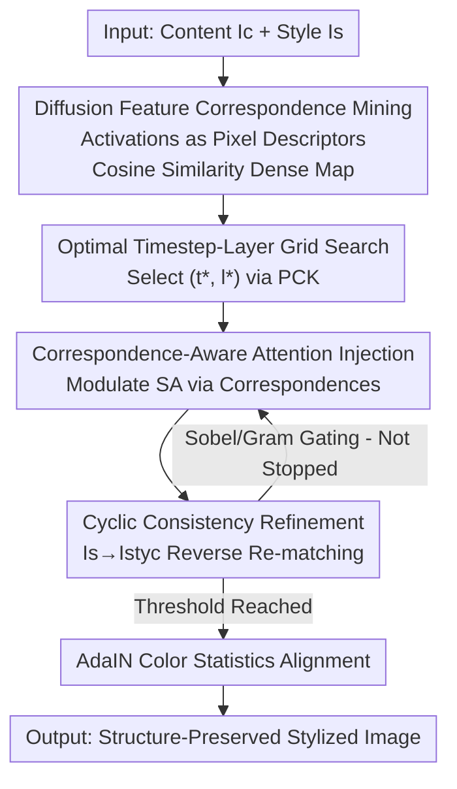

# CoCoDiff: Correspondence-Consistent Diffusion Model for Fine-grained Style Transfer

**Conference**: ICLR2026  
**OpenReview**: [https://openreview.net/forum?id=eRSuwB78LH](https://openreview.net/forum?id=eRSuwB78LH)  
**Code**: https://github.com/Wenbo-Nie/CoCoDiff  
**Area**: Diffusion Models / Style Transfer  
**Keywords**: Style Transfer, Semantic Correspondence, Diffusion Features, Attention Injection, Cyclic Consistency

## TL;DR
CoCoDiff is a **training-free** style transfer framework that directly extracts **pixel-level semantic correspondence** between content and style images from the intermediate features of pre-trained Stable Diffusion. It then utilizes a **cyclic-consistent** attention injection mechanism to "paste" styles onto structurally aligned regions, outperforming methods requiring additional training or annotations across FID, LPIPS, ArtFID, and CFSD metrics.

## Background & Motivation
**Background**: Neural Style Transfer (NST) aims to render the visual appearance of a style image onto a content image. Evolution has progressed from Gatys' CNN-based content/texture separation to AdaIN, WCT, StyTR² (Transformer), and current diffusion-era tools like StyleID and InstantStyle-Plus. Among these, **training-free** diffusion methods (directly manipulating self-attention in pre-trained models) are highly favored for eliminating the need for retraining.

**Limitations of Prior Work**: Existing methods fundamentally operate on a **global level**, ignoring **region-level or even pixel-level semantic correspondence**. This leads to two issues: one class (e.g., StyleID) applies styles globally, causing structural misalignment and loss of content detail; the other (e.g., SMS) trains complex external modules to find correspondence, which is inefficient and bypasses internal model capabilities. Fig.1 illustrates these failures: training-free diffusion methods show structural degradation, while neural methods fail to capture the target style.

**Key Challenge**: Most methods treat pre-trained diffusion models as **black-box generators** without realizing that **diffusion backbones already encode powerful semantic correspondence information**. Consequently, there is a significant gap—no one has directly mined and utilized the model's own semantic understanding for high-fidelity style transfer.

**Goal**: To decompose style transfer into two intertwined sub-problems: (1) finding **dense and semantically meaningful correspondence** between content and style images with vast differences in color, texture, and geometry; (2) injecting local style features into content structures **without disrupting global stylistic harmony**, even with perfect correspondence.

**Key Insight**: The authors observe that works like DIFT have proven that intermediate activations of pre-trained diffusion U-Nets can align object features across domains. Since semantic correspondence "is already there," it should be **extracted from the appropriate denoising timesteps and network layers** rather than learned from scratch.

**Core Idea**: Utilize pre-trained diffusion features to **extract** pixel-level content-style correspondence, then inject styles via a **cycle-optimized** attention mechanism based on these relationships—entirely training-free, label-free, and fine-tuning-free.

## Method

### Overall Architecture
CoCoDiff takes a content image $I_c$ and a style image $I_s$ as input to produce a structure-preserving, semantically consistent stylized result. The workflow, based on Stable Diffusion's DDIM inversion trajectory, is divided into two serial stages:

Stage 1: **Fine-grained Feature Matching (FFM)**: Content and style images are passed through the diffusion U-Net, using intermediate activations as pixel-wise descriptors. For each content position, the most similar position in the style image is found via cosine similarity to build a dense semantic correspondence map. A 2D grid search identifies the "most semantically representative" timestep $t^*$ and layer $l^*$.

Stage 2: **Fitting Cycle and Iterative Control (FIC)**: The correspondence map is used to **modulate self-attention** for style injection. Instead of a single pass, the authors introduce a closed loop: they first "learn" the style of the content image onto the style image to obtain an intermediate image $I_{styc}$, then re-match features between $I_c$ and $I_{styc}$ to obtain more accurate coordinates before final injection. Each iteration uses content-aware loss (Sobel edges) and style-aware loss (Gram matrix) as adaptive gates; final refinement is performed using AdaIN for color statistics alignment.

### Key Designs

**1. Diffusion Feature Correspondence Mining: Reading semantic correspondence from the backbone rather than learning from scratch**

This design addresses the limitation of treating diffusion models as black boxes. Pre-trained U-Net activations naturally encode semantic cues across timesteps $t$ and layers $l$. CoCoDiff treats these as pixel-wise descriptors. For each position $p_c$ in the content image, the most similar position $p_s$ in the style image is found:

$$\cos(p_c, p_s) = \frac{I_c(p_c) \cdot I_s(p_s)}{\|I_c(p_c)\|\,\|I_s(p_s)\|}$$

This yields a dense semantic correspondence map where the optimal position is $p_s^* = \arg\max_{p_s \in I_s} \cos(p_c, p_s)$. This benefit is twofold: correspondence is "free" from the backbone, avoiding external modules like SMS while providing better structural awareness than global methods.

**2. Optimal Timestep-Layer Grid Search: Finding the most semantically representative features via PCK**

Diffusion features are not equally reliable across all $(t,l)$ pairs—shallow layers or late timesteps focus on low-level details, while deep layers or early timesteps encode high-level semantics. The authors perform a 2D grid search over candidate sets $\mathcal{T}$ and $\mathcal{L}$ to maximize a quality metric $M(t,l)$:

$$(t^*, l^*) = \arg\max_{t \in \mathcal{T},\, l \in \mathcal{L}} M(t, l)$$

The metric $M(t,l)$ is defined using **PCK (Percentage of Correct Keypoints)** on semantic benchmarks like SPair-71k. Higher PCK indicates that features at $(t,l)$ provide more reliable semantic alignment. Once $(t^*, l^*)$ is fixed, it is used for all subsequent injections, turning feature selection into a quantifiable process.

**3. Correspondence-Aware Attention Injection: Precise modulation of self-attention at corresponding positions**

Standard style injection replaces content keys/values with stylistic ones: $\phi_c^{out} = \text{Attn}(Q_c^t, K_s^t, V_s^t)$. CoCoDiff improves this via **weighted modulation based on mapped positions**:

$$\text{feat}[k] = w \cdot \text{attn}[k][p_s^*] + \text{feat}[k][p_c]$$

Here $k$ is the feature channel, $p_c$ is the content position, and $p_s^*$ is the corresponding style position. $w$ controls the contribution. This ensures style is only injected into **semantically aligned regions**, maximally preserving content structure. Ablations show $w=0.6$ is optimal.

**4. Cyclic Consistency Refinement: Solving cross-distribution matching fragility via "indirect correspondence"**

This is the most ingenious design, addressing failures in matching content and style images with massive statistical differences. Directly matching $I_c$ and $I_s$ often fails due to divergent color/texture distributions. The authors use a **closed loop**: first, an intermediate image $I_{styc} = \text{Attn}(Q_s, K_c, V_c)$ is generated where the style image "learns" content characteristics. Correspondence is then established between $I_c$ and $I_{styc}$, producing coordinates $(p_c, p_{styc}^*)$, which are then used to inject $I_s$ into $I_c$:

$$\text{feat}[k] = w \cdot \text{attn}[k][p_{styc}^*] + \text{feat}[k][p_c]$$

This "indirect correspondence" aligns features between images within the same distribution, significantly improving accuracy (Fig.4B).

### Loss & Training
CoCoDiff is training-free; "losses" are used for **adaptive iterative gating**. For iteration $z$:

Content-aware loss uses Sobel filters for structural consistency:

$$L_{content} = \|\text{Sobel}(I_{gen}^{(z)}) - \text{Sobel}(I_c)\|$$

Style-aware loss uses Gram matrices across layers for texture:

$$L_{style} = \sum_{l \in layers} \|G(I_{gen}^{(z),l}) - G(I_s)\|_F^2$$

Iteration terminates when $L_{content} > \tau_c$ and $L_{style} < \tau_s$ are both satisfied. Finally, AdaIN performs color alignment: $y_{cs} = \sigma(y_s)\frac{y_c - \mu(y_c)}{\sigma(y_c)} + \mu(y_s)$. Experiments were conducted on an RTX 4090 using SD v1.4.

## Key Experimental Results

### Main Results
Evaluated on MS-COCO (content) and WikiArt (style), covering 13 artistic styles. All indicators are the lower the better:

| Metric | CoCoDiff | StyleID | AesPA | StyTR² | AdaIN | SCSA | SMS |
|------|---------|---------|-------|--------|-------|------|-----|
| FID ↓ | **18.432** | 21.010 | 19.645 | 18.886 | 18.672 | 20.835 | 31.266 |
| LPIPS ↓ | **0.549** | 0.565 | 0.556 | 0.587 | 0.612 | 0.562 | 0.821 |
| ArtFID ↓ | **30.100** | 34.446 | 32.124 | 31.559 | 31.711 | 34.106 | 58.756 |
| CFSD ↓ | 0.609 | 0.619 | 0.632 | 0.687 | 0.642 | **0.612** | 0.704 |

CoCoDiff ranks first in FID, LPIPS, and ArtFID, while CFSD (structure preservation) is competitive with SCSA.

### Ablation Study
Combination of Sobel (structure) and Gram (style) gating (Table 3):

| Sobel | Gram | FID ↓ | LPIPS ↓ | CFSD ↓ | Note |
|-------|------|-------|---------|--------|------|
| ✗ | ✗ | 26.513 | 0.697 | 0.804 | Worst performance |
| ✓ | ✗ | 29.845 | 0.506 | 0.631 | Sobel only: good structure, poor FID |
| ✗ | ✓ | 23.471 | 0.753 | 0.761 | Gram only: good global style, poor details |
| ✓ | ✓ | **18.432** | 0.549 | **0.609** | Complementary, optimal |

Injection weight $w$ and AdaIN (Table 4):

| Config | FID ↓ | LPIPS ↓ | CFSD ↓ | Note |
|------|-------|---------|--------|------|
| $w=0.3$ | 23.717 | 0.681 | 0.642 | Under-stylized |
| $w=0.6$ | **18.432** | **0.549** | **0.609** | Sweet spot |
| $w=3.0$ | 35.937 | 0.667 | 0.791 | Structural distortion |

### Key Findings
- **Sobel and Gram are highly complementary**: Using only one leads to bias; together, they achieve the best balance between structure and FID.
- **Injection weight $w$ is sensitive**: 0.6 is the "sweet spot"; $w=3.0$ nearly doubles the FID.
- **Adaptive gating outperforms fixed iterations**: Early stopping avoids over-processing and captures better quality than a fixed count of 1–5 iterations.
- **Indirect correspondence is superior**: Heatmaps confirm that the cyclic strategy precisely limits stylistic changes to relevant textures while preserving outlines.

## Highlights & Insights
- **Leveraging intrinsic backbone correspondence**: CoCoDiff doesn't train external modules but uses DIFT-like alignment directly for generation, which is the root of its success.
- **Cycle-indirect matching is the "finishing touch"**: Aligning distributions before matching is a robust strategy that could be generalized to other cross-domain tasks.
- **Quantifiable Layer Selection**: Using PCK benchmarks to calibrate internal features transforms heuristic choices into measurable ones.
- **Gating for Control, Not Training**: Using losses for early stopping is a lightweight yet effective way to maintain quality in training-free frameworks.

## Limitations & Future Work
- **Hyperparameter Tuning Cost**: Moving across models (especially SDXL) requires re-tuning weights like $\gamma$; thus, it is training-free but not parameter-tuning-free.
- **CFSD is not best-in-class**: There is still room for improvement in extreme structure-sensitive scenarios.
- **Dependency on SD architecture**: The method is tied to U-Net self-attention; effectiveness on DiT remains unverified.
- **Improvement Idea**: Replace manual grid search with a lightweight learnable selector or per-image adaptive layer selection.

## Related Work & Insights
- **vs StyleID**: StyleID lacks structural consistency due to global injection; CoCoDiff's spatial-aware injection yields better FID and ArtFID.
- **vs SMS**: SMS is inefficient due to external module training; CoCoDiff achieves superior results without any training.
- **vs DIFT**: While DIFT proves diffusion features can perform correspondence, CoCoDiff extends this to a generative task with cyclic refinement.

## Rating
- Novelty: ⭐⭐⭐⭐ Innovative combination of diffusion correspondence and cyclic matching for style transfer.
- Experimental Thoroughness: ⭐⭐⭐⭐ Extensive comparisons and ablations, though evaluation sample size could be larger.
- Writing Quality: ⭐⭐⭐⭐ Clear structure and complete logic.
- Value: ⭐⭐⭐⭐ High practical value as a low-cost, plug-and-play solution.

<!-- RELATED:START -->

## Related Papers

- [\[CVPR 2026\] RegionRoute: Regional Style Transfer with Diffusion Model](../../CVPR2026/image_generation/regionroute_regional_style_transfer_with_diffusion_model.md)
- [\[ICCV 2025\] CharaConsist: Fine-Grained Consistent Character Generation](../../ICCV2025/image_generation/characonsist_fine-grained_consistent_character_generation.md)
- [\[CVPR 2025\] SaMam: Style-aware State Space Model for Arbitrary Image Style Transfer](../../CVPR2025/image_generation/samam_style-aware_state_space_model_for_arbitrary_image_style_transfer.md)
- [\[CVPR 2025\] HSI: A Holistic Style Injector for Arbitrary Style Transfer](../../CVPR2025/image_generation/hsi_a_holistic_style_injector_for_arbitrary_style_transfer.md)
- [\[CVPR 2026\] Style-GRPO: Semantic-Aware Preference Optimization for Image Style Transfer Guided by Reward Modeling](../../CVPR2026/image_generation/style-grpo_semantic-aware_preference_optimization_for_image_style_transfer_guide.md)

<!-- RELATED:END -->
