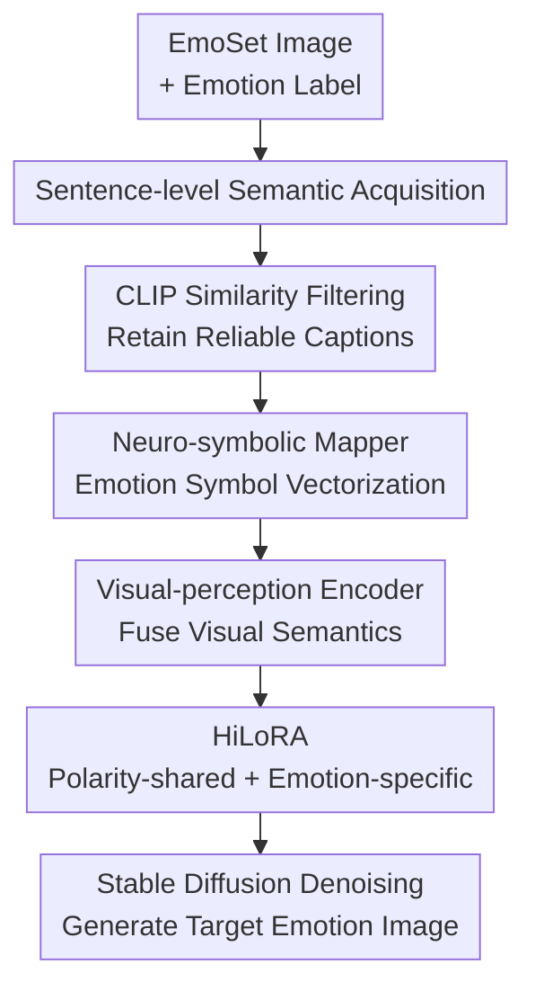

# CoEmoGen: Towards Semantically-Coherent and Scalable Emotional Image Content Generation

**Conference**: ICLR2026  
**OpenReview**: [https://openreview.net/forum?id=PTzByqd0aJ](https://openreview.net/forum?id=PTzByqd0aJ)  
**Code**: https://github.com/yuankaishen2001/CoEmoGen  
**Area**: Image Generation / Emotional Image Content Generation  
**Keywords**: Emotional Image Generation, Diffusion Models, Semantic Coherence, MLLM Labeling, HiLoRA  

## TL;DR
CoEmoGen transforms abstract emotions into sentence-level, contextually coherent visual semantic descriptions. By utilizing hierarchical LoRA within Stable Diffusion, it simultaneously models polarity-shared low-level visual styles and specific emotion-unique high-level semantics, leading to images that align better with target emotions and exhibit more natural semantics and scalability than methods like EmoGen.

## Background & Motivation
**Background**: Emotional visual analysis has primarily focused on "recognition": given an image, the model determines whether it evokes emotions such as amusement, awe, contentment, excitement, anger, disgust, fear, or sadness. With the advancement of text-to-image diffusion models, a natural inverse problem arises: can a model generate a semantically clear image that truly evokes a target emotion given only the target category? This is Emotional Image Content Generation (EICG).

**Limitations of Prior Work**: General text-to-image models excel at concrete concepts like "dog, car, or table" but struggle to directly understand abstract emotions like "awe, contentment, or disgust." Early emotion transfer methods focused on color, texture, and style; however, since image content remained fixed, modifying only low-level visual attributes was often insufficient to evoke the target emotion. EmoGen attempted semantic guidance using word-level attribute labels (objects, scenes) from EmoSet, but these labels are often isolated (e.g., "railroad track, tree, jeans"). They fail to explain why a person is sad, or miss key triggers (e.g., a clown triggering fear being labeled only as a "fashion accessory"). Furthermore, missing attribute labels in some samples limit the training scale and diversity.

**Key Challenge**: Emotional image generation requires "visual narratives that trigger emotions" rather than a concatenation of discrete object words. Word-level labels are inexpensive and simple but lack contextual relationships; sentence-level captions are closer to how humans describe emotion, but MLLM-generated captions introduce hallucinations and noise. Additionally, while emotions of the same polarity share low-level patterns like brightness and color, fine-grained emotions depend on different high-level semantics. Using a single unified LoRA tends to blur the distinctions between different emotions of the same polarity.

**Goal**: The authors aim to solve two sub-problems: first, expanding semantic supervision for EICG from word-level attributes to sentence-level, emotion-related, contextually coherent captions while ensuring reliability; second, distinguishing between "polarity-shared" low-level visual features and "emotion-specific" high-level semantics during diffusion model adaptation.

**Key Insight**: Observations come from both psychology and data construction. Psychologically, positive emotions share low-level cues (bright, rich colors), while negative emotions share others (dark, oppressive tendencies); however, amusement, awe, and contentment require distinct events and narratives. Data-wise, MLLMs are strong enough to generate captions focusing on emotion-triggering elements based on images and emotional priors, which can then be filtered using CLIP similarity.

**Core Idea**: Replace word-level attribute labels with "MLLM-generated and CLIP-filtered sentence-level emotion captions" for semantic supervision, and use Hierarchical LoRA (HiLoRA) to separately learn polarity-shared low-level features and emotion-specific high-level semantics.

## Method
### Overall Architecture
The input to CoEmoGen is not a free-text prompt but a target emotion category and its corresponding training samples: each sample includes an image $I_i$, an emotion label $y_i$, and an MLLM-generated caption $c_i$. The method converts EmoSet images into captions focused on emotion-triggering content and filters low-quality pairs via CLIP similarity. During training, the one-hot emotion label is mapped to an emotion descriptor, interacts with CLIP image features to obtain an emotion condition via a CLIP text encoder, and finally guides denoising in a U-Net with HiLoRA.

During the inference stage, the trained emotion conditions and HiLoRA adapters are used. To maintain diversity, the model samples visual embeddings from pre-constructed Gaussian emotion clusters for each category instead of using a fixed visual embedding, allowing the same emotion category to generate varied semantic content.

### Key Designs
**1. Sentence-level Semantic Acquisition: Converting isolated attributes to contextual descriptions**

EmoGen relies on EmoSet's scene/object word-level attributes, but the key issue is the lack of semantic relationships. CoEmoGen uses an MLLM to generate a caption for each EmoSet image, with a prompt explicitly stating "this image evokes `<emotion>`" and requiring focus on brightness, color, scene, objects, facial expressions, and actions. This results in narratively driven captions like "a person in a hoodie standing on tracks looking sad" rather than just a list of objects.

To mitigate MLLM hallucinations, the authors calculate image-caption similarity in CLIP space and discard the bottom 20% of samples within each category. This filtering ensures that the captions are reliable and allows the model to move beyond the limitations of manual attribute labels.

**2. Neuro-symbolic Mapper & Visual-perception Encoder: Transforming categories into interactive conditions**

Directly using text embeddings for labels like "anger" is overly constrained by CLIP's existing semantic space. CoEmoGen maps the one-hot emotion label $y_i^o$ through a Neuro-symbolic Mapper (fully connected layers and non-linear activations) to obtain an emotion descriptor $e_i$. This preserves the symbolic boundaries of emotion categories while allowing for richer variations in a continuous space.

To align the emotion condition with image content, the model uses CLIP image encoder features $v_i$ and a Visual-perception Encoder based on cross-attention: $e_i^v = \text{Softmax}(e_i W_q (v_i W_k)^T / \sqrt{d_0}) v_i W_v$. Following this, $e_i^v$ is fed into the CLIP text encoder to form the final emotion condition $e_i^c$.

**3. HiLoRA: Decoupling polarity-shared and emotion-specific adaptation**

Standard LoRA ($\Delta W = A \cdot B$) is effective for finetuning concrete concepts, but emotions have hierarchical structures. CoEmoGen designs two layers of LoRA for the U-Net: eight emotion-specific LoRAs (amusement, awe, etc.) and two polarity-shared LoRAs (positive, negative).

When training a sample, only the corresponding emotion-specific LoRA and its polarity-shared LoRA are activated. For amusement (positive polarity): $W' = W + A_1^p B_1^p + A_2^e B_2^e$. Polarity-shared LoRAs learn low-level patterns like brightness and color richness, while emotion-specific LoRAs learn unique semantic compositions.

**4. Semantic Loss: Preventing semantic collapse during diffusion training**

CoEmoGen freezes most components (latent encoder, CLIP encoders, U-Net body) and optimizes only the Mapper, Visual-perception Encoder, and HiLoRA. Beside the latent diffusion loss $L_{LDM}$, a semantic loss $L_{SEM}$ is added to explicitly minimize the distance between the emotion condition $e_i^c$ and the representation of the caption $T(c_i)$. The cosine distance is used: $L_{SEM}=1-\frac{e_i^c \cdot T(c_i)}{\|e_i^c\|\|T(c_i)\|}$. This ensures that the emotion condition itself remains consistent with sentence-level semantics.

### Loss & Training
The objective consists of the latent diffusion loss:

$$
L_{LDM}=\mathbb{E}_{E(\cdot), I_i, e_i^c, \epsilon, t}\left[\left\|\epsilon-\epsilon_\theta(z_t,t,E(I_i),e_i^c)\right\|_2^2\right]
$$

and the semantic loss:

$$
L_{SEM}=1-\frac{e_i^c \cdot T(c_i)}{\|e_i^c\|\|T(c_i)\|}
$$

The model is initialized with Stable Diffusion v1.5 and CLIP ViT-L/14. HiLoRA rank $r=4$. Training involves 130,000 iterations on two NVIDIA RTX 4090s using AdamW with a learning rate of $1e^{-3}$.

## Key Experimental Results

### Main Results
CoEmoGen was compared against Stable Diffusion, Textual Inversion, DreamBooth, and EmoGen using FID, LPIPS, Emotion Accuracy (Emo-A), Semantic Consistency (Sem-C), and Semantic Diversity (Sem-D).

| Method | FID↓ | LPIPS↑ | Emo-A↑ | Sem-C↑ | Sem-D↑ |
|------|------|--------|--------|--------|--------|
| Stable Diffusion | 44.05 | 0.687 | 70.77% | 0.608 | 0.0199 |
| Textual Inversion | 50.51 | 0.702 | 74.87% | 0.605 | 0.0282 |
| DreamBooth | 46.89 | 0.661 | 70.50% | 0.614 | 0.0178 |
| EmoGen | 41.60 | 0.717 | 76.25% | 0.633 | 0.0335 |
| **CoEmoGen** | **40.66** | **0.732** | **80.15%** | **0.641** | **0.0349** |

Relative to EmoGen, CoEmoGen improves FID (41.60 -> 40.66) and Emo-A (76.25% -> 80.15%), while also increasing Sem-C and Sem-D.

### Ablation Study
The semantic loss $L_{SEM}$ is the most critical: without it, Emo-A drops from 80.15% to 65.90% and FID worsens to 50.32.

| Configuration | FID↓ | LPIPS↑ | Emo-A↑ | Sem-C↑ | Sem-D↑ |
|------|------|--------|--------|--------|--------|
| Full CoEmoGen | 40.66 | 0.732 | 80.15% | 0.641 | 0.0349 |
| w/o $L_{SEM}$ | 50.32 | 0.698 | 65.90% | 0.562 | 0.0255 |
| w/o emotion-specific LoRAs | 45.30 | 0.713 | 75.37% | 0.625 | 0.0308 |
| w/o polarity-shared LoRAs | 41.47 | 0.724 | 78.83% | 0.638 | 0.0336 |

### Key Findings
- Sentence-level captions connect objects, scenes, and actions into narratives, avoiding the unnatural "collage" effect of isolated attribute words.
- $L_{SEM}$ acts as a performance safeguard, preventing the model from collapsing into purely pixel-based patterns while ignoring the emotion-triggering semantics.
- HiLoRA shows clear division: emotion-specific layers impact classification accuracy, while polarity-shared layers maintain shared visual atmospheres.
- User studies show 88.42% preference for CoEmoGen's semantic consistency.
- Scalability was proved via **EmoArt**, where the model was successfully adapted to emotional art images from WikiArt.

## Highlights & Insights
- Capturing the "narrative" of emotion is superior to treating emotions as isolated tokens or object lists.
- Using CLIP to filter MLLM captions is an effective technique for scalable dataset construction with quality control.
- The hierarchical structure of HiLoRA aligns perfectly with the psychology of emotion (polarity vs. specific category).
- The transition from word-level attributes to sentence-level narratives fundamentally improves the naturalness of generated content.

## Limitations & Future Work
- Semantic supervision relies on MLLM captions; CLIP filtering may not catch errors in "emotional reasoning" within the text.
- Evaluation depends on pre-trained emotion classifiers which may harbor biases from EmoSet.
- Training and data construction costs remain high for real-time applications.
- Future work aims to analyze the denoising process to observe when different emotional attributes are injected.

## Related Work & Insights
- **vs. EmoGen**: CoEmoGen upgrades supervision to sentence-level captions and utilizes hierarchical adaptation (HiLoRA) to avoid semantic disjointedness.
- **vs. Emotion Transfer**: Unlike color/style-based transfer, CoEmoGen generates content from scratch, allowing for emotional visual storytelling.
- **Inspiration**: This paradigm (MLLM-based semantic expansion + hierarchical adapters) can be applied to other abstract generation tasks like "nostalgia" or "safety."

## Rating
- Novelty: ⭐⭐⭐⭐☆
- Experimental Thoroughness: ⭐⭐⭐⭐☆
- Writing Quality: ⭐⭐⭐⭐☆
- Value: ⭐⭐⭐⭐⭐

<!-- RELATED:START -->

## Related Papers

- [\[CVPR 2026\] Anchoring and Rescaling Attention for Semantically Coherent Inbetweening](../../CVPR2026/image_generation/anchoring_and_rescaling_attention_for_semantically_coherent_inbetweening.md)
- [\[CVPR 2026\] LumiX: Structured and Coherent Text-to-Intrinsic Generation](../../CVPR2026/image_generation/lumix_structured_and_coherent_text-to-intrinsic_generation.md)
- [\[ICCV 2025\] EmotiCrafter: Text-to-Emotional-Image Generation based on Valence-Arousal Model](../../ICCV2025/image_generation/emoticrafter_text-to-emotional-image_generation_based_on_valence-arousal_model.md)
- [\[CVPR 2026\] Guiding Diffusion Models with Semantically Degraded Conditions](../../CVPR2026/image_generation/guiding_diffusion_models_with_semantically_degraded_conditions.md)
- [\[ICLR 2026\] Scalable Energy-Based Models via Adversarial Training: Unifying Discrimination and Generation](scalable_energy-based_models_via_adversarial_training_unifying_discrimination_an.md)

<!-- RELATED:END -->
## Related Papers

- [\[CVPR 2026\] Anchoring and Rescaling Attention for Semantically Coherent Inbetweening](../../CVPR2026/image_generation/anchoring_and_rescaling_attention_for_semantically_coherent_inbetweening.md)
- [\[CVPR 2026\] LumiX: Structured and Coherent Text-to-Intrinsic Generation](../../CVPR2026/image_generation/lumix_structured_and_coherent_text-to-intrinsic_generation.md)
- [\[ICCV 2025\] EmotiCrafter: Text-to-Emotional-Image Generation based on Valence-Arousal Model](../../ICCV2025/image_generation/emoticrafter_text-to-emotional-image_generation_based_on_valence-arousal_model.md)
- [\[CVPR 2026\] Guiding Diffusion Models with Semantically Degraded Conditions](../../CVPR2026/image_generation/guiding_diffusion_models_with_semantically_degraded_conditions.md)
- [\[ICLR 2026\] Soft-Di\[M\]O: Improving One-Step Discrete Image Generation with Soft Embeddings](soft-dimo_improving_one-step_discrete_image_generation_with_soft_embeddings.md)

<!-- RELATED:END -->
