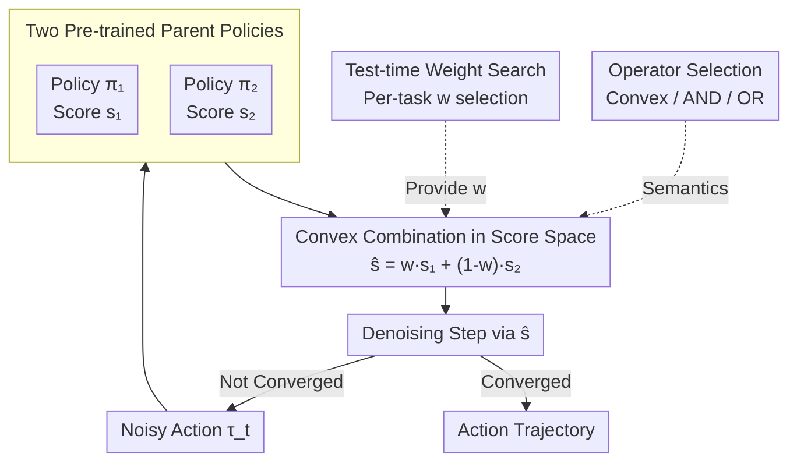

# Compose Your Policies! Improving Diffusion-based or Flow-based Robot Policies via Test-time Distribution-level Composition

**Conference**: ICLR 2026  
**arXiv**: [2510.01068](https://arxiv.org/abs/2510.01068)  
**Code**: [https://sagecao1125.github.io/GPC-Site/](https://sagecao1125.github.io/GPC-Site/)  
**Area**: Image Generation  
**Keywords**: Policy Composition, Diffusion Policy, Distribution-level Composition, Test-time Search, Robot Manipulation

## TL;DR
This paper proposes General Policy Composition (GPC), which performs a convex combination of distribution scores from multiple pre-trained diffusion or flow policies at test time. This approach yields a stronger policy surpassing any single parent without extra training. It theoretically proves that convex combinations can improve single-step score errors, which propagate to the entire trajectory via Grönwall bounds.

## Background & Motivation

**Background**: Diffusion Policies have become a powerful parameterization in robot learning, capable of representing complex multimodal action distributions. However, progress is limited by the cost of acquiring large-scale interaction datasets.

**Limitations of Prior Work**: (a) Scaling model capacity requires more data; (b) supervised fine-tuning involves expensive data collection; (c) reinforcement learning requires reward engineering and extensive online interaction; (d) existing policy composition methods (e.g., PoCo) use fixed weights and do not explore task-dependent weight searching.

**Key Challenge**: The performance of a single policy is limited by its training data and model capacity, but combining multiple policies requires theoretical guarantees—naive averaging does not necessarily yield better results.

**Goal**: To obtain stronger policies by combining existing ones without additional training.

**Key Insight**: Drawing an analogy from composite generative models—in diffusion models, the convex combination of multiple score functions is equivalent to the product of probability density functions, biasing sampling toward consensus regions.

**Core Idea**: Convex combination of multiple diffusion policy score functions + test-time weight search = zero-training policy enhancement.

## Method

### Overall Architecture
GPC addresses the problem of combining several pre-trained diffusion/flow policies with different strengths into a superior policy without retraining or collecting new data. It performs "composition" in the **score space** during **inference**. Given two pre-trained policies $\pi_1, \pi_2$, the score estimates $s_1, s_2$ are calculated at each denoising step and combined via a convex weight: $\hat{s}_{\text{comp}} = w_1 s_1 + w_2 s_2$. This synthetic score is then used for the denoising step. The weight $w$ is not a fixed constant but the optimal value found via search over $\{0.0, 0.1, \dots, 1.0\}$ for each task. Because composition occurs at the score level, heterogeneous policies (e.g., VA+VLA, RGB+Point Cloud, Diffusion+Flow-matching) can be combined regardless of architecture or modality.

### Key Designs

**1. Theoretical Guarantees for Convex Score Combination: Answering "Why mixing is better" mathematically**

GPC provides theoretical proof rather than relying solely on empirical observation. Proposition 4.1 considers two score estimators with different biases and noises, proving that the Mean Squared Error (MSE) $Q(w)$ of their convex combination is a convex quadratic function of the weight $w$. Consequently, the minimum point often falls within the interval, performing strictly better than either individual model unless their errors are identical. Intuitively, biases of different models often point in different directions and cancel out when mixed. Proposition 4.2 further uses Grönwall bounds to prove that this single-step improvement propagates throughout the sampling process, ultimately enhancing the quality of the complete action trajectory.

**2. General Policy Composition (GPC) Framework: Unifying composition in score space for heterogeneous policies**

GPC generalizes classifier-free guidance (CFG) into a multi-policy version:

$$\hat{\epsilon}(\tau_t, t, \mathbf{c}) = \epsilon_\theta(\tau_t, t) + \sum_i w_i\big(\epsilon_\theta(\tau_t, t, \mathbf{c}_i) - \epsilon_\theta(\tau_t, t)\big)$$

In each denoising step, score estimates from parent policies are combined into $\hat{s}_{\text{comp}} = w_1 s_1 + w_2 s_2$. Since this happens in the score space—rather than at the action or network level—policies can be combined even if they have different denoising steps, noise schedules, or frameworks (e.g., flow-matching vs. diffusion). This allows for combining VA and VLA, or RGB and point cloud inputs.

**3. Test-time Weight Search: Task-dependent optimal mixing ratios**

Weights $w$ are not arbitrary constants. GPC enumerates 11 values from $w \in \{0.0, 0.1, \dots, 1.0\}$ with a 0.1 step size and selects the best performer based on validation data. This reveals that even for the same two parent policies, different tasks require different composition ratios (optimal $w$ varies between 0.2 and 0.8), rendering fixed weights non-universal. While this adds the cost of 11 evaluations per task, it is negligible compared to training costs.

**4. Alternative Operators (AND / OR): Different probabilistic semantics**

While convex combination is the default, two alternative operators are provided. The **AND** operator corresponds to the product of distributions, where scores are added $\nabla \log p(\tau) = \nabla \log p_1(\tau) + \nabla \log p_2(\tau)$, biasing sampling toward regions where both policies agree (suitable for high-precision tasks). The **OR** operator corresponds to a mixture of distributions $p(\tau) \propto w_1 p_1(\tau) + w_2 p_2(\tau)$, preserving the multi-modality of both policies (suitable for tasks requiring diversity).

### Loss & Training

**Zero Training**. GPC operates entirely at inference time without modifying any pre-trained model parameters. The only overhead is the evaluation of 11 weight values.

## Key Experimental Results

### Main Results

Benchmarks include Robomimic (6 tasks), PushT, and RoboTwin:

| Setup | Method | Success Rate |
|------|------|----------|
| DP alone | Single Policy | Baseline |
| DP3 alone | Single Policy | Baseline |
| **GPC (DP + DP3)** | Convex Combination | **Exceeds Both** |

- GPC outperforms the better of the two parent policies in most tasks.
- Real-robot experiments verify consistent performance gains.

### Ablation Study

| Analysis Dimension | Key Findings |
|---------|---------|
| Convex vs AND vs OR | Convex is usually optimal; AND is better for high precision; OR for multi-modal tasks. |
| Optimal Weight Analysis | Optimal $w$ varies significantly by task (0.2~0.8), validating task dependency. |
| Heterogeneous (VA+VLA) | Can combine vastly different architectures and visual inputs. |
| Search Granularity | A 0.1 step size is sufficient; finer granularity yields diminishing returns. |

### Key Findings
- Combined policies can indeed surpass any single parent policy—the core surprising finding.
- Optimal weights are highly task-dependent: fixed weights are not universal.
- Convex score combination directs sampling to "consensus" high-density regions, naturally reducing edge errors of single policies.
- Success is possible even if one parent policy fails completely on a specific task.

## Highlights & Insights
- **1+1>2 Theoretical Guarantee**: The proof that convex combinations improve score error (Proposition 4.1) is elegant—the key insight being that differing bias directions can cancel each other out.
- **Zero Training Cost**: Works entirely during inference as a plug-and-play enhancement for existing policies, offering high practical value.
- **Heterogeneous Flexibility**: Supports combinations of VA, VLA, RGB, point cloud, diffusion, and flow-matching.
- **Unified CFG Perspective**: Interpreting GPC as a multi-policy version of classifier-free guidance provides a clear probabilistic explanation.

## Limitations & Future Work
- Test-time search requires separate weight tuning for each task, which may be costly for large task sets.
- Theoretical guarantees assume differing biases; however, models trained on the same data might have highly correlated biases.
- Only $N=2$ policy combinations were verified; weight space grows exponentially for $N>2$.
- Safety guarantees of the combined policy are not addressed—consensus regions are not necessarily safe.
- Metrics focus on success rate, lacking analysis of action quality (e.g., smoothness, efficiency).

## Related Work & Insights
- **vs PoCo (Wang et al., 2024c)**: PoCo performs constraint/task/modality composition with fixed weights. GPC introduces test-time search for task-optimal weights and provides deeper theoretical analysis.
- **vs Model Ensemble**: Traditional ensembles average predictions. GPC combines at the score/distribution level—the former averages behavior, while the latter focuses on consensus.
- **Transfer Insight**: Score combination theories can be directly transferred to model composition in image/video generation (e.g., combining multi-style diffusion models).

## Rating
- Novelty: ⭐⭐⭐⭐ Elegant theoretical guarantee, though final score combination is known in generative modeling.
- Experimental Thoroughness: ⭐⭐⭐⭐⭐ Simulation + Real-world, multiple benchmarks, and comprehensive ablations.
- Writing Quality: ⭐⭐⭐⭐⭐ Clear logical chain from theoretical motivation to method and experiments.
- Value: ⭐⭐⭐⭐ Highly practical "free lunch" method applicable to existing robotic systems.

<!-- RELATED:START -->

## Related Papers

- [\[ICLR 2026\] Improving Discrete Diffusion Unmasking Policies Beyond Explicit Reference Policies (UPO)](improving_discrete_diffusion_unmasking_policies_beyond_explicit_reference_polici.md)
- [\[ICML 2026\] Recovering Hidden Reward in Diffusion-Based Policies](../../ICML2026/image_generation/recovering_hidden_reward_in_diffusion-based_policies.md)
- [\[ICLR 2026\] MILR: Improving Multimodal Image Generation via Test-Time Latent Reasoning](milr_improving_multimodal_image_generation_via_test-time_latent_reasoning.md)
- [\[NeurIPS 2025\] Failure Prediction at Runtime for Generative Robot Policies](../../NeurIPS2025/image_generation/failure_prediction_at_runtime_for_generative_robot_policies.md)
- [\[NeurIPS 2025\] Real-Time Execution of Action Chunking Flow Policies](../../NeurIPS2025/image_generation/real-time_execution_of_action_chunking_flow_policies.md)

<!-- RELATED:END -->
