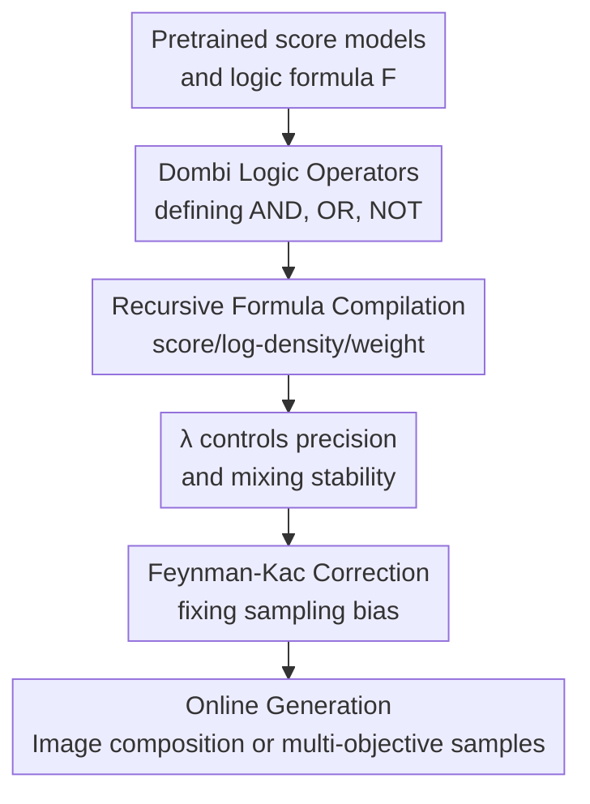

# Composition of Pretrained Diffusion Models: A Logic-Based Calculus

**Conference**: ICLR2026  
**OpenReview**: [https://openreview.net/forum?id=ADLiUSC7Qm](https://openreview.net/forum?id=ADLiUSC7Qm)  
**Code**: https://github.com/Aalto-QuML/logic-diffusion-composition  
**Area**: Diffusion Models / Image Generation  
**Keywords**: Diffusion Composition, Logic Calculus, Dombi Operators, Feynman-Kac Correction, Concept Negation  

## TL;DR
This paper elevates the empirical PoE/MoE composition of pretrained diffusion models to a fuzzy logic-based Dombi score calculus. It demonstrates more stable mode coverage and sampling correction in multi-prompt Stable Diffusion, complex SAT-style compositions, and multi-objective molecular generation.

## Background & Motivation
**Background**: Diffusion models can perform complex generation tasks through conditional prompts, classifier-free guidance, energy model composition, or weighting multiple score models. For example, to synthesize an image combining "mountain landscape" and "dog silhouette," one can sum or average the scores of the two conditional distributions; to avoid a concept, negative prompts or CFG-style operations (positive minus negative prompts) are commonly used.

**Limitations of Prior Work**: These composition methods often borrow the language of set theory but do not satisfy the fundamental properties of set operations. PoE is often interpreted as an intersection, but it biases towards small regions where both distributions have high density, leading to mode loss. MoE is interpreted as a union but is unstable when mixed with intersection and negation operations. Negative prompts or inverse-probability "NOT" operations can make the density non-normalizable, causing sampling trajectories to diverge. In other words, empirical score splicing reveals algebraic inconsistency, poor mode coverage, and sampling bias when formulated as `A AND (NOT B)`, `A XOR B`, or `majority of k concepts`.

**Key Challenge**: Diffusion model composition must satisfy two goals: first, the composition result should be reasoning-capable like logic formulas, approximately satisfying commutative, associative, De Morgan's dual, idempotency, and distributive laws; second, the composed object must be stably sampleable in the diffusion reverse process, rather than just having a "clean" density definition on the data distribution. Traditional PoE/MoE only solve small fragments, lacking a unified "density operator $\to$ score operator $\to$ sampling correction" closed loop.

**Goal**: The authors aim to establish an online calculus for pretrained diffusion model composition: given several trained score models and a logic formula, it outputs a sampleable composite score while tracking its corresponding density, stability, sampling bias, and how to correct said bias using Feynman-Kac weights.

**Key Insight**: Instead of treating probability products as intersections, the paper starts from fuzzy logic's t-norms/t-conorms. Fuzzy logic naturally studies the intersection, union, and negation of "soft sets"; densities in diffusion models can be seen as soft membership degrees. The authors map density to a $[0,1]$ membership space using a reference distribution, then lift Dombi t-norms back to the density and score domains, obtaining a family of operators with a temperature parameter $\lambda$.

**Core Idea**: Use De Morgan dual Dombi operators to replace manual PoE/MoE/negative prompt splicing, allowing any logic formula to be recursively compiled into a composite score, composite log-likelihood, and Feynman-Kac correction weights.

## Method

### Overall Architecture
The method does not retrain diffusion models but composes multiple pretrained models online during sampling. Given score models $\{s_i\}_{i=1}^k$, their online log-density estimates $\{\log q_i\}$, Feynman-Kac weights $\{g_i\}$, and a logic formula $F$ (composed of atomic models, NOT, AND, OR), the algorithm recursively compiles $F$ into a triplet: composite score $\bar{s}$, composite log-density $\log \bar{q}$, and composite weight $\bar{g}$. Sampling follows the reverse SDE, replacing the standard score with the composite score and reweighting particles using methods like SMC based on $\bar{g}$.

### Key Designs
**1. Dombi Logic Operators: Integrating AND, OR, and NOT into De Morgan Calculus**

The paper first uses a reference function $c(x)>0$ to map density $p(x)$ to fuzzy membership $\phi_c(p;x)=p(x)/(p(x)+c(x))$. This reference term only affects the definition of negation (representing the background distribution when negating concepts); AND and OR do not depend on it. The authors then adopt the generator function of the Dombi t-norm and lift it to the density domain:

$$
\neg_c p(x)=\frac{c(x)^2}{p(x)}, \quad
p_1(x)\wedge_\lambda p_2(x)=\frac{p_1(x)p_2(x)}{(p_1(x)^\lambda+p_2(x)^\lambda)^{1/\lambda}},
$$

$$
p_1(x)\vee_\lambda p_2(x)=(p_1(x)^\lambda+p_2(x)^\lambda)^{1/\lambda}.
$$

Key to these definitions is that they unify common composition methods into a tunable family: $\lambda=1$ relates to linear mixtures and harmonic means, $\lambda\to 0$ corresponds to the geometric mean (PoE), and $\lambda\to\infty$ approaches the min/max lattice. Compared to simple PoE, Dombi intersection is controlled by a power norm, preventing over-biasing towards a few modes. Unlike MoE, it belongs to the same De Morgan system as negation, ensuring complex formulas are algebraically consistent.

In the score domain, these operators remain computable. The OR operation corresponds to a score average with softmax weights, $s_1\vee_\lambda s_2=\alpha_1^\lambda s_1+\alpha_2^\lambda s_2$, where $\alpha_i^\lambda\propto\exp(\lambda\log p_i)$. Intersection simply replaces $\lambda$ with $-\lambda$, and referenced negation gives $\neg_c s=2s_c-s$.

**2. Recursive Formula Compilation: Transforming Logic Expressions into Sampleable Composite Scores**

To handle nested formulas like XOR or "majority of k," the authors define a grammar $F ::= i \mid \neg_j i \mid F_1 \circ F_2$. The recursive algorithm computes triplets for sub-formulas and merges them using Dombi weights. This allows the expressivity of "exactly one model satisfied" or "satisfy the majority while excluding a specific intersection." The Itô density estimator tracks $\log p_t(x_t)$ online, allowing softmax weights $\alpha_i$ to vary with sample position and time—assigning "responsibility" based on which sub-model the current particle resembles.

**3. $\lambda$ Stability Analysis: Balancing Precision and Sampling Oscillation**

The Dombi parameter $\lambda$ acts as an inverse temperature for score mixing. Larger $\lambda$ makes AND/OR closer to hard min/max (better logic precision) but makes weights $\alpha$ sensitive to density differences, potentially causing rapid score switching during sampling. The paper shows that for finite $\lambda$, violations of idempotency and distributive laws are bounded by $2^{\pm 2/\lambda}$, while the rate of change in mixing coefficients depends on $\lambda$, noise intensity $\sigma_t$, and score difference $\|s_1-s_2\|$.

**4. Feynman-Kac Correction: Fixing the Discrepancy between Noisy Scores and Noisy Distributions**

Non-linear compositions defined on clean data distributions do not generally commute with forward diffusion kernels. Composing noisy scores is not equivalent to adding noise to a composed clean distribution. The paper extends the Feynman-Kac Corrector to collect this discrepancy into a weight field $g_t(x)$, enabling a weighted SDE. For Dombi operations, the correction term involves the variance between the "norm of the average score" and the "average of the score norms." Without FKC, marginal distributions of particles may deviate from the target logic; with FKC, SMC can resample particles by $\exp(g_t(x)dt)$ to minimize bias.

## Key Experimental Results

### Main Results
The experiments cover SAT-style logic combinations (mode coverage), Stable Diffusion (image composition/negation), and molecular generation (FKC impact).

| Composition Task | Metric | Dombi | PoE/MoE | Conclusion |
|--------|------|------|---------|------|
| Maj2 | Sat / Unif | 1.00 / 1.00 | 1.00 / 0.80 | Both satisfy simple majority; PoE/MoE shows mode bias. |
| XOR2 | Sat / Unif | 0.97 / 1.00 | 0.00 / 0.00 | Dombi handles negation in XOR; PoE/MoE fails. |
| OneHot2 | Sat / Unif | 0.97 / 1.00 | 0.00 / 0.00 | Dombi covers "exactly one satisfied" cases. |
| Maj10 | Sat / Unif | 1.00 / 0.98 | 0.00 / 0.00 | Dombi remains stable as model count increases. |
| XOR10 | Sat / Unif | 0.89 / 0.98 | 0.00 / 0.00 | High satisfaction for formulas with 1000+ score terms. |

In Stable Diffusion v1-4, Dombi achieves higher CLIP and ImageReward scores for dual-prompt intersections and concept negation compared to SuperDiff and ICN.

| Task | Method | Param | CLIP / Gain | ImageReward / Gain |
|------|------|------|-------------|--------------------|
| Intersection | SuperDiff and | - | 24.87±2.92 | -1.33±0.83 |
| Intersection | PoE | - | 24.41±2.71 | -1.55±0.75 |
| Intersection | Dombi | $\lambda=1.0$ | 25.32±2.55 | -1.16±0.85 |
| Concept Negation | ICN | - | 7.29±2.76 | 1.14±0.72 |
| Concept Negation | Dombi | $\gamma=10$ | 7.02±2.54 | 1.21±0.66 |

### Ablation Study
Molecular generation tested FKC utility across 14 protein targets.

| Config | Temp. $\gamma$ | FKC? | $(P1 * P2)$ ↑ | max(P1,P2) ↓ | QED ↑ |
|------|---------------|------|---------------|--------------|-------|
| TargetDiff | - | - | 62.19±27.08 | -7.24±2.35 | 0.57±0.14 |
| Dombi | 2 | No | 71.36±29.44 | -7.59±2.48 | 0.59±0.12 |
| Dombi | 2 | Yes | 81.63±25.91 | -8.25±1.56 | 0.59±0.12 |

### Key Findings
- Dombi significantly improves the satisfiability and uniformity of satisfying modes in complex logic formulas compared to empirical weighting.
- $\lambda$ controls the tradeoff between logical "hardness" and stability; higher $\lambda$ improves logic precision but increases sampling variance.
- FKC provides tangible gains in multi-objective optimization (molecule generation), proving that sampling correction is essential for structural tasks.
- Extreme negation tasks (OneHot10) remain difficult for online score composition due to exponential complexity.

## Highlights & Insights
- Systematizes "diffusion composition" as a logic calculus rather than just another empirical weighting formula, providing far superior interpretability.
- The dual role of $\lambda$ as both a power norm index and a score softmax temperature provides clear theoretical intuition for hyperparameter tuning.
- Referenced negation is a practical design, allowing CFG-style concept avoidance to be integrated into a stable algebraic system.
- FKC addresses the often-ignored gap between defining a target density and the actual marginal distribution of a diffusion sampler.

## Limitations & Future Work
- Relies on online log-density estimation and repeated calls to multiple score models, increasing inference cost and memory overhead.
- $\lambda$ currently requires manual selection; future work could explore automated scheduling based on score variance or time steps.
- The calculus satisfies lattice properties only approximately for finite $\lambda$.
- Large-scale logic (e.g., OneHot10) shows that long formulas with many negation terms still pose challenges for satisfiability.

## Related Work & Insights
- **vs PoE**: PoE (score addition) is simple but creates mode collapse. Dombi uses power norms/softmax weights to preserve modes.
- **vs MoE**: MoE handles unions well but cannot solve intersections or negation. Dombi provides a dual system for all three.
- **vs SuperDiff**: While SuperDiff focuses on stable composition, this work derives the Dombi operator family from fuzzy logic and analyzes distributive law deviations.
- **vs CFG**: CFG provides relative concept negation; this work places it within a formal calculus.

## Rating
- Novelty: ⭐⭐⭐⭐⭐ Systematizes composition as a logic calculus with theoretical rigor.
- Experimental Thoroughness: ⭐⭐⭐⭐☆ Covers logic toys, SD, and molecules; could use more large-scale visual constraint tests.
- Writing Quality: ⭐⭐⭐⭐☆ Clear theoretical chain, though math-heavy sections have a high entry barrier.
- Value: ⭐⭐⭐⭐⭐ A foundational tool for training-free model ensembles and constrained generation.

<!-- RELATED:START -->

## Related Papers

- [\[ICLR 2026\] Bridging the Distribution Gap to Harness Pretrained Diffusion Priors for Super-Resolution](bridging_the_distribution_gap_to_harness_pretrained_diffusion_priors_for_super-r.md)
- [\[ICLR 2026\] Steer Away From Mode Collisions: Improving Composition In Diffusion Models](steer_away_from_mode_collisions_improving_composition_in_diffusion_models.md)
- [\[ICLR 2026\] LogiStory: A Logic-Aware Framework for Multi-Image Story Visualization](logistory_a_logic-aware_framework_for_multi-image_story_visualization.md)
- [\[CVPR 2025\] MixerMDM: Learnable Composition of Human Motion Diffusion Models](../../CVPR2025/image_generation/mixermdm_learnable_composition_of_human_motion_diffusion_models.md)
- [\[ICLR 2026\] Does FLUX Already Know How to Perform Physically Plausible Image Composition?](does_flux_already_know_how_to_perform_physically_plausible_image_composition.md)

<!-- RELATED:END -->
