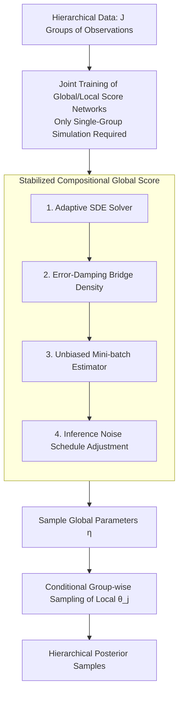

# Compositional amortized inference for large-scale hierarchical Bayesian models

**Conference**: ICLR2026  
**arXiv**: [2505.14429](https://arxiv.org/abs/2505.14429)  
**Code**: To be confirmed  
**Area**: Image Generation  
**Keywords**: amortized Bayesian inference, hierarchical model, compositional score matching, diffusion model, scalability

## TL;DR
Extends Compositional Score Matching (CSM) to hierarchical Bayesian models by introducing a new error-damping estimator and mini-batch strategy to solve numerical instability under massive data groups. This work achieves the first amortized inference for large-scale hierarchical models exceeding 750,000 parameters (250,000+ data groups) and validates its effectiveness in real-world fluorescence lifetime imaging (FLIM).

## Background & Motivation

**Background**: Amortized Bayesian Inference (ABI) utilizes neural networks to learn universal posterior functions, enabling zero-latency sampling for new data after training. However, scaling to hierarchical models remains a primary obstacle as training requires simulating a full "dataset of datasets" for each batch, leading to prohibitive computational costs.

**Limitations of Prior Work**: (a) Direct ABI requires simulating $J$ data groups ($J$ can reach hundreds of thousands), necessitating tens of thousands of simulations per batch; (b) Existing CSM methods become numerically unstable when the number of groups $J > 100$, as compositional score summation leads to error compounding and divergent sampling; (c) MCMC (e.g., NUTS) is infeasible for large-scale hierarchical models.

**Key Challenge**: The divide-and-conquer strategy of CSM allows training with only single-group simulations (efficient), but inference requires combining $J$ score estimates. As $J$ increases, the number of summed terms grows, leading to severe compounding of approximation errors and numerical explosion.

**Goal**: To maintain numerical stability for CSM at a scale of hundreds of thousands of data groups, enabling amortized inference for large-scale hierarchical models.

**Key Insight**: Introduce error-damping bridge densities to diminish the influence of compositional scores in high-noise regions while restoring the full summation in low-noise regions, while employing a mini-batch estimator to address memory constraints.

**Core Idea**: Modulate the accumulation speed of compositional scores along the diffusion trajectory using a time-varying damping function $d(t)$—damping at high noise to prevent divergence and restoring at low noise to ensure correctness.

## Method

### Overall Architecture
This paper addresses the difficulty of scaling ABI to **hierarchical models**, which organize data as "datasets within datasets." Conventional training requires simulating hundreds of thousands of groups per batch. CSM adopts a divide-and-conquer approach: training on **single-group data** and combining scores for $J$ groups during inference, making training costs independent of $J$. However, large $J$ leads to divergent summations. This pipeline ensures stability at massive scales.

Specifically, the model consists of two layers: local parameters $\boldsymbol{\theta}_j$ for each group and shared global parameters $\boldsymbol{\eta}$. During training, local score $s^{\text{local}}(\boldsymbol{\theta}_{t,j}, \boldsymbol{\eta}, \mathbf{Y}_j)$ and global score $s^{\text{global}}(\boldsymbol{\eta}_t, \mathbf{Y}_j)$ networks are learned jointly using single-group simulations. During inference, a **stabilized compositional global score** is used with a reverse SDE to sample global $\boldsymbol{\eta}$, followed by group-wise conditional sampling of local $\boldsymbol{\theta}_j$ given $\boldsymbol{\eta}$.

### Key Designs

**1. SDE Sampler replacing Langevin Sampling: Adaptive Solvers**  
Original CSM uses annealed Langevin sampling, which is sensitive to step size and prone to divergence in high-noise regions. This work adopts a reverse SDE formulation handled by an adaptive step-size solver, which automatically reduces step sizes in high-noise regions and increases them in low-noise regions, delegating the "where to move slowly" decision to the numerical solver.

**2. Error-Damping Bridge Density: Suppressing High-Noise Influence**  
Observation of the adaptive solver reveals that error is most severe in high-noise regions, where summations amplify instability. A time-varying damping function $d(t)$ is introduced into the bridge density:

$$p_t(\boldsymbol{\eta}_t | \mathbf{Y}_{1:J}) \propto p(\boldsymbol{\eta}_t)^{(1-J)(1-t)d(t)} \prod_j p_t(\boldsymbol{\eta}_t | \mathbf{Y}_j)^{d(t)}$$

Constraints are critical: $d(0)=1$ ensures recovery of the true posterior at the end of sampling without bias; $d(1) \leq 1$ suppresses the contribution of compositional scores at the start to prevent divergence. An exponential schedule $d(t) = \exp(-\ln(1/d_1) \cdot t)$ is used, where $d_1$ controls the depth of damping.

**3. Mini-batch Compositional Score Estimator: Unbiased Subset Summation**  
When $J > 10,000$, summing all scores is computationally and memory-wise prohibitive. A random subset of size $M$ is used to estimate the compositional score:

$$\hat{s}(\boldsymbol{\eta}_t) = (1-J)(1-t)\nabla \log p(\boldsymbol{\eta}_t) + \frac{J}{M}\sum_{i=1}^M s(\boldsymbol{\eta}_t, \mathbf{Y}_{j_i})$$

The $J/M$ prefix ensures the estimator is unbiased (Proposition 3.1). While mini-batching introduces variance, the damping mechanism simultaneously controls this variance in the sensitive high-noise regions.

**4. Noise Schedule Adjustment: Minimizing Dwell Time in High Noise**  
Since high-noise regions accumulate the most error, the inference phase utilizes a noise schedule different from training (e.g., increasing the shift parameter $s$ in a cosine schedule) to compress the time spent in high-noise sections, allowing the trajectory to quickly pass through the most "dangerous" zones.

### Loss & Training
Global and local score models are jointly trained (Eq. 11) using Denoising Score Matching (DSM) with likelihood weighting. Training is highly efficient as it only requires simulating single groups of data.

## Key Experimental Results

### Main Results (Convergence Across Methods)

| Method | N=10 | N=100 | N=10K | N=100K |
|------|------|-------|-------|--------|
| Annealed Langevin | ✓ | ✗ | ✗ | ✗ |
| Euler-Maruyama | ✓ | ✗ | ✗ | ✗ |
| Probability ODE | ✓ | ✓ | ✗ | ✗ |
| GAUSS | ✓ | ✓ | ✗ | ✗ |
| **Ours (damping)** | **✓** | **✓** | **✓** | **✓** |

### Ablation Study (Hierarchical AR Model)

| Configuration | Global RMSE | Local RMSE | Note |
|------|-------------|-------------|------|
| Direct ABI (Small Scale) | Optimal | Optimal | Requires full simulation |
| CSM (No damping) | Diverges | - | Fails for $J > 100$ |
| CSM + Damping | Close to Direct ABI | Close to Direct ABI | Efficiency >> 1 full simulation |

### Key Findings
- **Existing CSM methods fail at $N > 100$**: Langevin, Euler-Maruyama, ODE, and GAUSS cannot handle more than 10K data points.
- **Error damping is the key to massive scale**: Enables stable convergence even with 100K data points.
- **Real-world verification**: Successfully performs amortized hierarchical inference on FLIM data with $J > 250,000$ and $> 750,000$ parameters.
- **Extreme training efficiency**: Training cost does not scale with $J$ since only single-group simulations are needed.

## Highlights & Insights
- **Exemplar of Divide-and-Conquer**: Decomposing training into single groups while combining during inference avoids the simulation explosion of "datasets within datasets."
- **Elegant Time-Varying Damping**: $d(0)=1, d(1)\leq 1$ balances posterior correctness and numerical stability.
- **Mini-batch Unbiasedness**: Provides a rigorous yet simple proof for subset estimation, where variance is managed by damping.
- **Breaking the CSM Scaling Bottleneck**: Breakthrough of three orders of magnitude from 100 data points to 100,000.

## Limitations & Future Work
- **Damping parameter $d_1$ tuning**: While tunable at inference, the optimal value depends on problem scale; adaptive selection is a future direction.
- **Independent local scores**: Limited information sharing between groups during score network training.
- **Shallow hierarchies**: Only two-layer models were verified; deeper structures (3+ layers) require recursive composition.
- **Mini-batch variance**: Though unbiased, variance increases with $J/M$; adaptive mini-batch sizes may help.

## Related Work & Insights
- **vs Geffner et al. (2023) CSM**: Original CSM fails beyond $N > 10$ due to annealed Langevin sampling; Ours scales to $100K+$ via SDE + damping.
- **vs Linhart et al. (GAUSS)**: Uses second-order Gaussian approximations limited to 100 points. Ours extends this by three orders of magnitude.
- **vs Direct ABI**: Direct ABI is computationally heavy due to full hierarchical simulations; Ours maintains high efficiency via single-group simulations.

## Rating
- Novelty: ⭐⭐⭐⭐ Innovative error-damping bridge density and mini-batch estimation with theoretical support.
- Experimental Thoroughness: ⭐⭐⭐⭐ Validated across Gaussian toys, hierarchical AR, and real FLIM data, though comparison with more baselines could be beneficial.
- Writing Quality: ⭐⭐⭐⭐ Rigorous mathematical derivation and clear narrative from instability analysis to solution.
- Value: ⭐⭐⭐⭐⭐ First to scale amortized hierarchical Bayesian inference to real-world scientific scales (750K parameters).

<!-- RELATED:START -->

## Related Papers

- [\[ICLR 2026\] Compositional Visual Planning via Inference-Time Diffusion Scaling](compositional_visual_planning_via_inference-time_diffusion_scaling.md)
- [\[AAAI 2026\] HierarchicalPrune: Position-Aware Compression for Large-Scale Diffusion Models](../../AAAI2026/image_generation/hierarchicalprune_position-aware_compression_for_large-scale_diffusion_models.md)
- [\[CVPR 2026\] HiCoGen: Hierarchical Compositional Text-to-Image Generation in Diffusion Models via Reinforcement Learning](../../CVPR2026/image_generation/hicogen_hierarchical_compositional_text-to-image_generation_in_diffusion_models_.md)
- [\[ICLR 2026\] Large Scale Diffusion Distillation via Score-Regularized Continuous-Time Consistency](large_scale_diffusion_distillation_via_score-regularized_continuous-time_consist.md)
- [\[NeurIPS 2025\] Large-Scale Training Data Attribution for Music Generative Models via Unlearning](../../NeurIPS2025/image_generation/large-scale_training_data_attribution_for_music_generative_models_via_unlearning.md)

<!-- RELATED:END -->
