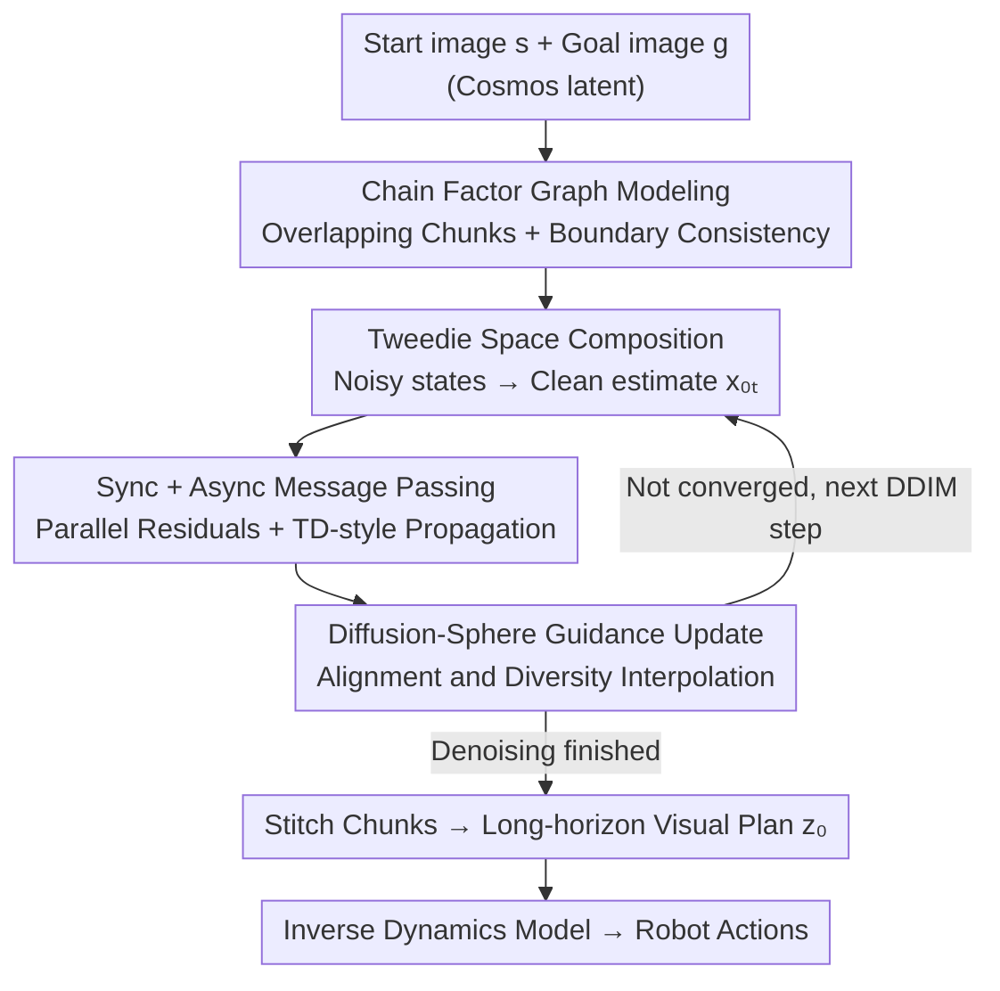

# Compositional Visual Planning via Inference-Time Diffusion Scaling

**Conference**: ICLR2026  
**OpenReview**: [https://openreview.net/forum?id=EEONns7ae4](https://openreview.net/forum?id=EEONns7ae4)  
**Project Page**: https://comp-visual-planning.github.io/  
**Code**: Committed to open source (Reproducibility statement in Paper, including algorithms and benchmark)  
**Area**: Robotics / Diffusion Planning / Inference-time Scaling  
**Keywords**: Visual Planning, Compositional Diffusion, Factor Graphs, Message Passing, Inference-time Guidance

## TL;DR
The authors freeze a pre-trained short-horizon video diffusion model and, at **inference time**, reformulate long-horizon planning as a chain-like factor graph of overlapping video segments. By performing synchronous and asynchronous message passing on **Tweedie clean estimates** (rather than noisy intermediate states) to enforce boundary consistency, they stitch short segments into globally coherent robotic manipulation plans without additional training, generalizing to start-goal combinations never seen during training.

## Background & Motivation
**Background**: Diffusion models have demonstrated strong capabilities in robotic planning, replacing per-instance optimization of trajectories with direct sampling from learned generators. However, mainstream video diffusion backbones are trained on **short segments**. Extending these to long sequences results in GPU memory and compute explosions. Furthermore, long-range constraints such as contact relationships, object persistence, and start-goal satisfaction must be maintained across the entire rollout.

**Limitations of Prior Work**: A natural way to apply short-horizon models to long-horizon tasks is **compositional generation**—decomposing the long trajectory into multiple overlapping short segments, denoising each, and averaging overlapping regions (e.g., score averaging in DiffCollage or GSC). However, this approach is unstable: forward diffusion "entangles" noisy variables between adjacent segments, causing the assumption of "factorability between segments" to **fail in noisy space**. Consequently, stitched global plans suffer from drift, boundary mismatches, and failed long-range constraint propagation. The paper demonstrates this with a three-petal flower toy experiment (stitching three 120° arc generators): DiffCollage leaves gaps at boundaries and fails to close the loop.

**Key Challenge**: Compositional heuristics (score averaging / Bethe approximation) are only exact on **clean data** (diffusion $t=0$). However, these heuristics are repeatedly applied at **noisy intermediate steps** $t>0$, creating a systematic gap. In other words, composition is performed in the wrong domain.

**Goal**: To compose short-horizon video diffusion models into long-horizon, globally consistent, and executable visual plans without retraining the backbone or adding task-specific adapters, while ensuring generalization to unseen start-goal combinations.

**Key Insight**: Since composition is unreliable in noisy states, it should be performed where the diffusion model's estimates are most reliable—namely, the **Tweedie clean estimate** $x_{0|t}$ predicted at each step. Strong and explicit compositional constraints (boundary equality) only become meaningful in this stable domain.

**Core Idea**: Reformulate long-horizon planning as "inference on a chain factor graph over overlapping video chunks." Local priors are provided by the frozen short-horizon diffusion backbone, while global consistency is enforced through **boundary consistency constraints on Tweedie estimates**, a process occurring entirely at inference time.

## Method

### Overall Architecture
The method addresses the following: given a **permanently frozen** video diffusion model $x_\theta$ trained on short segments, and provided with a start image and a goal image, generate a long-horizon video plan connecting them, which is then translated into robotic actions by an inverse dynamics model. The entire pipeline is training-free at inference.

Specifically, a plan is represented as a linear chain $z=[u_1,\dots,u_m]$ covered by $n$ overlapping factors $x_i=[u_{2i-1},u_{2i},u_{2i+1}]$. Each factor receives three consecutive frames, and adjacent factors share a **transition boundary variable**; the ends $u_1=s$ and $u_m=g$ are the start/goal boundary variables. All factors and variables are encoded into a compact latent space using a Cosmos tokenizer to save compute. During sampling, initial Gaussian noise is partitioned into $n$ overlapping chunks. In each DDIM step: predict the Tweedie estimate for each chunk $\to$ perform one DDIM step $\to$ compute a "boundary inconsistency" residual using synchronous and asynchronous message passing losses $\to$ use Diffusion-Sphere Guidance to steer the update toward "consistency satisfaction" without sacrificing diversity. After all steps, denoised chunks are stitched into the final plan $z_0$ and passed to the inverse dynamics model for execution.

### Key Designs

**1. Chain Factor Graph + Explicit Boundary Consistency: Reducing "Long-horizon Planning" to "Local Generation + Boundary Equality"**

To address the issues of memory explosion and failed long-range information propagation, the paper avoids direct generation of the entire long trajectory. Instead, it represents the trajectory as a linear chain of overlapping factors and enforces feasibility via a set of **boundary equations**. Let $A_i$ and $B_i$ be linear selection operators extracting the first and last frames of factor $x_i$, respectively. A feasible plan must satisfy: start/goal anchoring $A_1x_1=s, B_nx_n=g$, and transition boundaries $B_ix_i=A_{i+1}x_{i+1}$ (alignment on shared frames). This decomposes global planning into "generating each short chunk using the same $x_\theta$ + aligning at boundaries." Longer horizons only require more factors while reusing the same model weights, providing natural scalability. Explicit constraints allow start-goal information to propagate along the chain.

**2. Tweedie Space Composition: Applying Constraints on Clean Estimates to Circumvent the Noisy-Bethe Gap**

This is the theoretical pivot of the work. DiffCollage/GSC use the Bethe approximation—writing the joint distribution as a product of factors divided by variables—which leads to the score being a weighted sum of individual factor scores. This approximation is only accurate for clean data. The paper's **Noisy-Bethe Gap Theorem** shows that for a simple three-variable chain, the difference between the true noisy distribution and the Bethe estimate equals a covariance term $\Delta = Z\,\mathrm{Cov}_{u_2\sim q}\!\left[\tfrac{a}{c},\tfrac{b}{c}\right]$, where $a, b$ are "votes" cast by left/right factors to the boundary $u_2$ through their respective forward noise channels, and $c$ is the boundary's own unary evidence. Intuitively, forward diffusion injects shared, heteroskedastic perturbations at the boundary, causing the relative gains $a/c$ and $b/c$ to fluctuate together, resulting in non-zero covariance and systematic bias in the Bethe approximation. Consequently, the authors apply constraints on the stitched **Tweedie estimates** $x^{1:n}_{0|t}=x_\theta(x^{1:n}_t)$, defining the approximate distribution as $p(z_t)=\prod_i p(x_i_t)\cdot\exp(-\mathcal{L}(x^{1:n}_{0|t}))$, where the potential function penalizes inconsistencies among clean variables.

**3. Synchronous + Asynchronous Message Passing: Balancing Parallel Unbiasedness with Stability**

Since a single boundary consistency loss is insufficient for optimization, the authors design two complementary message passing schemes. The **Synchronous** scheme treats the chain as a Gaussian linear system, aggregating all boundary potentials $\psi_{i-1,i}=\exp(-\frac{1}{c_{i-1}}\|B_{i-1}x^{i-1}_{0|t}-A_ix^i_{0|t}\|^2)$ into a precision matrix $\Sigma^{-1}$ and vector $\eta$. The loss minimizes the residual $\|\Sigma^{-1}x^{1:n}_{0|t}-\eta\|$. This allows lockstep parallel updates without sequential bias but can be numerically "stiff" and slow to converge. The **Asynchronous** scheme draws from TD learning, using bootstrapped targets with stop-gradients $\mathrm{sg}(\cdot)$ for forward and backward propagation. $\mathcal{L}_{async}$ includes start/goal anchoring terms $\|s-A_1x^1_{0|t}\|, \|B_nx^n_{0|t}-g\|$, forward message terms $\|\mathrm{sg}(B_i\hat{x}^i_{0|t})-A_{i+1}x^{i+1}_{0|t}\|$, and mirrored backward terms. A discount factor $\gamma$ reduces message weight as distance from the start/goal increases. Targets $\hat{x}$ come from the latest model, while $x_{0|t}$ comes from an EMA model. Async is faster and more stable despite minor biases. The combined $\mathcal{L}=\mathcal{L}_{sync}+\mathcal{L}_{async}$ achieves an optimal balance between constraint strength and flexibility.

**4. Diffusion-Sphere Guidance: Converting Message Residuals into Training-Free Sampling Updates**

The differentiable consistency loss is integrated into the denoising process via Diffusion-Sphere Guidance (DSG). The steepest descent direction $d^*=-\sqrt{s}\sigma_t\cdot\frac{\nabla_{x_t}\mathcal{L}}{\|\nabla_{x_t}\mathcal{L}\|}$ is treated as the "alignment" direction and interpolated with the unconditional annealed sampling direction $d_{sample}=\sigma_t\epsilon_t$ using a guidance weight $g$ as $d_m=d_{sample}+g(d^*-d_{sample})$. This is then normalized to the spherical Gaussian constraint radius $x^{1:n}_{t-1}=\mu^{1:n}_{t-1}+r\frac{d_m}{\|d_m\|}$. This pulls samples toward boundary consistency while preserving local sampling quality, parallelism, and diversity, avoiding the collapse typically seen in standard gradient guidance.

### Loss & Training
During the training phase, the short-horizon video diffusion model $x_\theta$ is trained on **randomly cropped** short segments from long-horizon demonstrations using the $x_0$ prediction objective $\mathbb{E}\|x_0-x_\theta(x_t,t)\|^2$. An MLP-based inverse dynamics model is trained to predict end-effector poses from adjacent frames. The inference phase is entirely training-free: according to Algorithm 1, noise is sampled $\to$ partitioned into $n$ chunks $\to$ combined sync/async message passing + DSG guidance is performed per DDIM step $\to$ chunks are stitched into $z_0$. This framework is plug-and-play for any unconditional short-horizon diffusion backbone.

## Key Experimental Results

### Main Results
Evaluated on a compositional planning benchmark based on ManiSkill: each scene has $N$ starts and $N$ goals, totaling $N\cdot N$ pairs, but training only covers $N$ pairs. Evaluation considers $N$ seen pairs (IND) and $N\cdot N-N$ unseen pairs (OOD). Total: 4 scenes, 100 tasks (18 IND + 82 OOD), 30 episodes per task, 5 random seeds.

Success Rate (%, selected Overall and scenes, ± denotes Std Dev):

| Scene/Dist | GCDP (Strong Policy) | DiffCollage | CompDiffuser | Ours |
|-----------|------|------|------|------|
| Tool-Use OOD | 42±13 | 0±0 | 51±3 | **96±2** |
| Cube OOD | 24±13 | 0±0 | 34±6 | **65±9** |
| Puzzle OOD | 12±11 | 0±0 | 9±3 | **50±13** |
| Overall IND | 56±16 | 0±1 | 17±2 | **59±17** |
| Overall OOD | 15±13 | 0±0 | 16±2 | **54±14** |

DiffCollage failed almost entirely (blurred/unrealistic frames confused the IDM); strong policy baselines (GCDP, etc.) performed well on IND but suffered **catastrophic drops** on OOD. Ours maintained nearly equal IND/OOD performance (59 vs 54), demonstrating stable generalization.

Video Quality (VBench++, selected):

| Dist | Metric | DiffCollage | Ours |
|------|------|------|------|
| OOD | Motion Smoothness ↑ | 0.87±0.06 | **0.97±0.05** |
| OOD | Background Consistency ↑ | 0.80±0.07 | **0.90±0.05** |
| OOD | Imaging ↑ | 0.55±0.05 | **0.69±0.05** |

Temporal metrics (smoothness, consistency) lead significantly, correlating with executable trajectories; Imaging is noticeably better (fewer blurred frames).

### Ablation Study

| Config (Cube, IND/OOD Success %) | Result | Description |
|------|------|------|
| Sync Only | 10 / 8 | Constraints too stiff, lowest success rate |
| Async Only | 45 / 41 | TD-style updates more stable, significantly better |
| Sync & Async (Full) | **64 / 65** | Best balance between constraint and flexibility |

Scaling with sampling steps (Drawer, IND/OOD): 50 steps 35/20 $\to$ 100 steps 40/25 $\to$ 200 steps 45/45 $\to$ 300 steps **53/52**, showing the method benefits from increased inference-time compute.

Real-world robot (Franka Panda, 10 trials/task): Ours achieved IND 9/10, 7/10 and OOD 10/10, 8/10; DiffCollage scored only 1/1/0/0.

### Key Findings
- **Combined message passing is the primary contributor**: Synchronous loss alone is nearly ineffective (10/8); asynchronous is the stabilizer, and their union pushes performance to 64/65.
- **OOD generalization is the true differentiator**: Policy baselines reach 56 on IND but drop to 15 on OOD. Ours remains stable, verifying that "compositional generalization" stems from factor graph decomposition rather than memorizing training pairs.
- **Inference-time compute-performance trade-off**: Success rates scale monotonically with sampling steps, supporting the "inference-time scaling" hypothesis.
- **DiffCollage failure in noisy space is systematic**: Image artifacts don't just reduce vision scores; they contaminate the IDM, leading to execution failure, confirming the Noisy-Bethe Gap's impact.

## Highlights & Insights
- **The insight of "changing the domain of composition" is elegant**: Compositional heuristics fail not because they are inherently flawed, but because they are applied in the wrong (noisy) domain. Moving them to the Tweedie clean estimate restores their efficacy. This perspective is transferable to any "short-to-long" diffusion task.
- **The Noisy-Bethe Gap theorem formalizes intuition into a provable covariance term**, identifying that the gap originates from shared heteroskedastic perturbations at boundaries introduced by forward noise.
- **Reinterpreting guidance as message passing between tokens**: Conventional inference-time guidance adjusts a fixed-length output; here, information propagates across the sequence, allowing "short behavioral snippets" to be stitched into "long-horizon consistent plans."
- **Sync=Parallel Unbiased yet Stiff vs. Async=TD-style Fast yet Biased**: The design pattern of combining hard constraints with bootstrapped soft targets is a valuable lesson for other iterative generation tasks requiring global consistency.
- Training-free, plug-and-play, and stable IND≈OOD curves are rare and highly valuable in robotics.

## Limitations & Future Work
- **Dependency on the Inverse Dynamics Model (IDM)**: Even with perfect visual plans, final success depends on IDM quality. Blurred frames still occasionally confuse the IDM, indicating this link is a point of error amplification.
- **Linear chain factor graph is restricted**: The current chain-like stitching for start-goal tasks might not easily handle branching, tree-like, or cyclic task structures (e.g., multi-object parallel manipulation).
- **High sensitivity to hyperparameters**: Since the sync loss is essentially unusable alone, the method depends on the tuning of message passing schedules (sync/async ratio, discount $\gamma$, guidance weight $g$).
- **Scale of evaluation**: Experiments are primarily ManiSkill simulations and a small set of real-world tasks. Whether latent drift accumulates over much longer horizons (more factors) requires further verification.
- The authors envision extending the framework to panorama generation and long video synthesis, which remain to be implemented.

## Related Work & Insights
- **vs. DiffCollage / GSC (Zhang et al., 2023; Mishra et al., 2023)**: These use score averaging based on Bethe approximations in **noisy space**. Forward diffusion breaks factorability, leading to drift. Ours uses explicit boundary equations on **Tweedie clean estimates** with principled message passing, significantly improving stability (Overall OOD 54 vs. ~0).
- **vs. CompDiffuser**: Another compositional planning baseline, but Ours is significantly stronger on visual planning and OOD tasks (Tool-Use OOD 96 vs. 51) due to Tweedie-space constraints and dual message passing.
- **vs. Policy Learning (LCBC/LCDP/GCBC/GCDP)**: Policies are competitive on IND but fail on OOD. Ours maintains stability via compositional generalization, positioning it as a complementary approach.
- **vs. General Inference-time Guidance (DSG, DPS, etc.)**: Traditional methods guide fixed-length outputs. Ours reformulates guidance as cross-token message passing to stitch variable-length sequences, extending the boundaries of inference-time guidance.

## Rating
- Novelty: ⭐⭐⭐⭐⭐ Noisy-Bethe Gap theorem + Tweedie domain composition + Guidance-as-Message-Passing reformulation is fresh and self-consistent.
- Experimental Thoroughness: ⭐⭐⭐⭐ 4 Simulation scenes + Real robot + VBench + Ablations/Scaling. Scene and real-world task counts are somewhat small.
- Writing Quality: ⭐⭐⭐⭐ Logical progression with clear motivation; minor formatting issues in equations.
- Value: ⭐⭐⭐⭐⭐ Training-free, plug-and-play, and robust OOD generalization make this highly practical for long-horizon robotics.

<!-- RELATED:START -->

## Related Papers

- [\[ICLR 2026\] Inference-Time Scaling of Diffusion Models Through Classical Search](inference-time_scaling_of_diffusion_models_through_classical_search.md)
- [\[CVPR 2026\] Rethinking Prompt Design for Inference-time Scaling in Text-to-Visual Generation](../../CVPR2026/image_generation/rethinking_prompt_design_for_inference-time_scaling_in_text-to-visual_generation.md)
- [\[ICLR 2026\] Self-Improving Loops for Visual Robotic Planning](self-improving_loops_for_visual_robotic_planning.md)
- [\[ICLR 2026\] Inference-Time Scaling of Discrete Diffusion Models via Importance Weighting and Optimal Proposal Design](inference-time_scaling_of_discrete_diffusion_models_via_importance_weighting_and.md)
- [\[ICLR 2026\] Compositional amortized inference for large-scale hierarchical Bayesian models](compositional_amortized_inference_for_large-scale_hierarchical_bayesian_models.md)

<!-- RELATED:END -->
