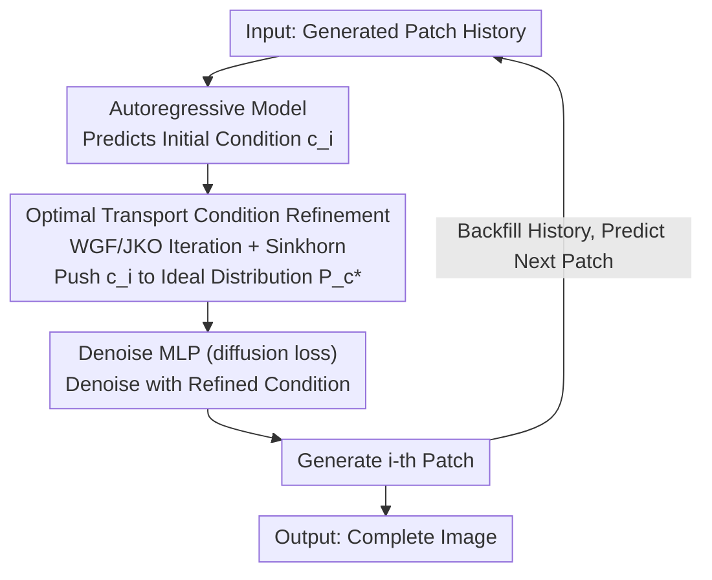

# Condition Errors Refinement in Autoregressive Image Generation with Diffusion Loss

**Conference**: ICLR 2026  
**arXiv**: [2602.07022](https://arxiv.org/abs/2602.07022)  
**Code**: None  
**Area**: Diffusion Models / Autoregressive Image Generation  
**Keywords**: autoregressive generation, diffusion loss, condition refinement, optimal transport, Wasserstein gradient flow

## TL;DR
The paper theoretically analyzes the advantages of autoregressive diffusion loss models over conditional diffusion models in condition error correction (exponential decay of gradient norm). It proposes a condition refinement method based on Optimal Transport (Wasserstein Gradient Flow) to solve the "condition inconsistency" problem in the autoregressive process, achieving an FID of 1.31 on ImageNet (based on MAR).

## Background & Motivation

**Background**: Autoregressive image generation has developed rapidly in recent years. Methods like MAR use diffusion loss instead of VQ tokenization, matching or even exceeding diffusion models in image generation quality. However, the theoretical differences between the "autoregressive + diffusion loss" paradigm and standard conditional diffusion models have not been fully explored.

**Limitations of Prior Work**: Although autoregressive conditional generation constructs context step-by-step, each condition $c_i$ accumulates irrelevant, redundant information from previous patches in addition to information useful for the current patch ("condition inconsistency"). This redundant information disturbs the conditional score of the denoising process $\nabla_{x_t} \log p(x_t|c_i)$, thereby reducing generation quality.

**Key Challenge**: Autoregressive methods capture dependencies through context accumulation, but the context inevitably contains noise information irrelevant to the current patch generation. How can redundancy be removed while preserving useful dependencies?

**Goal**: (a) Theoretically characterize the advantages of autoregressive diffusion loss compared to conditional diffusion; (b) Analyze the formation mechanism of condition inconsistency; (c) Propose a theoretically guaranteed condition refinement method.

**Key Insight**: Starting from the theoretical analysis of conditional score matching, it is proven that the autoregressive process inherently possesses a condition refinement effect (exponential decay of gradient norm). Subsequently, Optimal Transport theory (Wasserstein Gradient Flow) is used to further correct residual condition inconsistency.

**Core Idea**: Autoregressive conditional generation naturally features condition error decay, yet the condition inconsistency problem persists. Applying Wasserstein Gradient Flow for condition refinement can guarantee convergence to the ideal conditional distribution.

## Method

### Overall Architecture

This paper adopts a "theory-first, then implementation" approach. The problem addressed is that in image generators like MAR, the condition $c_i$ for each step—accumulated from preceding patches—contains redundant information irrelevant to the current generation. The paper labels this "condition inconsistency," which perturbs the denoising conditional score.

The paper first addresses two theoretical points: (1) why autoregressive diffusion loss is more robust against such redundancy than global conditional diffusion (**Condition Error Decay**, where the conditional gradient norm decays exponentially with the patch index); (2) why the decay does not reach zero, and how residual redundancy is decomposed (**Condition Inconsistency**). These analyses identify the "residual redundancy" as the target, leading to the insertion of a single new module into the runtime pipeline: **Optimal Transport Condition Refinement**. After the autoregressive model predicts the initial condition and before it enters the denoiser, a Wasserstein gradient flow pushes the condition distribution back to the ideal distribution to eliminate residual redundancy. This is followed by patch-wise denoising and history backfilling. The runtime pipeline is as follows:

The two parts of theoretical analysis (error decay and inconsistency decomposition) are not processing nodes in the pipeline but serve as the rationale for performing Optimal Transport refinement. Thus, the primary novel implementation node is the **Optimal Transport Condition Refinement**.

### Key Designs

**1. Condition Error Decay Analysis: Proving AR performs implicit refinement**

This analysis explains why autoregressive + diffusion loss can outperform global conditional diffusion. Under standard Markovian and Gaussian noise assumptions, the paper defines a condition error term $\epsilon_c$ to quantify the disturbance caused by adding a condition to the score function. The first conclusion (Theorem 1) indicates that conditional score matching loss forms an upper bound for unconditional score matching, meaning conditioning only makes score estimation harder. The critical conclusion (Theorem 2) is that through the autoregressive steps, the norm of the conditional gradient decays exponentially:

$$\|\nabla_{x_t} \log p_t(x_t|c_i)\| \leq M\beta^i + m,\quad \beta \in (0,1)$$

where $i$ is the patch index. This implies that as generation progresses, the influence of prior conditions on the current denoising decreases, eventually converging to a stationary value $m$. This demonstrates that patch-wise generation naturally possesses a "condition refinement" effect by fading out irrelevant historical information at an exponential rate.

**2. Condition Inconsistency Decomposition: Identifying the source of residual redundancy**

While exponential decay occurs, $\beta^i$ never hits zero, leaving residual redundancy. Lemma 6 formalizes this "condition inconsistency": each condition $c_i$ can be decomposed into an ideal condition $c_i^* = \pi_{\mathcal{I}_i^*}(c_i)$ and a redundant component $\eta_i = c_i - c_i^*$. The paper notes that the energy of redundancy $\mathbb{E}[\|\eta_i\|_2^2]$ consists of two parts: redundancy propagated from previous conditions and new noise injected at the current step. This decomposition reveals that while AR refinement is effective, it is imperfect, necessitating an explicit correction method.

**3. Optimal Transport Condition Refinement: Pushing conditions toward the ideal distribution**

This module addresses the residual $\eta_i$. The paper models "refining conditions" as a gradient flow optimization in Wasserstein space (Proposition 2 + Theorem 3), aiming to minimize the energy functional:

$$\mathcal{F}(P_c) = W_2^2(P_c, P_{c^*}) + \lambda \, \mathbb{E}_{c \sim P_c}\big[\|c - \mathcal{T}^{-1}(x)\|^2\big]$$

The first term uses the 2-Wasserstein distance to pull the current distribution $P_c$ toward the ideal $P_{c^*}$, while the second term serves as inverse-process regularization. Optimal Transport (OT) is preferred over KL divergence because it provides meaningful gradients even when the supports of two distributions are disjoint. The optimization is discretized via JKO iterations and has an exponential convergence guarantee $W_2(P_c^{(k)}, P_{c^*}) \leq \rho^k W_2(P_c^{(0)}, P_{c^*})$.

To ensure computational feasibility, entropy regularization is added:

$$\inf_\gamma \, \mathbb{E}_{(c,c')}[\|c - c'\|^2] + \epsilon \, \text{KL}(\gamma|\pi)$$

This is solved via Sinkhorn iterations, which makes the objective strictly convex and allows fast convergence with matrix scaling, reducing complexity to $O(n^2)$.

### Loss & Training

- The base framework uses MAR's diffusion loss (cosine noise schedule, 1000 steps).
- Learning rate $1 \times 10^{-5}$, 400 epochs, batch size 2048.
- 100-epoch linear learning rate warmup.
- EMA momentum of 0.9999.
- VAE uses LDM's KL-16.

## Key Experimental Results

### Main Results

| Method | FID ↓ | IS ↑ | Precision ↑ | Recall ↑ |
|------|-------|------|-------------|----------|
| MAR (943M) | 1.55 | 303.7 | 0.81 | 0.62 |
| De-MAR | 1.47 | 305.8 | 0.83 | 0.62 |
| RAR | 1.50 | 306.9 | 0.80 | 0.62 |
| **Ours (MAR)** | **1.31** | **324.2** | 0.81 | **0.63** |
| Ours (AR) | 1.52 | 317.6 | 0.82 | 0.60 |
| Baseline (CDM) | 3.26 | 259.6 | 0.81 | 0.58 |
| Baseline (AR) | 2.02 | 282.6 | 0.80 | 0.59 |

### Ablation Study (Scalability)

| Model Size | MAR FID | Ours FID | MAR IS | Ours IS |
|---------|---------|----------|--------|---------|
| 208M | 2.31 | **1.96** | 281.7 | **290.5** |
| 479M | 1.78 | **1.59** | 296.0 | **301.5** |
| 943M | 1.55 | **1.31** | 303.7 | **324.2** |

**ImageNet 512×512:**

| Method | FID ↓ | IS ↑ |
|------|-------|------|
| MAR | 1.73 | 279.9 |
| **Ours** | **1.58** | **302.3** |

### Key Findings
- OT condition refinement consistently improves performance across all model sizes, with more significant gains as the model scales.
- Analysis of the denoising process shows that this method achieves a higher SNR and lower noise intensity in later stages, indicating the effectiveness of condition refinement.
- The autoregressive baseline (AR) is significantly superior to the conditional diffusion model (CDM) baseline, validating the theoretical analysis (3.26 → 2.02).
- The method remains effective for high-resolution 512×512 generation.

## Highlights & Insights
- **Theory-Practice Synergy**: The design is not heuristic but guided by theoretical analysis of condition error decay in AR diffusion loss, followed by a targeted solution using OT theory.
- **WGF Perspective**: Using Wasserstein Gradient Flow for condition refinement is an interesting approach that could be transferred to other scenarios requiring "correction of conditional distributions," such as guidance optimization or formalizing prompt engineering.
- **Implicit Refinement of AR**: The discovery that autoregressive processes naturally perform condition refinement explains why methods like MAR generate high-quality images despite lacking global attention.

## Limitations & Future Work
- The OT refinement module increases inference overhead due to Sinkhorn iterations, but the paper does not report a direct inference speed comparison.
- Theoretical derivations rely on simplifying assumptions (Gaussian distribution, small variance, bounded second derivatives); the degree to which deep networks satisfy these is unclear.
- Evaluation is limited to ImageNet, lacking experiments on more complex tasks like Text-to-Image.
- The practical acquisition or approximation of the ideal condition distribution $P_{c^*}$ is not fully discussed.

## Related Work & Insights
- **vs MAR**: Directly adds OT condition refinement to MAR, reducing FID from 1.55 to 1.31 and increasing IS from 303.7 to 324.2, suggesting room for improvement in MAR's conditioning.
- **vs Conditional Diffusion Models (CDM)**: Both theory and experiments suggest autoregressive diffusion loss is superior to global conditional diffusion.
- **vs RAR/De-MAR**: These are complementary approaches to improving AR image generation; this work focuses uniquely on condition refinement.

## Rating
- Novelty: ⭐⭐⭐⭐ The theoretical analysis perspective is novel, and OT condition refinement is creative.
- Experimental Thoroughness: ⭐⭐⭐ Main experiments are solid, but lack inference speed analysis and T2I tasks.
- Writing Quality: ⭐⭐⭐⭐ Theoretical derivations are rigorous and clear, though heavily notation-laden.
- Value: ⭐⭐⭐⭐ Contributes significantly to the theoretical understanding of autoregressive image generation.

<!-- RELATED:START -->

## Related Papers

- [\[ICLR 2026\] From Prediction to Perfection: Introducing Refinement to Autoregressive Image Generation](from_prediction_to_perfection_introducing_refinement_to_autoregressive_image_gen.md)
- [\[ICLR 2026\] BAR: Refactor the Basis of Autoregressive Visual Generation](bar_refactor_the_basis_of_autoregressive_visual_generation.md)
- [\[ICLR 2026\] MADFormer: Mixed Autoregressive and Diffusion Transformers for Continuous Image Generation](textitmadformer_mixed_autoregressive_and_diffusion_transformers_for_continuous_i.md)
- [\[ICLR 2026\] Autoregressive Image Generation with Randomized Parallel Decoding](autoregressive_image_generation_with_randomized_parallel_decoding.md)
- [\[ICLR 2026\] NextStep-1: Toward Autoregressive Image Generation with Continuous Tokens at Scale](nextstep-1_toward_autoregressive_image_generation_with_continuous_tokens_at_scal.md)

<!-- RELATED:END -->
