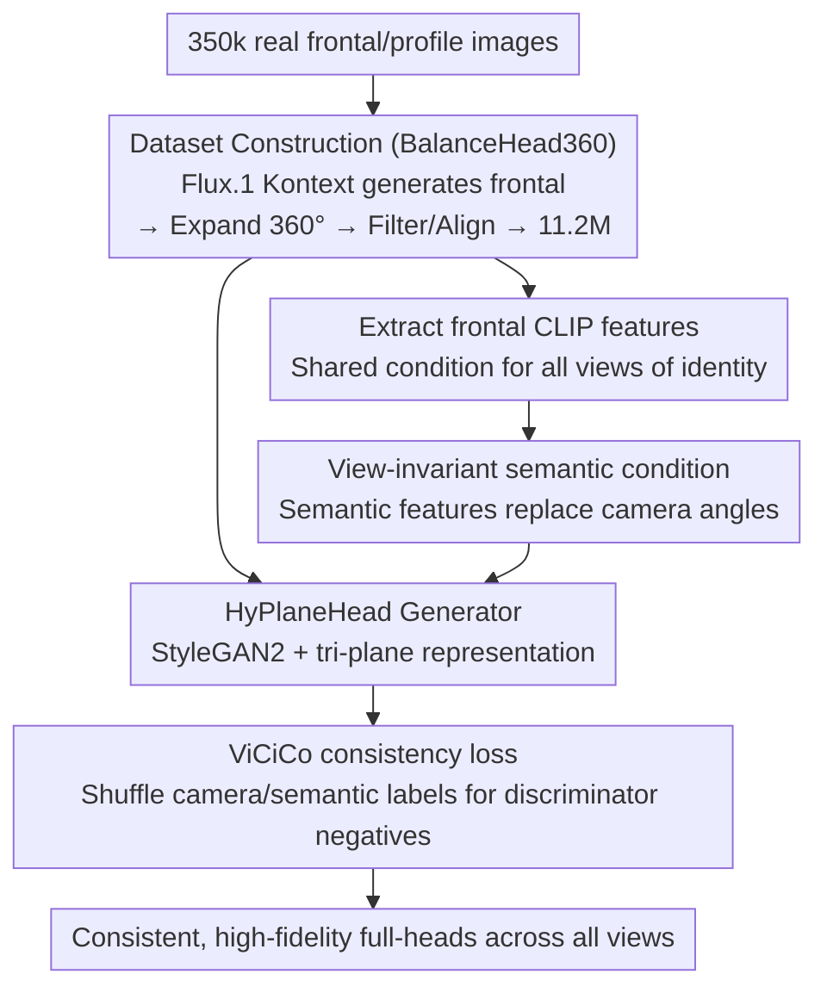

# Condition Matters in Full-head 3D GANs

**Conference**: ICLR2026  
**arXiv**: [2602.07198](https://arxiv.org/abs/2602.07198)  
**Code**: [https://lhyfst.github.io/balancehead/](https://lhyfst.github.io/balancehead/)  
**Area**: Others  
**Keywords**: 3D-aware GAN, full-head generation, semantic conditioning, view conditioning, synthetic data

## TL;DR
This work identifies that view conditioning in full-head 3D GANs causes severe directional bias (where generation quality at conditioned views far exceeds others). It proposes replacing camera views with view-invariant semantic features (frontal CLIP features) as conditions, paired with the BalanceHead360 dataset containing 11.2 million 360° balanced images synthesized via Flux.1 Kontext. This achieves high-fidelity, diverse full-head generation with consistency across all views for the first time.

## Background & Motivation

**Background**: 3D-aware GANs (EG3D, PanoHead, SphereHead, HyPlaneHead) utilize tri-plane representations to generate 3D heads. They inherit EG3D's view-conditioning strategy, using camera angles as the generator input condition.

**Limitations of Prior Work**: (a) **Directional Bias**—view conditioning leads to significantly higher generation quality at the conditioned viewpoints compared to others, causing global inconsistency (Fig. 2d-i); (b) Inference is forced to fix frontal conditions to ensure face quality, sacrificing back-view diversity; (c) **Data Imbalance**—in-the-wild datasets exhibit extremely non-uniform distributions of quality, quantity, and diversity across different views; (d) Completely removing conditions leads to mode collapse, making training infeasible.

**Key Challenge**: Full-head GANs require conditioning to stabilize training (unconditioned training collapses), yet view conditioning introduces directional bias. A view-invariant conditioning mechanism is necessary.

**Goal**: Design a view-invariant conditioning strategy and construct a view-balanced dataset to enable high-quality generation across all views in full-head GANs.

**Key Insight**: Utilize frontal CLIP image features as shared semantic conditions—where all viewpoints of the same individual share the same condition—to decouple generation capability from viewpoint orientation.

**Core Idea**: Transition 3D-aware GANs from "view conditioning" to "semantic conditioning" by replacing camera angles with frontal CLIP features as generator inputs to eliminate directional bias.

## Method

### Overall Architecture
This paper addresses a neglected root cause in full-head 3D GANs: using camera views as generator conditions results in the model performing well only at "conditioned views." The solution is two-fold. First, replace the training data by constructing the BalanceHead360 dataset, using Flux.1 Kontext to expand real frontal images into 360° multi-view synthetic data (11.2 million images), while extracting a single frontal CLIP feature per identity as a unified condition. Second, replace the conditioning mechanism by training a semantic-conditioned 3D-aware GAN based on the HyPlaneHead architecture. View-invariant frontal semantic features replace camera angles as generator inputs, supplemented by a ViCiCo consistency loss to align generation quality across all orientations.

### Key Designs

**1. BalanceHead360 Dataset Construction: Scaling viewpoint-uniform data to tens of millions using 2D generators**

In-the-wild head data is naturally imbalanced—frontal views are numerous and clear, while back views are sparse and blurry—contributing significantly to directional bias. This work uses synthetic data to ensure viewpoint uniformity. Starting from 350k real images, the pipeline uses HyperIQA for quality screening, Flux.1 Kontext to generate standardized frontal faces, and then expands them into multi-view images using Flux.1 Kontext with specific viewpoint prompts. Subsequently, Qwen2.5-VL filters artifacts, VGGHeads estimates poses, and ArcFace performs identity matching, resulting in 11.2 million 360° images. Since 3D-aware GANs naturally filter 2D inconsistencies via adversarial training and tri-plane constraints, the lack of strict 3D consistency in the 2D synthetic data is not a bottleneck.

**2. View-Invariant Semantic Conditioning: Decoupling generation from orientation via frontal CLIP anchors**

Directional bias stems from the inclusion of viewpoint information in the condition: once camera angles enter the generator, the model couples "high-quality synthesis" with "specific orientations." This work replaces camera angle inputs with the previously extracted frontal CLIP features—all 360° views of an identity are generated using the same feature. Because the condition contains no orientation information, generation capability is decoupled from viewpoint. The frontal view is selected because it contains the most comprehensive semantic information (facial features, hair, clothing), acting as a stable "identity anchor."

**3. ViCiCo Loss (View-image and Condition-image Consistency): Preventing multi-face artifacts and enforcing semantic alignment**

Simply changing the condition is insufficient; the generator might collapse to few modes or produce artifacts like multiple faces. ViCiCo constructs negative samples on the discriminator side by randomly shuffling camera labels and/or semantic conditions. These "mismatched" pairs are fed to the discriminator as fake samples:

$$\mathcal{L}_{\text{ViCiCo}} = \log\bigl(1 - D((I^+, I, I^m), (r_{\text{cam}}', c_{\text{sem}}'))\bigr)$$

where $r_{\text{cam}}'$ and $c_{\text{sem}}'$ represent shuffled camera labels and semantic conditions. This forces the generator to strictly follow the true semantic distribution rather than learning a few shortcuts.

### Loss & Training
The framework is built on HyPlaneHead (StyleGAN2 backbone + hybrid plane representation). Training was conducted on 8 × H20 GPUs with a batch size of 32 for 10 days, processing a total of 32 million images.

## Key Experimental Results

### Main Results (FID Evaluation)

| Conditioning | ViCiCo | FID-view ↓ | FID-random ↓ | FID-front ↓ |
| :--- | :--- | :--- | :--- | :--- |
| View Conditioning | ✗ | 9.67 | 13.82 | 8.42 |
| View + Semantic | ✗ | 8.63 | 46.24 | 5.90 |
| Semantic Conditioning | ✗ | - | 4.45 | 4.11 |
| **Semantic Conditioning** | **✓** | **-** | **3.67** | **3.51** |

### Ablation Study

| Configuration | Result | Note |
| :--- | :--- | :--- |
| No Condition | Training Collapse | Early mode collapse |
| Removing conditions mid-training | Collapse after ~1000k images | Conditioning is essential |
| Semantic Condition + ViCiCo | FID-random 3.67 | View-invariant, optimal |

### Key Findings
- **Severe Directional Bias**: Under view conditioning, FID-random (13.82) is much higher than FID-view (9.67), indicating quality degradation at unconditioned viewpoints.
- **Semantic Conditioning Eliminates Bias**: FID-random dropped from 13.82 to 3.67, achieving consistent quality across all views.
- **2D Synthetic Data Efficacy**: While Flux.1 Kontext data lacks strict 3D consistency, 3D-aware GANs are robust enough to learn from it.
- **FID-front Improvement**: Frontal quality improved from 8.42 to 3.51 due to semantic conditioning and larger data scale.

## Highlights & Insights
- **"Conditioning structures the generative space"**: Changing the conditioning mechanism fundamentally alters how the GAN learns 3D space—a crucial but often overlooked design choice.
- **Synergy between 2D Generative Models and 3D-aware GANs**: Leveraging the powerful generation of 2D models to produce training data while relying on 3D GANs to filter inconsistencies creates a new "inconsistency-tolerant" paradigm.
- **Semantic Conditioning Promotes Continual Learning**: Adversarial training often stagnates; semantic conditioning forces the generator to follow the data distribution, leading to better results as scale increases.
- **11.2 Million Synthetic Images**: A massive scale-up (requiring 26 days on 400 × A10 GPUs) that breaks the data bottleneck for full-head generation.

## Limitations & Future Work
- **Dependency on Flux.1 Kontext**: Data quality is limited by the inherent capabilities and biases of the 2D generative model.
- **CLIP Feature Limitations**: CLIP might lose fine-grained details; DINOv2 or multi-modal encoders could be superior.
- **High Training Cost**: Difficult to reproduce without significant compute resources.
- **Static Heads**: Scaling to talking heads or dynamic expressions remains an important future direction.

## Related Work & Insights
- **vs PanoHead/SphereHead/HyPlaneHead**: These all utilize view conditioning and thus inherit directional bias. This work is the first to systematically analyze and resolve it.
- **vs SOAP**: SOAP uses 24k 3D model renderings, which are limited in identity diversity. This work scales to 11.2M images across 350k identities.
- **vs 3DGH**: While 3DGH separately models hair and head to reduce front-back discrepancies, this work addresses the root cause via conditioning.

## Rating
- Novelty: ⭐⭐⭐⭐⭐ Simple but profound insight; a paradigm-shifting design change.
- Experimental Thoroughness: ⭐⭐⭐⭐⭐ 11.2M dataset, 3 types of FID metrics, and exhaustive ablations.
- Writing Quality: ⭐⭐⭐⭐⭐ Very persuasive visualizations of directional bias.
- Value: ⭐⭐⭐⭐⭐ Paradigm-level impact on 3D head generation.

<!-- RELATED:START -->

## Related Papers

- [\[ICML 2026\] Scalable GANs with Transformers](../../ICML2026/image_generation/scalable_gans_with_transformers.md)
- [\[ICLR 2026\] BideDPO: Conditional Image Generation with Simultaneous Text and Condition Alignment](bidedpo_conditional_image_generation_with_simultaneous_text_and_condition_alignm.md)
- [\[ICLR 2026\] PI-Light: Physics-Inspired Diffusion for Full-Image Relighting](pi-light_physics-inspired_diffusion_for_full-image_relighting.md)
- [\[ICLR 2026\] Factuality Matters: When Image Generation and Editing Meet Structured Visuals](factuality_matters_when_image_generation_and_editing_meet_structured_visuals.md)
- [\[ICLR 2026\] Dual-Path Condition Alignment for Diffusion Transformers](dual-path_condition_alignment_for_diffusion_transformers.md)

<!-- RELATED:END -->
