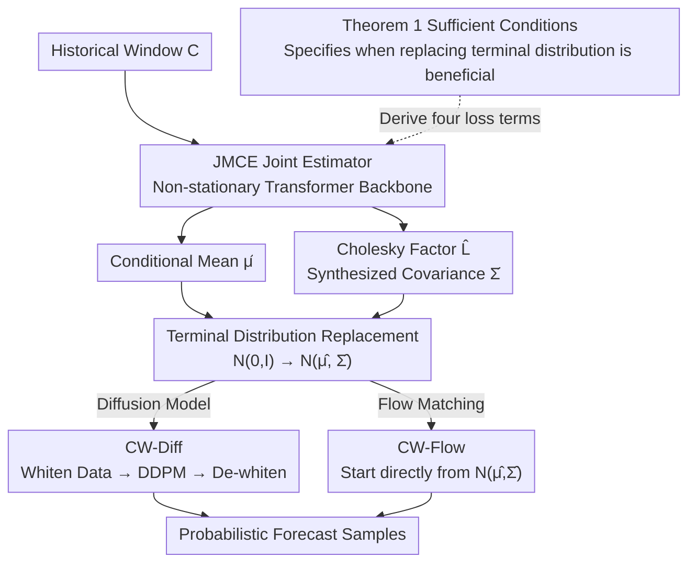

# Conditionally Whitened Generative Models for Probabilistic Time Series Forecasting

**Conference**: ICLR2026  
**arXiv**: [2509.20928](https://arxiv.org/abs/2509.20928)  
**Code**: To be confirmed  
**Area**: Image Generation  
**Keywords**: probabilistic forecasting, diffusion model, flow matching, conditional whitening, covariance estimation

## TL;DR
The authors propose CW-Gen (Conditionally Whitened Generative Models), which replaces the standard Gaussian terminal distribution in diffusion models/flow matching by jointly estimating the conditional mean and sliding window covariance matrix. They theoretically prove that sampling quality inevitably improves when the estimator satisfies sufficient conditions, consistently enhancing multivariate time series probabilistic forecasting performance across 5 datasets and 6 generative models.

## Background & Motivation

**Background**: Diffusion models (TimeGrad, CSDI, SSSD, Diffusion-TS) and flow matching (FlowTS) have been applied to multivariate time series probabilistic forecasting. CARD/TimeDiff/TMDM introduced conditional mean regressors as priors to improve forecasting, while NsDiff further introduced conditional variance.

**Limitations of Prior Work**: (a) The terminal distribution of standard diffusion models is $\mathcal{N}(0, I)$, completely ignoring conditional mean and covariance prior information—forcing the denoising process to learn non-stationary trends and inter-variable dependencies from scratch; (b) Existing methods that introduce priors (TMDM, NsDiff) involve overly complex designs and ignore inter-variable covariance; (c) There is a lack of theoretical guarantees—when and why does introducing a prior improve generation quality?

**Key Challenge**: The forward process of diffusion models transforms data into standard Gaussian noise, discarding conditional mean and covariance information. If the terminal distribution were closer to $P_{X|C}$ (i.e., smaller KL divergence), the generation quality would necessarily be better—but how accurate must the estimator be to be beneficial?

**Goal**: (a) Theoretically answer "under what conditions does replacing the terminal distribution improve generation"; (b) Design a joint mean-covariance estimator; (c) Propose a unified framework applicable to both diffusion models and flow matching.

**Key Insight**: Conditional whitening—de-centering with estimated conditional means + normalizing with the inverse square root of estimated conditional covariance—is equivalent to applying a linear transformation to the data to make it closer to standard Gaussian.

**Core Idea**: Replace the terminal distribution of diffusion/flow matching from $\mathcal{N}(0,I)$ to $\mathcal{N}(\hat{\mu}_{X|C}, \hat{\Sigma}_{X|C})$, allowing the denoising network to learn only the residuals through a conditional whitening transformation.

## Method

### Overall Architecture
CW-Gen aims to address the issue where standard diffusion/flow matching schemes noise all data into $\mathcal{N}(0,I)$, effectively discarding the prior information of conditional means (trends) and inter-variable covariance. The method comprises two steps. First, the Joint Mean-Covariance Estimator (JMCE), using Non-stationary Transformer as a backbone, jointly estimates the future conditional mean $\hat{\mu}_{X|C}$ and the sliding window covariance $\hat{\Sigma}_{t|C}$ for each time step from the historical window $C$. The four loss terms of JMCE are derived directly from the "sufficient conditions" in Theorem 1. Second, these estimates are injected into the generative models via "conditional whitening"—resulting in CW-Diff for diffusion and CW-Flow for flow matching. The core operation is replacing the original terminal distribution $\mathcal{N}(0,I)$ with $\mathcal{N}(\hat{\mu}_{X|C}, \hat{\Sigma}_{X|C})$, which is closer to the true conditional distribution.

### Key Designs

**1. Theorem 1: An inequality answering "when terminal distribution replacement is guaranteed to be beneficial"**

Prior works introduced mean priors heuristically without theoretical guarantees. This paper provides sufficient conditions: when

$$(\min_i \hat{\lambda}_i)^{-1}\big(\|\mu - \hat{\mu}\|_2^2 + \|\Sigma - \hat{\Sigma}\|_N\big) + \sqrt{d}\,\|\Sigma - \hat{\Sigma}\|_F \leq \|\mu\|_2^2$$

holds, replacing the terminal distribution with the estimated conditional Gaussian will reduce the KL divergence with the true distribution $P_{X|C}$. The left side represents estimation errors (mean $\ell_2$ error, covariance errors under nuclear norm $\|\cdot\|_N$ and Frobenius norm $\|\cdot\|_F$, amplified by the inverse of the minimum eigenvalue), while the right side is signal strength—the energy of the conditional mean $\|\mu\|_2^2$. The intuition is clear: stronger signals, more accurate estimation, and non-degenerate covariance make the condition easier to satisfy. Since time series are inherently non-stationary, $\|\mu\|_2^2$ is naturally large. This inequality serves as the blueprint for the JMCE loss function.

**2. JMCE: Transforming theoretical error terms into loss functions**

JMCE outputs the conditional mean $\hat{\mu}_{X|C}$ and the covariance $\hat{\Sigma}_{t|C}$ per time step. To ensure positive semi-definiteness, it predicts the Cholesky factor $\hat{L}_t$ to synthesize $\hat{\Sigma}_t = \hat{L}_t \hat{L}_t^\top$. The training objective is:

$$\mathcal{L}_{\text{JMCE}} = \mathcal{L}_2 + \mathcal{L}_{\text{SVD}} + \lambda_{\min}\sqrt{dT_f}\,\mathcal{L}_F + w_{\text{Eigen}}\sum_t \mathcal{R}_{\lambda_{\min}}$$

These four terms correspond to elements in the Theorem 1 inequality: $\mathcal{L}_2$ handles mean error, while $\mathcal{L}_{\text{SVD}}$ and $\mathcal{L}_F$ suppress covariance errors. The final term is a minimum eigenvalue penalty $\mathcal{R}_{\lambda_{\min}} = \sum_i \text{ReLU}(\lambda_{\min} - \hat{\lambda}_i)$, specifically targeting the $(\min_i \hat{\lambda}_i)^{-1}$ factor to ensure the covariance does not degenerate.

**3. CW-Diff: Whitening and de-whitening in DDPM**

To inject mean and covariance into diffusion models, CW-Diff performs conditional whitening on the data:

$$X_0^{\text{CW}} = \hat{\Sigma}^{-0.5} \circ (X_0 - \hat{\mu})$$

This transforms non-stationary data into a form closer to standard Gaussian. After running standard DDPM processes on $X_0^{\text{CW}}$, the sample is inverse-transformed back: $X = \hat{\Sigma}^{0.5} \circ X^{\text{CW}} + \hat{\mu}$. The denoising network then only needs to complete the remaining residuals after whitening.

**4. CW-Flow: Replacing terminal noise in Flow Matching without inversion**

Flow matching naturally allows for arbitrary terminal distributions. CW-Flow replaces the terminal noise $\mathcal{N}(0,I)$ with $\mathcal{N}(\hat{\mu}, \hat{\Sigma})$ directly. Unlike CW-Diff, which requires $\hat{\Sigma}^{-0.5}$ (costly matrix inversion), CW-Flow circumvents this, making it more computationally efficient while maintaining comparable performance.

### Loss & Training
JMCE is pre-trained independently using a Non-stationary Transformer backbone. Once stable mean-covariance estimates are obtained, the downstream diffusion or flow matching network is trained using the whitened data in a decoupled two-stage process.

## Key Experimental Results

### Main Results (CW-Gen Win Rate)

| Dataset | Dim | CW-Gen Win Rate (6 Models × 4 Metrics) |
|--------|------|-------------------------------|
| ETTh1 | 7 | 22/24 ≈ 91.7% |
| ETTh2 | 7 | 22/24 ≈ 91.7% |
| ILI | 7 | 20/24 ≈ 83.3% |
| Weather | 21 | 22/24 ≈ 91.7% |
| Solar Energy | 137 | 19/24 ≈ 79.2% |

### Ablation Study (ETTh1, CRPS ↓)

| Model | Raw | + CW | Gain |
|------|-----|------|------|
| TimeDiff | 0.787 | 0.505 | -35.8% |
| SSSD | 0.836 | 0.524 | -37.3% |
| Diffusion-TS | 0.626 | ~0.45 | ~-28% |
| FlowTS | ~0.7 | ~0.5 | ~-29% |

### Key Findings
- **Consistency Across Models**: Adding CW to 6 different generative models (TimeDiff, SSSD, CSDI, Diffusion-TS, FlowTS, TMDM) consistently improves performance, proving the method is model-agnostic.
- **Effectiveness in High Dimensions**: A 79% win rate on Solar Energy (137 dimensions) suggests covariance estimation remains beneficial in higher dimensions.
- **Significant CRPS Improvement**: Gains of 28-37% indicate that standard Gaussian terminal distributions indeed waste significant prior information.
- **CW-Flow vs CW-Diff**: CW-Flow avoids matrix inversion, leading to faster computation with similar performance.
- **Robustness to Distribution Shift**: Experiments show CW-Gen effectively mitigates distribution shifts between training and testing.

## Highlights & Insights
- **Theorem 1 formalizes intuition**: Larger signals ($\|\mu\|_2^2$), smaller estimation errors, and non-zero minimum eigenvalues make terminal distribution replacement more beneficial. Non-stationary sequences naturally fit this.
- **Unified Framework for Priors**: CARD, TimeDiff, TMDM, and NsDiff can be viewed as special cases of CW-Gen, providing both theoretical and practical value.
- **JMCE Loss derived from theory**: Each loss term maps directly to a term in Theorem 1, demonstrating theory-guided design.
- **Plug-and-play attribute**: CW is a data preprocessing step that does not alter diffusion/flow matching architectures, allowing easy integration into existing models.

## Limitations & Future Work
- **Covariance estimation instability in extremely high dimensions**: Estimating a $137 \times 137$ matrix is feasible, but thousands of variables might require structural assumptions like diagonal or sparse covariance.
- **Computational cost of JMCE pre-training**: Requires training an additional estimator, though it is a one-time cost.
- **Limited to forecasting**: Tasks like generative imputation or anomaly detection have not yet been validated.
- **Future directions**: (a) Replacing linear whitening with non-linear whitening (e.g., Normalizing Flows); (b) Joint end-to-end training of JMCE and the generative model.

## Related Work & Insights
- **vs CARD/TimeDiff**: These only inject conditional means. CW-Gen injects both mean and covariance and provides theoretical proof of the covariance contribution.
- **vs NsDiff**: NsDiff injects mean and variance but ignores covariance (independence assumption). CW-Gen captures inter-variable dependencies via the full covariance matrix.
- **vs TMDM**: TMDM embeds mean regression into a complex variational inference framework. CW-Gen’s whitening operation is more concise and elegant.

## Rating
- Novelty: ⭐⭐⭐⭐ The concept of conditional whitening is novel, and the theoretical analysis is deep, unifying several prior methods.
- Experimental Thoroughness: ⭐⭐⭐⭐⭐ Comprehensive evaluation across 5 datasets, 6 models, and 4 metrics yields convincing win rates.
- Writing Quality: ⭐⭐⭐⭐⭐ The logical chain from theory to design to experiments is clear and complete.
- Value: ⭐⭐⭐⭐⭐ High practical value as it is plug-and-play for any temporal diffusion/flow matching model.

<!-- RELATED:START -->

## Related Papers

- [\[AAAI 2026\] SimDiff: Simpler Yet Better Diffusion Model for Time Series Point Forecasting](../../AAAI2026/image_generation/simdiff_simpler_yet_better_diffusion_model_for_time_series_point_forecasting.md)
- [\[ICLR 2026\] DoFlow: Flow-based Generative Models for Interventional and Counterfactual Forecasting](doflow_flow-based_generative_models_for_interventional_and_counterfactual_foreca.md)
- [\[ECCV 2024\] Probabilistic Weather Forecasting with Deterministic Guidance-Based Diffusion Model](../../ECCV2024/image_generation/probabilistic_weather_forecasting_with_deterministic_guidance-based_diffusion_mo.md)
- [\[AAAI 2026\] TSGDiff: Rethinking Synthetic Time Series Generation from a Pure Graph Perspective](../../AAAI2026/image_generation/tsgdiff_rethinking_synthetic_time_series_generation_from_a_pure_graph_perspectiv.md)
- [\[CVPR 2026\] Elucidating the SNR-t Bias of Diffusion Probabilistic Models](../../CVPR2026/image_generation/dcw_snr_t_bias_diffusion.md)

<!-- RELATED:END -->
